# WEB前端开发最佳实践

# WEB入门

## WEB概述

**Web 入门**是一门介绍 Web 开发实用性的简洁系列课程。在这里你将学会如何设置构建简单网页所需的工具并发布你自己的简易代码。

### 建立你的第一个网站[Section](https://developer.mozilla.org/zh-CN/docs/Learn/Getting_started_with_the_web#%E5%BB%BA%E7%AB%8B%E4%BD%A0%E7%9A%84%E7%AC%AC%E4%B8%80%E4%B8%AA%E7%BD%91%E7%AB%99)

构建一个专业的网站需要大量的工作，所以如果你是新手，我们鼓励你从小事做起。你不会直接建立另一个 Facebook，但建立一个个人的简单在线网站并不难，所以让我们从这里开始吧。

通过按顺序阅读下面列出的文章，你将逐渐建立好你自己的第一个在线网站。让我们开始吧！

### [安装基础软件](https://developer.mozilla.org/zh-CN/docs/Learn/Getting_started_with_the_web/Installing_basic_software)[Section](https://developer.mozilla.org/zh-CN/docs/Learn/Getting_started_with_the_web#%E5%AE%89%E8%A3%85%E5%9F%BA%E7%A1%80%E8%BD%AF%E4%BB%B6)

当提到建站工具的时候，网上有着一大堆工具可供选择。如果你才刚刚起步，你可能会在各种各样的代码编辑器、框架以及测试工具中困惑不已。 在[安装基础软件](https://developer.mozilla.org/zh-CN/docs/Learn/Getting_started_with_the_web/Installing_basic_software)中我们将一步一步地展示如何安装一些你所需要的基础 Web 开发软件。

### [你的网站看起来是什么样的？](https://developer.mozilla.org/zh-CN/docs/Learn/Getting_started_with_the_web/What_will_your_website_look_like)[Section](https://developer.mozilla.org/zh-CN/docs/Learn/Getting_started_with_the_web#%E4%BD%A0%E7%9A%84%E7%BD%91%E7%AB%99%E7%9C%8B%E8%B5%B7%E6%9D%A5%E6%98%AF%E4%BB%80%E4%B9%88%E6%A0%B7%E7%9A%84%EF%BC%9F)

在开始为你的网站写代码之前，你应该先做好规划。你将展示什么信息？你将使用什么样的字体和颜色？在[你的网站看起来是什么样的？](https://developer.mozilla.org/zh-CN/docs/Learn/Getting_started_with_the_web/What_will_your_website_look_like)这一块中我们简要讲述了一个简单的方法，你可以根据这个方法来设计和规划网站的内容。

### [文件处理](https://developer.mozilla.org/zh-CN/docs/Learn/Getting_started_with_the_web/Dealing_with_files)[Section](https://developer.mozilla.org/zh-CN/docs/Learn/Getting_started_with_the_web#%E6%96%87%E4%BB%B6%E5%A4%84%E7%90%86)

一个网站包含很多文件：文本内容、代码、样式表、媒体内容等。当你建立一个网站，你需要给这些文件安排一个合理的结构，并确保它们能够相互联系。[文件处理](https://developer.mozilla.org/zh-CN/docs/Learn/Getting_started_with_the_web/Dealing_with_files)这块内容将向你解释如何给你的网站建立一个合理的文件结构以及一些你应该要注意的问题。

### [HTML 基础](https://developer.mozilla.org/zh-CN/docs/Learn/Getting_started_with_the_web/HTML_basics)[Section](https://developer.mozilla.org/zh-CN/docs/Learn/Getting_started_with_the_web#HTML_%E5%9F%BA%E7%A1%80)

超文本标记语言 ( HTML ) 是用来构建你的网页内容并将其语义化的代码。举例来说， 我的内容是一些段落还是带点的列表？我的网页上有插入图片吗？有数据表格吗？[HTML 基础](https://developer.mozilla.org/zh-CN/docs/Learn/Getting_started_with_the_web/HTML_basics)将在你能承受的范围内提供足够的信息让你熟悉 HTML。

### [CSS 基础](https://developer.mozilla.org/zh-CN/docs/Learn/Getting_started_with_the_web/CSS_basics)[Section](https://developer.mozilla.org/zh-CN/docs/Learn/Getting_started_with_the_web#CSS_%E5%9F%BA%E7%A1%80)

层叠样式表 (CSS) 是用来添加样式到你网站的代码。举例来说，你想让文字是黑色还是红色的？在屏幕的何处展示内容？用什么背景图像和颜色来装饰你的网站？[CSS 基础](https://developer.mozilla.org/zh-CN/docs/Learn/Getting_started_with_the_web/CSS_basics)带你完成你需要做的事。

### [JavaScript 基础](https://developer.mozilla.org/zh-CN/docs/Learn/Getting_started_with_the_web/Javascript_basics)[Section](https://developer.mozilla.org/zh-CN/docs/Learn/Getting_started_with_the_web#JavaScript_%E5%9F%BA%E7%A1%80)

JavaScript 是一种被用来添加交互功能到你的网站的编程语言。比如游戏，或者当按下按钮后会发生的事情，或者将数据输入表格，动态样式效果，动画等等。[JavaScript 基础](https://developer.mozilla.org/zh-CN/docs/Learn/Getting_started_with_the_web/JavaScript_basics)将让你了解这门令人激动的语言能做什么，以及如何开始。

### [发布你的网站](https://developer.mozilla.org/zh-CN/docs/Learn/Getting_started_with_the_web/Publishing_your_website)[Section](https://developer.mozilla.org/zh-CN/docs/Learn/Getting_started_with_the_web#%E5%8F%91%E5%B8%83%E4%BD%A0%E7%9A%84%E7%BD%91%E7%AB%99)

当你完成了代码并整理好了构建网站的文件的时候，你需要将它们发布到互联网上以便人们可以找到它。[发布你的网站](https://developer.mozilla.org/zh-CN/docs/Learn/Getting_started_with_the_web/Publishing_your_website)描述了如何最轻松地发布你的简易代码。

### [万维网是怎么工作的?](https://developer.mozilla.org/zh-CN/docs/Learn/Getting_started_with_the_web/%E7%BD%91%E7%BB%9C%E6%98%AF%E5%A6%82%E4%BD%95%E5%B7%A5%E4%BD%9C%E7%9A%84)[Section](https://developer.mozilla.org/zh-CN/docs/Learn/Getting_started_with_the_web#%E4%B8%87%E7%BB%B4%E7%BD%91%E6%98%AF%E6%80%8E%E4%B9%88%E5%B7%A5%E4%BD%9C%E7%9A%84)

当你访问你喜爱的网站时，你可能不知道在这背后有很多复杂的事情正在发生。[万维网是怎么工作的](https://developer.mozilla.org/zh-CN/docs/Learn/Getting_started_with_the_web/%E7%BD%91%E7%BB%9C%E6%98%AF%E5%A6%82%E4%BD%95%E5%B7%A5%E4%BD%9C%E7%9A%84)概述了当你通过你的电脑查看一个网页时发生了什么。

### 相关链接[Section](https://developer.mozilla.org/zh-CN/docs/Learn/Getting_started_with_the_web#%E7%9B%B8%E5%85%B3%E9%93%BE%E6%8E%A5)

[Web Demystified](https://www.youtube.com/playlist?list=PLo3w8EB99pqLEopnunz-dOOBJ8t-Wgt2g)： 一个由 [Jérémie Patonnier](https://twitter.com/JeremiePat) 创作的面向 Web 开发的完全新手的系列视频，讲述了 Web 基础。

## 安装基础软件

在*安装基础软件*中, 我们将向你展示简单网页制作所需要的工具，以及如何正确安装它们。

### 专业人员使用哪些工具？[Section](https://developer.mozilla.org/zh-CN/docs/Learn/Getting_started_with_the_web/Installing_basic_software#%E4%B8%93%E4%B8%9A%E4%BA%BA%E5%91%98%E4%BD%BF%E7%94%A8%E5%93%AA%E4%BA%9B%E5%B7%A5%E5%85%B7%EF%BC%9F)

- **计算机，**也许这对你来说是很明显的，但是你们中有些人们是通过手机或者图书馆的计算机来阅读这篇文章的。对于正经的 Web 开发，最好还是使用运行 Windows，Mac，或者 Linux 系统的台式计算机或笔记本电脑。
- **文本编辑器**，用来编写代码。这可以是纯文本编辑器，比如 [Sublime](https://www.sublimetext.com/)，[Brackets](http://brackets.io/)， [Atom](https://atom.io/) 或 [Visual Studio Code](https://code.visualstudio.com/)；也可以是混合的编辑器，如 [Dreamweaver](https://www.adobe.com/products/dreamweaver.html) 或者[WebStorm](https://www.jetbrains.com/webstorm/)。Office 文档编辑器不适合在此使用，因为他们依赖的隐藏元素会干扰浏览器渲染机制。
- **浏览器**，用来测试你的代码。如今使用最多的浏览器有 [Firefox](https://www.mozilla.org/en-US/firefox/new/)，[Chrome](https://www.google.com/chrome/browser/)，[Opera](http://www.opera.com/)， [Safari](https://www.apple.com/safari/)，[Internet Explorer](http://windows.microsoft.com/en-us/internet-explorer/download-ie) 和 [Microsoft Edge](https://www.microsoft.com/en-us/windows/microsoft-edge)。你同时需要在移动设备和任何你的目标用户可能使用的老式浏览器（如 IE 8-10）中测试你的网页表现如何。
- **图像编辑器**，像 [The GIMP](http://www.gimp.org/)，[Paint.NET](http://www.getpaint.net/)，或 [Photoshop](https://www.adobe.com/products/photoshop.html)，用来编辑你的网页所需的图像。
- **版本控制系统**，用来管理服务器文件，支持项目中的团队协作，共享代码与资源，以及避免编辑冲突。当今最流行的版本控制工具是 [Git](http://git-scm.com/)，同时 [GitHub](https://github.com/) 这个基于 Git 的代码托管服务网站也非常流行。 
- **FTP 工具软件**，在旧式使用网络账户管理的服务器上，通常我们使用 FTP 进行文件管理（[Git](http://git-scm.com/) 正在取代 FTP）。有很多 (S)FTP 工具软件，比如 [Cyberduck](https://cyberduck.io/)，[Fetch](http://fetchsoftworks.com/)，和 [FileZilla](https://filezilla-project.org/)。
- **自动化构建工具，** 比如 [Grunt](http://gruntjs.com/) 或 [Gulp](http://gulpjs.com/)，来自动完成重复的任务，例如压缩代码和运行测试。
- 模板，库，框架等等，任何用来加快编写常规功能的工具。
- 还有更多工具哟！

### 什么是我现在真正需要的工具？[Section](https://developer.mozilla.org/zh-CN/docs/Learn/Getting_started_with_the_web/Installing_basic_software#%E4%BB%80%E4%B9%88%E6%98%AF%E6%88%91%E7%8E%B0%E5%9C%A8%E7%9C%9F%E6%AD%A3%E9%9C%80%E8%A6%81%E7%9A%84%E5%B7%A5%E5%85%B7%EF%BC%9F)

上面的列表看起来可怕，不过幸运的是你刚接触 Web 开发时并不需要知道上面大部分内容。在这篇文章里，我们只要求你有最小的配备——一个文本编辑器和一些现代的浏览器。

### 安装文本编辑器[Section](https://developer.mozilla.org/zh-CN/docs/Learn/Getting_started_with_the_web/Installing_basic_software#%E5%AE%89%E8%A3%85%E6%96%87%E6%9C%AC%E7%BC%96%E8%BE%91%E5%99%A8)

你的电脑上可能已经安装了一个基本的文本编辑器。Windows 上默认安装了 [记事本](https://en.wikipedia.org/wiki/Notepad_%28software%29) 而 macOS 上则有 [TextEdit](https://en.wikipedia.org/wiki/TextEdit)。Linux 发行版众多，其中 Ubuntu 上是默认是 [gedit](https://en.wikipedia.org/wiki/Gedit)。

在Web开发中，你可以使用比记事本和 TextEdit 更好的工具。 我们推荐初学者使用 [Brackets](https://brackets.io/), 它提供了实时预览和代码提示等强大功能，而且免费。（译者*fan19900404*注：我个人更加倾向于使用 [Visual Studio Code](https://code.visualstudio.com/)，完美的原生中文支持，强大的插件体系，多平台支持，它是微软出品，开源免费）

### 安装现代浏览器[Section](https://developer.mozilla.org/zh-CN/docs/Learn/Getting_started_with_the_web/Installing_basic_software#%E5%AE%89%E8%A3%85%E7%8E%B0%E4%BB%A3%E6%B5%8F%E8%A7%88%E5%99%A8)

现在，我们只要安装几个桌面 Web 浏览器来测试我们的代码。在下面选择你的运行系统然后点击相应的链接来下载你最喜爱的浏览器的安装器：

- Linux: [Firefox](https://www.mozilla.org/en-US/firefox/new/)，[Chrome](https://www.google.com/chrome/browser/)，[Opera](http://www.opera.com/)。
- Windows: [Firefox](https://www.mozilla.org/en-US/firefox/new/)，[Chrome](https://www.google.com/chrome/browser/)，[Opera](http://www.opera.com/)，[Internet Explorer](http://windows.microsoft.com/en-us/internet-explorer/download-ie)，[Microsoft Edge](https://www.microsoft.com/en-us/windows/microsoft-edge) （Edge 是 Windows 10 的默认浏览器；如果你的系统版本是 Windows 7 或者更高，你可以安装 Internet Explorer 11；否则你应该安装另外一个浏览器）
- Mac: [Firefox](https://www.mozilla.org/en-US/firefox/new/)，[Chrome](https://www.google.com/chrome/browser/)，[Opera](http://www.opera.com/)，[Safari](https://www.apple.com/safari/) (Safari 是 iOS 和 macOS 的默认浏览器)

在继续我们的教程之前，你应该安装好以上至少两个浏览器，并准备用它们来测试你的代码。

### 安装本地 Web 服务器[Section](https://developer.mozilla.org/zh-CN/docs/Learn/Getting_started_with_the_web/Installing_basic_software#%E5%AE%89%E8%A3%85%E6%9C%AC%E5%9C%B0_Web_%E6%9C%8D%E5%8A%A1%E5%99%A8)

一些示例需要通过 Web 服务器运行才能正常工作。你可以通过阅读[如何设置本地测试服务器？](https://developer.mozilla.org/zh-CN/docs/Learn/Common_questions/set_up_a_local_testing_server)了解更多。

##   你的网站看起来是什么样的？

在你编写代码之前讨论好你的计划和设计工作，包括：“我的网页要呈现什么信息？”，“我想要什么字体和颜色？”，和“我的网页有什么用处？”。

### 第一步：做出计划[Section](https://developer.mozilla.org/zh-CN/docs/Learn/Getting_started_with_the_web/What_will_your_website_look_like#%E7%AC%AC%E4%B8%80%E6%AD%A5%EF%BC%9A%E5%81%9A%E5%87%BA%E8%AE%A1%E5%88%92)

在做任何事之前，你需要一些主意。我的网页到底有什么作用？一个网页基本可以做任何事，但是你的第一次尝试应该简单点。我们将以编写一个简单的网页开始，包括一个头部，一张图片和几个段落。

开始之前，你需要回答这些问题：

1. **你的网页内容是什么**？你喜欢狗狗，纽约或者吃豆人吗？
2. **你的主题中要展示什么信息**？编写一个标题和几个段落，再想几张你想展示出来的图片。
3. **你的网页长得什么样**？用高级一点的术语来说就是，你的背景颜色是什么？什么字体合适：正式的，卡通的，粗犷的，还是精细的？

提示：复杂的项目需要详细的参考手册，内容包括颜色，字体，网页中各项目的间距，合适的编写规范等等。参考手册有时也被称为设计指南或者品牌手册，你可以在 [Firefox OS Guidelines](https://www.mozilla.org/en-US/styleguide/products/firefox-os/) 查看一个参考手册的例子。

### 为你的设计出一个草稿图[Section](https://developer.mozilla.org/zh-CN/docs/Learn/Getting_started_with_the_web/What_will_your_website_look_like#%E4%B8%BA%E4%BD%A0%E7%9A%84%E8%AE%BE%E8%AE%A1%E5%87%BA%E4%B8%80%E4%B8%AA%E8%8D%89%E7%A8%BF%E5%9B%BE)

接下来，拿一支笔和一张纸然后粗略地画出你希望你的网站呈现出来的样子。对于你的第一个简单网页，并没有什么好做的，但是你现在应该养成这样的习惯。这真的很有用——你并不需要成为下一个梵高！


提示：即使是在真正的复杂的网站中，设计团队也是首先在纸上画出草稿，然后在图形编辑器中或者使用 Web 技术作出数码模型；

Web 团队通常包括一个图形设计师和 [用户体验设计师](https://developer.mozilla.org/en-US/docs/Glossary/UX) 。图形设计师的作用很明显是将网页视觉部分组合在一起。用户体验设计师则拥有一个某种更抽象的角色来解决用户如何浏览和与网站交互。

### 选择你的内容[Section](https://developer.mozilla.org/zh-CN/docs/Learn/Getting_started_with_the_web/What_will_your_website_look_like#%E9%80%89%E6%8B%A9%E4%BD%A0%E7%9A%84%E5%86%85%E5%AE%B9)

在这个时候就可以开始将最终呈现在你的网页上的内容放在一起了。

### 文本[Section](https://developer.mozilla.org/zh-CN/docs/Learn/Getting_started_with_the_web/What_will_your_website_look_like#%E6%96%87%E6%9C%AC)

你应该还记得之前的段落和标题，确保它们在身边。

### 主题颜色[Section](https://developer.mozilla.org/zh-CN/docs/Learn/Getting_started_with_the_web/What_will_your_website_look_like#%E4%B8%BB%E9%A2%98%E9%A2%9C%E8%89%B2)

要选择一种颜色，访问 [the Color Picker](https://developer.mozilla.org/zh-CN/docs/Web/CSS/CSS_Colors/Color_picker_tool) 找出你喜欢的颜色。当你在一种颜色上点击时，你会看到一个类似于 #660066 的奇怪的六位编码。这是十六进制编码，并且表示了你的颜色。复制下来并将它暂时保存在安全的地方。

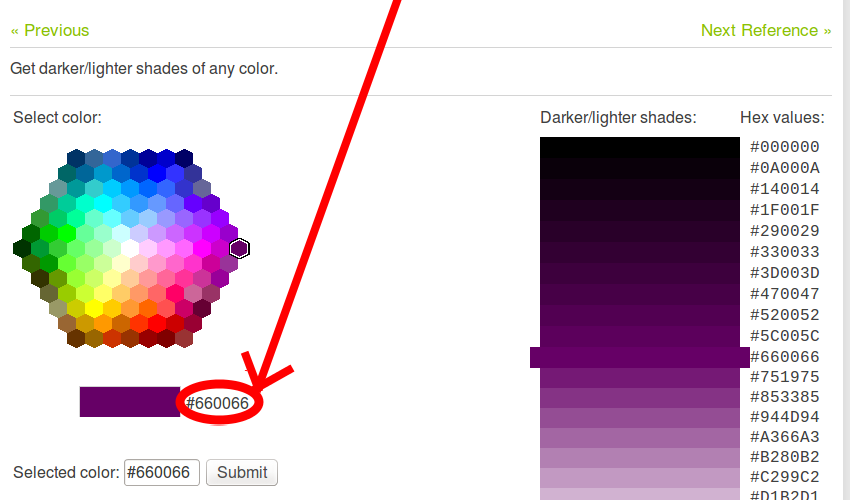

### 图像[Section](https://developer.mozilla.org/zh-CN/docs/Learn/Getting_started_with_the_web/What_will_your_website_look_like#%E5%9B%BE%E5%83%8F)

要选择一个图像，访问 [Google Images](https://www.google.com/imghp?gws_rd=ssl) 搜索合适的内容。

1. 当你找到想要的图像时，在图像上单击。
2. 按下 *查看图像* 按钮。
3. 在下一页，右击图像（或者在 Mac 上 Ctrl + 点击），选择 *图像另存为...，然后选择一个安全的位置存放你的图像。另外你也可以复制*你的浏览器地址栏上的图像地址以便后来使用。

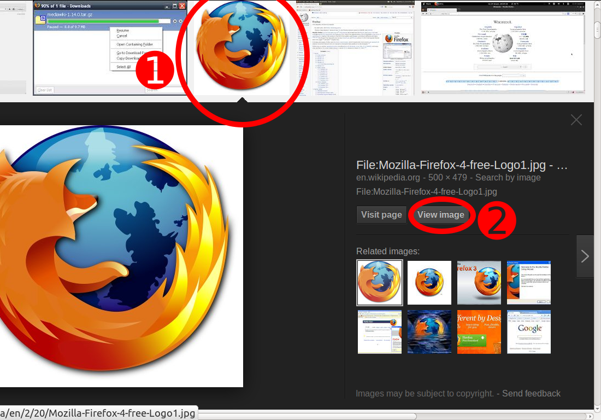

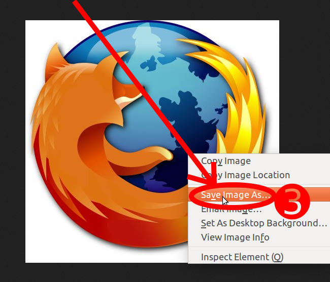

提示：大部分网络上的图片，包括 Google 中的都是有版权的。为了减少你盗用版权行为的可能，你可以使用 Google 许可过滤器。只需 1）点击搜索按钮，然后 2）选择使用权利：

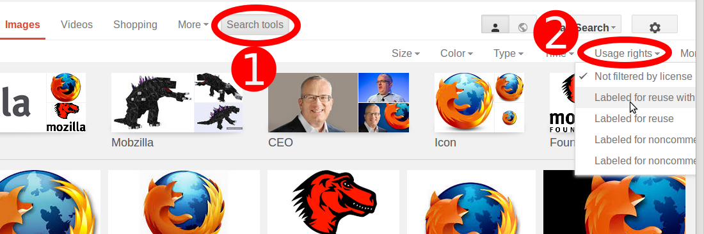

### 字体[Section](https://developer.mozilla.org/zh-CN/docs/Learn/Getting_started_with_the_web/What_will_your_website_look_like#%E5%AD%97%E4%BD%93)

要选择一种字体：

1. 访问  [Google Fonts](http://www.google.com/fonts) 并把列表一直往下翻直到你找到你想要的。你也可以使用左侧的控制栏来过滤结果。
2. 点击你想要的字体旁边的 “+”(添加) 图标*。*
3. 点击页面底部面板的 "* Family Selected" 按钮（ "*" 取决于你选择的字体数量）。
4. 在弹出框中，你可以看到 Google 给你的代码片段并且复制至你的文本编辑器并保存以便后续使用。


 


## 文件处理

一个网站由文本、代码、样式表、媒体内容等等的各种文件组成。当你开发网站时，你需要以清晰的结构将它们存储在你的本地计算机中，保证这些文件之间的联系，使它们看起来正确，然后才能将它们[上传至服务器](https://developer.mozilla.org/zh-CN/Learn/Getting_started_with_the_web/Publishing_your_website)。本节将会讨论一些你需要注意的问题，这样你就能创建清晰的文件结构。

### 网站应该存放在计算机何处？[Section](https://developer.mozilla.org/zh-CN/docs/Learn/Getting_started_with_the_web/Dealing_with_files#%E7%BD%91%E7%AB%99%E5%BA%94%E8%AF%A5%E5%AD%98%E6%94%BE%E5%9C%A8%E8%AE%A1%E7%AE%97%E6%9C%BA%E4%BD%95%E5%A4%84%EF%BC%9F)

当你在你自己的本地计算机操作你的网站时，你应该将所有关联的文件放在一个能反映服务器上文件结构的单独的文件夹里。这个文件夹可以存放在任何你喜欢的位置，不过你应该将它放在你容易找到的位置，或许可以是你的桌面，你的主页，或是磁盘根目录。

1. 选择一个位置存放你的网站项目。创建一个文件夹（在本文中，我们将其命名为 `web-projects`）。这将是你所有网站项目存放的位置。
2. 在该文件夹里新建另一个文件夹来存放你的第一个网页。在本文中，我们将其命名为 `test-site` （或者其它更有想象力的名称）。

### 一些关于大小写和空格的提示[Section](https://developer.mozilla.org/zh-CN/docs/Learn/Getting_started_with_the_web/Dealing_with_files#%E4%B8%80%E4%BA%9B%E5%85%B3%E4%BA%8E%E5%A4%A7%E5%B0%8F%E5%86%99%E5%92%8C%E7%A9%BA%E6%A0%BC%E7%9A%84%E6%8F%90%E7%A4%BA)

你会注意到，文中所有的文件夹名和文件都使用小写字母，且没有空格。这是因为：

1. 很多计算机，特别是 Web 服务器，是对大小写敏感的。举个例子，如果你将一张图片放在 `test-site/MyImage.jpg`，然后在一个不同的文件里你试图以 `test-site/myimage.jpg`  引用这张图片，这将不会起作用。
2. 浏览器，Web服务器，还有编程语言不能一致处理空格。举个例子，如果你在文件名里使用空格，一些系统会把它这个文件名视为两个文件名。一些服务器将会把你的文件名里的空格替换为 “%20”（URI 里空格的编码），破坏你所有的链接。最好使用横线，而不是下划线来分离单词：对比 `my-file.html` 和 `my_file.html` 。

简单地说，你应该在文件名中使用连字符。谷歌搜索引擎把连字符当作一个词的分隔符， 但不会以这种方式处理下划线。基于这些原因，至少在你知道自己在做什么之前，最好养成在文件夹和文件名中使用小写，并且使用短横线而不是空格来分隔的习惯。这样可以避免你在以后碰到一些问题。

### 网站应该使用什么结构？[Section](https://developer.mozilla.org/zh-CN/docs/Learn/Getting_started_with_the_web/Dealing_with_files#%E7%BD%91%E7%AB%99%E5%BA%94%E8%AF%A5%E4%BD%BF%E7%94%A8%E4%BB%80%E4%B9%88%E7%BB%93%E6%9E%84%EF%BC%9F)

接下来，看看我们的测试网站应该拥有什么结构。我们创建的任何网站项目中最常使用的就是一个索引 HTML 文件和不同的包括图像，样式表和脚本文件的文件夹。让我们现在创建它们：

1. `**index.html**` ：这个文件通常将包括你的主页内容，也就是说，人们第一次进入你的网页看到的文本和图像。使用你的文本编辑器，创建一个名为 `index.html` 的新文件并将其保存在 `test-site` 文件夹。
2. **images 文件夹** ：这个文件夹包含你网页上所有使用的图像。在 `test-site` 文件夹内创建一个 `images` 文件夹。
3. **styles 文件夹** ：这个文件夹包含了为你的内容添加样式的样式表（比如，设置文本颜色和背景颜色）。在 `test-site` 文件夹内创建一个 `styles` 文件夹。
4. **scripts 文件夹** ：这个文件夹包含了所有为你网页添加交互功能的 JavaScript 代码（比如点击时读取数据的按钮）。在 `test-site` 文件夹内创建一个 `scripts` 文件夹。

提示：在 Windows 系统中，你可能在查看文件名时会遇到问题，因为 Windows 默认开启一个名叫“隐藏已知文件类型扩展名”的选项。要关闭这个选项，你可以打开 Windows 资源管理器，选择“文件夹选项”，单击“选项”，取消“隐藏已知文件类型扩展名”复选框，然后点击“确定”。对于涉及您的 Windows 版本的更多具体信息，您可以在网上搜索。

### 文件路径[Section](https://developer.mozilla.org/zh-CN/docs/Learn/Getting_started_with_the_web/Dealing_with_files#%E6%96%87%E4%BB%B6%E8%B7%AF%E5%BE%84)

为了关联不同文件，你需要为它们提供文件路径——基本上是一个路线让一个文件知道另一个文件在哪。为了实现，我们将插入一小段HTML代码到 `index.html` 文件，让其显示你在[你的网站看起来是什么样的？](https://developer.mozilla.org/zh-CN/docs/Learn/Getting_started_with_the_web/What_will_your_website_look_like) 文章里选择的图像。

1. 复制你之前保存的图像到 `images` 文件夹。

2. 打开 

    

   ```
   index.html
   ```

    

   文件，准确插入以下代码。现在不理解代码的意义也不用担心——我们将在以后详细讲解此结构的信息。

   ```html
   <!DOCTYPE html>
   <html>
     <head>
       <meta charset="utf-8">
       <title>My test page</title>
     </head>
     <body>
       
     </body>
   </html>
   ```

3. 这行代码 `` 是在页面里插入图像的 HTML 代码。我们需要告诉 HTML 图像在哪里。这张图片在 *images 目录下，*而 *images* 目录与 `index.html` 处于同级目录。要从 `index.html` 所处一级目录进入图片所在目录，我们所需的文件路径是 `images/你的图像文件名` 。例如，我们的图像叫做 `firefox-icon.png` ，所以文件路径就是 `images/firefox-icon.png` 。

4. 在 HTML 代码里 `src＝""` 的双引号中插入文件路径。

5. 保存 HTML 文件，然后使用浏览器打开（双击文件）。你应该看到展示着你的图像的新网页！


一些文件路径的通用规则：

- 要引用一个位于调用的 HTML 文件同级目录的目标文件，只需直接使用文件名，比如  `my-image.jpg` 。
- 要引用一个子目录的文件，在路径前写下目录名并加一个斜杠，比如 `subdirectory/my-image.jpg` 。
- 要引用一个位于调用的 HTML 文件的**父级**目录的目标文件，加上两个点。举个例子，如果 `index.html` 在  `test-site` 下面的一个子目录而 `my-image.png` 在 `test-site` 目录，你可以在 `index.html` 里使用 `../my-image.png` 引用 `my-image.png` 。
- 你可以随意组合以上方法，比如 `../subdirectory/another-subdirectory/my-image.png`.

到此为止，这就是你需要知道的全部内容。

提示：Windows 文件系统会使用反斜杠而不是斜杠，比如 `C:\windows` 。这在 HTML 里没什么关系，就算你在 Windows 上开发你的网页，你仍应该在你的代码中使用斜杠。

### 还有什么要做的？[Section](https://developer.mozilla.org/zh-CN/docs/Learn/Getting_started_with_the_web/Dealing_with_files#%E8%BF%98%E6%9C%89%E4%BB%80%E4%B9%88%E8%A6%81%E5%81%9A%E7%9A%84%EF%BC%9F)

我们差不多都做完了。你的文件夹结构应该像这样：


## HTML 基础


​    **超文本标记语言  (英语：Hypertext Markup Language，简称：HTML )  是一种用来结构化 Web 网页及其内容的标记语言。例如，你的内容可以是一组段落或一个重点列表，甚至可以含有图片和数据表。这篇文章提供的内容，能使你对HTML语言及其功能有最基本的认识。**

### 所以到底什么是 HTML？[Section](https://developer.mozilla.org/zh-CN/docs/Learn/Getting_started_with_the_web/HTML_basics#%E6%89%80%E4%BB%A5%E5%88%B0%E5%BA%95%E4%BB%80%E4%B9%88%E6%98%AF_HTML%EF%BC%9F)

HTML 并不是编程语言，它是一种用于定义内容结构的*标记语言*。HTML 由一系列的**元素（elements）**所组成，这些元素可以用来封装不同部分的内容，使其以某种方式呈现或者工作。 闭合标签（ [tags](https://developer.mozilla.org/en-US/docs/Glossary/tag)）可以使得一个文字或者一张图片超链接到其他地方，可以使得文字变为斜体，可让文字变大或者变小等等。 例如，键入下面一行内容：

```html
My cat is very grumpy
```

如果我们想要让这行单独呈现，我们可以将其封装成为一个段落（**p**aragraph）元素：

```html
<p>My cat is very grumpy</p>
```

### 解析一个HTML元素[Section](https://developer.mozilla.org/zh-CN/docs/Learn/Getting_started_with_the_web/HTML_basics#%E8%A7%A3%E6%9E%90%E4%B8%80%E4%B8%AAHTML%E5%85%83%E7%B4%A0)

让我们深入探索一下这个段落元素。


这个元素的主要部分有：

1. **开始标签**（The opening tag）：这里包含了元素的名称（本例为 p），被开、闭**尖括号**所包围。这表示元素从此开始或者开始起作用——在本例中即段落由此开始。
2. **闭合标签**（The closing tag）：与开始标签相似，只是其在元素名之前包含了一个斜杠。这表示着元素的结尾——这表示元素在此结束——在本例中即段落在此结束。初学者常常会犯忘记包含闭合标签的错误，这可能会产生一些奇怪的结果。
3. **内容**（The content）：这是一个元素的内容，这个例子中就是所输入的文本本身。
4. **元素**（The element）：开标签、闭标签与内容相结合，便是一个完整的元素。

元素也可以有属性，看起来像这样：


属性（Attribute）包含了关于元素的一些额外的信息，这些信息本身并不需要被显现在内容中。在这个例子中，`class` 是一个属性名称，`editor-note` 是属性的值 。`class` 属性允许你为元素提供一个标识名称，以便进一步为元素指定样式或进行其他操作时使用。

一个属性应该包含：

1. 在属性与元素名称（或上一个属性，如果有超过一个属性的话）之间的空格符。
2. 属性的名称，并接上一个等号。
3. 由引号所包围的属性值。

### 嵌套元素[Section](https://developer.mozilla.org/zh-CN/docs/Learn/Getting_started_with_the_web/HTML_basics#%E5%B5%8C%E5%A5%97%E5%85%83%E7%B4%A0)

你也可以将一个元素置于其他元素之中——这被称作**嵌套**。如果你想表明你的猫**非常**的暴躁，我们可以将 “非常” 用 [``](https://developer.mozilla.org/zh-CN/docs/Web/HTML/Element/strong) 元素包裹，这意味着这个单词将被强调：

```html
<p>My cat is <strong>very</strong> grumpy.</p>
```

你必须保证你的元素被正确地嵌套：在这个例子中我们首先使用 p 标签，然后是 strong 标签，接着我们需要先闭合 strong 标签，最后再闭合 p 标签。下面是一个错误示范：

```html
<p>My cat is <strong>very grumpy.</p></strong>
```

元素必须正确地开始和闭合，才能清楚地显示出正确的嵌套。如果它们像上面这样，那么你的浏览器将尽量地猜测你想要表达的意思，但是你很大程度上不会得到你期望的结果。所以千万不要这样做！

### 空元素[Section](https://developer.mozilla.org/zh-CN/docs/Learn/Getting_started_with_the_web/HTML_basics#%E7%A9%BA%E5%85%83%E7%B4%A0)

有一些元素并不包含内容，它们被称为空元素。看看我们 HTML 代码中已经存在的 [``](https://developer.mozilla.org/zh-CN/docs/Web/HTML/Element/img) 元素：

```html

```

它包含了两个属性，但是这里并没有 `</img>` 闭合标签，也没有内部内容。因为图像元素不需要包含内容来产生效果，它的作用是向其所在的位置嵌入一个图像。

### 解析HTML文档[Section](https://developer.mozilla.org/zh-CN/docs/Learn/Getting_started_with_the_web/HTML_basics#%E8%A7%A3%E6%9E%90HTML%E6%96%87%E6%A1%A3)

上面我们介绍了一些基本的 HTML 元素，但是它们自己不是很有用。现在我们看看如何将它们组合起来成为一个完整的 HTML 页面。让我们重新看看  `index.html` 示例里的内容（我们先前在[文件处理](https://developer.mozilla.org/zh-CN/docs/Learn/Getting_started_with_the_web/Dealing_with_files)里创建的）：

```html
<!DOCTYPE html>
<html>
  <head>
    <meta charset="utf-8">
    <title>My test page</title>
  </head>
  <body>
    
  </body>
</html>
```

这里我们有：

- `<!DOCTYPE html>` — 文档类型。在 HTML 刚刚出现的时期里（大约是1991/2 年），文档类型是用来链接一些好的 HTML 应该遵守的规则，有点像自动校正等。然而现在已经没有人关心这些，只是因为历史原因必须它必须包含在代码中。现在你只需要知道这些就可以。
- `<html></html>` — [``](https://developer.mozilla.org/zh-CN/docs/Web/HTML/Element/html) 元素。这个元素包含了整个页面的内容，有时也被称作根元素。
- `<head></head>` — [``](https://developer.mozilla.org/zh-CN/docs/Web/HTML/Element/head) 元素。这个元素可以包含你想添加的所有内容，但是不会被用户所看到。这里面包括像想被搜索引擎搜索到的关键字（[keywords](https://developer.mozilla.org/en-US/docs/Glossary/keyword)）和页面描述，CSS 样式表和字符编码声明等。
- `<body></body>` — [``](https://developer.mozilla.org/zh-CN/docs/Web/HTML/Element/body) 元素。这个元素包含了你想让用户在访问你的页面时看到的内容，不管是文本，图像，视频，游戏，可播放的音轨或其他内容。
- `<meta charset="utf-8">` — 这个元素指定了你的文档需要使用的字符编码是 UTF-8 ，它包括了非常多人类已知语言的字符。基本上 UTF-8 可以处理任何文本内容。我们没有任何理由不去设定字符编码，而且也可以避免以后可能出现的问题。
- `<title></title>` — [``](https://developer.mozilla.org/zh-CN/docs/Web/HTML/Element/title) 元素。这个元素设置了页面的标题，标题显示在浏览器标签页上，而且在你将网页添加到收藏夹或喜爱中时将作为默认名称。

### 图像[Section](https://developer.mozilla.org/zh-CN/docs/Learn/Getting_started_with_the_web/HTML_basics#%E5%9B%BE%E5%83%8F)

让我们重新回到 [``](https://developer.mozilla.org/zh-CN/docs/Web/HTML/Element/img) 元素：

```html

```

像我们之前说过的，它将图像嵌入到元素所在位置。它通过包含图像文件路径的 `src` (source) 属性实现这一功能。

但是这一元素也要包括 `alt` (alternative) 属性 —— 这个属性应该是图像的描述内容，当图像不能被某些用户看见时，可能是因为：

1. 他们是盲人或者有视觉障碍。某些有严重视觉损伤的用户经常使用屏幕阅读器来为他们读出 `alt` 属性里的内容。
2. 有些代码里的错误让图像不能被展示出来。举个例子，试着故意将 `src` 属性里的路径改错。如果你保存并且重新加载页面，你应该能在图像的位置看到：


alt 属性的关键就是要“可以描述图像的文本”。当被读出来时， alt 里面的内容应该向用户传递足够图像表达的意思。所以我们现在的文本 "My test image" 并不合适。一个描述火狐Logo的更好的文本应该是 "The Firefox logo: a flaming fox surrounding the Earth."。

现在为你的图像尝试一些更好的 alt 文本。

提示： 点击 [MDN 无障碍着陆页](https://developer.mozilla.org/zh-CN/docs/Web/Accessibility) *查看更多*。

### 标记文本[Section](https://developer.mozilla.org/zh-CN/docs/Learn/Getting_started_with_the_web/HTML_basics#%E6%A0%87%E8%AE%B0%E6%96%87%E6%9C%AC)

这一部分包含了一些基本的用来标记文本的 HTML 元素。

### 标题（不同于页面标题 title）[Section](https://developer.mozilla.org/zh-CN/docs/Learn/Getting_started_with_the_web/HTML_basics#%E6%A0%87%E9%A2%98%EF%BC%88%E4%B8%8D%E5%90%8C%E4%BA%8E%E9%A1%B5%E9%9D%A2%E6%A0%87%E9%A2%98_title%EF%BC%89)

标题元素允许你指定内容的标题和子标题。就像一本书拥有主标题，然后每一章还有标题，然后还有更小的标题，HTML 文档也是一样。HTML 包括六个级别的标题， [``](https://developer.mozilla.org/zh-CN/docs/Web/HTML/Element/h1)–[``](https://developer.mozilla.org/zh-CN/docs/Web/HTML/Element/h6) ，虽然你可能只会用到 3-4 最多。

```html
<h1>My main title</h1>
<h2>My top level heading</h2>
<h3>My subheading</h3>
<h4>My sub-subheading</h4>
```

现在尝试一下，在你的 [``](https://developer.mozilla.org/zh-CN/docs/Web/HTML/Element/img) 元素上面添加一个合适的标题。

### 段落[Section](https://developer.mozilla.org/zh-CN/docs/Learn/Getting_started_with_the_web/HTML_basics#%E6%AE%B5%E8%90%BD)

像上面解释过的一样，[``](https://developer.mozilla.org/zh-CN/docs/Web/HTML/Element/p) 元素是用来指定段落的。你会经常使用它来指定常规的文本内容：

```html
<p>This is a single paragraph</p>
```

（从[你的网站看起来是什么样的？](https://developer.mozilla.org/zh-CN/docs/Learn/Getting_started_with_the_web/What_will_your_website_look_like)）添加你的样本内容到一个或几个段落里，然后将它们放在 [``](https://developer.mozilla.org/zh-CN/docs/Web/HTML/Element/img) 元素之下。

### 列表[Section](https://developer.mozilla.org/zh-CN/docs/Learn/Getting_started_with_the_web/HTML_basics#%E5%88%97%E8%A1%A8)

很多Web上的内容都是列表，所以 HTML 为它们准备了一些特别的列表元素。要标记列表通常包括至少两个元素。最常用的列表类型是有序列表（ ordered lists ）和无序列表（ unordered lists ）：

1. **无序列表** 中项目的顺序并不重要，就像购物列表。这些内容被包括在一个 [``](https://developer.mozilla.org/zh-CN/docs/Web/HTML/Element/ul) 元素里。
2. **有序列表** 中项目的顺序很重要，就像一个食谱。这些内容被包括在一个 [``](https://developer.mozilla.org/zh-CN/docs/Web/HTML/Element/ol) 元素里。

列表内的每个项目被包括在一个 [``](https://developer.mozilla.org/zh-CN/docs/Web/HTML/Element/li) (list item) 元素里。

所以，如果我们想要将下面的段落碎片改成一个列表：

```html
<p>At Mozilla, we’re a global community of technologists, thinkers, and builders working together ... </p>
```

我们可以这样更改标记：

```html
<p>At Mozilla, we’re a global community of</p>
    
<ul> 
  <li>technologists</li>
  <li>thinkers</li>
  <li>builders</li>
</ul>

<p>working together ... </p>
```

尝试添加一个有序列表和无序列表到你的示例页面。

### 链接[Section](https://developer.mozilla.org/zh-CN/docs/Learn/Getting_started_with_the_web/HTML_basics#%E9%93%BE%E6%8E%A5)

链接非常重要 — 它们让 Web 成为了 WEB（万维网）。要植入一个链接，我们需要使用一个简单的元素 — [``](https://developer.mozilla.org/zh-CN/docs/Web/HTML/Element/a) — a 是 "anchor" （锚）的缩写。要将一些文本添加到链接中，只需如下几步：

1. 选择一些文本。我们选择“Mozilla Manifesto”。

2. 将文本包含在&lt;a>元素内，就像这样：

   ```html
   <a>Mozilla Manifesto</a>
   ```

3. 赋予 [`<a>`](https://developer.mozilla.org/zh-CN/docs/Web/HTML/Element/a) 元素一个 `href` 属性，就像这样：

   ```html
   <a href="">Mozilla Manifesto</a>
   ```

4. 把你想要链接的网址放到该属性内：

   ```html
   <a href="https://www.mozilla.org/en-US/about/manifesto/">Mozilla Manifesto</a>
   ```

如果你在网址开始部分省略了 `https://` 或者 `http://` 协议，你可能会得到错误的结果。在完成一个链接后，点击它并确保它去向了你指定的网址。

`href` 这个名字可能开始看起来有点晦涩难懂。如果你在记忆它的名字上有问题的话，记住它代表的是 **\*h**ypertext **ref**erence* （超文本引用）*。*

如果你还没有完成过上面的操作，现在就为你的页面添加一个链接吧。

### 结论[Section](https://developer.mozilla.org/zh-CN/docs/Learn/Getting_started_with_the_web/HTML_basics#%E7%BB%93%E8%AE%BA)

如果你一直跟着这篇文章里的指导做的话，你应该完成了一个像下面这样的页面。（你也可以[从这查看](http://mdn.github.io/beginner-html-site/)）：


如果你遇到困难，你可以将 Github 上的[完整示例代码](https://github.com/mdn/beginner-html-site/blob/gh-pages/index.html)上与你的文件进行比较。

在这里，我们只是介绍了一点点 HTML。要学习更多，访问我们的 [HTML 学习页](https://developer.mozilla.org/zh-CN/Learn/HTML) 。

## CSS 基础

层叠样式表（英语：**C**ascading **S**tyle **S**heet，简称：CSS）是你用来为网页添加样式的代码。这一节内容会带你了解你所需的基础知识。我们将解答像这样的问题：怎样将文本改成黑色或红色？怎样将内容在屏幕上这样或那样的地方显示？怎样用背景图片或背景颜色来装饰网页？

### 所以到底什么是CSS？[Section](https://developer.mozilla.org/zh-CN/docs/Learn/Getting_started_with_the_web/CSS_basics#%E6%89%80%E4%BB%A5%E5%88%B0%E5%BA%95%E4%BB%80%E4%B9%88%E6%98%AFCSS%EF%BC%9F)

就像 HTML，CSS 也不是真正的编程语言。它也不是标记语言——是样式表语言。也就是说，它允许你有选择性地为 HTML 文档的元素添加样式。举例来说，要选择一个 HTML 页面里**所有**的段落元素，然后将它们的文本改成红色，在 CSS 中你应该这样写：

```css
p {
  color: red;
}
```

让我们动手操作一下：将这三行 CSS 代码粘贴到文本编辑器里的新文件中，然后保存文件名为  `style.css` ，保存到 `styles` 文件夹内。

但是我们还需要将 CSS 文件应用到 HTML 文档内，否则的话 CSS 代码不会影响到 HTML 文档在浏览器里的显示。（如果你没有完整地跟随我们的指导，在[文件处理](https://developer.mozilla.org/zh-CN/docs/Learn/Getting_started_with_the_web/Dealing_with_files)和 [HTML 基础](https://developer.mozilla.org/zh-CN/docs/Learn/Getting_started_with_the_web/HTML_basics)中查看你所需的内容。）

1.  打开 `index.html` 文件，然后将下面一行粘贴到头部（也就是 `<head>` 和 `</head>` 标签之间）。

   ```html
   <link href="styles/style.css" rel="stylesheet" type="text/css">
   ```

2. 保存 `index.html` 并用浏览器将其打开。你应该看到这样的页面：

如果你的段落文字现在是红色的了，那么祝贺你，你已经成功地写下了你的第一句 CSS 代码！

### 解析CSS规则集[Section](https://developer.mozilla.org/zh-CN/docs/Learn/Getting_started_with_the_web/CSS_basics#%E8%A7%A3%E6%9E%90CSS%E8%A7%84%E5%88%99%E9%9B%86)

让我们仔细看一看 CSS ：


整个结构称为 CSS 的**规则集**（通常被简称为“规则”），注意里面单独的部分也是一样：

- 选择器（**Selector**）

  HTML 元素的名称位于规则集开始。它选择了一个或多个需要添加样式的元素（在这个例子中就是 `p` 元素）。要给不同元素添加样式只需要更改选择器就行了。

- 声明（**Declaration**）

  一个单独的规则比如 `color: red;` 这指定了你想要添加样式元素的**属性**。

- 属性（**Properties**）

  这是你改变 HTML 元素样式的方法。（在这个例子中 `color` 就是 [``](https://developer.mozilla.org/zh-CN/docs/Web/HTML/Element/p) 元素的属性。）在 CSS 中，你通过选择合适的属性来改变你的规则。

- 属性值（Property value）

  在属性的右边，冒号后面，我们拥有**属性值**，用于从指定的属性里的非常多的外观中选择一个值（我们除了 `red` 之外还有很多属性值可以用于 `color` ）。

注意其他重要的语法：

- 每个规则集（除了选择器的部分）都应该包含在成对的大括号里（`{}`）。
- 在每个声明里，你应该用冒号（`:`）分离开属性与属性值。
- 在每个规则集里，你应该用分号（`;`）分离开各个声明。

如果要同时修改多个属性，你只需要将它们用分号隔开，就像这样：

```css
p {
  color: red;
  width: 500px;
  border: 1px solid black;
}
```

### 选择多个元素[Section](https://developer.mozilla.org/zh-CN/docs/Learn/Getting_started_with_the_web/CSS_basics#%E9%80%89%E6%8B%A9%E5%A4%9A%E4%B8%AA%E5%85%83%E7%B4%A0)

你也可以选择多种类型的元素然后为它们添加一组相同的样式。将不同的选择器用逗号分开。例如：

```css
p, li, h1 {
  color: red;
}
```

### 不同类型的选择器[Section](https://developer.mozilla.org/zh-CN/docs/Learn/Getting_started_with_the_web/CSS_basics#%E4%B8%8D%E5%90%8C%E7%B1%BB%E5%9E%8B%E7%9A%84%E9%80%89%E6%8B%A9%E5%99%A8)

选择器有许多不同的类型。在上面我们只看到了**元素选择器**，它被用来选择 HTML 文档中给定的元素。但是我们可以做出更加具体的选择。下面是一些常用的选择器类型：

| 选择器名称                               | 选择的内容                                                   | 示例                                                         |
| ---------------------------------------- | ------------------------------------------------------------ | ------------------------------------------------------------ |
| 元素选择器（有时也称作标签或类型选择器） | 所有指定类型的 HTML 元素                                     | `p` 选择 `<p>`                                               |
| 标识（ID）选择器                         | 页面中指定标识的元素（在一个 HTML 页面中，每个标识只被允许指定到一个元素） | `#my-id` 选择 `<p id="my-id">` 或 `<a id="my-id">`           |
| 类别选择器                               | 页面中指定类别的元素（一个页面中可以出现多个类别实例）       | `.my-class` 选择 `<p class="my-class">` 和 `<a class="my-class">` |
| 属性选择器                               | 页面中拥有指定属性的元素                                     | `img[src]` 选择 `` 而不是 ``     |
| 伪类选择器                               | 指定的元素，但是需要在特殊的状态，比如悬停                   | `a:hover` 选择 `<a>`, 但是只在鼠标悬停在链接上时             |

这里有更多选择器可供探索，在[选择器指南](https://developer.mozilla.org/zh-CN/docs/Learn/CSS/Introduction_to_CSS/Selectors)中你可以查看更多详细的信息。

### 字体和文本[Section](https://developer.mozilla.org/zh-CN/docs/Learn/Getting_started_with_the_web/CSS_basics#%E5%AD%97%E4%BD%93%E5%92%8C%E6%96%87%E6%9C%AC)

既然我们已经探索了一些 CSS 基础，现在就让我们开始添加更多规则和信息到我们的 `style.css` 文件中来让我们的示例更加美观。首先，让我们的字体和文本变得更加漂亮。

1. 首先，找到我们在之前访问 Google Fonts 中[保存的内容](https://developer.mozilla.org/zh-CN/docs/Learn/Getting_started_with_the_web/What_should_your_web_site_be_like#Font)。在 `index.html` 的头部中任意位置添加 [``](https://developer.mozilla.org/zh-CN/docs/Web/HTML/Element/link) 元素（注意：在 `<head>` 和 `</head>` 之间的任意位置）。它将看起来像下面这样：

   ```html
   <link href='http://fonts.googleapis.com/css?family=Open+Sans' rel='stylesheet' type='text/css'>
   ```

2. 接下来，删除 `style.css` 文件中已有的规则。那是一次好的尝试，不过红色的文字看起来并不太舒服。

3. 将下列代码添加到相应的位置，用你在 Google Fonts 找到的字体替代  `font-family` 中的占位行。（ `font-family` 意味着你想要你的文本使用的字体。）这条规则首先为整个页面设定了一个全局字体和字号（因为 `<html>` 是整个页面的父元素，而且它所有的子元素都会继承相同的 `font-size` 和 `font-family`）：

   ```css
   html {
     font-size: 10px; /* px 表示 “像素（pixels）”: 这个基础字号现在高10像素 */
     font-family: 'Open Sans', sans-serif; /* 剩下的部分是你从 Google fonts 上获取的输出 */
   }
   ```

   注意：在 CSS 文档中所有位于 `/*` 和 `*/` 之间的内容都是 CSS 注释，它会被浏览器在渲染代码时忽略。你可以在这里写下对你现在要做的事情有帮助的笔记。

4. 现在我们将要为 HTML 中 body 元素内的 ([`<h1>`](https://developer.mozilla.org/zh-CN/docs/Web/HTML/Element/h1), [`<li>`](https://developer.mozilla.org/zh-CN/docs/Web/HTML/Element/li), 和 [`<p>`](https://developer.mozilla.org/zh-CN/docs/Web/HTML/Element/p))元素设置字号。我们也会将标题居中显示，同时为 body 元素内的内容设置行高和间距，来让页面可读性更高。

   ```css
   h1 {
     font-size: 60px;
     text-align: center;
   }
   
   p, li {
     font-size: 16px;    
     line-height: 2;
     letter-spacing: 1px;
   }
   ```

你可以调整这些 `px` 值到任何你喜欢的值来让你的设计更符合你的心意，不过通常你的设计应该看起来像这样：


### 盒子，盒子，一切都与盒子有关[Section](https://developer.mozilla.org/zh-CN/docs/Learn/Getting_started_with_the_web/CSS_basics#%E7%9B%92%E5%AD%90%EF%BC%8C%E7%9B%92%E5%AD%90%EF%BC%8C%E4%B8%80%E5%88%87%E9%83%BD%E4%B8%8E%E7%9B%92%E5%AD%90%E6%9C%89%E5%85%B3)

在你写 CSS 时你会发现它大部分都是关于盒子——设置它们的尺寸，颜色，位置等等。你的页面里大部分 HTML 元素都可以被看作一个一个层叠的盒子。


并不意外，CSS 布局主要就是基于盒模型的。每个占据你页面空间的块都有这样的属性：

- **内边距**（`padding`），围绕着内容的空间（比如围绕段落的空间）
- **边框**（`border`），紧接着内边距的实体线段
- **外边距**（`margin`），围绕元素外部的空间


在这一部分我们用：

- `width` （属于一个元素的）
- `background-color` ，元素内容和内边距之后的颜色
- `color` ，元素内容的颜色（通常是文本）
- `text-shadow` ，为元素内的文本设置阴影
- `display` ，设置元素的显示模式（暂时不用关心这部分内容）

让我们赶紧开始添加更多的 CSS 到页面中吧！将这些新规则都添加到页面的底部，不要害怕改变了属性的值会造成什么结果，赶紧去尝试吧！

### 更改页面颜色[Section](https://developer.mozilla.org/zh-CN/docs/Learn/Getting_started_with_the_web/CSS_basics#%E6%9B%B4%E6%94%B9%E9%A1%B5%E9%9D%A2%E9%A2%9C%E8%89%B2)

```css
html {
  background-color: #00539F;
}
```

这条规则设置了整个页面的背景颜色。将上面颜色的代码改成你在[你的网站呈现什么样子？](https://developer.mozilla.org/zh-CN/docs/Learn/Getting_started_with_the_web/What_will_your_website_look_like)中选择的主题颜色。

### 解析 body 元素[Section](https://developer.mozilla.org/zh-CN/docs/Learn/Getting_started_with_the_web/CSS_basics#%E8%A7%A3%E6%9E%90_body_%E5%85%83%E7%B4%A0)

```css
body {
  width: 600px;
  margin: 0 auto;
  background-color: #FF9500;
  padding: 0 20px 20px 20px;
  border: 5px solid black;
}
```

现在是 [``](https://developer.mozilla.org/zh-CN/docs/Web/HTML/Element/body) 元素。这里有几条声明，所以我们一条一条看：

- `width: 600px;` — 强制页面永远保持600像素宽。
- `margin: 0 auto;` — 当你在像 `margin` 或 `padding` 这样的属性中设置两个值时，第一个值代表元素的上方**和**下方（在这个例子中设置为 `0`），而第二个值代表左边**和**右边（在这里，`auto` 是一个特殊的值，意思是水平方向上左右对称）。你也可以使用一个，三个或四个值，参考[这里](https://developer.mozilla.org/en-US/docs/Web/CSS/margin#Values) 。
- `background-color: #FF9500;` — 之前说过，指定元素的背景颜色。我们给 body 元素用了一种略微偏红的橘色以与深蓝色的 [``](https://developer.mozilla.org/zh-CN/docs/Web/HTML/Element/html) 元素形成反差，但你也可以继续试验其它颜色。
- `padding: 0 20px 20px 20px;` — 我们给内边距设置了四个值来让内容四周产生一点空间。这一次我们不设置上方的内边距，设置右边，下方，左边的内边距为20像素。值以上、右、下、左的顺序排列。
- `border: 5px solid black;` — 简单地为页面四周设置了5像素的黑色实线边框。

### 为页面主标题定位和添加样式[Section](https://developer.mozilla.org/zh-CN/docs/Learn/Getting_started_with_the_web/CSS_basics#%E4%B8%BA%E9%A1%B5%E9%9D%A2%E4%B8%BB%E6%A0%87%E9%A2%98%E5%AE%9A%E4%BD%8D%E5%92%8C%E6%B7%BB%E5%8A%A0%E6%A0%B7%E5%BC%8F)

```css
h1 {
  margin: 0;
  padding: 20px 0;    
  color: #00539F;
  text-shadow: 3px 3px 1px black;
}
```

你可能发现了我们在页面上方有一个可怕的间隙。那是因为浏览器会在你没有提供任何 CSS 代码的情况下应用一些 **默认样式** 给 [``](https://developer.mozilla.org/zh-CN/docs/Web/HTML/Element/h1) 元素。那可能听起来不是个好主意，但是我们希望一个没有任何样式的网页也有基本的可读性。为了去掉那个间隙，我们通过设置 `margin: 0;` 覆盖掉默认样式。

至此，我们已经设置了标题的上内边距和下内边距为20像素，并且将标题文本与 html 的背景颜色设为一致。

我们在这里使用了的一个非常有趣的属性是 `text-shadow`  ，它为元素内容的文本内容提供了阴影。它的四个值如下：

- 第一个像素值设置了**水平对齐**——它的横向偏移；一个负值会导致向左偏移。
- 第二个像素值设置了**垂直对齐**——它的纵向偏移；一个负值会导致向上偏移。
- 第三个像素值设置了阴影的**模糊半径**——越大的值会产生越模糊的阴影。
- 第四个值设置了阴影的基色。

 请尝试不同的值看看你会得出什么样的结果！

### 居中图像[Section](https://developer.mozilla.org/zh-CN/docs/Learn/Getting_started_with_the_web/CSS_basics#%E5%B1%85%E4%B8%AD%E5%9B%BE%E5%83%8F)

```css
img {
  display: block;
  margin: 0 auto;
}
```

最后，我们将使图像居中来让它变得更美观。我们可以重新使用之前应用到 body 的 `margin: 0 auto` ，但是我们还要做其他调整。 [``](https://developer.mozilla.org/zh-CN/docs/Web/HTML/Element/body) 元素是**块级**元素，意味着它占据了页面的空间并且能够赋予外边距和其他改变间距的值。与之对应的是**行内**元素，意味着它不能。所以为了使图像有外边距，我们必须使用 `display: block` 给予其块级行为。

提示：如果你暂时不能理解 `display: block` 和块级元素与行内元素的差别也没关系；随着你对 CSS 学习的深入，你将明白这个问题。要了解更多 `display` 属性的值请查看[显示参考页面](https://developer.mozilla.org/zh-CN/docs/Web/CSS/display) 。

### 结论[Section](https://developer.mozilla.org/zh-CN/docs/Learn/Getting_started_with_the_web/CSS_basics#%E7%BB%93%E8%AE%BA)

如果你一直跟随我们的说明，那么到最后你应该得到一个这样的页面（你也可以在[这里](http://mdn.github.io/beginner-html-site-styled/)查看我们的版本）：


如果你有遇到问题，你可以将你的代码与我们GitHub上的[完整示例代码](https://github.com/mdn/beginner-html-site-styled/blob/gh-pages/styles/style.css)做对比。

在这里，我们只提到了非常有限的 CSS 知识，要查看更多，请访问我们的[CSS学习页面](https://developer.mozilla.org/zh-CN/Learn/CSS)。

## **JavaScript基础**

JavaScript 是一门为你的网站添加交互功能的编程语言。（例如：游戏，响应按钮被按下或者以表单输入的数据，动态样式，动画等）。本文可以帮助你开始使用这种令人兴奋的语言，并让你明白能做什么。

### 所以到底什么是 JavaScript？[Section](https://developer.mozilla.org/zh-CN/docs/Learn/Getting_started_with_the_web/JavaScript_basics#%E6%89%80%E4%BB%A5%E5%88%B0%E5%BA%95%E4%BB%80%E4%B9%88%E6%98%AF_JavaScript%EF%BC%9F)

[JavaScript](https://developer.mozilla.org/en-US/docs/Glossary/JavaScript)（缩写：JS）是一门成熟的[动态编程语言](https://developer.mozilla.org/en-US/docs/Glossary/Dynamic_programming_language)。当应用于 [HTML](https://developer.mozilla.org/en-US/docs/Glossary/HTML) 文档时，它可以在网站上提供动态交互性。它是 Mozilla 项目联合创始人， Mozilla 基金会和 Mozilla 公司的 Brendan Eich 发明的。

JavaScript 是非常通用的。你可以从简单的交互，比如轮播、相册、浮动布局和按钮点击事件做起。随着你学习的深入，你可以创建游戏、二维和三维动画、数据库驱动的综合应用程序，以及更多！

JavaScript 本身是相当简洁却非常灵活的。开发者们在 JavaScript 核心之上编写了非常多的工具，从而花最小的代价获得大量额外的功能。这些功能包括：

- 浏览器**应用编程接口** ([API](https://developer.mozilla.org/en-US/docs/Glossary/API)) 。API 内置于浏览器中，它们提供像动态编写 HTML 和设置 CSS 样式，采集并操控用户摄像头的数据流和生成三维图像与音频样本等功能。
- 第三方 API 允许开发者将来自其它内容提供者，如 Twitter 或 Facebook ，的功能整合到自己的网站里。
- 你可以在你的 HTML 里应用第三方框架和库以快速构建网站和应用。

因为这篇文章只会简单介绍 JavaScript ，所以我们并不打算在这个阶段过于详细地介绍 JavaScript 语言以及前面提及的各式工具。你可以之后在 [JavaScript 学习区](https://developer.mozilla.org/zh-CN/docs/Learn/JavaScript)和 MDN 的其它地方学习更多细节。

下面我们将介绍语言的一些核心部分，你也可以看看如何使用一些浏览器 API 。

### **一个 “Hello World”示例[Section](https://developer.mozilla.org/zh-CN/docs/Learn/Getting_started_with_the_web/JavaScript_basics#%E4%B8%80%E4%B8%AA_%E2%80%9CHello_World%E2%80%9D%E7%A4%BA%E4%BE%8B)**

上面的内容听起来非常激动人心，而且也应该如此—— JavaScript 是最让人激动的 Web 技术之一，而且当你对它掌握的加深，你的网页将进入一个更有创造力和更加强大的层次。

然而，JavaScript 比 HTML 和 CSS 学习起来更加复杂一点，所以你需要一步一步谨慎地走。首先，我们将向你展示怎么在你的页面中添加一些基本的 JavaScript 脚本来创造一个 “hello world” 示例（[编程世界的标准示例](https://en.wikipedia.org/wiki/%22Hello,_World!%22_program)）。

注意：如果你没有学习我们之前的课程，[点击下载示例代码](https://github.com/mdn/beginner-html-site-styled/archive/gh-pages.zip)然后将其作为你的出发点。

1. 首先，前往你的测试目录并创建一个叫做 `scripts` 的文件夹。然后在这个文件夹下创建一个新的 `main.js` 文件并保存。

2. 接下来，打开你的 `index.html` 文件，在 `</body>` 闭合标签之前输入这一行代码：

   ```html
   <script src="scripts/main.js"></script>
   ```

3. 这基本上与引入 CSS 的 [``](https://developer.mozilla.org/zh-CN/docs/Web/HTML/Element/link) 元素功能相同——它将 JavaScript 引入了页面，所以它将影响 HTML （包括 CSS 和其它页面上的其它任何内容）。 

4. 现在将下面的代码添加到 `main.js` 文件中:

   ```js
   var myHeading = document.querySelector('h1');
   myHeading.textContent = 'Hello world!';
   ```

5. 最后，确保 HTML 和 JavaScript 文件已经保存好，然后用浏览器打开 `index.html` 。你应该看到如下内容：

   

提示：我们之所以**将 *<script>* 元素放在 HTML 文件底部**，是因为浏览器会按照代码在文件中的顺序解析 HTML。如果应该要影响下面 HTML 的 JavaScript 先被加载，那么它可能由于 HTML 尚未被加载而失效。所以**将 JavaScript 代码放在靠近 HTML 页面底部的位置是通常最好的选择**。

### 发生了什么？[Section](https://developer.mozilla.org/zh-CN/docs/Learn/Getting_started_with_the_web/JavaScript_basics#%E5%8F%91%E7%94%9F%E4%BA%86%E4%BB%80%E4%B9%88%EF%BC%9F)

你的标题通过 JavaScript 被更改为了 “Hello world!” 。我们首先使用一个叫做[`querySelector()`](https://developer.mozilla.org/zh-CN/docs/Web/API/Document/querySelector) 的函数来获取标题，然后将其储存在一个叫 `myHeading` 的变量中。这与我们使用 CSS 选择器进行的操作非常相像。如果你想对某个元素进行操作，首先你得先选择它。

之后我们将 `myHeading` 变量的属性 [`textContent`](https://developer.mozilla.org/zh-CN/docs/Web/API/Element/textContent) （代表这个标题的内容）赋值为 “Hello world!” 。

**提示**：以上两个用到的特性都是[文档对象模型 (DOM) API](https://developer.mozilla.org/zh-CN/docs/Web/API/Document_Object_Model) 的一部分， 它可以使你控制文档。

### **语言基础速览[Section](https://developer.mozilla.org/zh-CN/docs/Learn/Getting_started_with_the_web/JavaScript_basics#%E8%AF%AD%E8%A8%80%E5%9F%BA%E7%A1%80%E9%80%9F%E8%A7%88)**

让我们来解释一下 JavaScript 这门语言的一些核心特性，以便让你们更好地了解它是怎么运作的。更棒的是，这些特性对所有编程语言来说都很常见。如果你能够掌握这些基础，你就能更好地在编程的世界里徜徉！

注意：在学习这篇文章时，将示例代码输入到你的 JavaScript 控制台里看看会发生什么。要查看更多关于 JavaScript 控制台的信息，点击[探索浏览器开发者工具](https://developer.mozilla.org/zh-CN/Learn/Discover_browser_developer_tools)。

### **变量[Section](https://developer.mozilla.org/zh-CN/docs/Learn/Getting_started_with_the_web/JavaScript_basics#%E5%8F%98%E9%87%8F)**

**[变量](https://developer.mozilla.org/en-US/docs/Glossary/Variable)是你存储值的容器**。要声明一个变量你需要首先使用**关键字 `var`** ，然后输入任何你想要的名称：

```js
var myVariable;
```

提示：行末的分号表示语句结束，不过这个分号只有在单行内需要分割语句时才是必须的。然而，一些人认为在每个语句后面加分号是一种好的风格。这里为你提供了更多关于是否应该加分号的规则 — 查看 [Your Guide to Semicolons in JavaScript](http://news.codecademy.com/your-guide-to-semicolons-in-javascript/) 获取更多细节。

提示：你几乎可以以任何名称来命名一个变量，不过我们有一些限制（点击这里查看[变量命名规则](http://www.codelifter.com/main/tips/tip_020.shtml)）。如果你不确定，你可以[验证你的变量名](https://mothereff.in/js-variables)查看是否有效。

提示：JavaScript 是对大小写敏感的—— `myVariable` 与 `myvariable` 是不同的。如果你的代码出现问题了，查看一下大小写有没有错误！

定义一个变量之后，你可以赋予它一个值：

```js
myVariable = 'Bob';
```

你也可以将这些操作写在同一行：

```js
var myVariable = 'Bob';
```

你可以通过变量名称读取变量的值：

```js
myVariable;
```

在给变量赋值之后，你可以更改这个变量的值：

```html
var myVariable = 'Bob';
myVariable = 'Steve';
```

注意变量有不同的 [数据类型](https://developer.mozilla.org/zh-CN/docs/Web/JavaScript/Data_structures) ：

| 变量                                                         | 解释                                                         | 示例                                                         |
| ------------------------------------------------------------ | ------------------------------------------------------------ | ------------------------------------------------------------ |
| [String](https://developer.mozilla.org/en-US/docs/Glossary/String) | 字符串（文字序列）。 要表示变量的值是字符串，你必须将它们用引号包裹起来。 | `var myVariable = 'Bob';`                                    |
| [Number](https://developer.mozilla.org/en-US/docs/Glossary/Number) | 数字。不用引号包围。                                         | `var myVariable = 10;`                                       |
| [Boolean](https://developer.mozilla.org/en-US/docs/Glossary/Boolean) | 布尔(逻辑)值。一个 True/False （真 / 假）值。 `true`/`false` 是 JS 里的特殊关键字，不需要引号。 | `var myVariable = true;`                                     |
| [Array](https://developer.mozilla.org/en-US/docs/Glossary/Array) | 数组，一种允许你存储多个值在一个引用里的结构。               | `var myVariable = [1,'Bob','Steve',10];` 引用数组的元素只需：`myVariable[0]`, `myVariable[1]`, 等等. |
| [Object](https://developer.mozilla.org/en-US/docs/Glossary/Object) | 对象，基本上 JavaScript 里的任何东西都是对象，而且都可以被储存在变量里。将这个牢记于心。 | `var myVariable = document.querySelector('h1');` 上面所有示例都是对象。 |

那么为什么我们需要变量呢？好吧，在编程时要做任何有趣的事我们必须用到变量。如果值无法被改变，那么你将无法动态地做任何事，就像个性化一条祝福信息或是改变在图片库里展示的图片。

### 注释[Section](https://developer.mozilla.org/zh-CN/docs/Learn/Getting_started_with_the_web/JavaScript_basics#%E6%B3%A8%E9%87%8A)

你可以在 JavaScript 中添加注释，就像你在 CSS 中做过的一样。

```js
/*
Everything in between is a comment.
*/
```

如果你的注释只有一行，我们经常将它们更简单地放在两个斜杠之后，就像这样：

```js
// This is a comment
```

### 运算符[Section](https://developer.mozilla.org/zh-CN/docs/Learn/Getting_started_with_the_web/JavaScript_basics#%E8%BF%90%E7%AE%97%E7%AC%A6)

 [运算符](https://developer.mozilla.org/en-US/docs/Glossary/Operator)是一个根据两个值（或变量）产生结果的数学符号。在下面的表格里你可以看到一些最简单的运算符，后面的示例你可以在浏览器控制台里尝试一下。

| 运算符     | 解释                                                         | 符号          | 示例                                                         |
| ---------- | ------------------------------------------------------------ | ------------- | ------------------------------------------------------------ |
| 加/连接    | 用来相加两个数字，或者连接两个字符串。                       | `+`           | `6 + 9;"Hello " + "world!";`                                 |
| 减、乘、除 | 这些运算符操作将与你期望它们在基础数学中所做的一样。         | `-`, `*`, `/` | `9 - 3;8 * 2; // JS中的乘是一个"*"号;9 / 3;`                 |
| 赋值运算符 | 你之前已经见过这个符号了：它将一个值赋给一个变量             | `=`           | `var myVariable = 'Bob';`                                    |
| 相等       | 它将测试两个值是否相等，而且会返回一个 `true`/`false` （布尔型）值。 | `===`         | `var myVariable = 3;myVariable === 4;`                       |
| 非，不等   | 经常与相等运算一起使用，非运算符在JS中表示逻辑非——它也返回一个布尔值。 | `!`, `!==`    | 原本的值是 `true` ，但是返回了 `false` 因为之后我们做了非运算：`var myVariable = 3;!myVariable === 3;`这里我们测试了" `myVariable` 是否等于 3"。这里返回了 `false` ，因为它等于 3。`var myVariable = 3;myVariable !== 3;` |

还有很多运算符供我们探索，不过暂时我们只需要这么多。你可以在[表达式和运算符](https://developer.mozilla.org/zh-CN/docs/Web/JavaScript/Reference/Operators)查看完整列表。

提示：计算时如果混合不同的数据类型可能导致奇怪的结果，所以请谨慎地正确引用你的变量，然后得出你期望的结果。比如输入 `"35" + "25"` 到控制台。为什么结果与你想象的不同？因为引号将数字转换成了字符串，所以最终会连接两个字符串而不是相加数字。如果你输入 `35 + 25`，你会得到正确的结果。

### 条件句[Section](https://developer.mozilla.org/zh-CN/docs/Learn/Getting_started_with_the_web/JavaScript_basics#%E6%9D%A1%E4%BB%B6%E5%8F%A5)

条件句是能够让你测试一个表达式是否返回 `true` 然后根据结果运行不同的代码的代码结构。一个常用的条件句形式是 `if ... else` 语句。下面是一个例子：

```js
var iceCream = 'chocolate';
if (iceCream === 'chocolate') {
  alert('Yay, I love chocolate ice cream!');    
} else {
  alert('Awwww, but chocolate is my favorite...');    
}
```

 `if ( ... )` 里面的表达式就是测试——这里使用了（上面所提到的）相等运算符来比较变量 `iceCream` 与字符串 `chocolate` 是否相等。 如果返回 `true`，运行第一块代码；如果返回 `false`，跳过第一块直接运行 `else` 之后的第二块代码。

### 函数[Section](https://developer.mozilla.org/zh-CN/docs/Learn/Getting_started_with_the_web/JavaScript_basics#%E5%87%BD%E6%95%B0)

[函数](https://developer.mozilla.org/en-US/docs/Glossary/Function)是一种封装你想重复使用的功能的方法，这样你就可以需要使用其中的功能的时候通过函数名称来调用函数，而不用老是重复写下整段代码。你在上面已经见过一些函数了，比如：

1. ```js
   var myVariable = document.querySelector('h1');
   ```

2. ```js
   alert('hello!');
   ```

这些函数 `document.querySelector` 和 `alert` 是浏览器内置的，你可以在任何时候使用。

**如果你看到一些东西长得像变量名但是有括号——`()`——在后面，这可能就是一个函数**。**函数通常包括[参数](https://developer.mozilla.org/en-US/docs/Glossary/Argument)**——**一些必要的数据**。它们在括号内部，如果有一个以上参数则使用逗号分开。

比如， `alert()` 函数在浏览器窗口内弹出一个警告框，但是我们需要给函数提供一个字符串作为参数以告诉函数应该在警告框里写什么。

好消息是你可以定义你自己的函数——在下一个例子里我们会写一个简单的需要两个参数来做乘法运算的函数。

```js
function multiply(num1, num2) {
  var result = num1 * num2;
  return result;
}
```

尝试在控制台运行这个函数，然后自己尝试几次不同的参数，比如：

```js
multiply(4, 7);
multiply(20, 20);
multiply(0.5, 3);
```

**提示**：`return` 语句告诉浏览器返回 `result` 变量以便使用。这是很有必要的，因为函数内定义的变量只能在函数内使用。这叫做变量[作用域](https://developer.mozilla.org/en-US/docs/Glossary/Scope)。（详见[变量作用域](https://developer.mozilla.org/zh-CN/docs/Web/JavaScript/Guide/Values,_variables,_and_literals#Variable_scope)）

### 事件[Section](https://developer.mozilla.org/zh-CN/docs/Learn/Getting_started_with_the_web/JavaScript_basics#%E4%BA%8B%E4%BB%B6)

你需要使用事件在网页上创建真正的交互——事件是能够捕捉浏览器操作并且允许你运行代码进行响应的代码结构。最明显的事件是[点击事件](https://developer.mozilla.org/zh-CN/docs/Web/Events/click)，它会在鼠标点击什么的时候被浏览器唤醒。 为了演示这个操作，尝试将下面的代码输入到控制台，然后在当前网页点击：

```js
document.querySelector('html').onclick = function() {
    alert('Ouch! Stop poking me!');
}
```

我们有许多方法来将一个事件与元素绑定。在这里我们选择了 [``](https://developer.mozilla.org/zh-CN/docs/Web/HTML/Element/html) 元素，然后将 `onclick` 属性设置成包含单击时我们想要运行的代码的匿名函数。

注意到

```js
document.querySelector('html').onclick = function() {};
```

相当于

```js
var myHTML = document.querySelector('html');
myHTML.onclick = function() {};
```

只是更加简洁。

### **改善示例网页[Section](https://developer.mozilla.org/zh-CN/docs/Learn/Getting_started_with_the_web/JavaScript_basics#%E6%94%B9%E5%96%84%E7%A4%BA%E4%BE%8B%E7%BD%91%E9%A1%B5)**

现在我们已经讲述了一点 JavaScript 的基础了，让我们添加一些更酷的特性到示例网页里来看看我们能做什么。

### 添加一个图像切换器[Section](https://developer.mozilla.org/zh-CN/docs/Learn/Getting_started_with_the_web/JavaScript_basics#%E6%B7%BB%E5%8A%A0%E4%B8%80%E4%B8%AA%E5%9B%BE%E5%83%8F%E5%88%87%E6%8D%A2%E5%99%A8)

这一部分我们将用更多 DOM API 特性添加另一张图片到我们的网站，并且添用一些 JavaScript 使图片被点击时进行切换。

1. 首先，找到另一个你想用来装饰你的网页的图片。确保它与你第一张图片尺寸相同，或者尽可能相似。

2. 将图片保存在 `images` 文件夹。

3. 重命名图片为 `firefox2.png` 。

4. 打开 `main.js` 文件，输入下面的 JavaScript 代码 ( 如果你的 "hello world" JavaScript 仍然在这个文件中，删除它们 ) :

   ```html
   var myImage = document.querySelector('img');
   
   myImage.onclick = function() {
       var mySrc = myImage.getAttribute('src');
       if(mySrc === 'images/firefox-icon.png') {
         myImage.setAttribute('src', 'images/firefox2.png');
       } else {
         myImage.setAttribute('src', 'images/firefox-icon.png');
       }
   }
   ```

5. 保存所有文件然后用浏览器打开 `index.html` 。当你点击图片时，它应该会切换成另一张图片！

在这里，我们将 [``](https://developer.mozilla.org/zh-CN/docs/Web/HTML/Element/img) 元素的引用存放在 `myImage` 变量里。接下来，我们将这个变量的 `onclick` 事件与一个匿名函数绑定。选择，每次图片被点击时：

1. 我们获取这张**图片的 `src` 属性的值**。

2. 我们使用一个条件句来**判断 src的值**是否等于原始图像的路径:

   1. 如果是，我们将 `src` 的值改为第二张图片的路径，强制在 [``](https://developer.mozilla.org/zh-CN/docs/Web/HTML/Element/img) 内读取另一张图片。
   2. 如果不是（意味着它肯定已经被更改过）, 我们把 `src` 的值重新设置为原始图片的路径，即原来的状态。

### 添加个性化的欢迎信息[Section](https://developer.mozilla.org/zh-CN/docs/Learn/Getting_started_with_the_web/JavaScript_basics#%E6%B7%BB%E5%8A%A0%E4%B8%AA%E6%80%A7%E5%8C%96%E7%9A%84%E6%AC%A2%E8%BF%8E%E4%BF%A1%E6%81%AF)

接下来我们会添加另一段代码，在用户初次进入站点时将网页的标题改成一段个性化的欢迎信息。欢迎信息会由 [Web Storage API](https://developer.mozilla.org/zh-CN/docs/Web/API/Web_Storage_API) 保存下来，即使用户关闭页面之后再重新打开此页面，我们仍然可以得到之前的信息。我们还会添加一个选项来在必要的时候改变用户并且改变欢迎信息。

1. 在 `index.html` 里， 在 [`<script>`](https://developer.mozilla.org/zh-CN/docs/Web/HTML/Element/script) 元素前添加下一行代码：

   ```html
   <button>Change user</button>
   ```

2. 在 `main.js 里，`在文件底部添加下面的代码，必须一字不漏——这会分别抓取按钮和标题的引用并将其存放在变量里：

   ```js
   var myButton = document.querySelector('button');
   var myHeading = document.querySelector('h1');
   ```

3. 现在添加下面的函数来设置个性化内容——这暂时不会起任何作用，不过我们后面会用到：

   ```js
   function setUserName() {
     var myName = prompt('Please enter your name.');
     localStorage.setItem('name', myName);
     myHeading.textContent = 'Mozilla is cool, ' + myName;
   }
   ```

   函数包含了一个 [`prompt()`](https://developer.mozilla.org/zh-CN/docs/Web/API/Window.prompt) 函数， 它会像 `alert()` 一样弹出一个对话框。只不过 `prompt()` 需要用户输入数据,，而且在用户点击确定后将数据存储在变量里。在这里，我们要求用户输入姓名。接下来我们调用一个叫 `localStorage` 的 API ，它允许我们将数据存储在浏览器里以供后续获取。我们使用 localStorage 的 `setItem()` 函数来创建并将数据存储在名为 `'name'` 的参数里，然后将它的值设置为包含用户输入的姓名的 `myName` 变量。 最后，我们将标题的 `textContent` 属性设置成加上用户姓名的字符串。

4. 接下来，添加这个 `if else` 块——我们将这称作初始化代码，因为它在初次读取时构造了这个应用程序：

   ```js
   if(!localStorage.getItem('name')) {
     setUserName();
   } else {
     var storedName = localStorage.getItem('name');
     myHeading.textContent = 'Mozilla is cool, ' + storedName;
   }
   ```

   这段代码首先用一个非运算符（逻辑非，用 ! 表示）来检查 `name` 数据是否存在。如果不存在， `setUserName()` 函数就会被运行来创建它。如果存在（用户之前创建过），我们通过 `getItem()` 调用存储过的姓名然后将 `textContent` 设置为加上用户姓名的字符串，就像在 `setUserName()` 里做过的一样。

5. 最后，将下面的 `onclick` 事件处理器绑定到按钮上，这样当我们点击按钮时， `setUserName()` 函数就会被运行。这样用户就可以随时通过点击按钮来设置新的姓名。

   ```js
   myButton.onclick = function() {
     setUserName();
   }
   ```

现在当你第一次访问网页时，它将询问你的用户名然后向你发出一段个性化的信息。你可以在任何时候通过点击按钮来改变用户名 。告诉你一个额外的福利，因为用户名是存放在 localStorage 里的，它会持续到网站关闭，所以这段个性化的信息在你重新打开浏览器时将仍然在这！

### 结论[Section](https://developer.mozilla.org/zh-CN/docs/Learn/Getting_started_with_the_web/JavaScript_basics#%E7%BB%93%E8%AE%BA)

如果你一直跟随我们的指导，那么到最后你应该得到如下页面（你也可以在[这里](https://mdn.github.io/beginner-html-site-scripted/)查看我们的版本）：


如果你有遇到问题，你可以将你的代码与我们GitHub上的[完整示例代码](https://github.com/mdn/beginner-html-site-scripted/blob/gh-pages/scripts/main.js)做对比。

在这里，我们只提到了非常有限的 JavaScript 知识。要查看更多，请访问我们的 [JavaScript指南](https://developer.mozilla.org/zh-CN/docs/Learn/JavaScript)。

## 发布网站

在你已经写好了代码并且整理好了你网站的全部文件后，你需要将它们全部上线，这样别人才能看到。这篇文章将向你展示如何轻松地将你简单的示例代码传到网上。

### 有哪些方法可供选择？[Section](https://developer.mozilla.org/zh-CN/docs/Learn/Getting_started_with_the_web/Publishing_your_website#%E6%9C%89%E5%93%AA%E4%BA%9B%E6%96%B9%E6%B3%95%E5%8F%AF%E4%BE%9B%E9%80%89%E6%8B%A9%EF%BC%9F)

发布一个网页并不是三言两语就能简单说明的，这主要是因为我们有太多方法去完成它了。在这篇文章里我们并不准备讲述所有方法。 反之我们准备从初学者的视角讨论一下三种常见的方式的利弊，然后带你看看我们将要使用的一种方法。

### 获取主机服务和域名[Section](https://developer.mozilla.org/zh-CN/docs/Learn/Getting_started_with_the_web/Publishing_your_website#%E8%8E%B7%E5%8F%96%E4%B8%BB%E6%9C%BA%E6%9C%8D%E5%8A%A1%E5%92%8C%E5%9F%9F%E5%90%8D)

如果你想要完全控制你发布的网页，那么你将需要花钱购置：

- 主机服务 — 在主机服务提供商的 [Web 服务器](https://developer.mozilla.org/en-US/Learn/What_is_a_web_server)上租用文件空间。将你网站的文件上传到这里，然后服务器会提供 Web 用户需求的内容。
- [域名](https://developer.mozilla.org/en-US/Learn/Understanding_domain_names)——一个可以让人们访问的独一无二的地址，像 `http://www.mozilla.org`，或 `http://www.bbc.co.uk` 。你可以从**域名注册商**租借域名 。

许多专业的网站通过这种方法接入互联网。

此外，你将需要一个 [文件传输协议](https://developer.mozilla.org/en-US/docs/Glossary/FTP) 程序 ( 点击[钻研在网络上做某些事情要花费多少：软件](https://developer.mozilla.org/zh-CN/docs/Learn/Common_questions/How_much_does_it_cost#%E8%BD%AF%E4%BB%B6)查看详细信息 ) 来将网站文件上传到服务器。不同的 FTP 程序涵盖了不同的范围， 但是你通常需要使用主机服务提供商给你的详细信息（比如用户名、密码、主机名）登录到 Web 服务器 。然后程序在两个窗口里分别显示本地文件和服务器文件，这样你就可以在它们之间进行传输：


**寻找主机服务和域名的建议**

- 我们不会推荐任何商业化的主机公司。要找到主机公司和域名注册商，只需要搜索 "网络主机服务" 和 "域名" 来找到一家出售域名的公司。 所有这种类型的公司都允许你查看你想要的域名是否可用。
- 你的家庭或办公 [网络服务提供商](https://developer.mozilla.org/en-US/docs/Glossary/ISP) 可能会提供一些受限制的的小型主机空间。它们的能使用的功能都会受到限制，但是它们会非常适合你的第一个实验的——联系一下他们！
- 有一些免费服务比如 [Neocities](https://neocities.org/) ， [Blogspot](https://www.blogger.com/) ，和 [Wordpress](https://wordpress.com/) 。重复一遍， 一分钱一分货，不过它们对于你的初次实验可能会是很理想的。 免费服务大部分也不需要 FTP 软件来上传文件 — 你只需要将文件拖入到它们网页的界面里。
- 有时公司会打包提供主机服务和域名。

### 使用在线工具如 GitHub 或 Google App Engine[Section](https://developer.mozilla.org/zh-CN/docs/Learn/Getting_started_with_the_web/Publishing_your_website#%E4%BD%BF%E7%94%A8%E5%9C%A8%E7%BA%BF%E5%B7%A5%E5%85%B7%E5%A6%82_GitHub_%E6%88%96_Google_App_Engine)

有一些工具能使你在线发布网站 :

- [GitHub](https://github.com/) 是一个“社交编程”网站。它允许你上传代码库并储存在 [Git](http://git-scm.com/) 版本控制系统里。 然后你可以协作代码项目，系统是默认开源的，意味着世界上任何人都可以找到你 GitHub 上的代码。去使用 GitHub，从中学习并且提高自己吧！ 你也可以对别人的代码那样做！ 这是一个非常重要、有用的社区，而且 Git/GitHub 是非常流行的 [version control system](http://git-scm.com/book/en/v2/Getting-Started-About-Version-Control) — 大部分科技公司在工作中使用它。 GitHub 有一个非常有用的特点叫 [GitHub pages](https://pages.github.com/)，允许你将网站代码放在网上。
- Google App Engine

不像大部分其它主机服务，这类工具通常是免费的，不过你只能使用有限的功能。

### 使用像 Thimble 的基于 Web 的集成开发环境[Section](https://developer.mozilla.org/zh-CN/docs/Learn/Getting_started_with_the_web/Publishing_your_website#%E4%BD%BF%E7%94%A8%E5%83%8F_Thimble_%E7%9A%84%E5%9F%BA%E4%BA%8E_Web_%E7%9A%84%E9%9B%86%E6%88%90%E5%BC%80%E5%8F%91%E7%8E%AF%E5%A2%83)

有许多web应用能够仿真一个网站开发环境，允许你输入 HTML、CSS 和 JavaScript 然后显示代码的结果 —— 全部在一个标签页里！通常这些工具都很简单，对学习很有帮助，而且是免费的（基本功能），它们在一个独特的地址显示你提交的网页。不过，基础功能是很有限的，而且这些应用通常不提供如图像的内容的主机空间。

使用一下以下几种工具，看看你最喜欢哪一个：

- [JSFiddle](https://jsfiddle.net/)
- [Thimble](https://thimble.webmaker.org/)
- [JSBin](http://jsbin.com/)
- [CodePen](https://codepen.io/)


### **通过GitHub发布[Section](https://developer.mozilla.org/zh-CN/docs/Learn/Getting_started_with_the_web/Publishing_your_website#%E9%80%9A%E8%BF%87GitHub%E5%8F%91%E5%B8%83)**

现在，让我们通过Github页面告诉你公布的你的代码是如此的简单。

1. 首先， [注册一个GitHub账号，](https://github.com/join) 并确认你的邮箱地址。

2. 接下来，你需要创建一个新的资源库( repository )来存放你的文件。

3. 在这个页面上，在 *Repository name* 输入框里输入  *username*.github.io，username 是你的用户名。

   比如，我们的朋友 bobsmith 会输入  *bobsmith.github.io。*
   同时勾选 *Initialize this repository with a README* ，然后点击Create repository。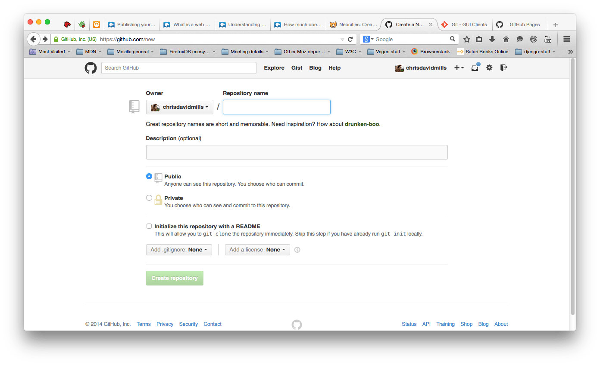

4. 然后，将你的网页文件夹拖拽到你的资源库( repository )，再点击 Commit changes。

   **提示**: 确保你的文件夹有一个 *index.html* 文件.

5. 现在将你的浏览器转到 *username*.github.io 来在线查看你的网站。比如，*如果用户名为chrisdavidmills*, 请转到 [chrisdavidmills.github.io](http://chrisdavidmills.github.io/)。

   **提示**: 你的网站可能需要几分钟的时间才能投入使用。 如果它不能立即工作，你可能需要等待几分钟，然后再试一次。

想要了解更多，请看 [GitHub Pages Help](https://help.github.com/categories/github-pages-basics/).

### 延展阅读[Section](https://developer.mozilla.org/zh-CN/docs/Learn/Getting_started_with_the_web/Publishing_your_website#%E5%BB%B6%E5%B1%95%E9%98%85%E8%AF%BB)

- [What is a web server](https://developer.mozilla.org/en-US/Learn/What_is_a_web_server)
- [Understanding domain names](https://developer.mozilla.org/en-US/Learn/Understanding_domain_names)
- [How much does it cost to do something on the web?](https://developer.mozilla.org/en-US/Learn/How_much_does_it_cost)
- [Deploy a Website](https://www.codecademy.com/learn/deploy-a-website)
- [Cheap or free static web hosting](http://alignedleft.com/resources/cheap-web-hosting) by Scott Murray has some useful ideas on available services.

## WEB是如何工作的

这篇文章简单描述了你在计算机或手机上通过浏览器访问网页时发生了什么。

这个理论在短期内对你编写网页代码不会有实质性的帮助，但是不久之后你会真正从中受益。

### 客户端和服务器[Section](https://developer.mozilla.org/zh-CN/docs/Learn/Getting_started_with_the_web/How_the_Web_works#%E5%AE%A2%E6%88%B7%E7%AB%AF%E5%92%8C%E6%9C%8D%E5%8A%A1%E5%99%A8)

连接到互联网的计算机被称作客户端和服务器。下面是一个简单描述它们如何交互的图表：


- 客户端是典型的Web用户入网设备（比如，你连接了Wi-Fi的电脑，或接入移动网络的手机）和设备上可联网的软件（通常使用像 Firefox 和 Chrome的浏览器）。
- 服务器是存储网页，站点和应用的计算机。当一个客户端设备想要获取一个网页时，一份网页的拷贝将从服务器上下载到客户端机器上来在用户浏览器上显示。

### 其他部分[Section](https://developer.mozilla.org/zh-CN/docs/Learn/Getting_started_with_the_web/How_the_Web_works#%E5%85%B6%E4%BB%96%E9%83%A8%E5%88%86)

我们讲的客户端和服务器并不能完成全部工作。还有其他必要的部分，我们将在下面讲述。

现在，让我们假设 Web 就是一条路。路的一端是客户端，就像你的家。另一端则是服务器，就像你想去的商店。


除了客户端和服务器，我们还需要了解：

- **网络连接**: 允许你在互联网上发送和接受数据。基本上和你家到商店的街道差不多。

- **TCP/IP**: 传输控制协议和因特网互连协议是定义数据如何传输的通信协议。这就像你下订单，去商店和买东西时所使用的传输机制。这里就像是一辆汽车或自行车（或是你能想到的其他可能）。

- **DNS**: 域名系统服务器像是一本网站通讯录。当你在浏览器内输入一个网址时，浏览器获取网页之前将会查看域名系统。浏览器需要找到存放你想要的网页的服务器，才能发送 HTTP 请求到正确的地方。就像你要知道商店的地址才能到达那。

- **HTTP**: 超文本传输协议是一个定义客户端和服务器间交流的语言的协议（[protocol](https://developer.mozilla.org/en-US/docs/Glossary/Protocol) ）。就像你下订单时所说的话一样。

- 组成文件

  : 一个网页由许多文件组成，就像商店里不同的商品一样。这些文件有两种类型：

  - **代码** : 网页大体由 HTML、CSS、JavaScript组成，不过你会在后面看到不同的技术。
  - **资源** : 这是其他组成网页的东西的集合，比如图像、音乐、视频、Word文档、PDF文件。

### 到底发生了什么？[Section](https://developer.mozilla.org/zh-CN/docs/Learn/Getting_started_with_the_web/How_the_Web_works#%E5%88%B0%E5%BA%95%E5%8F%91%E7%94%9F%E4%BA%86%E4%BB%80%E4%B9%88%EF%BC%9F)

当你在浏览器里输入一个网址时（在我们的例子里就是走向商店的路上时）：

1. 浏览器在域名系统服务器上找出存放网页的服务器的实际地址（找出商店的位置）。
2. 浏览器发送 HTTP 请求信息到服务器来请拷贝一份网页到客户端（你走到商店并下订单）。这条消息，包括其他所有在客户端和服务器之间传递的数据都是通过互联网使用 TCP/IP 协议传输的。
3. 服务器同意客户端的请求后，会返回一个“200 OK”信息，意味着“你可以查看这个网页，给你～”，然后开始将网页的文件以数据包的形式传输到浏览器（商店给你商品，你将商品带回家）。
4. 浏览器将数据包聚集成完整的网页然后将网页呈现给你（商品到了你的门口 —— 新东西，好棒！）。

### DNS解析[Section](https://developer.mozilla.org/zh-CN/docs/Learn/Getting_started_with_the_web/How_the_Web_works#DNS%E8%A7%A3%E6%9E%90)

真正的网址看上去并不像你输入的那样美好、容易记忆。它们是一串数字，像 63.245.217.105。

这叫做 IP 地址，它代表了一个互联网上独特的位置。然而，它并不容易记忆，不是吗？那就是域名系统被发明的原因。它们是将你输入浏览器的地址与实际 IP 地址相匹配的特殊的服务器（像 "mozilla.org"）。

网页可以通过  [IP地址](https://developer.mozilla.org/en-US/docs/Glossary/IP_Address)直接访问。试试通过输入 `63.245.217.105` 来访问 Mozilla网站。能准确访问的IP是：63.245.215.20。


### 数据包解析[Section](https://developer.mozilla.org/zh-CN/docs/Learn/Getting_started_with_the_web/How_the_Web_works#%E6%95%B0%E6%8D%AE%E5%8C%85%E8%A7%A3%E6%9E%90)

前面我们用“包”来描述了数据从服务器到客户端传输的格式。这是什么意思？基本上，当数据在Web上传输时，是以成千上万的小 数据块 的形式传输的。大量不同的用户都可以在同时下载同一个网页。如果网页以单个大的 数据块 形式传输，一次就只有一个用户下载，无疑会让Web非常没有效率并且失去很多乐趣。

### 扩展阅读[Section](https://developer.mozilla.org/zh-CN/docs/Learn/Getting_started_with_the_web/How_the_Web_works#%E6%89%A9%E5%B1%95%E9%98%85%E8%AF%BB)

- [How the Internet works](https://developer.mozilla.org/zh-CN/docs/learn/How_the_Internet_works)
- [HTTP — an Application-Level Protocol](https://dev.opera.com/articles/http-basic-introduction/)
- [HTTP: Let’s GET It On!](https://dev.opera.com/articles/http-lets-get-it-on/)
- [HTTP: Response Codes](https://dev.opera.com/articles/http-response-codes/)

#   HTML介绍

## HTML学习路线

为了创建网站，你应该了解[HTML](https://developer.mozilla.org/en-US/docs/Glossary/HTML) —— 用于定义一个网页的结构的基本技术。HTML用来详细说明你的网页内容是应该被理解为段落、列表、头部、链接、图像、多媒体播放器、表单或是其他众多可用的元素当中的一个亦或是你定义的新元素。

### 学习路径[Section](https://developer.mozilla.org/zh-CN/docs/Learn/HTML#%E5%AD%A6%E4%B9%A0%E8%B7%AF%E5%BE%84)

理论上来说你的学习旅途应该从学HTML开始，先阅读[HTML介绍 — (Introduction to HTML)](https://developer.mozilla.org/zh-CN/docs/Learn/HTML/Introduction_to_HTML)。此后你便能够继续学习更多高级的主题，例如：

- [CSS](https://developer.mozilla.org/zh-CN/docs/Learn/CSS), 如何运用CSS装饰HTML(例如：更改你的文本字号和使用的字体，添加边框和阴影，将你的页面设计成多栏布局，添加动画和其他视觉效果。)
- [JavaScript](https://developer.mozilla.org/zh-CN/docs/Learn/JavaScript),如何使用JavaScript为网页添加动态的函数功能(例如：找到你的地址并且在地图上绘制出来，当你触发按钮就让UI元素显示或消失，将用户的数据本地储存在他们的电脑里，以及更多的函数功能。)

在开始这个主题的学习之前，你至少要对被动（passively）使用电脑和网络有基本的认识(例如：看着它并理解它的内容。不过既然你在上网看这篇文档，这一点应该不是问题(^_^) )。

- 你应该安装好一个基础的工作环境，详细参照[安装基础的软件](https://developer.mozilla.org/zh-CN/docs/Learn/Getting_started_with_the_web/Installing_basic_software) [— ](https://developer.mozilla.org/en-US/docs/Learn/HTML/Introduction_to_HTML)[(Installing basic software](https://developer.mozilla.org/en-US/docs/Learn/Getting_started_with_the_web/Installing_basic_software))。
- 并且理解如何新建和管理文件，详细参照 [处理文件 ](https://developer.mozilla.org/zh-CN/docs/Learn/Getting_started_with_the_web/Dealing_with_files)[— ](https://developer.mozilla.org/en-US/docs/Learn/HTML/Introduction_to_HTML)[(Dealing with files)](https://developer.mozilla.org/en-US/docs/Learn/Getting_started_with_the_web/Dealing_with_files) 

这两个都是 [开始Web的学习 — (Getting started with the web)](https://developer.mozilla.org/zh-CN/docs/Learn/Getting_started_with_the_web) 里完全新手模块中的内容。

建议在尝试这个主题的学习之前先完成[开始Web的学习 — (Getting started with the web)](https://developer.mozilla.org/zh-CN/docs/Learn/Getting_started_with_the_web) 的学习，然而这并不是绝对必要的。[HTML基础 — (HTML basics](https://developer.mozilla.org/zh-CN/docs/Learn/Getting_started_with_the_web/HTML_basics))里大多数的文章在 [HTML介绍 — (Introduction to HTML)](https://developer.mozilla.org/zh-CN/docs/Learn/HTML/Introduction_to_HTML) 模块里也有，虽然细节更为详细。

### 模块[Section](https://developer.mozilla.org/zh-CN/docs/Learn/HTML#%E6%A8%A1%E5%9D%97)

这个主题由包含以下模块，建议按顺序进行学习。很显然，我们建议你从第一个模块开始学习。

- [HTML介绍  (Introduction to HTML)](https://developer.mozilla.org/zh-CN/docs/Learn/HTML/Introduction_to_HTML)

  这一模块将为你铺路，帮你熟悉一些重要的概念和语法，着眼于如何应用HTML去编辑，如何创造超链接，以及怎样使用HTML构造一个网页。

- [多媒体和嵌入  (Multimedia and embedding)](https://developer.mozilla.org/zh-CN/docs/Learn/HTML/Multimedia_and_embedding)

  这个模块带你探索如何使用HTML在你的网页里如何包含多媒体信息、如何用多种不同方法插入图片、如何嵌入视频、音频，甚至是嵌入其他完整的网页。

- [HTML 表格  (HTML Tables)](https://developer.mozilla.org/zh-CN/docs/Learn/HTML/Tables)

  在网页上表现表格数据、又要以易理解、可访问（[accessible](https://developer.mozilla.org/en-US/docs/Glossary/Accessibility)）的方式，是一项挑战。这个模块包括了基本的表格标记（markup），同时也有更多复杂的特性，例如实现标题和总结。

- [HTML 表单  (HTML Forms )](https://developer.mozilla.org/zh-CN/docs/Learn/HTML/Forms_and_buttons)

  表单是网页中十分重要的部分——它们会提供给你交互网站需要的很多功能（例如：注册，登录，发送反馈、购物等等）。这个模块将带你开始创建表单的客户端部分。

### 解决常见HTML问题[Section](https://developer.mozilla.org/zh-CN/docs/Learn/HTML#%E8%A7%A3%E5%86%B3%E5%B8%B8%E8%A7%81HTML%E9%97%AE%E9%A2%98)

[使用HTML解决基础的问题](https://developer.mozilla.org/zh-CN/docs/Learn/HTML/Howto) 为我们提供了一系列在创建网页过程中解决基础问题的方案：处理标题，添加图片或视频，强调内容，创建一个基础表单等等。

### 相关链接[Section](https://developer.mozilla.org/zh-CN/docs/Learn/HTML#%E7%9B%B8%E5%85%B3%E9%93%BE%E6%8E%A5)

- [HTML(超文本标记语言) — HTML(HyperText Markup Language)](https://developer.mozilla.org/zh-CN/docs/Web/HTML) on MDN.

  这是HTML 文档在 MDN 上的主入口，涵盖了详细的元素和属性参考。举例来说，如果你想知道一个元素有什么属性或者一个属性具有什么值，这是一个查询的好地方。


## HTML概述

就其核心而言， [HTML](https://developer.mozilla.org/en-US/docs/Glossary/HTML) 是一种相当简单的、由不同[元素](https://developer.mozilla.org/zh-CN/docs/Learn/HTML/zh-CN/docs/Glossary/Element)组成的标记语言，它可以应用于文本片段，使文本在文档中具有不同的含义（它是一个段落吗？它是一个项目列表吗？它是一个表格吗？），将文档结构化为逻辑块（文档是否有头部？有三列内容？有一个导航菜单？），并且可以将图片，影像等内容嵌入到页面中。本模块将介绍前两个，并且介绍一些理解HTML所需的基本概念和语法。

### 前提[Section](https://developer.mozilla.org/zh-CN/docs/Learn/HTML/Introduction_to_HTML#%E5%89%8D%E6%8F%90)

在开始这个模块之前，你不需要预先具有任何HTML的知识，但是你需要至少熟悉一些使用电脑的基础，会被动地使用网络（也就是仅需要看着它，浏览内容）。你应该为电脑配置一个基本的工作环境，这在[安装基本软件](https://developer.mozilla.org/zh-CN/docs/Learn/Getting_started_with_the_web/Installing_basic_software)的页面中有详细说明，并且需要懂得如何创建和管理文件，这在[处理文件](https://developer.mozilla.org/zh-CN/docs/Learn/Getting_started_with_the_web/Dealing_with_files)页面中有详细说明 —— 它们都是我们纯新手[web开发入门](https://developer.mozilla.org/zh-CN/docs/Learn/Getting_started_with_the_web)模块的一部分。

**注意：**如果你工作在一个无权创建自己文件的电脑/平板/其他设备上，你需要在一个在线编程工具上试验 （大多数）代码示例，如 [JSBin](http://jsbin.com/) 或者[Thimble](https://thimble.mozilla.org/)等。

### 指南[Section](https://developer.mozilla.org/zh-CN/docs/Learn/HTML/Introduction_to_HTML#%E6%8C%87%E5%8D%97)

这个模块包含以下文章，这些文章会帮你过一遍HTML所有的基本理论，并且提供足够的实践机会。

- [HTML入门](https://developer.mozilla.org/zh-CN/docs/Learn/HTML/Introduction_to_HTML/Getting_started)

  涵盖了HTML绝对基础的知识来帮助你入门——我们定义元素、属性和其他重要术语，以及它们属于语言的哪个部分。我们也会展示一个典型的HTML 页面是如何被结构化的，以及一个 HTML 元素是如何被结构化的 ，并且解释另一些基础但重要的语言特性。一路下来，我们会与一些 HTML一起玩耍，来激发你的兴趣！

- [Head中有什么？HTML中的元数据](https://developer.mozilla.org/zh-CN/docs/Learn/HTML/Introduction_to_HTML/The_head_metadata_in_HTML)

  当页面被加载后HTML中的head部分**是不会**被显示在web浏览器中的。它包含了许多信息，例如网页的标题[``](https://developer.mozilla.org/zh-CN/docs/Web/HTML/Element/title)，指向[CSS](https://developer.mozilla.org/en-US/docs/Glossary/CSS)的链接（如果你想用CSS来设计HTML内容的样式），指向自定义网站图标的链接和一些元数据（关于HTML本身的数据，例如它的作者和描述这个文档的关键字）。

- [HTML 文字处理基础 ](https://developer.mozilla.org/zh-CN/docs/Learn/HTML/Introduction_to_HTML/HTML_text_fundamentals)

  HTML的主要工作之一就是给予文本意义（也被叫做**语义**），所以浏览器就知道如何正确的显示文本了。这篇文章关注于如何用HTML来将文本块分解为结构化的标题和段落、强调和加粗单词 、创建列表和其他。

- [创建超链接](https://developer.mozilla.org/zh-CN/docs/Learn/HTML/Introduction_to_HTML/Creating_hyperlinks)

  超链接真的很重要 - 它们是使Web成为一个Web。本文介绍了创建链接所需的语法，并讨论了链接最佳实践。

- [高级文本排版](https://developer.mozilla.org/zh-CN/docs/Learn/HTML/Introduction_to_HTML/Advanced_text_formatting)

  HTML中有许多其他元素可以用于格式化文本，我们没有在[HTML 文字处理基础](https://developer.mozilla.org/zh-CN/docs/Learn/HTML/Introduction_to_HTML/HTML_text_fundamentals)中提到它们。这些元素不太知名，但了解它们仍然有用。在这篇文章里，你将学习如何标记引文、描述列表、计算机代码和其他类似的文本、下标和上标、联系信息等。

- [文档和网站结构](https://developer.mozilla.org/zh-CN/docs/Learn/HTML/Introduction_to_HTML/Document_and_website_structure)

  除了定义页面的各个部分（例如“段落”或“图像”）外，HTML也用于定义网站的区域（例如“标题”，“导航菜单”，“主内容列“）。本文探讨如何规划基本网站结构，以及如何编写HTML以表示此结构。

- [调试 HTML](https://developer.mozilla.org/zh-CN/docs/Learn/HTML/Introduction_to_HTML/Debugging_HTML)

  编写HTML是好的，但如果出现了什么问题，而且你没能找到代码中的错误在哪里的话，本文将向你介绍一些可以帮上忙的工具。

### 评估[Section](https://developer.mozilla.org/zh-CN/docs/Learn/HTML/Introduction_to_HTML#%E8%AF%84%E4%BC%B0)

以下评估将测试你对上述指南中HTML基础知识的理解。

- [制造一份信件](https://developer.mozilla.org/zh-CN/docs/Learn/HTML/Introduction_to_HTML/Marking_up_a_letter)

  我们或早或晚都学会了如何写一封信，这也是一个不错的用来测试我们的文本格式化技能例子！所以在这个评估中，你会得到一封信来标记。

- [ 结构化页面内容](https://developer.mozilla.org/zh-CN/docs/Learn/HTML/Introduction_to_HTML/Structuring_a_page_of_content)

  此评估测试你能否使用HTML构建简单的内容页面，其中包含页眉、页脚、导航菜单、主要内容和侧边栏。

### 相关链接[Section](https://developer.mozilla.org/zh-CN/docs/Learn/HTML/Introduction_to_HTML#%E7%9B%B8%E5%85%B3%E9%93%BE%E6%8E%A5)

 [网络文化基础 1](https://teach.mozilla.org/activities/web-lit-basics/)

  一个优秀的Mozilla基础课程，探索和测试在HTML模块介绍中讨论的许多技能。学习者熟悉阅读，写作和参与这个六部分模块的网络。通过生产和协作掌握网络的基础。


  ## HTML入门


​    


​    通过本文，我们将带领您从HTML最基础的部分开始学习 - 我们定义元素，属性以及您可能听到的其他重要术语，以及它们在语言中的合适位置。我们还告诉你HTML元素的结构组成，以及一个典型HTML页面的结构，当然也会解释其他一些重要的基本语言特性。学习的同时，我们会使用HTML做一些好玩的事情，让你对HTML更加感兴趣！

| 基础要求: | 基本的计算机素养,  基本软件安装, 和使用文件的基本知识.     |
| --------- | ---------------------------------------------------------- |
| 目的:     | 要获得对HTML语言的基本熟悉，并获得一些练习写几个HTML元素。 |

### 什么是 HTML?[Section](https://developer.mozilla.org/zh-CN/docs/Learn/HTML/Introduction_to_HTML/Getting_started#%E4%BB%80%E4%B9%88%E6%98%AF_HTML)

[HTML](https://developer.mozilla.org/en-US/docs/Glossary/HTML) (HyperText Markup Language) 不是一种编程语言;它是一种标记语言，用于告诉您的浏览器如何构造您访问的网页。它可以像Web开发人员希望的那样复杂或简单。 HTML由一系列的 [元素](https://developer.mozilla.org/en-US/docs/Glossary/Element)组成, 您可以使用它来封装，包装或标记内容的不同部分，使其以某种方式显示，或以某种方式执行。封闭[tags](https://developer.mozilla.org/en-US/docs/Glossary/Tag) 可以使一点内容成为超链接以链接到Web上的另一页面，斜体字等等。例如，采取以下行内容：

```html
My cat is very grumpy
```

如果我们想要自己的行，我们可以指定它是一个段落通过将它包含在段落标签([``](https://developer.mozilla.org/zh-CN/docs/Web/HTML/Element/p)) 元素：

```html
<p>My cat is very grumpy</p>
```

注意：HTML中的标签是不区分大小写的。也就是说，当你输入标签时，你既可以使用大写字母也可以使用小写字母。例如，标签[``](https://developer.mozilla.org/zh-CN/docs/Web/HTML/Element/title)可以写作`<title>`，`<TITLE>`，`<Title>`，`<TiTlE>`，等等，它们都可以正常工作。不过，从一致性、可读性和其他各方面来说，最好仅使用小写字母。

### 剖析一个 HTML 元素[Section](https://developer.mozilla.org/zh-CN/docs/Learn/HTML/Introduction_to_HTML/Getting_started#%E5%89%96%E6%9E%90%E4%B8%80%E4%B8%AA_HTML_%E5%85%83%E7%B4%A0)

 

让我们进一步探讨我们的段落元素：


我们的元素的主要部分是：

1. **开始标签（Opening tag）：**包括元素的名称（在本例中，p），包裹在开始和结束尖括号中。这表示元素开始或开始生效 - 在这种情况下，表示了一个段落的开头。
2. **结束标签（Closing tag）：**这与开始标记相同，除了它在元素名称之前包含正斜杠。这表示元素结束的位置 - 在这种情况下，表示了一个段落的结尾. 没有包含结束标记是一个常见的初学者错误，并可能导致奇怪的结果。
3. **内容（Content）：**这是元素的内容，在这种情况下只是文本。
4. **元素（Element）：**开始标记，加结束标记，加内容，等于元素。

### 实践学习: 创建你的第一个HTML文档[Section](https://developer.mozilla.org/zh-CN/docs/Learn/HTML/Introduction_to_HTML/Getting_started#%E5%AE%9E%E8%B7%B5%E5%AD%A6%E4%B9%A0_%E5%88%9B%E5%BB%BA%E4%BD%A0%E7%9A%84%E7%AC%AC%E4%B8%80%E4%B8%AAHTML%E6%96%87%E6%A1%A3)

通过使用标签 `<em>` 和 `</em>` （在前面放置 `<em>` 打开元素，在后面放置 `</em>` 关闭元素）——这使得行内容变成斜体强调！您可以在“输出”区域中实时查看更改更新。

如果您犯了错误，您总是可以使用重置按钮重置。如果你真的卡住了，按显示解决方案按钮看到答案。

**[练习在网页中打开](https://developer.mozilla.org/zh-CN/docs/Learn/HTML/Introduction_to_HTML/Getting_started#%E5%AE%9E%E8%B7%B5%E5%AD%A6%E4%B9%A0_%E5%88%9B%E5%BB%BA%E4%BD%A0%E7%9A%84%E7%AC%AC%E4%B8%80%E4%B8%AAHTML%E6%96%87%E6%A1%A3)**

<iframe src="https://mdn.mozillademos.org/zh-CN/docs/learn/HTML/Introduction_to_HTML/Getting_started$samples/Playable_code?revision=1421738" height="300" width="700" id="frame_Playable_code" class="live-sample-frame sample-code-frame" frameborder="0" style="font-style: normal; max-width: calc((100% - 40px) - 6px); margin: 0px; padding: 20px; border-width: 1px 1px 1px 5px; border-style: solid; border-color: rgb(61, 126, 154); border-image: initial; width: calc((100% - 40px) - 6px); color: rgb(51, 51, 51); font-family: Verdana, arial, x-locale-body, sans-serif; font-size: 16px; font-variant-ligatures: normal; font-variant-caps: normal; font-weight: 400; letter-spacing: -0.05328px; orphans: 2; text-align: start; text-indent: 0px; text-transform: none; white-space: normal; widows: 2; word-spacing: 0px; -webkit-text-stroke-width: 0px; background-color: rgb(255, 255, 255); text-decoration-style: initial; text-decoration-color: initial;"></iframe>

在 CodePen 中打开在 JSFiddle 中打开


### 嵌套元素[Section](https://developer.mozilla.org/zh-CN/docs/Learn/HTML/Introduction_to_HTML/Getting_started#%E5%B5%8C%E5%A5%97%E5%85%83%E7%B4%A0)

你也可以把元素放到其它元素之中——这被称作嵌套。如果我们想要表明我们的小猫脾气很暴躁，可以将very嵌套在[``](https://developer.mozilla.org/zh-CN/docs/Web/HTML/Element/strong) 中，意味着这个单词被着重强调:

```html
<p>My cat is <strong>very</strong> grumpy.</p>
```

你需要确保元素被正确的嵌套：在上面的例子中我们先打开[``](https://developer.mozilla.org/zh-CN/docs/Web/HTML/Element/p)元素，然后才打开[``](https://developer.mozilla.org/zh-CN/docs/Web/HTML/Element/strong)元素，因此必须先将[``](https://developer.mozilla.org/zh-CN/docs/Web/HTML/Element/strong)元素关闭，然后再去关闭[``](https://developer.mozilla.org/zh-CN/docs/Web/HTML/Element/p)元素。下面的例子是错误的：

```html
<p>My cat is <strong>very grumpy.</p></strong>
```

所有的元素都需要正确的打开和关闭，这样才能按你所想的方式展现。如果像上述的例子一样进行了错误的嵌套，那么浏览器会去猜测你想要表达的意思，但很有可能会得出错误的结果。所以永远不要这么做！

### **块级元素和内联元素[Section](https://developer.mozilla.org/zh-CN/docs/Learn/HTML/Introduction_to_HTML/Getting_started#%E5%9D%97%E7%BA%A7%E5%85%83%E7%B4%A0%E5%92%8C%E5%86%85%E8%81%94%E5%85%83%E7%B4%A0)**

在HTML中有两种你需要知道的重要元素类别，**块级元素和内联元素。**

- **块级元素在页面中以块的形式展现 —— 相对与其前面的内容它会出现在新的一行，其后的内容也会被挤到下一行展现。**块级元素通常用于展示页面上结构化的内容，例如段落、列表、导航菜单、页脚等等。一个以block形式展现的块级元素不会被嵌套进内联元素中，但可以嵌套在其它块级元素中。
- **内联元素通常出现在块级元素中并包裹文档内容的一小部分，而不是一整个段落或者一组内容。内联元素不会导致文本换行**：它通常出现在一堆文字之间例如超链接元素[``](https://developer.mozilla.org/zh-CN/docs/Web/HTML/Element/a)或者强调元素[``](https://developer.mozilla.org/zh-CN/docs/Web/HTML/Element/em)和 [``](https://developer.mozilla.org/zh-CN/docs/Web/HTML/Element/strong)。

看一看下面的例子：

```html
<em>first</em><em>second</em><em>third</em>

<p>fourth</p><p>fifth</p><p>sixth</p>
```

[`<em>`](https://developer.mozilla.org/zh-CN/docs/Web/HTML/Element/em) 是一个内联元素，所以就像你在下方可以看到的，第一行代码中的三个元素都没有间隙的展示在了同一行。而[``](https://developer.mozilla.org/zh-CN/docs/Web/HTML/Element/p)是一个块级元素，所以第二行代码中的每个元素分别都另起了新的一行展现，并且每个段落间都有一些间隔（这是因为默认的浏览器有着默认的展示[``](https://developer.mozilla.org/zh-CN/docs/Web/HTML/Element/p)元素的 [CSS styling](https://developer.mozilla.org/en-US/docs/Learn/CSS/Introduction_to_CSS) ）。

<iframe src="https://mdn.mozillademos.org/zh-CN/docs/learn/HTML/Introduction_to_HTML/Getting_started$samples/%E5%9D%97%E7%BA%A7%E5%85%83%E7%B4%A0%E5%92%8C%E5%86%85%E8%81%94%E5%85%83%E7%B4%A0?revision=1421738" height="200" width="700" id="frame_块级元素和内联元素" class="live-sample-frame sample-code-frame" frameborder="0" style="font-style: normal; max-width: calc((100% - 40px) - 6px); margin: 0px; padding: 20px; border-width: 1px 1px 1px 5px; border-style: solid; border-color: rgb(61, 126, 154); border-image: initial; width: calc((100% - 40px) - 6px); color: rgb(51, 51, 51); font-family: Verdana, arial, x-locale-body, sans-serif; font-size: 16px; font-variant-ligatures: normal; font-variant-caps: normal; font-weight: 400; letter-spacing: -0.05328px; orphans: 2; text-align: start; text-indent: 0px; text-transform: none; white-space: normal; widows: 2; word-spacing: 0px; -webkit-text-stroke-width: 0px; background-color: rgb(255, 255, 255); text-decoration-style: initial; text-decoration-color: initial;"></iframe>

在 CodePen 中打开在 JSFiddle 中打开


**提示**: HTML5重新定义了元素的类别：见 [元素内容分类](http://www.whatwg.org/specs/web-apps/current-work/complete/section-index.html#element-content-categories)（链接已失效）。尽管这些新的定义更精确，但却比上述的 “块级元素” 和 “内联元素” 更难理解，因此在之后的讨论中仍使用旧的定义。

### 空元素[Section](https://developer.mozilla.org/zh-CN/docs/Learn/HTML/Introduction_to_HTML/Getting_started#%E7%A9%BA%E5%85%83%E7%B4%A0)

不是所有元素都拥有开始标签，内容和结束标记. 一些元素只有一个标签，通常用来在此元素所在位置插入/嵌入一些东西 。例如：元素[`img`](https://developer.mozilla.org/zh-CN/docs/Web/HTML/Element/img)是用来在元素[`img`](https://developer.mozilla.org/zh-CN/docs/Web/HTML/Element/img)所在位置插入一张指定的图片。例子如下：

```html

```

显示如下：


在 CodePen 中打开在 JSFiddle 中打开

**提示**: Empty elements 有时也被叫作 *void elements*.

### **属性[Section](https://developer.mozilla.org/zh-CN/docs/Learn/HTML/Introduction_to_HTML/Getting_started#%E5%B1%9E%E6%80%A7)**

元素也可以拥有属性，如下：


属性包含元素的额外信息，这些信息不会出现在实际的内容中。在上述例子中，这个class属性给元素赋了一个识别的名字（id），这个名字此后可以被用来识别此元素的样式信息和其他信息。

一个属性必须包含如下内容：

1. 在元素和属性之间有个空格space (如果有一个或多个已存在的属性，就与前一个属性之间有一个空格.)
2. 属性后面紧跟着一个“=”符号.
3. 有一个属性值,由一对引号“ ”引起来.

### 学习实践：为一个元素添加属性[Section](https://developer.mozilla.org/zh-CN/docs/Learn/HTML/Introduction_to_HTML/Getting_started#%E5%AD%A6%E4%B9%A0%E5%AE%9E%E8%B7%B5%EF%BC%9A%E4%B8%BA%E4%B8%80%E4%B8%AA%E5%85%83%E7%B4%A0%E6%B7%BB%E5%8A%A0%E5%B1%9E%E6%80%A7)

另一个例子是关于元素[``](https://developer.mozilla.org/zh-CN/docs/Web/HTML/Element/a)的——元素[``](https://developer.mozilla.org/zh-CN/docs/Web/HTML/Element/a)是锚，它使被标签包裹的内容成为一个超链接。此元素也可以添加大量的属性，其中几个如下：

 

- `href`: 这个属性声明超链接的web地址，当这个链接被点击浏览器会跳转至href声明的web地址。例如： `href="https://www.mozilla.org/"`。
- `title`: 标题`title` 属性为超链接声明额外的信息，比如你将链接至那个页面。例如： `title="The Mozilla homepage"`。当鼠标悬浮时，将出现一个工具提示。
- `target`: 目标`target` 属性指定将用于显示链接的浏览上下文。 例如， `target="_blank"` 将在新标签页中显示链接。如果你希望在目前标签页显示链接，只需忽略这个属性。 

 

在下面的文本框中内容，使之变成指向任一个你喜欢的web地址的链接。首先，添加<a>元素，然后为它添加href属性和title属性。你可以适时地在输出区域看到你改变的内容。你应该可以看到一个连接，当鼠标移上此链接时会显示title属性值，当点击此链接时会跳转到href指定的web地址。记住：在元素名和属性名之间以及两个属性之间要有一个空格space。

当你出错时，你可以用*Reset* 按钮修改它。当你真正完成这个任务时，点击*Show solution* 按钮观看答案。


在 CodePen 中打开在 JSFiddle 中打开


### 布尔属性[Section](https://developer.mozilla.org/zh-CN/docs/Learn/HTML/Introduction_to_HTML/Getting_started#%E5%B8%83%E5%B0%94%E5%B1%9E%E6%80%A7)

有时你会看到没有值的属性，它是合法的。这些属性被称为布尔属性，他们只能有跟它的属性名一样的属性值。例如 `disabled` 属性，他们可以标记表单输入使之变为不可用(变灰色)，此时用户不能向他们输入任何数据。

```html
<input type="text" disabled="disabled">
```

采用如下简写更佳(下面一句为可用可输入数据的文本框，以作为对比)：

```html
<input type="text" disabled>

<input type="text">
```

上面两个文本框显示如下：

<iframe src="https://mdn.mozillademos.org/zh-CN/docs/learn/HTML/Introduction_to_HTML/Getting_started$samples/%E5%B8%83%E5%B0%94%E5%B1%9E%E6%80%A7?revision=1421738" height="100" width="700" id="frame_布尔属性" class="live-sample-frame sample-code-frame" frameborder="0" style="font-style: normal; max-width: calc((100% - 40px) - 6px); margin: 0px; padding: 20px; border-width: 1px 1px 1px 5px; border-style: solid; border-color: rgb(61, 126, 154); border-image: initial; width: calc((100% - 40px) - 6px); color: rgb(51, 51, 51); font-family: Verdana, arial, x-locale-body, sans-serif; font-size: 16px; font-variant-ligatures: normal; font-variant-caps: normal; font-weight: 400; letter-spacing: -0.05328px; orphans: 2; text-align: start; text-indent: 0px; text-transform: none; white-space: normal; widows: 2; word-spacing: 0px; -webkit-text-stroke-width: 0px; background-color: rgb(255, 255, 255); text-decoration-style: initial; text-decoration-color: initial;"></iframe>

在 CodePen 中打开在 JSFiddle 中打开


### 省略包围属性值的引号[Section](https://developer.mozilla.org/zh-CN/docs/Learn/HTML/Introduction_to_HTML/Getting_started#%E7%9C%81%E7%95%A5%E5%8C%85%E5%9B%B4%E5%B1%9E%E6%80%A7%E5%80%BC%E7%9A%84%E5%BC%95%E5%8F%B7)

当你浏览那些粗糙的web网站，你将会看见各种各样奇怪的标记风格，其中就有不给属性值添加引号。在某些情况下它是被允许的，但是其他情况下会破坏你的标记。例如，我们可以写一个只拥有一个href属性的链接，如下：

```
<a href=https://www.mozilla.org/>favorite website</a>
```

然而，当我们再添加一个title属性时就会出错，如下：

```
<a href=https://www.mozilla.org/ title=The Mozilla homepage>favorite website</a>
```

此时浏览器会误解你的标记，它会把title属性理解为三个属性——title的属性值为"The“，另外还有两个布尔属性“`Mozilla`”和“`homepage`”。看下面的例子，它明显不是我们所期望的，并且在这个编码里面它会报错或者出现异常行为。试一试把鼠标移动到连接上，看会显示什么title属性值!

<iframe src="https://mdn.mozillademos.org/zh-CN/docs/learn/HTML/Introduction_to_HTML/Getting_started$samples/%E7%9C%81%E7%95%A5%E5%8C%85%E5%9B%B4%E5%B1%9E%E6%80%A7%E5%80%BC%E7%9A%84%E5%BC%95%E5%8F%B7?revision=1421738" height="100" width="700" id="frame_省略包围属性值的引号" class="live-sample-frame sample-code-frame" frameborder="0" style="font-style: normal; max-width: calc((100% - 40px) - 6px); margin: 0px; padding: 20px; border-width: 1px 1px 1px 5px; border-style: solid; border-color: rgb(61, 126, 154); border-image: initial; width: calc((100% - 40px) - 6px); color: rgb(51, 51, 51); font-family: Verdana, arial, x-locale-body, sans-serif; font-size: 16px; font-variant-ligatures: normal; font-variant-caps: normal; font-weight: 400; letter-spacing: -0.05328px; orphans: 2; text-align: start; text-indent: 0px; text-transform: none; white-space: normal; widows: 2; word-spacing: 0px; -webkit-text-stroke-width: 0px; background-color: rgb(255, 255, 255); text-decoration-style: initial; text-decoration-color: initial;"></iframe>

在 CodePen 中打开在 JSFiddle 中打开

我们建议始终添加引号——这样可以避免很多问题，并且使代码更易读。

### 单引号或者双引号？[Section](https://developer.mozilla.org/zh-CN/docs/Learn/HTML/Introduction_to_HTML/Getting_started#%E5%8D%95%E5%BC%95%E5%8F%B7%E6%88%96%E8%80%85%E5%8F%8C%E5%BC%95%E5%8F%B7%EF%BC%9F)

在目前为止，本章内容所有的属性都是由双引号来包裹。也许在一些HTML中，你以前也见过单引号。这只是风格的问题，你可以从中选择一个你喜欢的。以下两种情况都可以：

```html
<a href="http://www.example.com">A link to my example.</a>

<a href='http://www.example.com'>A link to my example.</a>
```

但你应该注意单引号和双引号不能再一个属性值里面混用。下面的语法是错误的：

```html
<a href="http://www.example.com'>A link to my example.</a>
```

在一个HTML中已使用一种引号，你可以在此引号中嵌套另外一种引号：

```html
<a href="http://www.example.com" title="Isn't this fun?">A link to my example.</a>
```

如果你想将引号当作文本显示在html中，你就必须使用 [实体引用](https://developer.mozilla.org/zh-CN/docs/Learn/HTML/Introduction_to_HTML/Getting_started#%E5%AE%9E%E4%BD%93%E5%BC%95%E7%94%A8%EF%BC%9A_%E5%9C%A8HTML%E4%B8%AD%E5%8C%85%E5%90%AB%E7%89%B9%E6%AE%8A%E5%AD%97%E7%AC%A6) 。

### **分析HTML文档[Section](https://developer.mozilla.org/zh-CN/docs/Learn/HTML/Introduction_to_HTML/Getting_started#%E5%88%86%E6%9E%90HTML%E6%96%87%E6%A1%A3)**

学习了一些HTML元素的基础知识，这些元素单独一个是没有意义的。现在我们来学习这些特定元素是怎么被结合起来，从而形成一个完整的HTML页面的：

```html
<!DOCTYPE html>
<html>
  <head>
    <meta charset="utf-8">
    <title>My test page</title>
  </head>
  <body>
    <p>This is my page</p>
  </body>
</html>
```

分析如下:

1. `<!DOCTYPE html>`: 声明文档类型. 很久以前，早期的HTML(大约1991年2月)，文档类型声明类似于链接，规定了HTML页面必须遵从的良好规则，能自动检测错误和其他有用的东西。使用如下：

   ```
   <!DOCTYPE html PUBLIC "-//W3C//DTD XHTML 1.0 Transitional//EN"
   "http://www.w3.org/TR/xhtml1/DTD/xhtml1-transitional.dtd">
   ```

   然而现在没有人再这样写，需要保证每一个东西都正常工作已成为历史。你只需要知道`<!DOCTYPE html>是最短的有效的文档声明。`

2. ```
   <!DOCTYPE html>
   ```

   : 声明文档类型. 很久以前，早期的HTML(大约1991年2月)，文档类型声明类似于链接，规定了HTML页面必须遵从的良好规则，能自动检测错误和其他有用的东西。使用如下：

   ```html
   <!DOCTYPE html PUBLIC "-//W3C//DTD XHTML 1.0 Transitional//EN"
   "http://www.w3.org/TR/xhtml1/DTD/xhtml1-transitional.dtd">
   ```

   然而现在没有人再这样写，需要保证每一个东西都正常工作已成为历史。你只需要知道

   ```
   <!DOCTYPE html>是最短的有效的文档声明。
   ```

3. ```
   <!DOCTYPE html>
   ```

   : 声明文档类型. 很久以前，早期的HTML(大约1991年2月)，文档类型声明类似于链接，规定了HTML页面必须遵从的良好规则，能自动检测错误和其他有用的东西。使用如下：

   ```html
   <!DOCTYPE html PUBLIC "-//W3C//DTD XHTML 1.0 Transitional//EN"
   "http://www.w3.org/TR/xhtml1/DTD/xhtml1-transitional.dtd">
   ```

   然而现在没有人再这样写，需要保证每一个东西都正常工作已成为历史。你只需要知道

   ```
   <!DOCTYPE html>是最短的有效的文档声明。
   ```

4. ```
   <!DOCTYPE html>
   ```

   : 声明文档类型. 很久以前，早期的HTML(大约1991年2月)，文档类型声明类似于链接，规定了HTML页面必须遵从的良好规则，能自动检测错误和其他有用的东西。使用如下：

   ```html
   <!DOCTYPE html PUBLIC "-//W3C//DTD XHTML 1.0 Transitional//EN"
   "http://www.w3.org/TR/xhtml1/DTD/xhtml1-transitional.dtd">
   ```

   然而现在没有人再这样写，需要保证每一个东西都正常工作已成为历史。你只需要知道

   ```
   <!DOCTYPE html>是最短的有效的文档声明。
   ```

5. ```
   <!DOCTYPE html>
   ```

   : 声明文档类型. 很久以前，早期的HTML(大约1991年2月)，文档类型声明类似于链接，规定了HTML页面必须遵从的良好规则，能自动检测错误和其他有用的东西。使用如下：

   ```html
   <!DOCTYPE html PUBLIC "-//W3C//DTD XHTML 1.0 Transitional//EN"
   "http://www.w3.org/TR/xhtml1/DTD/xhtml1-transitional.dtd">
   ```

   然而现在没有人再这样写，需要保证每一个东西都正常工作已成为历史。你只需要知道

   ```
   <!DOCTYPE html>是最短的有效的文档声明。
   ```

6. 

   : 声明文档类型. 很久以前，早期的HTML(大约1991年2月)，文档类型声明类似于链接，规定了HTML页面必须遵从的良好规则，能自动检测错误和其他有用的东西。使用如下：

   ```html
   <!DOCTYPE html PUBLIC "-//W3C//DTD XHTML 1.0 Transitional//EN"
   "http://www.w3.org/TR/xhtml1/DTD/xhtml1-transitional.dtd">
   ```

   然而现在没有人再这样写，需要保证每一个东西都正常工作已成为历史。你只需要知道

   ```
   <!DOCTYPE html>是最短的有效的文档声明。
   ```

7. `<html></html>`: `<html>`元素。这个元素包裹了整个完整的页面，是一个根元素。

8. `<head></head>`: `<head>元素`. 这个元素是一个容器，它包含了所有你想包含在HTML页面中但不想在HTML页面中显示的内容。这些内容包括你想在搜索结果中出现的关键字和页面描述，CSS样式，字符集声明等等。以后的章节能学到更多关于<head>元素的内容。

9. `<meta charset="utf-8">`: 这个元素设置文档使用utf-8字符集编码，utf-8字符集包含了人类大部分的文字。基本上他能识别你放上去的所有文本内容。毫无疑问要使用它，并且它能在以后避免很多其他问题。

10. `<title></title>`: 设置页面标题，出现在浏览器标签上，当你标记/收藏页面时它可用来描述页面。

11. `<body></body>`: `<body>`元素。 包含了你访问页面时所有显示在页面上的内容，文本，图片，音频，游戏等等。

### 学习实践：为HTML文档添加一些特征[Section](https://developer.mozilla.org/zh-CN/docs/Learn/HTML/Introduction_to_HTML/Getting_started#%E5%AD%A6%E4%B9%A0%E5%AE%9E%E8%B7%B5%EF%BC%9A%E4%B8%BAHTML%E6%96%87%E6%A1%A3%E6%B7%BB%E5%8A%A0%E4%B8%80%E4%BA%9B%E7%89%B9%E5%BE%81)

如果你想在你的本地练习写一些HTML页面，你可以这样做：

1. 复制上面的HTML页面例子。
2. 在编辑器创建一个新文件。
3. 粘贴代码到这个文件。
4. 保存为`index.html`.

**提示：**你也可以在[MDN Learning Area Github repo](https://github.com/mdn/learning-area/blob/master/html/introduction-to-html/getting-started/index.html)上找到这些基础的HTML示例

你可以打开浏览器看看这段代码的效果是什么样的，然后改变代码刷新浏览器看看新的结果。 最开始的代码是这样的效果：

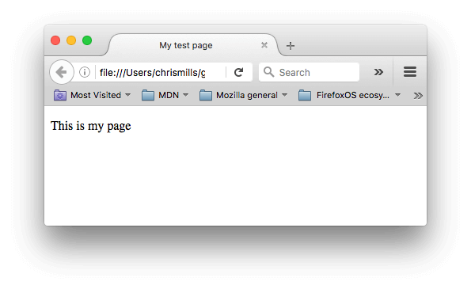

所以在这段练习中, 你可以用你的电脑在本地编写运行代码，如上所述, 你也可以在下面的简单可编辑窗口编辑它 (此时这个简单的可编辑窗口仅显示<body>标签内的内容.) 我们希望您能够实践以下步骤：

- 就在 [``](https://developer.mozilla.org/zh-CN/docs/Web/HTML/Element/body) 元素开始标签下方, 为这个文档添加一个主标题。这个主标题应该被包含在 `<h1>` 开始标签和 `</h1>`结束标签之间。
- 编辑这个段落以包含一些你感兴趣的文本。
- 把字词包含在开始标记 `<strong>`和结束标记 `</strong>` 之间可以使他们以粗体显示，从而突出任何重要的字词。
- 在你的文档中添加一个超文本链接，就像[explained earlier in the article](https://developer.mozilla.org/en-US/Learn/HTML/Introduction_to_HTML/Getting_started#Active_learning_Adding_attributes_to_an_element)。
- 在段落下方向你的文档添加一张图片，就像 [explained earlier in the article](https://developer.mozilla.org/en-US/Learn/HTML/Introduction_to_HTML/Getting_started#Empty_elements)。如果你尝试对不同的图片(在你的本地电脑或是在Web的其他位置上)添加链接，那你就更棒了。

当你出错时，你可以用 Reset 按钮修改它。当你真正完成这个任务时，点击 Show solution 按钮观看答案。

<iframe src="https://mdn.mozillademos.org/zh-CN/docs/learn/HTML/Introduction_to_HTML/Getting_started$samples/Playable_code3?revision=1421738" height="600" width="700" id="frame_Playable_code3" class="live-sample-frame sample-code-frame" frameborder="0" style="font-style: normal; max-width: calc((100% - 40px) - 6px); margin: 0px; padding: 20px; border-width: 1px 1px 1px 5px; border-style: solid; border-color: rgb(61, 126, 154); border-image: initial; width: calc((100% - 40px) - 6px); color: rgb(51, 51, 51); font-family: Verdana, arial, x-locale-body, sans-serif; font-size: 16px; font-variant-ligatures: normal; font-variant-caps: normal; font-weight: 400; letter-spacing: -0.05328px; orphans: 2; text-align: start; text-indent: 0px; text-transform: none; white-space: normal; widows: 2; word-spacing: 0px; -webkit-text-stroke-width: 0px; background-color: rgb(255, 255, 255); text-decoration-style: initial; text-decoration-color: initial;"></iframe>

在 CodePen 中打开在 JSFiddle 中打开


### HTML中的空白[Section](https://developer.mozilla.org/zh-CN/docs/Learn/HTML/Introduction_to_HTML/Getting_started#HTML%E4%B8%AD%E7%9A%84%E7%A9%BA%E7%99%BD)

在上面的例子中，你可能已经注意到了在代码中包含了很多的空格——这是没有必要的；下面的两个代码片段是等价的：

```html
<p>Dogs are silly.</p>

<p>Dogs        are
         silly.</p>
```

无论你用了多少空白(包括空白字符，包括换行), 当渲染这些代码的时候，HTML解释器会将连续出现的空白字符减少为一个单独的空格符。那么为什么我们会使用那么多的空白呢? 答案就是为了可读性 —— 如果你的代码被很好地进行格式化，那么就很容易理解你的代码是怎么回事, 反之就只有聚做一团的混乱. 在我们的HTML代码中，我们让每一个嵌套的元素以两个空格缩进。 你使用什么风格来格式化你的代码取决于你 (比如所对于每层缩进使用多少个空格),但是你应该坚持使用某种风格。

### **实体引用： 在HTML中包含特殊字符[Section](https://developer.mozilla.org/zh-CN/docs/Learn/HTML/Introduction_to_HTML/Getting_started#%E5%AE%9E%E4%BD%93%E5%BC%95%E7%94%A8%EF%BC%9A_%E5%9C%A8HTML%E4%B8%AD%E5%8C%85%E5%90%AB%E7%89%B9%E6%AE%8A%E5%AD%97%E7%AC%A6)**

在HTML中，字符 `<`, `>`,`"`,`'` 和 `&` 是特殊字符. 它们是HTML语法自身的一部分, 那么你如何将这些字符包含进你的文本中呢, 比如说如果你真的想要在文本中使用符号&或者小于号, 而不想让它们被浏览器视为代码并被解释?

我们必须使用字符引用 —— 表示字符的特殊编码, 它们可以在那些情况下使用. 每个字符引用以符号&开始, 以分号(;)结束.

| 原义字符 | 等价字符引用 |
| -------- | ------------ |
| <        | &lt;         |
| >        | &gt;         |
| "        | &quot;       |
| '        | &apos;       |
| &        | &amp;        |

在下面的例子中你可以看到两个段落，它们在谈论web技术:

```html
<p>In HTML, you define a paragraph using the <p> element.</p>

<p>In HTML, you define a paragraph using the &lt;p&gt; element.</p>
```

在下面的实时输出中，你会看到第一段是错误的，因为浏览器会认为第二个<p>是开始一个新的段落！  第二段是正确的，因为我们用字符引用来代替了角括号（'<'和'>'符号）.

<iframe src="https://mdn.mozillademos.org/zh-CN/docs/learn/HTML/Introduction_to_HTML/Getting_started$samples/%E5%AE%9E%E4%BD%93%E5%BC%95%E7%94%A8%EF%BC%9A_%E5%9C%A8HTML%E4%B8%AD%E5%8C%85%E5%90%AB%E7%89%B9%E6%AE%8A%E5%AD%97%E7%AC%A6?revision=1421738" height="200" width="700" id="frame_实体引用：_在HTML中包含特殊字符" class="live-sample-frame sample-code-frame" frameborder="0" style="font-style: normal; max-width: calc((100% - 40px) - 6px); margin: 0px; padding: 20px; border-width: 1px 1px 1px 5px; border-style: solid; border-color: rgb(61, 126, 154); border-image: initial; width: calc((100% - 40px) - 6px); color: rgb(51, 51, 51); font-family: Verdana, arial, x-locale-body, sans-serif; font-size: 16px; font-variant-ligatures: normal; font-variant-caps: normal; font-weight: 400; letter-spacing: -0.05328px; orphans: 2; text-align: start; text-indent: 0px; text-transform: none; white-space: normal; widows: 2; word-spacing: 0px; -webkit-text-stroke-width: 0px; background-color: rgb(255, 255, 255); text-decoration-style: initial; text-decoration-color: initial;"></iframe>

在 CodePen 中打开在 JSFiddle 中打开

**提示**: 维基百科上有一个包含所有可用HTML字符实体引用的列表：[XML和HTML字符实体引用列表](http://en.wikipedia.org/wiki/List_of_XML_and_HTML_character_entity_references)。

### **HTML注释[Section](https://developer.mozilla.org/zh-CN/docs/Learn/HTML/Introduction_to_HTML/Getting_started#HTML%E6%B3%A8%E9%87%8A)**

如同大部分的编程语言一样，在HTML中有一种可用的机制来在代码中书写注释 —— 注释是被浏览器忽略的，而且是对用户不可见的，它们的目的是允许你描述你的代码是如何工作的和不同部分的代码做了什么等等。 如果你在半年后重新返回你的代码库，而且不能记起你所做的事情 —— 或者当你处理别人的代码的时候， 那么注释是很有用的.

为了将一段HTML中的内容置为注释，你需要将其用特殊的记号<!--和-->包括起来， 比如：

```html
<p>I'm not inside a comment</p>

<!-- <p>I am!</p> -->
```

正如你下面所见的那样，第一段出现在了实时输出中，但是第二段却没有。

<iframe src="https://mdn.mozillademos.org/zh-CN/docs/learn/HTML/Introduction_to_HTML/Getting_started$samples/HTML%E6%B3%A8%E9%87%8A?revision=1421738" height="100" width="700" id="frame_HTML注释" class="live-sample-frame sample-code-frame" frameborder="0" style="font-style: normal; max-width: calc((100% - 40px) - 6px); margin: 0px; padding: 20px; border-width: 1px 1px 1px 5px; border-style: solid; border-color: rgb(61, 126, 154); border-image: initial; width: calc((100% - 40px) - 6px); color: rgb(51, 51, 51); font-family: Verdana, arial, x-locale-body, sans-serif; font-size: 16px; font-variant-ligatures: normal; font-variant-caps: normal; font-weight: 400; letter-spacing: -0.05328px; orphans: 2; text-align: start; text-indent: 0px; text-transform: none; white-space: normal; widows: 2; word-spacing: 0px; -webkit-text-stroke-width: 0px; background-color: rgb(255, 255, 255); text-decoration-style: initial; text-decoration-color: initial;"></iframe>

在 CodePen 中打开在 JSFiddle 中打开


### **总结[Section](https://developer.mozilla.org/zh-CN/docs/Learn/HTML/Introduction_to_HTML/Getting_started#%E6%80%BB%E7%BB%93)**

你已经来到了这篇文章的结尾 —— 希望你享受你的基础的HTML学习的旅程。 在这里你应该可以理解HTML语言的全貌， 它在基础的级别是如何工作，而且可以使用一些元素和属性。 在这个模块的后续文章中，我们会深入一些你已经见过的东西的细节，并且介绍一些新的HTML的特性。未完待续！

**提示**: 现在，你将开始学习更多关于HTML的知识，你可能也想了解一些层叠样式列表（[CSS](https://developer.mozilla.org/zh-CN/docs/Learn/CSS)）的基础知识。CSS是一种用来设计网页样式的语言（比如，用它改变字体、颜色或页面布局等）。你很快就会发现，HTML和CSS能很好地协调配合。

## &lt;head>里有什么? Metadata中的元数据

在页面加载完成的时候，标签[head](https://developer.mozilla.org/en-US/docs/Glossary/Head)里的内容，是不会在页面中显示出来的。它包含了像页面的[``](https://developer.mozilla.org/zh-CN/docs/Web/HTML/Element/title)(标题) ,[CSS](https://developer.mozilla.org/en-US/docs/Glossary/CSS)(如果你选择用 CSS 来为 HTML 内容添加样式)，指向自定义图标的链接和其他的元数据(比如 作者，和描述文档的关键词)。在本文中，我们将包含所有上述的事情，为您在脑海中营造一个很好的基础和代码印象。

| 先决条件: | 熟悉HTML,可以去 [Getting started with HTML](https://developer.mozilla.org/zh-CN/docs/Learn/HTML/Introduction_to_HTML/Getting_started).了解 |
| --------- | ------------------------------------------------------------ |
| 目的:     | 学习head标签，它的目的是什么，包含哪些元素以及它对页面有什么影响 |

### 什么是Head标签?[Section](https://developer.mozilla.org/zh-CN/docs/Learn/HTML/Introduction_to_HTML/The_head_metadata_in_HTML#%E4%BB%80%E4%B9%88%E6%98%AFHead%E6%A0%87%E7%AD%BE)

让我们简单的回顾下上一章提到的HTML

```html
<!DOCTYPE html>
<html>
  <head>
    <meta charset="utf-8">
    <title>My test page</title>
  </head>
  <body>
    <p>This is my page</p>
  </body>
</html>
```

head 标签是 [``](https://developer.mozilla.org/zh-CN/docs/Web/HTML/Element/head) 元素的内容。不像 [``](https://developer.mozilla.org/zh-CN/docs/Web/HTML/Element/body) 元素的内容可以显示在浏览器中，head 的内容不会在浏览器中显示，它的作用是包含一些页面的[元数据](https://developer.mozilla.org/en-US/docs/Glossary/Metadata)。在下面的例子中，head 的内容很少。

```html
<head>
  <meta charset="utf-8">
  <title>My test page</title>
</head>
```

当然，在大型的页面中，head 会包含很多的元数据。你可以用 [developer tools](https://developer.mozilla.org/en-US/docs/Learn/Discover_browser_developer_tools) 去查看你喜欢的网页的 head 的内容。 在这里，我们不打算将所有能够包含在 head 里的内容都告诉你，而是会告诉你如何使用你将要包含在 head 里的主要元素，并给你一些相似的例子。让我们开始吧。

### **增加一个标题[Section](https://developer.mozilla.org/zh-CN/docs/Learn/HTML/Introduction_to_HTML/The_head_metadata_in_HTML#%E5%A2%9E%E5%8A%A0%E4%B8%80%E4%B8%AA%E6%A0%87%E9%A2%98)**

我们之前已经看到了 [`title`](https://developer.mozilla.org/zh-CN/docs/Web/HTML/Element/title)，它可以用来给 html 文档添加一个标题。你可能会将它和给 body 添加标题的 [``](https://developer.mozilla.org/zh-CN/docs/Web/HTML/Element/h1) 元素混淆，有些时候 h1 也会被称作网页标题。但是它们是不同的。

- 当被加载到浏览器中的时候，元素 [``](https://developer.mozilla.org/zh-CN/docs/Web/HTML/Element/h1)  会出现在页面中 —— 通常它应该在一个页面中只被使用一次, 它被用来标记你的页面内容的标题(故事的标题，新闻标题或者任何适当的方式）
- 元素 [``](https://developer.mozilla.org/zh-CN/docs/Web/HTML/Element/title) 是用来表示整个HTML文档大致内容的元数据(不是文档的内容.)

### 交互式学习：检查一个简单的例子[Section](https://developer.mozilla.org/zh-CN/docs/Learn/HTML/Introduction_to_HTML/The_head_metadata_in_HTML#%E4%BA%A4%E4%BA%92%E5%BC%8F%E5%AD%A6%E4%B9%A0%EF%BC%9A%E6%A3%80%E6%9F%A5%E4%B8%80%E4%B8%AA%E7%AE%80%E5%8D%95%E7%9A%84%E4%BE%8B%E5%AD%90)

1. 为了开始这个交互式学习，我们希望你到我们的Github库中下载一份我们的

   **title-example.html page** 要做到这一点, 你可以

   1. 使用你的代码编辑器，从页面中拷贝粘贴代码到一个新的文本文件中，然后将其保存到一个适当的地方。
   2. 按下页面中的 "Raw" 按钮, 从浏览器的菜单中选择 *File > Save Page As...* , 然后选择一个地方来保存这个文件.

2. 在浏览器中打开文件，你会看到类似这样效果:

   

   现在很明显的可以看到 `<h1>` 出现的地方, 和  `<title>` 出现的地方!

3. 你应该尝试着在你的代码编辑器中打开这些代码，编辑这些元素的内容，然后在你的浏览器中刷新页面。祝你玩得开心。

元素 `<title>` 也被以其他的方式使用着. 比如说，如果你尝试为某个页面添加书签，(*Bookmarks > Bookmark This Page*, 在火狐浏览器中), 你会看到 `<title>` 的内容被作为建议的书签名.


元素 `<title>` 的内容也被用在搜索的结果中，正如你下面看到的那样。

### **元数据：&lt;meta>元素[Section](https://developer.mozilla.org/zh-CN/docs/Learn/HTML/Introduction_to_HTML/The_head_metadata_in_HTML#%E5%85%83%E6%95%B0%E6%8D%AE%EF%BC%9A%3Cmeta%3E%E5%85%83%E7%B4%A0)**

元数据就是描述数据的数据，而HTML有一个“官方的”方式来为一个文档添加元数据，——  [``](https://developer.mozilla.org/zh-CN/docs/Web/HTML/Element/meta) 元素. 当然，其他在这篇文章中提到的东西也可以被当作元数据。 有很多不同种类的 `<meta>` 元素可以被包含进你的页面的&lt;head>元素, 但是现在我们还不会尝试去解释所有类型, 这只会引起混乱。 我们会解释一些你常会看到的类型，先让你有个概念。

### 指定你的文档中字符的编码[Section](https://developer.mozilla.org/zh-CN/docs/Learn/HTML/Introduction_to_HTML/The_head_metadata_in_HTML#%E6%8C%87%E5%AE%9A%E4%BD%A0%E7%9A%84%E6%96%87%E6%A1%A3%E4%B8%AD%E5%AD%97%E7%AC%A6%E7%9A%84%E7%BC%96%E7%A0%81)

在上面的例子中，这行是被包含的：

```html
<meta charset="utf-8">
```

这个元素简单的指定了文档的字符编码 —— 在这个文档中被允许使用的字符集。 `utf-8` 是一个通用的字符集，它包含了任何人类语言中的大部分的字符。 这意味着你的web页面可以显示任意的语言; 所以对于你的每一个页面，使用这个设置是很好的! 比如说，你的页面可以很好的处理英语和日语:


比如说，如果你将你的字符集设置为 `ISO-8859-1` (拉丁字母的字符集), 那么你的页面会是乱码的:


### 交互式学习： 体验字符集[Section](https://developer.mozilla.org/zh-CN/docs/Learn/HTML/Introduction_to_HTML/The_head_metadata_in_HTML#%E4%BA%A4%E4%BA%92%E5%BC%8F%E5%AD%A6%E4%B9%A0%EF%BC%9A_%E4%BD%93%E9%AA%8C%E5%AD%97%E7%AC%A6%E9%9B%86)

为了进行这个练习，回到你在前面<title>章节中获取的HTML模板 ( [title-example.html page](https://github.com/mdn/learning-area/blob/master/html/introduction-to-html/the-html-head/title-example.html)), 试着改变其字符集的值为`ISO-8859-1`, 然后将日语添加到页面中. 这就是我们使用的代码:

```html
<p>Japanese example: ご飯が熱い。</p>
```

### **添加作者和描述[Section](https://developer.mozilla.org/zh-CN/docs/Learn/HTML/Introduction_to_HTML/The_head_metadata_in_HTML#%E6%B7%BB%E5%8A%A0%E4%BD%9C%E8%80%85%E5%92%8C%E6%8F%8F%E8%BF%B0)**

许多`<meta>` 元素包含了`name` 和 `content` 特性:

- `name` 特性指定了meta 元素的类型; 说明该元素包含了什么类型的信息。
- `content` 指定了实际的元数据内容。

这两个meta 元素对于定义你的页面的作者和提供页面的内容描述是很有用的 。 让我们看一个例子：

```html
<meta name="author" content="Chris Mills">
<meta name="description" content="The MDN Learning Area aims to provide
complete beginners to the Web with all they need to know to get
started with developing web sites and applications.">
```

指定作者在某些情况下是很有用的：如果你需要联系页面的作者，问一些关于页面内容的问题。 一些内容管理系统能够自动获取页面作者的信息，然后用于某种目的。

指定包含关于页面内容的关键字的页面内容的描述是很有用的，因为它可能或让你的页面在搜索引擎的相关的搜索出现得更多 (这些行为术语上被称为 [Search](https://developer.mozilla.org/en-US/docs/Glossary/SEO)[ Engine Optimization](https://developer.mozilla.org/en-US/docs/Glossary/SEO), or [SEO](https://developer.mozilla.org/en-US/docs/Glossary/SEO).)

### **实践操作: 在搜索引擎中description的使用[Section](https://developer.mozilla.org/zh-CN/docs/Learn/HTML/Introduction_to_HTML/The_head_metadata_in_HTML#%E5%AE%9E%E8%B7%B5%E6%93%8D%E4%BD%9C_%E5%9C%A8%E6%90%9C%E7%B4%A2%E5%BC%95%E6%93%8E%E4%B8%ADdescription%E7%9A%84%E4%BD%BF%E7%94%A8)**

description也被使用在搜索引擎显示的结果页中。 下面通过一个例子来说明

1. 到[front page of The Mozilla Developer Network](https://developer.mozilla.org/en-US/).

2. 查看网页源代码(*通过鼠标右键点击网页在弹出的菜单中选择[查看网页源代码]*)

3. 找到description的meta标签. 就和如下展示的这样:

   ```html
   <meta name="description" content="The Mozilla Developer Network (MDN) provides
   information about Open Web technologies including HTML, CSS, and APIs for both
   Web sites and HTML5 Apps. It also documents Mozilla products, like Firefox OS.">
   ```

4. 现在，在你喜欢的搜索引擎里搜索”Mozilla Developer Network“ (下图展示的是在雅虎搜索里的情况.) 。你会看到description `<meta>` and `<title>` 元素如何在搜索结果里显示— 很值得这样做哦！

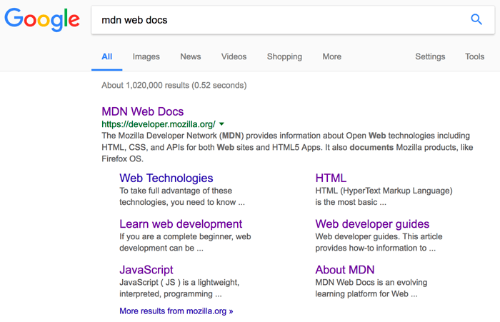

 

**Note**:在谷歌搜索里，在主页面链接下面，你将看到一些相关子页面 — 这些是站点链接,可以在 [Google's webmaster tools](http://www.google.com/webmasters/tools/) 配置— 一种可以使你你的的站点对搜索引擎更友好的方式。

**Note**: 许多 `<meta>` 特性已经不再使用. 例如, keyword `<meta>` 元素— 提供关键词给搜索引擎，根据不同的搜索词，查找到相关的网站 — 被搜索引擎忽略了， 因为作弊者填充了大量关键词到keyword, 错误地引导搜索结果。

### 其他类型的 metadata[Section](https://developer.mozilla.org/zh-CN/docs/Learn/HTML/Introduction_to_HTML/The_head_metadata_in_HTML#%E5%85%B6%E4%BB%96%E7%B1%BB%E5%9E%8B%E7%9A%84_metadata)

当你在网站上查看源码时，你也会发现其他类型的元数据。你在网站上看到的许多功能都是专有创作，旨在向某些网站(如社交网站)提供可使用的特定信息。

例如，Facebook 编写的元数据协议 [Open Graph Data](http://ogp.me/) 为网站提供了更丰富的元数据。在 MDN 源代码中，你会发现：

```html
<meta property="og:image" content="https://developer.cdn.mozilla.net/static/img/opengraph-logo.dc4e08e2f6af.png">
<meta property="og:description" content="The Mozilla Developer Network (MDN) provides
information about Open Web technologies including HTML, CSS, and APIs for both Web sites
and HTML5 Apps. It also documents Mozilla products, like Firefox OS.">
<meta property="og:title" content="Mozilla Developer Network">
```

上面代码展现的一个效果就是，当你在 Facebook 上链接到 MDN 时，该链接将显示一个图像和描述：这为用户提供更丰富的体验。


Twitter 还拥有自己的类型的专有元数据协议，当网站的 URL 显示在 twitter.com 上时，它具有相似的效果。例如下面：

```html
<meta name="twitter:title" content="Mozilla Developer Network">
```

### **在你的站点增加自定义图标[Section](https://developer.mozilla.org/zh-CN/docs/Learn/HTML/Introduction_to_HTML/The_head_metadata_in_HTML#%E5%9C%A8%E4%BD%A0%E7%9A%84%E7%AB%99%E7%82%B9%E5%A2%9E%E5%8A%A0%E8%87%AA%E5%AE%9A%E4%B9%89%E5%9B%BE%E6%A0%87)**

为了进一步丰富你的网站设计，你可以在元数据中添加对自定义图标的引用，这些将在特定的场合中显示。

这个不起眼的图标已经存在很多很多年了，16 x 16 像素是这种图标的第一种类型。你可以看见这些图标出现在浏览器每一个打开的页面中的标签页中中以及在书签面板中的书签页面中。

**页面添加图标的方式**有：

1. 将其保存在与网站的索引页面相同的目录中，以.ico格式保存（大多数浏览器将支持更通用的格式，如.gif或.png，但使用ICO格式将确保它能在如Internet Explorer 6一样久远的浏览器显示）

2. 将以下行添加到HTML <head>中以引用它：

   ```html
   <link rel="shortcut icon" href="favicon.ico" type="image/x-icon">
   ```

现代浏览器在各种场合使用favicons，如打开的页面标签页和书签面板中的书签页面。下面是一个favicon 出现在书签面板中的例子：
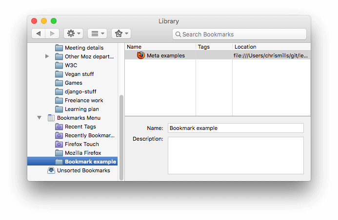


如今还有很多其他的图标类型可以考虑。 例如，你可以在 MDN 主页的源代码中找到它：

```html
<!-- third-generation iPad with high-resolution Retina display: -->
<link rel="apple-touch-icon-precomposed" sizes="144x144" href="https://developer.cdn.mozilla.net/static/img/favicon144.a6e4162070f4.png">
<!-- iPhone with high-resolution Retina display: -->
<link rel="apple-touch-icon-precomposed" sizes="114x114" href="https://developer.cdn.mozilla.net/static/img/favicon114.0e9fabd44f85.png">
<!-- first- and second-generation iPad: -->
<link rel="apple-touch-icon-precomposed" sizes="72x72" href="https://developer.cdn.mozilla.net/static/img/favicon72.8ff9d87c82a0.png">
<!-- non-Retina iPhone, iPod Touch, and Android 2.1+ devices: -->
<link rel="apple-touch-icon-precomposed" href="https://developer.cdn.mozilla.net/static/img/favicon57.a2490b9a2d76.png">
<!-- basic favicon -->
<link rel="shortcut icon" href="https://developer.cdn.mozilla.net/static/img/favicon32.e02854fdcf73.png">
```

这些注释解释了每个图标的用途 - 这些元素涵盖的东西提供一个高分辨率图标，这些高分辨率图标当网站保存到iPad的主屏幕时使用。

不用担心现在实现所有这些类型的图标 - 这是一个相当先进的功能，你将不会被要求在这个课堂上学习这个知识点。 这里的主要目的是让你提前了解有这一样东西以防当你浏览其他网站的源代码时不理解源代码的含义。

### **在HTML中应用CSS和JavaScript[Section](https://developer.mozilla.org/zh-CN/docs/Learn/HTML/Introduction_to_HTML/The_head_metadata_in_HTML#%E5%9C%A8HTML%E4%B8%AD%E5%BA%94%E7%94%A8CSS%E5%92%8CJavaScript)**

如今，几乎你使用的所有网站都会使用 [CSS](https://developer.mozilla.org/en-US/docs/Glossary/CSS) 让网页更加炫酷, 使用[JavaScript](https://developer.mozilla.org/en-US/docs/Glossary/JavaScript)让网页有交互功能, 比如视频播放器，地图，游戏以及更多功能。这些应用在网页中很常见，它们分别使用 [`<link>`](https://developer.mozilla.org/zh-CN/docs/Web/HTML/Element/link)元素以及 [`<script>`](https://developer.mozilla.org/zh-CN/docs/Web/HTML/Element/script) 元素。

-  [`link`](https://developer.mozilla.org/zh-CN/docs/Web/HTML/Element/link) 元素经常位于文档的头部，它有2个属性， rel="stylesheet"，表明这是文档的样式表，而 href,包含了样式表文件的路径：

  ```html
  <link rel="stylesheet" href="my-css-file.css">
  ```

 &lt;script> 部分没必要非要放在文档头部; 实际上，把它放在文档的尾部（在 &lt;/body>标签之前）是一个更好的选择 ，这样可以确保在加载脚本之前浏览器已经解析了HTML内容（如果脚本加载某个不存在的元素，浏览器会报错）。
```js
<script src="my-js-file.js"></script>
```

注意： < script >元素看起来像一个空元素，但它并不是，因此需要一个结束标记。您还可以选择将脚本放入< script >元素中，而不是指向外部脚本文件。

### 实践操作: 在网页中应用CSS和JavaScript[Section](https://developer.mozilla.org/zh-CN/docs/Learn/HTML/Introduction_to_HTML/The_head_metadata_in_HTML#%E5%AE%9E%E8%B7%B5%E6%93%8D%E4%BD%9C_%E5%9C%A8%E7%BD%91%E9%A1%B5%E4%B8%AD%E5%BA%94%E7%94%A8CSS%E5%92%8CJavaScript)

1. 开始操作之前， 先拷贝我们的 [meta-example.html](https://github.com/mdn/learning-area/blob/master/html/introduction-to-html/the-html-head/meta-example.html), [script.js](https://github.com/mdn/learning-area/blob/master/html/introduction-to-html/the-html-head/script.js) 和 [style.css](https://github.com/mdn/learning-area/blob/master/html/introduction-to-html/the-html-head/style.css) 文件，并把它们保存到本地电脑的同一目录下，确保使用了正确的文件名和文件格式。
2. 使用浏览器和文字编辑器同时打开你的HTML文件。
3. 根据上面的信息，添加 [``](https://developer.mozilla.org/zh-CN/docs/Web/HTML/Element/link)和 [``](https://developer.mozilla.org/zh-CN/docs/Web/HTML/Element/script)部分到您的HTML文件中, 这样你的HTML就可以应用CSS和JavaScript了。

如果按照上述步骤正确地执行, 当你保存HTML文件并重新刷新浏览器的话，你会发现页面已经变样了：

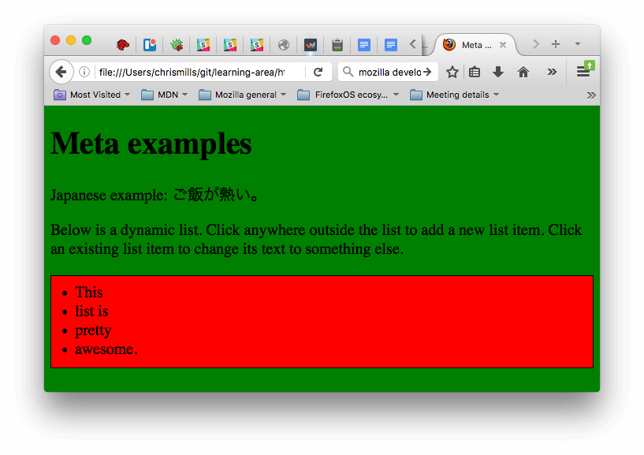

- JavaScript在页面中添加了一个空列表。现在当你点击列表中的任何地方，浏览器会弹出一个对话框要求你为新列表项输入一些文本内容。 当你点击OK按钮，刚刚那个新的列表项会添加到页面上，当你点击那些已有的列表项，会弹出一个对话框允许你修改列表项的文本。
- CSS使页面背景变成了绿色，文本变得大了一点。它还将JavaScript添加到页面中的一些内容进行了样式化，（带有黑色边框的红色条是CSS添加到js生成的列表中的样式。）

**注意**：如果你卡在这个练习当中，无法正常应用CSS和JavaScript，试着查看一下我们的  [css-and-js.html](https://github.com/mdn/learning-area/blob/master/html/introduction-to-html/the-html-head/css-and-js.html) 页面实例。

### **为文档设定主语言[Section](https://developer.mozilla.org/zh-CN/docs/Learn/HTML/Introduction_to_HTML/The_head_metadata_in_HTML#%E4%B8%BA%E6%96%87%E6%A1%A3%E8%AE%BE%E5%AE%9A%E4%B8%BB%E8%AF%AD%E8%A8%80)**

最后，值得一提的是你可以（而且确实应该）为你的**站点设定语言**， 这个可以通过添加lang属性到HTML开始标签中来实现 (参考 [meta-example.html](https://github.com/mdn/learning-area/blob/master/html/introduction-to-html/the-html-head/meta-example.html))，如下所示：

```html
<html lang="en-US">
```

这在很多方面都很有用。如果你的HTML文档的语言设置好了，那么你的HTML文档就会被搜索引擎更有效地索引 (例如，允许它在特定于语言的结果中正确显示),对于那些使用屏幕阅读器的视障人士也很有用(比如, 法语和英语中都有“six”这个单词，但是发音却完全不同)。

你还可以将文档的分段设置为不同的语言。例如， 我们可以把日语部分设置为日语， 如下所示：

```html
<p>Japanese example: <span lang="jp">ご飯が熱い。</span>.</p>
```

这些codes根据 [ISO 639-1](https://en.wikipedia.org/wiki/ISO_639-1) 标准定义的. 你可以在[Language tags in HTML and XML](https://www.w3.org/International/articles/language-tags/)找到更多相关的。

### 总结[Section](https://developer.mozilla.org/zh-CN/docs/Learn/HTML/Introduction_to_HTML/The_head_metadata_in_HTML#%E6%80%BB%E7%BB%93)

已经到了我们快速学习HTML head的尾声 — 你还能学到更多的相关的, 但是现阶段详尽的讲的太多会无聊且迷惑, 我们只希望你现在在这学到最基本的概念! 下一篇我们将要学习 HTML text 基础.

## HTML 文字基础

HTML的主要工作是编辑文本结构和文本内容（也称为语义[semantics](https://developer.mozilla.org/en-US/docs/Glossary/semantics)），以便浏览器能正确的显示。 本文介绍了 [HTML](https://developer.mozilla.org/en-US/docs/Glossary/HTML)的使用方法：在一段文本中添加标题和段落，强调语句，创建列表等等。

| 先决条件: | 了解基本的html知识, 它们在这 [Getting started with HTML](https://developer.mozilla.org/en-US/docs/Learn/HTML/Introduction_to_HTML/Getting_started). |
| --------- | ------------------------------------------------------------ |
| 目的:     | 学习如何用标记(段落、标题、列表、强调、引用)来建立基础文本页面的文本结构和文本内容。 |

### **基础: 标题和段落[Section](https://developer.mozilla.org/zh-CN/docs/Learn/HTML/Introduction_to_HTML/HTML_text_fundamentals#%E5%9F%BA%E7%A1%80_%E6%A0%87%E9%A2%98%E5%92%8C%E6%AE%B5%E8%90%BD)**

大部分的文本结构由标题和段落组成。 不管是小说、报刊、教科书还是杂志等。


内容结构化会使读者的阅读体验更轻松，更愉快。

在HTML中，每个段落是通过[``](https://developer.mozilla.org/zh-CN/docs/Web/HTML/Element/p) 元素标签进行定义的, 比如下面这样：

```html
<p>I am a paragraph, oh yes I am.</p>
```

每个标题（Heading）是通过“标题标签”进行定义的：

```html
<h1>I am the title of the story.</h1>
```

这里有六个标题元素标签— [`<h1>`](https://developer.mozilla.org/zh-CN/docs/Web/HTML/Element/h1), [`<h2>`](https://developer.mozilla.org/zh-CN/docs/Web/HTML/Element/h2), [`<h3>`](https://developer.mozilla.org/zh-CN/docs/Web/HTML/Element/h3), [`<h4>`](https://developer.mozilla.org/zh-CN/docs/Web/HTML/Element/h4), [`<h5>`](https://developer.mozilla.org/zh-CN/docs/Web/HTML/Element/h5), 和 [`<h6>`](https://developer.mozilla.org/zh-CN/docs/Web/HTML/Element/h6). 每个元素代表文档中不同级别的内容; <h1>表示主标题（the main heading），<h2>表示二级子标题（subheadings），<h3>表示三级子标题（sub-subheadings），等等。

### 编辑结构层次[Section](https://developer.mozilla.org/zh-CN/docs/Learn/HTML/Introduction_to_HTML/HTML_text_fundamentals#%E7%BC%96%E8%BE%91%E7%BB%93%E6%9E%84%E5%B1%82%E6%AC%A1)

这里举一个例子。在一个故事中，<h1>表示故事的名字，<h2>表示每个章节的标题， <h3>表示每个章节下的子标题，以此类推。

```html
<h1>The Crushing Bore</h1>

<p>By Chris Mills</p>

<h2>Chapter 1: The Dark Night</h2>

<p>It was a dark night. Somewhere, an owl hooted. The rain lashed down on the ...</p>

<h2>Chapter 2: The eternal silence</h2>

<p>Our protagonist could not so much as a whisper out of the shadowy figure ...</p>

<h3>The specter speaks</h3>

<p>Several more hours had passed, when all of a sudden the specter sat bolt upright and exclaimed, "Please have mercy on my soul!"</p>
```

所涉及的元素具体代表什么，完全取决于作者编辑的内容，只要层次结构是合理的。在创建此类结构时，您只需要记住一些最佳实践：

- **优选地，您应该只对每个页面使用一次&lt;h1> — 这是顶级标题，所有其他标题位于层次结构中的下方。**
- 请确保在层次结构中以正确的顺序使用标题。不要使用<h3>来表示副标题，后面跟<h2>来表示副副标题 - 这是没有意义的，会导致奇怪的结果。
- 在可用的六个标题级别中，您应该旨在每页使用不超过三个，除非您认为有必要使用更多。具有许多级别的文档（即，较深的标题层次结构）变得难以操作并且难以导航。在这种情况下，如果可能，建议将内容分散在多个页面上。

### 为什么我们需要结构化?[Section](https://developer.mozilla.org/zh-CN/docs/Learn/HTML/Introduction_to_HTML/HTML_text_fundamentals#%E4%B8%BA%E4%BB%80%E4%B9%88%E6%88%91%E4%BB%AC%E9%9C%80%E8%A6%81%E7%BB%93%E6%9E%84%E5%8C%96)

回答这个问题前，让我们先来看一段文档示例“[text-start.html](https://github.com/mdn/learning-area/blob/master/html/introduction-to-html/html-text-formatting/text-start.html)” — 并从运行这段文档示例（美味的豆沙食谱）开始。首先，您可以复制一份并保存到本地机器上，在之后的练习中您将用到它。在这个文档的主体 （body）中包含了多个内容 — 这些内容没有做任何标记，但是编辑时使用了换行 (输入回车/换行跳转到下一行)处理。

然而，当您在浏览器中打开文档时，您会看到文本显示为一整块！

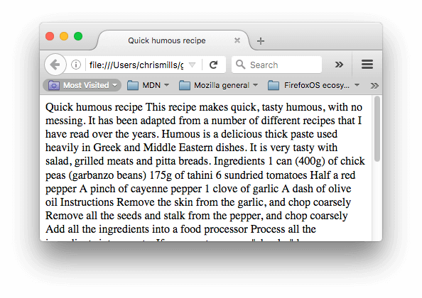


这是因为没有元素给内容结构，所以浏览器不知道什么是标题，什么是段落。此外：

- 用户在阅读网页时，往往会快速浏览以查找相关内容，经常只是阅读开头的标题（我们通常在一个网页上会花费很少的时间 [spend a very short time on a web page](http://www.nngroup.com/articles/how-long-do-users-stay-on-web-pages/))。如果用户不能在几秒内看到一些有用的内容，他们很可能会感到沮丧并离开。
- 对您的网页建立索引的搜索引擎将标题的内容视为影响网页搜索排名的重要关键字。没有标题，您的网页在[SEO](https://developer.mozilla.org/en-US/docs/Glossary/SEO)（搜索引擎优化）方面效果不佳。
- 严重视力障碍者通常不会阅读网页；他们用听力来代替。完成这项工作的软件叫做屏幕阅读器（[screen reader](http://en.wikipedia.org/wiki/Screen_reader)）。该软件提供了快速访问给定文本内容的方法。在使用的各种技术中，它们通过朗读标题来提供文档的概述，让用户能快速找到他们需要的信息。如果标题不可用，用户将被迫听到整个文档的大声朗读。
- 使用[CSS](https://developer.mozilla.org/en-US/docs/Glossary/CSS)样式化内容，或者使用[JavaScript](https://developer.mozilla.org/en-US/docs/Glossary/JavaScript)做一些有趣的事情，你需要包含相关内容的元素，所以CSS / JavaScript可以有效地定位它。

因此，我们需要给我们的内容结构标记。

### 实践操作: 编辑我们的内容结构[Section](https://developer.mozilla.org/zh-CN/docs/Learn/HTML/Introduction_to_HTML/HTML_text_fundamentals#%E5%AE%9E%E8%B7%B5%E6%93%8D%E4%BD%9C_%E7%BC%96%E8%BE%91%E6%88%91%E4%BB%AC%E7%9A%84%E5%86%85%E5%AE%B9%E7%BB%93%E6%9E%84)

让我们直接跳进一个实例。在下面的示例中，向“Input”字段中的原始文本添加元素，使其在“Output”字段中显示为标题和两个段落。

如果您犯了错误，您可以使用*重置*按钮进行重置。如果卡住，请按*显示解决方案*按钮以查看答案。

<iframe src="https://mdn.mozillademos.org/zh-CN/docs/learn/HTML/Introduction_to_HTML/HTML_text_fundamentals$samples/Playable_code?revision=1409107" height="500" width="700" id="frame_Playable_code" class="live-sample-frame sample-code-frame" frameborder="0" style="font-style: normal; max-width: calc((100% - 40px) - 6px); margin: 0px; padding: 20px; border-width: 1px 1px 1px 5px; border-style: solid; border-color: rgb(61, 126, 154); border-image: initial; width: calc((100% - 40px) - 6px); color: rgb(51, 51, 51); font-family: Verdana, arial, x-locale-body, sans-serif; font-size: 16px; font-variant-ligatures: normal; font-variant-caps: normal; font-weight: 400; letter-spacing: -0.05328px; orphans: 2; text-align: start; text-indent: 0px; text-transform: none; white-space: normal; widows: 2; word-spacing: 0px; -webkit-text-stroke-width: 0px; background-color: rgb(255, 255, 255); text-decoration-style: initial; text-decoration-color: initial;"></iframe>

在 CodePen 中打开在 JSFiddle 中打开


### 为什么我们需要语义？[Section](https://developer.mozilla.org/zh-CN/docs/Learn/HTML/Introduction_to_HTML/HTML_text_fundamentals#%E4%B8%BA%E4%BB%80%E4%B9%88%E6%88%91%E4%BB%AC%E9%9C%80%E8%A6%81%E8%AF%AD%E4%B9%89%EF%BC%9F)

在我们身边的任何地方都要依赖语义学 — 我们依靠以前的经验就知道日常事物都代表什么；当我们看到什么，我们就会知道它代表什么。举个例子, 我们知道红色交通灯表示“停止”，绿色交通灯表示”通行“。 如果运用了错误的语义，事情会迅速地变得非常棘手 (难道有某个国家使用红色代表通行？我不希望如此)

同样的道理，我们需要确保使用了正确的元素来给予内容正确的意思、作用以及外形。在这里，[``](https://developer.mozilla.org/zh-CN/docs/Web/HTML/Element/h1) 元素也是一个语义元素，它给出了包裹在您的页面上用来表示顶级标题的角色（或意义）的文本。

```html
<h1>这是一个顶级标题</h1>
```

一般来说，浏览器会给它一个更大的字形来让它看上去像个标题（虽然你可以使用CSS让它变成任何你想要的样式。更重要的是，它的语义值将以多种方式被使用，比如通过搜索引擎和屏幕阅读器（上文提到过的）。

在另一方面，你可以让任一元素看起来像一个顶级标题，如下：

```html
<span style="font-size: 32px; margin: 21px 0;">Is this a top level heading?</span>
```

这是一个 [``](https://developer.mozilla.org/zh-CN/docs/Web/HTML/Element/span) 元素，它没有语义。当您想要对它用CSS（或者JS）时，您可以用它包裹内容，且不需要附加任何额外的意义（在未来的课程中你会发现更多这类元素）。我们已经对它使用了CSS来让它看起来像一个顶级标题。然而，由于它没有语义值，所以它不会有任何上文提到的帮助。最好的方法是使用相关的HTML元素来标记这个项目。

### **列表 Lists[Section](https://developer.mozilla.org/zh-CN/docs/Learn/HTML/Introduction_to_HTML/HTML_text_fundamentals#%E5%88%97%E8%A1%A8_Lists)**

现在，让我们注意一下列表。列表在生活中随处可见——从你的购物清单到你的回家路线方案列表，再到你遵从的教程说明列表。在网络上，列表也到处存在，我们需要学习三种不同类型的列表。

### 无序 Unordered[Section](https://developer.mozilla.org/zh-CN/docs/Learn/HTML/Introduction_to_HTML/HTML_text_fundamentals#%E6%97%A0%E5%BA%8F_Unordered)

无序的列表被用来标记每个项目。在这里，项目的顺序并不重要 — 让我们看下面的购物单的例子。

```html
牛奶
鸡蛋
面包
鹰嘴豆泥
```

每份无序的清单从 [`<ul>`](https://developer.mozilla.org/zh-CN/docs/Web/HTML/Element/ul) 元素开始——这元素包裹了清单上所有被列出的项目：

```html
<ul>
牛奶
鸡蛋
面包
鹰嘴豆泥
</ul>
```

最后一步就是用 [``](https://developer.mozilla.org/zh-CN/docs/Web/HTML/Element/li) 元素把每个列出的项目分别包裹起来：

```html
<ul>
  <li>牛奶</li>
  <li>鸡蛋</li>
  <li>面包</li>
  <li>鹰嘴豆泥</li>
</ul>
```

**实践操作: 标记无序列表**

尝试编辑下面的样本来创建您个人的HTML无序列表。

<iframe src="https://mdn.mozillademos.org/zh-CN/docs/learn/HTML/Introduction_to_HTML/HTML_text_fundamentals$samples/Playable_code_2?revision=1409107" height="400" width="700" id="frame_Playable_code_2" class="live-sample-frame sample-code-frame" frameborder="0" style="font-style: normal; max-width: calc((100% - 40px) - 6px); margin: 0px; padding: 20px; border-width: 1px 1px 1px 5px; border-style: solid; border-color: rgb(61, 126, 154); border-image: initial; width: calc((100% - 40px) - 6px); color: rgb(51, 51, 51); font-family: Verdana, arial, x-locale-body, sans-serif; font-size: 16px; font-variant-ligatures: normal; font-variant-caps: normal; font-weight: 400; letter-spacing: -0.05328px; orphans: 2; text-align: start; text-indent: 0px; text-transform: none; white-space: normal; widows: 2; word-spacing: 0px; -webkit-text-stroke-width: 0px; background-color: rgb(255, 255, 255); text-decoration-style: initial; text-decoration-color: initial;"></iframe>

在 CodePen 中打开在 JSFiddle 中打开

### **有序 Ordered[Section](https://developer.mozilla.org/zh-CN/docs/Learn/HTML/Introduction_to_HTML/HTML_text_fundamentals#%E6%9C%89%E5%BA%8F_Ordered)**

有序的列表是根据项目的顺序列出来的——让我们以一组方向为例：

```html
行驶到这条路的尽头
向右转
直行穿过第一个双环形交叉路
在第三个环形交叉路左转
学校就在你的右边，300米处
```

这个标记的结构和无序列表一样，除了你需要用[``](https://developer.mozilla.org/zh-CN/docs/Web/HTML/Element/ol) 元素将所有项目包裹, 而不是用`<ul>：`

```html
<ol>
  <li>行驶到这条路的尽头</li>
  <li>向右转</li>
  <li>直行穿过第一个双环形交叉路</li>
  <li>在第三个环形交叉路左转</li>
  <li>学校就在你的右边，300米处</li>
</ol>
```

**实践操作: 标记有序列表**

尝试编辑下面的样本来创建您个人的HTML有序列表：

<iframe src="https://mdn.mozillademos.org/zh-CN/docs/learn/HTML/Introduction_to_HTML/HTML_text_fundamentals$samples/Playable_code_3?revision=1409107" height="500" width="700" id="frame_Playable_code_3" class="live-sample-frame sample-code-frame" frameborder="0" style="font-style: normal; max-width: calc((100% - 40px) - 6px); margin: 0px; padding: 20px; border-width: 1px 1px 1px 5px; border-style: solid; border-color: rgb(61, 126, 154); border-image: initial; width: calc((100% - 40px) - 6px); color: rgb(51, 51, 51); font-family: Verdana, arial, x-locale-body, sans-serif; font-size: 16px; font-variant-ligatures: normal; font-variant-caps: normal; font-weight: 400; letter-spacing: -0.05328px; orphans: 2; text-align: start; text-indent: 0px; text-transform: none; white-space: normal; widows: 2; word-spacing: 0px; -webkit-text-stroke-width: 0px; background-color: rgb(255, 255, 255); text-decoration-style: initial; text-decoration-color: initial;"></iframe>

在 CodePen 中打开在 JSFiddle 中打开


### 实践操作: 标记我们的食谱[Section](https://developer.mozilla.org/zh-CN/docs/Learn/HTML/Introduction_to_HTML/HTML_text_fundamentals#%E5%AE%9E%E8%B7%B5%E6%93%8D%E4%BD%9C_%E6%A0%87%E8%AE%B0%E6%88%91%E4%BB%AC%E7%9A%84%E9%A3%9F%E8%B0%B1)

到了这里，你拥有了所有你需要的信息来标记我们的食谱样例。你可以选择从[text-start.html](https://github.com/mdn/learning-area/blob/master/html/introduction-to-html/html-text-formatting/text-start.html)复制一份文件并保存在本地，打开它进行编辑，或者在下面的例子中进行编辑。因为在本地你可以保存你的项目，所以在本地做这个工作可能更好。而如果你在下面可编辑的样本中作业，下一次你打开这个网站时你可能会丢失你的数据。各有利弊吧。

<iframe src="https://mdn.mozillademos.org/zh-CN/docs/learn/HTML/Introduction_to_HTML/HTML_text_fundamentals$samples/Playable_code_4?revision=1409107" height="500" width="700" id="frame_Playable_code_4" class="live-sample-frame sample-code-frame" frameborder="0" style="font-style: normal; max-width: calc((100% - 40px) - 6px); margin: 0px; padding: 20px; border-width: 1px 1px 1px 5px; border-style: solid; border-color: rgb(61, 126, 154); border-image: initial; width: calc((100% - 40px) - 6px); color: rgb(51, 51, 51); font-family: Verdana, arial, x-locale-body, sans-serif; font-size: 16px; font-variant-ligatures: normal; font-variant-caps: normal; font-weight: 400; letter-spacing: -0.05328px; orphans: 2; text-align: start; text-indent: 0px; text-transform: none; white-space: normal; widows: 2; word-spacing: 0px; -webkit-text-stroke-width: 0px; background-color: rgb(255, 255, 255); text-decoration-style: initial; text-decoration-color: initial;"></iframe>

在 CodePen 中打开在 JSFiddle 中打开


如果你感到棘手，你可以随时按下*Show solution*按钮，或者在我们的github repo上检查我们的 [text-complete.html](https://github.com/mdn/learning-area/blob/master/html/introduction-to-html/html-text-formatting/text-complete.html) 样例。

### 嵌套列表 Nesting lists[Section](https://developer.mozilla.org/zh-CN/docs/Learn/HTML/Introduction_to_HTML/HTML_text_fundamentals#%E5%B5%8C%E5%A5%97%E5%88%97%E8%A1%A8_Nesting_lists)

将一个列表嵌入到另一个列表是完全可以的。 你可能想让一些子项目列在首项目之下。让我们从食谱示例中获取第二个列表：

```html
<ol>
  <li>Remove the skin from the garlic, and chop coarsely.</li>
  <li>Remove all the seeds and stalk from the pepper, and chop coarsely.</li>
  <li>Add all the ingredients into a food processor.</li>
  <li>Process all the ingredients into a paste.</li>
  <li>If you want a coarse "chunky" humous, process it for a short time.</li>
  <li>If you want a smooth humous, process it for a longer time.</li>
</ol>
```

由于最后两项与它们的前一项非常密切相关（它们看起来更像该项的子项或选项），将它们编辑成无序列表，并嵌套在该项的子项中可能更合理。就像下面这样：

```html
<ol>
  <li>Remove the skin from the garlic, and chop coarsely.</li>
  <li>Remove all the seeds and stalk from the pepper, and chop coarsely.</li>
  <li>Add all the ingredients into a food processor.</li>
  <li>Process all the ingredients into a paste.
    <ul>
      <li>If you want a coarse "chunky" humous, process it for a short time.</li>
      <li>If you want a smooth humous, process it for a longer time.</li>
    </ul>
  </li>
</ol>
```

尝试回到上一个实践操作的例子中，并更新第二个列表。

### **重点强调[Section](https://developer.mozilla.org/zh-CN/docs/Learn/HTML/Introduction_to_HTML/HTML_text_fundamentals#%E9%87%8D%E7%82%B9%E5%BC%BA%E8%B0%83)**

在人类语言中，为了突出一句话的意思，我们通常强调某些词，并且我们通常想要标记某些词作为重点或者在某种程度上的不同。 HTML 提供了许多语义化的元素，并且允许我们通过这些元素的意义标记正文内容，在这个章节中，我们将看到最常见的一小部分元素。

### **强调[Section](https://developer.mozilla.org/zh-CN/docs/Learn/HTML/Introduction_to_HTML/HTML_text_fundamentals#%E5%BC%BA%E8%B0%83)**

当我们想要在口语中添加强调，我们重读某些词，以便隐含的说出我们想要说的意思。类似的，在写作中，我们通过将文字写成斜体来强调它。比如，接下来的两个句子就有不同的含义.

I am glad you weren't late.

I am *glad* you weren't *late*.

第一句话听起来真的像松了一口气因为没有迟到。相反，第二句话听起来具有讽刺性而且有隐含的攻击性，表达对一个人迟到的恼怒。

在HTML中我们用[``](https://developer.mozilla.org/zh-CN/docs/Web/HTML/Element/em)（emphasis）元素来标记这样的情况。这样做既可以让文档读起来更有趣，也可以被屏幕阅读器识别出来，并以不同的语调发出。浏览器默认风格为斜体，但你不应该纯粹使用这个标签来获得斜体风格，为了获得斜体风格，你应该使用[``](https://developer.mozilla.org/zh-CN/docs/Web/HTML/Element/span)元素和一些CSS，或者是[``](https://developer.mozilla.org/zh-CN/docs/Web/HTML/Element/i)元素（见下文）。

```html
<p>I am <em>glad</em> you weren't <em>late</em>.</p>
```

### 非常重要[Section](https://developer.mozilla.org/zh-CN/docs/Learn/HTML/Introduction_to_HTML/HTML_text_fundamentals#%E9%9D%9E%E5%B8%B8%E9%87%8D%E8%A6%81)

为了强调重要的词，在口语方面我们往往用重音强调，在文字方面则是用粗体字来达到强调的效果。例如下面这段:

This liquid is highly toxic.

I am counting on you. **Do not** be late!

在HTML中我们用[``](https://developer.mozilla.org/zh-CN/docs/Web/HTML/Element/strong) (strong importance) 元素来标记这样的请况。这样做既可以让文档更加地有用，也可以被屏幕阅读器识别出来，并以不同的语调发出。浏览器默认风格为粗体，但你不应该纯粹使用这个标签来获得粗体风格，为了获得粗体风格，你应该使用[``](https://developer.mozilla.org/zh-CN/docs/Web/HTML/Element/span)元素和一些CSS，或者是 [``](https://developer.mozilla.org/zh-CN/docs/Web/HTML/Element/b) 元素 (见下文)。

```html
<p>This liquid is <strong>highly toxic</strong>.</p>

<p>I am counting on you. <strong>Do not</strong> be late!</p>
```

如有需要你可以将strong元素和em元素嵌套在其他的标签中：

```html
<p>This liquid is <strong>highly toxic</strong> —
if you drink it, <strong>you may <em>die</em></strong>.</p>
```

### **实践操作: 我们是重要的[Section](https://developer.mozilla.org/zh-CN/docs/Learn/HTML/Introduction_to_HTML/HTML_text_fundamentals#%E5%AE%9E%E8%B7%B5%E6%93%8D%E4%BD%9C_%E6%88%91%E4%BB%AC%E6%98%AF%E9%87%8D%E8%A6%81%E7%9A%84!)**

在这个实践操作中，我们提供了可编辑的例子。在这个例子中，我们想让你把斜体(em)和加粗(strong)放在你认为重要的词汇上，仅仅为了练习。

<iframe src="https://mdn.mozillademos.org/zh-CN/docs/learn/HTML/Introduction_to_HTML/HTML_text_fundamentals$samples/Playable_code_5?revision=1409107" height="500" width="700" id="frame_Playable_code_5" class="live-sample-frame sample-code-frame" frameborder="0" style="font-style: normal; max-width: calc((100% - 40px) - 6px); margin: 0px; padding: 20px; border-width: 1px 1px 1px 5px; border-style: solid; border-color: rgb(61, 126, 154); border-image: initial; width: calc((100% - 40px) - 6px); color: rgb(51, 51, 51); font-family: Verdana, arial, x-locale-body, sans-serif; font-size: 16px; font-variant-ligatures: normal; font-variant-caps: normal; font-weight: 400; letter-spacing: -0.05328px; orphans: 2; text-align: start; text-indent: 0px; text-transform: none; white-space: normal; widows: 2; word-spacing: 0px; -webkit-text-stroke-width: 0px; background-color: rgb(255, 255, 255); text-decoration-style: initial; text-decoration-color: initial;"></iframe>

在 CodePen 中打开在 JSFiddle 中打开


### **斜体字、粗体字、下划线...[Section](https://developer.mozilla.org/zh-CN/docs/Learn/HTML/Introduction_to_HTML/HTML_text_fundamentals#%E6%96%9C%E4%BD%93%E5%AD%97%E3%80%81%E7%B2%97%E4%BD%93%E5%AD%97%E3%80%81%E4%B8%8B%E5%88%92%E7%BA%BF...)**

迄今为止我们已经讨论的元素都是意义清楚的语义元素。[`b`](https://developer.mozilla.org/zh-CN/docs/Web/HTML/Element/b), [`i`](https://developer.mozilla.org/zh-CN/docs/Web/HTML/Element/i), 和 [`u`](https://developer.mozilla.org/zh-CN/docs/Web/HTML/Element/u) 的情况却有点复杂。它们出现于人们要在文本中使用粗体、斜体、下划线但CSS仍然不被完全支持的时期。像这样的元素，仅仅影响表象而且没有语义，被称为**表象元素（presentational elements）**并且不应该再被使用。因为正如我们在之前看到的，语义对可访问性，SEO（搜索引擎优化）等非常重要。

HTML5用新的语义规则重新定义了`<b>`,`<i>`和`<u>`,稍微有点混乱。

这里是最好的经验法则：使用`<b>`,`<i>`,`<u>` 来传达传统意义上的粗体，斜体或下划线是合适的，没有其他元素更适合这样用了。然而，总是保持它们拥有可访问性的心态是不对的。斜体的概念对人们使用屏幕阅读器是没有帮助的，对使用其他书写系统而不是拉丁文书写系统的人们也是没有帮助的。

- [`i`](https://developer.mozilla.org/zh-CN/docs/Web/HTML/Element/i) 被用来传达传统上用斜体表达的意义：外国文字，分类名称，技术术语，一种思想……
- [`b`](https://developer.mozilla.org/zh-CN/docs/Web/HTML/Element/b) 被用来传达传统上用粗体表达的意义：关键字，产品名称，引导句……
- [`u`](https://developer.mozilla.org/zh-CN/docs/Web/HTML/Element/u) 被用来传达传统上用下划线表达的意义：专有名词，拼写错误……

一种关于下划线的警告：**人们很容易把下划线和超链接联系起来**。因此，在Web上，最好只在链接上使用下划线。当语义适合时使用&lt;u>元素，但是有时候在Web上用CSS改变下划线默认的的样式更加合适。下面的例子说明了如何做。

```html
<!-- scientific names -->
<p>
  The Ruby-throated Hummingbird (<i>Archilocus colubris</i>)
  is the most common hummingbird in Eastern North America.
</p>

<!-- foreign words -->
<p>
  The menu was a sea of exotic words like <i lang="uk-latn">vatrushka</i>,
  <i lang="id">nasi goreng</i> and <i lang="fr">soupe à l'oignon</i>.
</p>

<!-- a known misspelling -->
<p>
  Someday I'll learn how to <u>spel</u> better.
</p>

<!-- Highlight keywords in a set of instructions -->
<ol>
  <li>
    <b>Slice</b> two pieces of bread off the loaf.
  </li>
  <li>
    <b>Insert</b> a tomato slice and a leaf of
    lettuce between the slices of bread.
  </li>
</ol>
```

### 总结[Section](https://developer.mozilla.org/zh-CN/docs/Learn/HTML/Introduction_to_HTML/HTML_text_fundamentals#%E6%80%BB%E7%BB%93)

至此，本文应该给您做了一个很好的了解，如何开始在HTML中标记文本，并介绍了一些最重要的元素。在这一领域还有许多语义元素，我们将在后面的“更多语义元素”文章中看到更多的语义元素。 在下一篇文章中，我们将详细介绍如何创建超链接（[create hyperlinks](https://developer.mozilla.org/en-US/docs/Learn/HTML/Introduction_to_HTML/Creating_hyperlinks)），它可能是Web上最重要的元素。

## 建立超链接


超链接非常重要 ——它们使互联网成为一个互联的网络。本文介绍了创建链接所需的语法，并且讨论了链接的最佳实现方法。

| 前提: | 熟悉基本HTML（包含在 [Getting started with HTML](https://developer.mozilla.org/en-US/docs/Learn/HTML/Introduction_to_HTML/Getting_started)中），HTML 文本格式（包含在 [HTML text fundamentals](https://developer.mozilla.org/en-US/docs/Learn/HTML/Introduction_to_HTML/HTML_text_fundamentals) 中）。 |
| ----- | ------------------------------------------------------------ |
| 目标: | 学习如何实现一个有效地把多个文件链接在一起的超文本链接。     |

### 什么是超链接?[Section](https://developer.mozilla.org/zh-CN/docs/Learn/HTML/Introduction_to_HTML/Creating_hyperlinks#%E4%BB%80%E4%B9%88%E6%98%AF%E8%B6%85%E9%93%BE%E6%8E%A5)

超链接是互联网提供的最令人兴奋的创新之一，它们从一开始就一直是互联网的一个功能，使互联网成为互联的网络。超链接使我们能够将我们的文档链接到任何其他文档（或其他资源），也可以链接到文档的指定部分，我们可以在一个简单的网址上提供应用程序（与必须先安装的本地应用程序或其他东西相比）。几乎任何网络内容都可以转换为链接，点击（或激活）超链接将使网络浏览器转到另一个网址（[URL](https://developer.mozilla.org/en-US/docs/Glossary/URL)）。

注意：URL可以指向HTML文件、文本文件、图像、文本文档、视频和音频文件以及可以在网络上保存的任何其他内容。 如果浏览器不知道如何显示或处理文件，它会询问您是否要打开文件（需要选择合适的本地应用来打开或处理文件）或下载文件（以后处理它）。

例如，BBC 主页包含大量的链接，不仅指向多个新闻故事，而且指向网站的不同区域（导航功能），登录/注册页面（用户工具）等等。


### **链接的解析[Section](https://developer.mozilla.org/zh-CN/docs/Learn/HTML/Introduction_to_HTML/Creating_hyperlinks#%E9%93%BE%E6%8E%A5%E7%9A%84%E8%A7%A3%E6%9E%90)**

通过将文本（或其他内容，见[块级链接](https://developer.mozilla.org/zh-CN/docs/Learn/HTML/Introduction_to_HTML/Creating_hyperlinks#%E5%9D%97%E7%BA%A7%E9%93%BE%E6%8E%A5))转换为[``](https://developer.mozilla.org/zh-CN/docs/Web/HTML/Element/a)元素内的链接来创建基本链接， 给它一个`href`属性（也称为目标），它将包含您希望链接指向的网址。

```html
<p>I'm creating a link to
<a href="https://www.mozilla.org/en-US/">the Mozilla homepage</a>.
</p>
```

结果如下所示：
I'm creating a link to [the Mozilla homepage](https://www.mozilla.org/en-US/).

### **使用title属性添加支持信息[Section](https://developer.mozilla.org/zh-CN/docs/Learn/HTML/Introduction_to_HTML/Creating_hyperlinks#%E4%BD%BF%E7%94%A8title%E5%B1%9E%E6%80%A7%E6%B7%BB%E5%8A%A0%E6%94%AF%E6%8C%81%E4%BF%A1%E6%81%AF)**

您可能要添加到您的链接的另一个属性是标题；这旨在包含关于链接的补充有用信息，例如页面包含什么样的信息或需要注意的事情。 例如：

```html
<p>I'm creating a link to
<a href="https://www.mozilla.org/en-US/"
   title="The best place to find more information about Mozilla's
          mission and how to contribute">the Mozilla homepage</a>.
</p>
```

结果如下（当链接悬停在其上时，标题将作为工具提示出现）：

I'm creating a link to [the Mozilla homepage](https://www.mozilla.org/en-US/).

注意：连接的标题仅当鼠标悬停在其上时才会显示，这意味着使用键盘来导航网页的人很难获取到标题信息。如果标题信息对于页面非常重要，你应该使用所有用户能都方便获取的方式来呈现，例如放在常规文本中。

### 主动学习：创建您自己的示例链接[Section](https://developer.mozilla.org/zh-CN/docs/Learn/HTML/Introduction_to_HTML/Creating_hyperlinks#%E4%B8%BB%E5%8A%A8%E5%AD%A6%E4%B9%A0%EF%BC%9A%E5%88%9B%E5%BB%BA%E6%82%A8%E8%87%AA%E5%B7%B1%E7%9A%84%E7%A4%BA%E4%BE%8B%E9%93%BE%E6%8E%A5)

主动学习时间：我们希望您使用本地代码编辑器创建一个HTML文档（我们的 [getting started template](https://github.com/mdn/learning-area/blob/master/html/introduction-to-html/getting-started/index.html)会很好）

- 在HTML内，尝试添加一个或者多个段落或其他你知道类型的内容。
- 将某些内容转换为链接。
- 包含标题属性。

### 块级链接[Section](https://developer.mozilla.org/zh-CN/docs/Learn/HTML/Introduction_to_HTML/Creating_hyperlinks#%E5%9D%97%E7%BA%A7%E9%93%BE%E6%8E%A5)

如上所述，你可以将一些内容转换为链接，甚至是 [块级元素](https://developer.mozilla.org/en-US/Learn/HTML/Introduction_to_HTML/Getting_started#Block_versus_inline_elements)。如果你想要将一个图像转换为链接，你只需把图像放到`<a></a>`标签中间。

```html
<a href="https://www.mozilla.org/en-US/">
  
</a>
```

**注意**: 你会在未来的文章中发现更多在Web中使用图像的例子。

### **统一资源定位器(URL)与路径(path)快速入门[Section](https://developer.mozilla.org/zh-CN/docs/Learn/HTML/Introduction_to_HTML/Creating_hyperlinks#%E7%BB%9F%E4%B8%80%E8%B5%84%E6%BA%90%E5%AE%9A%E4%BD%8D%E5%99%A8(URL)%E4%B8%8E%E8%B7%AF%E5%BE%84(path)%E5%BF%AB%E9%80%9F%E5%85%A5%E9%97%A8)**

要全面地了解链接目标，你需要了解统一资源定位器和文件路径。本小节将介绍相关的信息。

统一资源定位器（英文：**U**niform **R**esource **L**ocator，简写：URL）是一个定义了在网络上的位置的一个文本字符串。例如Mozilla的英文主页定位在`https://www.mozilla.org/en-US/`.

URL使用路径查找文件。路径指定文件系统中您感兴趣的文件所在的位置。看一下一个简单的目录结构的例子 (see the [creating-hyperlinks](https://github.com/mdn/learning-area/tree/master/html/introduction-to-html/creating-hyperlinks) directory.)


此目录结构的根目录称为`creation-hyperlinks`。当在网站上工作时， 你会有一个包含整个网站的目录。在根目录，我们有一个`index.html`和一个`contacts.html`文件。在真实的网站上，`index.html` 将会成为我们的主页或登录页面。

我们的根目录还有两个目录—— `pdfs` 和`projects`，它们分别包含一个 PDF (`project-brief.pdf`) 文件和一个`index.html` 文件。请注意你可以有两个`index.html`文件，前提是他们在不同的目录下，许多网站就是如此。第二个`index.html`或许是项目相关信息的主登录界面。

- **指向相同目录：**如果`index.html`（顶层的`index.html`）想要包含一个超链接指向`contacts.html`，你只需要指定想要链接的文件名，因为它与当前文件是在同一个目录的. 所以你应该使用的URL是`contacts.html`:

  ```html
  <p>Want to contact a specific staff member?
  Find details on our <a href="contacts.html">contacts page</a>.</p>
  ```

- **指向子目录：**如果你想要包含一个超链接到`index.html` （顶层`index.html`)）指向 `projects/index.html`，您需要进入项目目录，然后指明要链接到的文件。 通过指定目录的名称，然后是正斜杠，然后是文件的名称。因此您要使用的URL是`projects / index.html`：

  ```html
  <p>Visit my <a href="projects/index.html">project homepage</a>.</p>
  ```

- **指向上级目录：** 如果你想在`projects/index.html`中包含一个指向`pdfs/project-brief.pdf`的超链接，你必须返回上级目录，然后再回到`pdf`目录。“返回上一个目录级”使用两个英文点号表示 — `..` — 所以你应该使用的URL是 `../pdfs/project-brief.pdf`：

  ```html
  <p>A link to my <a href="../pdfs/project-brief.pdf">project brief</a>.</p>
  ```

注意：如果需要的话，你可以将这些功能的多个例子和复杂的url结合起来。例如：`../../../complex/path/to/my/file.html`.

### 文档片段[Section](https://developer.mozilla.org/zh-CN/docs/Learn/HTML/Introduction_to_HTML/Creating_hyperlinks#%E6%96%87%E6%A1%A3%E7%89%87%E6%AE%B5)

超链接可以链接到html文档的特定部分（被称为**文档片段**），而不仅仅是文件的顶部。要做到这一点你必须首先分配一个`id`属性的元素到链接。通常链接到一个特定的标题是有意义的，所以这看起来像下面的内容：

```html
<h2 id="Mailing_address">Mailing address</h2>
```

然后链接到那个特定的`id`，您可以在URL的结尾包含它，前面是一个井号（#），例如：

```html
<p>Want to write us a letter? Use our <a href="contacts.html#Mailing_address">mailing address</a>.</p>
```

你甚至可以用它自己的文档片段参考链接到同一份文件的另一部分：

```html
<p>The <a href="#Mailing_address">company mailing address</a> can be found at the bottom of this page.</p>
```

### **绝对链接和相对链接[Section](https://developer.mozilla.org/zh-CN/docs/Learn/HTML/Introduction_to_HTML/Creating_hyperlinks#%E7%BB%9D%E5%AF%B9%E9%93%BE%E6%8E%A5%E5%92%8C%E7%9B%B8%E5%AF%B9%E9%93%BE%E6%8E%A5)**

你在网络上遇到的两个术语是绝对URL和相对URL：

**绝对URL**： 指向由其在Web上的绝对位置定义的位置，包括 [协议](https://developer.mozilla.org/zh-CN/docs/Glossary/%E5%8D%8F%E8%AE%AE) and [域名](https://developer.mozilla.org/zh-CN/docs/Glossary/%E5%9F%9F%E5%90%8D). 像下面的例子,如果`index.html` 页面上传到`projects`这一个目录 。`project`位于web服务站点的根目录, web站点的域名为`http://www.example.com`, 这个页面可以通过`http://www.example.com/projects/index.html`访问 ( 或者仅仅通过`http://www.example.com/projects/`来访问, 因为大多数web服务通过访问`index.html`这样的页面来加载，如果没有特定的URL的话)

**绝对URL**总是指向相同的位置，不管它在哪里使用。

**相对URL：** 指向与您链接的文件相关的位置，更像我们在前面一节中所看到的位置。例如，如果我们想从示例文件链接`http://www.example.com/projects/index.html`转到相同目录下的一个PDF文件, URL就是文件名URL — 例如 `project-brief.pdf` —没有其他的信息要求. 如果PDF文件能够在`projects`的子目录`pdfs`中访问到, 相对路径就是`pdfs/project-brief.pdf` (对应的绝对URL就是 `http://www.example.com/projects/pdfs/project-brief.pdf`.)

一个相对URL将指向不同的位置，这取决于它所在的文件所在的位置——例如，如果我们把`index.html` 文件 从 `projects` 目录移动出来并进入Web站点的根目录（最高级别，而不是任何目录中），  `pdfs/project-brief.pdf` 的相对URL将会指向`http://www.example.com/pdfs/project-brief.pdf`, 而不是`http://www.example.com/projects/pdfs/project-brief.pdf`.

### **链接最佳实践[Section](https://developer.mozilla.org/zh-CN/docs/Learn/HTML/Introduction_to_HTML/Creating_hyperlinks#%E9%93%BE%E6%8E%A5%E6%9C%80%E4%BD%B3%E5%AE%9E%E8%B7%B5)**

在写链接时有一些最好的做法。现在让我们看看这些。


### **用清晰的链接措辞[Section](https://developer.mozilla.org/zh-CN/docs/Learn/HTML/Introduction_to_HTML/Creating_hyperlinks#%E7%94%A8%E6%B8%85%E6%99%B0%E7%9A%84%E9%93%BE%E6%8E%A5%E6%8E%AA%E8%BE%9E)**

把链接放在你的页面上很容易。这还不够。我们需要让所有的读者都可以使用链接，不管他们当前的环境和哪些工具。例如：

- 使用屏幕阅读器的用户喜欢从页面上的一个链接跳到另一个链接，并且脱离上下文来阅读链接。
- 搜索引擎使用链接文本为索引目标文件所以，在链接文本中包含关键词是一个很好的主意，以有效地描述与之相关的信息。
- 读者往往会浏览页面而不是阅读每一个字，他们的眼睛会被页面的特征所吸引，比如链接。他们会找到描述性的链接。

让我们来看一个具体的例子：

**\*好**链接文本:* [Download Firefox](https://firefox.com/)

```html
<p><a href="https://firefox.com/">
  Download Firefox
</a></p>
```

**\*坏**链接文本:* [Click here](https://firefox.com/) to download Firefox

```html
<p><a href="https://firefox.com/">
  Click here
</a>
to download Firefox</p>
```

其他提示：

- 不要重复URL作为链接文本的一部分 — URL看起来很丑，当屏幕朗读器一个字母一个字母的读出来的时候听起来就更丑了。
- 不要在链接文本中说“link”或“links to”——它只是噪音。屏幕阅读器告诉人们有一个链接。可视化用户也会知道有一个链接，因为链接通常是用不同的颜色设计的，并且存在下划线（这个惯例一般不应该被打破，因为用户习惯了它。）
- 保持你的链接标签尽可能短-长链接尤其惹恼屏幕阅读器用户，他们必须听到整件事读出来。

### 尽可能使用相对链接[Section](https://developer.mozilla.org/zh-CN/docs/Learn/HTML/Introduction_to_HTML/Creating_hyperlinks#%E5%B0%BD%E5%8F%AF%E8%83%BD%E4%BD%BF%E7%94%A8%E7%9B%B8%E5%AF%B9%E9%93%BE%E6%8E%A5)

从上面的描述中，您可能认为始终使用绝对链接是一个好主意；毕竟，当页面像相对链接那样移动时，它们不会中断。但是，当链接到同一网站的其他位置时，你应该使用相关链接（当链接到另一个网站时，你需要使用绝对链接）：

- **首先，检查代码要容易得多——相对URL通常比绝对URL短得多，这使得阅读代码更容易。**
- **其次，在可能的情况下使用相对URL更有效**。**当使用绝对URL时，浏览器首先通过查询域名（使用“DNS”）}查找服务器的真实位置，然后再转到该服务器并查找所请求的文件。另一方面，相对URL，浏览器只在同一服务器上查找被请求的文件。因此，如果你使用相对URL做的绝对URL，你就不断地让你的浏览器做额外的工作，这意味着它的效率会降低。**

### 链接到非html资源 ——留下清晰的指示[Section](https://developer.mozilla.org/zh-CN/docs/Learn/HTML/Introduction_to_HTML/Creating_hyperlinks#%E9%93%BE%E6%8E%A5%E5%88%B0%E9%9D%9Ehtml%E8%B5%84%E6%BA%90_%E2%80%94%E2%80%94%E7%95%99%E4%B8%8B%E6%B8%85%E6%99%B0%E7%9A%84%E6%8C%87%E7%A4%BA)

当链接到一个需要下载的资源（如PDF或Word文档）或流媒体（如视频或音频）或有另一个潜在的意想不到的效果（打开一个弹出窗口，或加载Flash电影），你应该添加明确的措辞，以减少任何混乱。如下的例子会让人反感：

- 如果你是在低带宽连接，点击一个链接，然后就开始下载大文件。
- 如果你没有安装Flash播放器，点击一个链接，然后突然被带到一个需要Flash的页面。

让我们看看一些例子，看看在这里可以使用什么样的文本：

```html
<p><a href="http://www.example.com/large-report.pdf">
  Download the sales report (PDF, 10MB)
</a></p>

<p><a href="http://www.example.com/video-stream/">
  Watch the video (stream opens in separate tab, HD quality)
</a></p>

<p><a href="http://www.example.com/car-game">
  Play the car game (requires Flash)
</a></p>
```

### 在下载链接时使用下载属性[Section](https://developer.mozilla.org/zh-CN/docs/Learn/HTML/Introduction_to_HTML/Creating_hyperlinks#%E5%9C%A8%E4%B8%8B%E8%BD%BD%E9%93%BE%E6%8E%A5%E6%97%B6%E4%BD%BF%E7%94%A8%E4%B8%8B%E8%BD%BD%E5%B1%9E%E6%80%A7)

当您链接到要下载的资源而不是在浏览器中打开时，您可以使用下载属性来提供一个默认的保存文件名。下面是一个下载链接到Firefox 的 Windows最新版本的示例：

```
<a href="https://download.mozilla.org/?product=firefox-latest-ssl&os=win64&lang=en-US"
   download="firefox-latest-64bit-installer.exe">
  Download Latest Firefox for Windows (64-bit) (English, US)
</a>
```

### 主动学习：创建一个导航菜单[Section](https://developer.mozilla.org/zh-CN/docs/Learn/HTML/Introduction_to_HTML/Creating_hyperlinks#%E4%B8%BB%E5%8A%A8%E5%AD%A6%E4%B9%A0%EF%BC%9A%E5%88%9B%E5%BB%BA%E4%B8%80%E4%B8%AA%E5%AF%BC%E8%88%AA%E8%8F%9C%E5%8D%95)

在这个练习中，我们希望你把一些页面和导航菜单链接起来，创建一个多页面的网站。这是创建网站的一种常见方式——每一页都使用相同的页面结构，包括相同的导航菜单，所以当链接被点击时，它给人的印象是你停留在同一个地方，不同的内容正在被提出来。

您需要将以下四页的本地副本放在同一目录中。 (see the [navigation-menu-start](https://github.com/mdn/learning-area/tree/master/html/introduction-to-html/navigation-menu-start)directory if you want a the full listing):

- [index.html](https://github.com/mdn/learning-area/blob/master/html/introduction-to-html/navigation-menu-start/index.html)
- [projects.html](https://github.com/mdn/learning-area/blob/master/html/introduction-to-html/navigation-menu-start/projects.html)
- [pictures.html](https://github.com/mdn/learning-area/blob/master/html/introduction-to-html/navigation-menu-start/pictures.html)
- [social.html](https://github.com/mdn/learning-area/blob/master/html/introduction-to-html/navigation-menu-start/social.html)

你应该:

1. 在一个页面上的指定位置添加一个无序列表，其中包含要链接到的页面的名称。导航菜单通常只是一个链接列表，因此这在语义上是确定的。
2. 将每个页面名称转换为该页的链接。
3. 将导航菜单复制到每个页面。
4. 在每一页上，只删除同一页的链接——一个页面包含自己的链接是令人困惑和毫无意义的，而缺少链接会对你当前的页面起到很好的视觉提示作用。

最终的例子应该是这样的：


**注意**: 如果你卡住了，或者不确定你是否正确，你可以检查导航菜单上的目录，看看正确的答案。

### **电子邮件链接[Section](https://developer.mozilla.org/zh-CN/docs/Learn/HTML/Introduction_to_HTML/Creating_hyperlinks#%E7%94%B5%E5%AD%90%E9%82%AE%E4%BB%B6%E9%93%BE%E6%8E%A5)**

当点击一个链接或按钮时，打开一个新的电子邮件发送信息而不是连接到一个资源或页面，这种情况是可能做到的。这样做是使用[``](https://developer.mozilla.org/zh-CN/docs/Web/HTML/Element/a)元素和`mailto`：URL的方案。
其最基本和最常用的使用形式为一个`mailto`:link （链接），链接简单说明收件人的电子邮件地址。例如:

```html
<a href="mailto:nowhere@mozilla.org">Send email to nowhere</a>
```

这会创建一个链接，看起来像这样： [Send email to nowhere](mailto:nowhere@mozilla.org).

实际上，邮件地址甚至是可选的。如果你忘记了（也就是说，你的`href`仅仅只是简单的"`mailto:`"），一个新的发送电子邮件的窗口也会被用户的邮件客户端打开，只是没有收件人的地址信息，这通常在“分享”链接是很有用的，用户可以发送给他们选择的地址邮件

### 具体细节[Section](https://developer.mozilla.org/zh-CN/docs/Learn/HTML/Introduction_to_HTML/Creating_hyperlinks#%E5%85%B7%E4%BD%93%E7%BB%86%E8%8A%82)

除了电子邮件地址，您还可以提供其他信息。事实上，任何标准的邮件头字段可以被添加到邮件的URL你提供。 其中最常用的是主题(subject)、抄送(cc)和主体(body) (这不是一个真正的头字段，但允许您为新邮件指定一个短内容消息)。 每个字段及其值被指定为查询项。

下面是一个包含cc、bcc、主题和主体的示例：

```html
<a href="mailto:nowhere@mozilla.org?cc=name2@rapidtables.com&bcc=name3@rapidtables.com&amp;subject=The%20subject%20of%20the%20email &amp;body=The%20body%20of%20the%20email">
  Send mail with cc, bcc, subject and body
</a>
```

**注意:** 每个字段的值必须是URL编码的。 也就是说，不能有非打印字符（不可见字符比如制表符、换行符、分页符）和空格 [percent-escaped](http://en.wikipedia.org/wiki/Percent-encoding). 同时注意使用问号（`?`）来分隔主URL与参数值，以及使用&符来分隔`mailto:`中的各个参数。 这是标准的URL查询标记方法。阅读 [The GET method](https://developer.mozilla.org/en-US/docs/Learn/HTML/Forms/Sending_and_retrieving_form_data#The_GET_method) 以了解哪种URL查询标记方法是更常用的。

这里有一些其他的示例`mailto`链接：

- <mailto:>
- <mailto:nowhere@mozilla.org>
- <mailto:nowhere@mozilla.org,nobody@mozilla.org>
- <mailto:nowhere@mozilla.org?cc=nobody@mozilla.org>
- <mailto:nowhere@mozilla.org?cc=nobody@mozilla.org&subject=This%20is%20the%20subject>

### 总结[Section](https://developer.mozilla.org/zh-CN/docs/Learn/HTML/Introduction_to_HTML/Creating_hyperlinks#%E6%80%BB%E7%BB%93)

这就是链接！当您开始查看样式时，您将在稍后的课程中返回链接。接下来是HTML，我们将返回文本语义，并查看一些更高级/不寻常的功能，您会发现有用的-高级文本格式是您的下一站。

## 高级文字格式

HTML中有许多其他元素可以用于格式化文本，我们没有在[HTML 文字处理基础](https://developer.mozilla.org/zh-CN/docs/Learn/HTML/Introduction_to_HTML/HTML_text_fundamentals)中提到它们。本文中所描述的元素虽然少有人知，但仍然值得去学习（尽管仍然不是完整的列表）。在这里你将了解标记引文、描述列表、计算机代码和其他相关文本、下标和上标、联系信息等。

| 预备知识: | 熟悉基础的HTML（包含在 [Getting started with HTML](https://developer.mozilla.org/zh-CN/docs/learn/HTML/Introduction_to_HTML/Getting_started) 中）、HTML文本格式（包含在 [HTML text fundamentals](https://developer.mozilla.org/zh-CN/docs/learn/HTML/Introduction_to_HTML/HTML_text_fundamentals) 中）。 |
| --------- | ------------------------------------------------------------ |
| 目标:     | 学习如何使用不太知名的HTML元素来标记高级语义特征。           |

### 描述列表[Section](https://developer.mozilla.org/zh-CN/docs/Learn/HTML/Introduction_to_HTML/Advanced_text_formatting#%E6%8F%8F%E8%BF%B0%E5%88%97%E8%A1%A8)

在 HTML 基础部分，我们讨论了如何在 HTML 中[标记基本的列表](https://developer.mozilla.org/zh-CN/docs/Learn/HTML/Introduction_to_HTML/HTML_text_fundamentals#%E5%88%97%E8%A1%A8_Lists)，但是我们没有提到你偶尔会遇到的第三种类型的列表—**描述列表** (description list) **。**这种列表的目的是标记一组项目及其相关描述，例如术语和定义，或者是问题和答案等。让我们看一组术语和定义的示例：

```html
soliloquy
In drama, where a character speaks to themselves, representing their inner thoughts or feelings and in the process relaying them to the audience (but not to other characters.)
monologue
In drama, where a character speaks their thoughts out loud to share them with the audience and any other characters present.
aside
In drama, where a character shares a comment only with the audience for humorous or dramatic effect. This is usually a feeling, thought or piece of additional background information
```

描述列表使用与其他列表类型不同的闭合标签— [`dl`](https://developer.mozilla.org/zh-CN/docs/Web/HTML/Element/dl); 此外，每一项都用  [`dt`](https://developer.mozilla.org/zh-CN/docs/Web/HTML/Element/dt) (description term)  元素闭合。每个描述都用 [`dd`](https://developer.mozilla.org/zh-CN/docs/Web/HTML/Element/dd) (description description) 元素闭合。让我们来完成下面的标记例子:

```html
<dl>
  <dt>soliloquy</dt>
  <dd>In drama, where a character speaks to themselves, representing their inner thoughts or feelings and in the process relaying them to the audience (but not to other characters.)</dd>
  <dt>monologue</dt>
  <dd>In drama, where a character speaks their thoughts out loud to share them with the audience and any other characters present.</dd>
  <dt>aside</dt>
  <dd>In drama, where a character shares a comment only with the audience for humorous or dramatic effect. This is usually a feeling, thought or piece of additional background information.</dd>
</dl>
```

浏览器的默认样式会在**描述列表的描述部分**（description description）和**描述术语**（description terms）之间产生缩进。MDN非常严密地遵循这一惯例，同时也鼓励关于术语的其他更多的定义（but also embolden the terms for extra definition）。

下面是前述代码的显示结果：

- soliloquy

  In drama, where a character speaks to themselves, representing their inner thoughts or feelings and in the process relaying them to the audience (but not to other characters.)

- monologue

  In drama, where a character speaks their thoughts out loud to share them with the audience and any other characters present.

- aside

  In drama, where a character shares a comment only with the audience for humorous or dramatic effect. This is usually a feeling, thought or piece of addtional background information.

请注意：一个术语<dt>可以同时有多个描述`<dd>`，比如说：

- aside

  In drama, where a character shares a comment only with the audience for humorous or dramatic effect. This is usually a feeling, thought or piece of additional background information.

  In writing, a section of content that is related to the current topic, but doesn't fit directly into the main flow of content so is presented nearby (often in a box off to the side.)

### 主动学习: 标记一组定义[Section](https://developer.mozilla.org/zh-CN/docs/Learn/HTML/Introduction_to_HTML/Advanced_text_formatting#%E4%B8%BB%E5%8A%A8%E5%AD%A6%E4%B9%A0_%E6%A0%87%E8%AE%B0%E4%B8%80%E7%BB%84%E5%AE%9A%E4%B9%89)

现在是时候尝试一下描述列表了; 在输入区域的原始文本里添加相应的元素，使得它在输出区域是以描述列表的形式出现。如果你喜欢，你也可以使用你自己的描述术语和描述。

如果在这其中犯了错误，你可以使用Reset按钮来复原，如果你实在不知道怎么做，你可以按下Show solution按钮看答案。

**标记前的描述列表**

```
Live output
Bacon
The glue that binds the world together.
Eggs
The glue that binds the cake together.
Coffee
The drink that gets the world running in the morning.
A light brown color.
Editable code
Press Esc to move focus away from the code area (Tab inserts a tab character).
```
**标记后的描述列表**

```
<dl>
 <dt>Bacon</dt>
 <dd>The glue that binds the world together.</dd>
 <dt>Eggs</dt>
 <dd>The glue that binds the cake together.</dd>
 <dt>Coffee</dt>
 <dd>The drink that gets the world running in the morning.</dd>
 <dd>A light brown color.</dd>
</dl>
```

### **引用[Section](https://developer.mozilla.org/zh-CN/docs/Learn/HTML/Introduction_to_HTML/Advanced_text_formatting#%E5%BC%95%E7%94%A8)**

HTML也有用于标记引用的特性，至于使用哪个元素标记，取决于你引用的是一块还是一行。

### **块引用[Section](https://developer.mozilla.org/zh-CN/docs/Learn/HTML/Introduction_to_HTML/Advanced_text_formatting#%E5%9D%97%E5%BC%95%E7%94%A8)**

如果一个块级内容（一个段落、多个段落、一个列表等）从其他地方被引用，你应该把它用[``](https://developer.mozilla.org/zh-CN/docs/Web/HTML/Element/blockquote)元素包裹起来表示，并且在`cite`属性里用URL来指向引用的资源。例如，下面的例子就是引用的MDN的`<blockquote>`元素页面：

```html
<p>The <strong>HTML <code>&lt;blockquote&gt;</code> Element</strong> (or <em>HTML Block
Quotation Element</em>) indicates that the enclosed text is an extended quotation.</p>
```

要把这些转换为块引用，我们要这样做：

```html
<blockquote cite="https://developer.mozilla.org/en-US/docs/Web/HTML/Element/blockquote">
  <p>The <strong>HTML <code>&lt;blockquote&gt;</code> Element</strong> (or <em>HTML Block
  Quotation Element</em>) indicates that the enclosed text is an extended quotation.</p>
</blockquote>
```

浏览器在渲染块引用时默认会增加缩进，作为引用的一个指示符；MDN是这样做的，但是也增加了额外的样式：

> The **HTML <blockquote> Element** (or *HTML Block Quotation Element*) indicates that the enclosed text is an extended quotation.

### **行内引用[Section](https://developer.mozilla.org/zh-CN/docs/Learn/HTML/Introduction_to_HTML/Advanced_text_formatting#%E8%A1%8C%E5%86%85%E5%BC%95%E7%94%A8)**

行内元素用同样的方式工作，除了使用[``](https://developer.mozilla.org/zh-CN/docs/Web/HTML/Element/q)元素。例如，下面的标记包含了从MDN`<q>`页面的引用：

```html
<p>The quote element — <code>&lt;q&gt;</code> — is <q cite="https://developer.mozilla.org/en-US/docs/Web/HTML/Element/q">intended
for short quotations that don't require paragraph breaks.</q></p>
```

浏览器默认将其作为普通文本放入引号内表示引用，就像下面：

The quote element — `<q>` — is intended for short quotations that don't require paragraph breaks.(<q>元素旨在用于不需要分段的短引用)

### 引文[Section](https://developer.mozilla.org/zh-CN/docs/Learn/HTML/Introduction_to_HTML/Advanced_text_formatting#%E5%BC%95%E6%96%87)

`cite`属性的内容听起来很有用，但不幸的是，浏览器、屏幕阅读器等等不会真的关心它，如果不使用JavaScript或CSS，浏览器不会显示`cite`的内容。如果你想要确保引用的资源在页面上是可用的，更好的方法是把[`<cite>`](https://developer.mozilla.org/zh-CN/docs/Web/HTML/Element/cite)元素放到引用元素旁边。这就意味着包含引用资源的名称——即引用的书的名字，或人的名字——但并不表示你不可以用同样的方式把要链接的文本放到`<cite>`元素中：

```html
<p>According to the <a href="https://developer.mozilla.org/en-US/docs/Web/HTML/Element/blockquote">
<cite>MDN blockquote page</cite></a>:
</p>

<blockquote cite="https://developer.mozilla.org/en-US/docs/Web/HTML/Element/blockquote">
  <p>The <strong>HTML <code>&lt;blockquote&gt;</code> Element</strong> (or <em>HTML Block
  Quotation Element</em>) indicates that the enclosed text is an extended quotation.</p>
</blockquote>

<p>The quote element — <code>&lt;q&gt;</code> — is <q cite="https://developer.mozilla.org/en-US/docs/Web/HTML/Element/q">intended
for short quotations that don't require paragraph breaks.</q> -- <a href="https://developer.mozilla.org/en-US/docs/Web/HTML/Element/q">
<cite>MDN q page</cite></a>.</p>
```

引文默认的字体样式为斜体。你可以在[quotations.html](https://github.com/mdn/learning-area/blob/master/html/introduction-to-html/advanced-text-formatting/quotations.html)中参看代码。

### 主动学习：是谁说的？[Section](https://developer.mozilla.org/zh-CN/docs/Learn/HTML/Introduction_to_HTML/Advanced_text_formatting#%E4%B8%BB%E5%8A%A8%E5%AD%A6%E4%B9%A0%EF%BC%9A%E6%98%AF%E8%B0%81%E8%AF%B4%E7%9A%84%EF%BC%9F)

到了主动学习的时间！在这个例子中我们想要你：

1. 把中间的段落变成块引用，它要包含`cite`属性
2. 把第三个段落的一部分变成行内引用，它要包含`cite`属性
3. 每一个引用都要包含`<cite>`元素

 

你需要的引用源：

- http://www.brainyquote.com/quotes/authors/c/confucius.html 对应the Confucius quote
- http://www.affirmationsforpositivethinking.com/index.htm 对应 "The Need To Eliminate Negative Self Talk".

 

如果你做错了，你总可以使用Reset按钮重置。如果你真的不会了，按下Show solution按钮来看答案。

**引用前**

```
<p>Hello and welcome to my motivation page. As Confucius once said:</p>
<p>It does not matter how slowly you go as long as you do not stop.</p>
<p>I also love the concept of positive thinking, and The Need To Eliminate Negative Self Talk (as mentioned in Affirmations for Positive Thinking.)</p>

```

**应用后**

```
<p>Hello and welcome to my motivation page. As <a href="http://www.brainyquote.com/quotes/authors/c/confucius.html"><cite>Confucius</cite></a> once said:</p>

<blockquote cite="http://www.brainyquote.com/quotes/authors/c/confucius.html">
 <p>It does not matter how slowly you go as long as you do not stop.</p>
</blockquote>

<p>I also love the concept of positive thinking, and <q cite="http://www.affirmationsforpositivethinking.com/index.htm">The Need To Eliminate Negative Self Talk</q> (as mentioned in <a href="http://www.affirmationsforpositivethinking.com/index.htm"><cite>Affirmations for Positive Thinking</cite></a>.)</p>
```


### **缩略语[Section](https://developer.mozilla.org/zh-CN/docs/Learn/HTML/Introduction_to_HTML/Advanced_text_formatting#%E7%BC%A9%E7%95%A5%E8%AF%AD)**

另一个你在web上看到的相当常见的元素是[`abbr`](https://developer.mozilla.org/zh-CN/docs/Web/HTML/Element/abbr)——它常被用来包裹一个缩略语或缩写，并且提供缩写的解释（包含在`title`属性中）。让我们看看下面两个例子：

```html
<p>We use <abbr title="Hypertext Markup Language">HTML</abbr> to structure our web documents.</p>

<p>I think <abbr title="Reverend">Rev.</abbr> Green did it in the kitchen with the chainsaw.</p>
```

这些代码的显示效果如下（当光标移动到项目上时会出现提示）：

We use HTML to structure our web documents.

I think Rev. Green did it in the kitchen with the chainsaw.

**Note**: 还有另一个元素<acronym>，它基本上与<abbr>相同，专门用于首字母缩略词而不是缩略语。 然而，这已经被废弃了 - 它在浏览器的支持中不如<abbr>，并且具有类似的功能，所以没有意义。 只需使用<abbr>。

### 主动学习：标记一个引用[Section](https://developer.mozilla.org/zh-CN/docs/Learn/HTML/Introduction_to_HTML/Advanced_text_formatting#%E4%B8%BB%E5%8A%A8%E5%AD%A6%E4%B9%A0%EF%BC%9A%E6%A0%87%E8%AE%B0%E4%B8%80%E4%B8%AA%E5%BC%95%E7%94%A8)

在这个简单的主动学习任务中，我们希望你简单地标记一个缩写。你可以使用下面的示例，或者用自己的示例来替换。

**标记引用前**

```
<p>NASA sure does some exciting work.</p>
```

**标记引用后**

```
<p>
<abbr title="National Aeronautics and Space Administration">NASA</abbr>
sure does some exciting work.
</p>
```


### **标记联系方式[Section](https://developer.mozilla.org/zh-CN/docs/Learn/HTML/Introduction_to_HTML/Advanced_text_formatting#%E6%A0%87%E8%AE%B0%E8%81%94%E7%B3%BB%E6%96%B9%E5%BC%8F)**

HTML有个用于标记联系方式的元素——[`address`](https://developer.mozilla.org/zh-CN/docs/Web/HTML/Element/address)。它仅仅包含你的联系方式，例如：

```html
<address>
  <p>Chris Mills, Manchester, The Grim North, UK</p>
</address>
```

但要记住的一点是，`<address>`元素是为了标记编写HTML文档的人的联系方式，而不是任何其他的内容。因此，如果这是Chris写的文档，上面的内容将会很好。注意，下面的内容也是可以的：

```html
<address>
  <p>Page written by <a href="../authors/chris-mills/">Chris Mills</a>.</p>
</address>
```

### **上标和下标[Section](https://developer.mozilla.org/zh-CN/docs/Learn/HTML/Introduction_to_HTML/Advanced_text_formatting#%E4%B8%8A%E6%A0%87%E5%92%8C%E4%B8%8B%E6%A0%87)**

当你使用日期、化学方程式、和数学方程式时会偶尔使用上标和下标。 [`<sup>`](https://developer.mozilla.org/zh-CN/docs/Web/HTML/Element/sup) 和[`<sub>`](https://developer.mozilla.org/zh-CN/docs/Web/HTML/Element/sub)元素可以解决这样的问题。例如：

```html
<p>My birthday is on the 25<sup>th</sup> of May 2001.</p>
<p>Caffeine's chemical formula is C<sub>8</sub>H<sub>10</sub>N<sub>4</sub>O<sub>2</sub>.</p>
<p>If x<sup>2</sup> is 9, x must equal 3 or -3.</p>
```

这些代码输出的结果是：

My birthday is on the 25th of May 2001.

Caffeine's chemical formula is C8H10N4O2.

If x2 is 9, x must equal 3 or -3.

### 展示计算机代码[Section](https://developer.mozilla.org/zh-CN/docs/Learn/HTML/Introduction_to_HTML/Advanced_text_formatting#%E5%B1%95%E7%A4%BA%E8%AE%A1%E7%AE%97%E6%9C%BA%E4%BB%A3%E7%A0%81)

有大量的HTML元素可以来标记计算机代码：

- [`code`](https://developer.mozilla.org/zh-CN/docs/Web/HTML/Element/code): 用于标记计算机通用代码。
- [`pre`](https://developer.mozilla.org/zh-CN/docs/Web/HTML/Element/pre): 对保留的空格（通常是代码块）——如果您在文本中使用缩进或多余的空白，浏览器将忽略它，您将不会在呈现的页面上看到它。但是，如果您将文本包含在`<pre></pre>`标签中，那么空白将会以与你在文本编辑器中看到的相同的方式渲染出来。
- [`var`](https://developer.mozilla.org/zh-CN/docs/Web/HTML/Element/var): 用于标记具体变量名。
- [`kbd`](https://developer.mozilla.org/zh-CN/docs/Web/HTML/Element/kbd): 用于标记输入电脑的键盘（或其他类型）输入。
- [`samp`](https://developer.mozilla.org/zh-CN/docs/Web/HTML/Element/samp): 用于标记计算机程序的输出。

让我们看看一些例子。你应该尝试运行一下（尝试运行一下[other-semantics.html](https://github.com/mdn/learning-area/blob/master/html/introduction-to-html/advanced-text-formatting/other-semantics.html)样例文件的拷贝）：

```html
<pre><code>var para = document.querySelector('p');

para.onclick = function() {
  alert('Owww, stop poking me!');
}</code></pre>

<p>You shouldn't use presentational elements like <code>&lt;font&gt;</code> and <code>&lt;center&gt;</code>.</p>

<p>In the above JavaScript example, <var>para</var> represents a paragraph element.</p>


<p>Select all the text with <kbd>Ctrl</kbd>/<kbd>Cmd</kbd> + <kbd>A</kbd>.</p>

<pre>$ <kbd>ping mozilla.org</kbd>
<samp>PING mozilla.org (63.245.215.20): 56 data bytes
64 bytes from 63.245.215.20: icmp_seq=0 ttl=40 time=158.233 ms</samp></pre>
```

上面的代码显示效果如下：


### **标记时间和日期[Section](https://developer.mozilla.org/zh-CN/docs/Learn/HTML/Introduction_to_HTML/Advanced_text_formatting#%E6%A0%87%E8%AE%B0%E6%97%B6%E9%97%B4%E5%92%8C%E6%97%A5%E6%9C%9F)**

**HTML 还支持将时间和日期标记为可供机器识别的格式的 [`time`](https://developer.mozilla.org/zh-CN/docs/Web/HTML/Element/time) 元素。例如：**

```html
<time datetime="2016-01-20">20 January 2016</time>
```

为什么需要这样做？因为世界上有许多种书写日期的格式，上边的日期可能被写成：

- 20 January 2016
- 20th January 2016
- Jan 20 2016
- 20/06/16
- 06/20/16
- The 20th of next month
- 20e Janvier 2016
- 2016年1月20日
- And so on

但是这些不同的格式不容易被电脑识别 — 假如你想自动抓取页面上所有事件的日期并将它们插入到日历中， [`time`](https://developer.mozilla.org/zh-CN/docs/Web/HTML/Element/time) 元素允许你附上清晰的、可被机器识别的 时间/日期来实现这种需求。

上述基本的例子仅仅提供了一种简单的可被机器识别的日期格式，这里还有许多其他支持的格式，例如：

```html
<!-- Standard simple date -->
<time datetime="2016-01-20">20 January 2016</time>
<!-- Just year and month -->
<time datetime="2016-01">January 2016</time>
<!-- Just month and day -->
<time datetime="01-20">20 January</time>
<!-- Just time, hours and minutes -->
<time datetime="19:30">19:30</time>
<!-- You can do seconds and milliseconds too! -->
<time datetime="19:30:01.856">19:30:01.856</time>
<!-- Date and time -->
<time datetime="2016-01-20T19:30">7.30pm, 20 January 2016</time>
<!-- Date and time with timezone offset-->
<time datetime="2016-01-20T19:30+01:00">7.30pm, 20 January 2016 is 8.30pm in France</time>
<!-- Calling out a specific week number-->
<time datetime="2016-W04">The fourth week of 2016</time>
```

### 总结[Section](https://developer.mozilla.org/zh-CN/docs/Learn/HTML/Introduction_to_HTML/Advanced_text_formatting#%E6%80%BB%E7%BB%93)

到这里你就完成了 HTML 语义文本元素的学习。但要记住，你在本课程中学到的并不是 HTML 文本元素的详细列表 — 我们想要尽量覆盖主要的、通用的、常见的，或者至少是有趣的部分。如果你想找到更多的 HTML 元素，可以看一看我们的[HTML 元素参考](https://developer.mozilla.org/zh-CN/docs/Web/HTML/Element)（从 [内联文本语义](https://developer.mozilla.org/zh-CN/docs/Web/HTML/Element#%E5%86%85%E8%81%94%E6%96%87%E6%9C%AC%E8%AF%AD%E4%B9%89)部分开始会是一个好的选择） 。在下一篇文章中我们将会学习用来组织 HTML 文档不同部分的 HTML 元素。


## 文档与网站架构

除了定义网页的各个部分（例如“段落”或“图片”）外，[HTML](https://developer.mozilla.org/en-US/docs/Glossary/HTML)还拥有一些用于定义网站区域的块级元素(例如“头部”，“导航菜单”，“主要内容列”)。本文将探讨如何规划基本的网站结构，并通过编写HTML来表示这种网站结构。

| 要求： | 熟悉基础的HTML，如[Getting started with HTML](https://developer.mozilla.org/zh-CN/docs/Learn/HTML/Introduction_to_HTML/Getting_started)所述；HTML文本格式，如[HTML text fundamentals](https://developer.mozilla.org/zh-CN/docs/Learn/HTML/Introduction_to_HTML/HTML_text_fundamentals)所述。了解超链接如何工作，如[Creating hyperlinks](https://developer.mozilla.org/zh-CN/docs/Learn/HTML/Introduction_to_HTML/Creating_hyperlinks)所述。 |
| ------ | ------------------------------------------------------------ |
| 目标:  | 了解如何使用语义标签来构建文档，以及如何制定简单网站的结构   |

### **文档的基本部分[Section](https://developer.mozilla.org/zh-CN/docs/learn/HTML/Introduction_to_HTML/%E6%96%87%E4%BB%B6%E5%92%8C%E7%BD%91%E7%AB%99%E7%BB%93%E6%9E%84#%E6%96%87%E6%A1%A3%E7%9A%84%E5%9F%BA%E6%9C%AC%E9%83%A8%E5%88%86)**

网页可以看起来彼此不同，但它们都倾向于使用类似的标准组件，除非页面显示全屏视频或游戏，或是某种艺术项目的一部分，或者是结构不当：

- 标题

  通常在顶部有一个大标题和（或）图标。 这是一个网站的主要常见信息，通常存在于每一个网页。

- 导航

  链接到网站的主要部分；通常由菜单按钮、链接或选项卡表示。与标题一样，这些内容通常在一个网页与另一个网页之间保持一致——在您的网站上导航不一致只会使人疑惑和恼火。许多网页设计师认为导航栏是标题的一部分，而不是独立的组件，但这并不是一个硬性规定；实际上有些人认为，两个独立的会有更好的[可访问性](https://developer.mozilla.org/zh-CN/docs/learn/Accessibility)，因为如果它们互相独立，屏幕阅读器可以更好地阅读两个功能。

- 主要内容

  中心的一个大区域，包含给定网页的大部分独特内容，例如您要观看的视频，或您正在阅读的主要故事，或您要查看的地图，或新闻标题等......这是网站的一部分，绝对会因页面而异。

- 侧栏

  一些次要信息、链接、引言、广告等。通常这是与主要内容中包含的内容相关（例如在新闻文章页面上，侧边栏可能包含作者的个人信息或相关文章的链接），但有在一些情况下，你会发现一些重复的元素，如辅助导航系统。

- 页脚

  横跨页面底部的条纹，通常包含精美的打印、版权通知或联系信息。 它是一个放置公共信息（如标题）的地方，但通常该信息对网站来说不是特别重要。 通过提供用于快速访问热门内容的链接，页脚有时也用于[SEO](https://developer.mozilla.org/zh-CN/docs/Glossary/SEO)目的。

一个“典型的网站”可能会这样布局：


### **用于结构化网站的HTML[Section](https://developer.mozilla.org/zh-CN/docs/learn/HTML/Introduction_to_HTML/%E6%96%87%E4%BB%B6%E5%92%8C%E7%BD%91%E7%AB%99%E7%BB%93%E6%9E%84#%E7%94%A8%E4%BA%8E%E7%BB%93%E6%9E%84%E5%8C%96%E7%BD%91%E7%AB%99%E7%9A%84HTML)**

上面显示的简单示例不是很漂亮，但是非常适合用于说明典型的网站布局。 一些网站有更多的列，有些网站更复杂，但你会有你的想法。使用正确的CSS，您可以使用几乎任何元素来装饰不同的部分，并得到您想要的结果，但如前所述，我们需要遵守语义，并**使用正确的元素进行语义化工作**。

这是因为视觉效果并不能说明一切。 我们可以对内容最有用的部分使用颜色和字体大小来吸引用户的关注，例如导航菜单和相关链接，但是视觉障碍的人该怎么办，这难道也对那些没有“粉红色”和“大”的概念的人来说非常有用吗？

**Note**: 色盲患者大概[占了世界人口的 8%](http://www.color-blindness.com/2006/04/28/colorblind-population/)，盲人和视障人士占世界人口的4-5％左右（2012年全球[有2.85亿人](https://en.wikipedia.org/wiki/Visual_impairment), 总人口[约70亿](https://en.wikipedia.org/wiki/World_human_population#/media/File:World_population_history.svg)）。

在您的HTML代码中，您可以根据其功能标记内容部分 - 您可以明确地使用表示上述内容部分的元素，屏幕阅读器等辅助技术可以识别这些元素，并帮助执行“找到主导航 “或”找到主要内容“。 正如我们前面提到的那样，[没有使用正确的元素结构和语义去构建网页会有很多的不良影响](https://developer.mozilla.org/zh-CN/docs/learn/HTML/Introduction_to_HTML/HTML_text_fundamentals#%E4%B8%BA%E4%BB%80%E4%B9%88%E6%88%91%E4%BB%AC%E9%9C%80%E8%A6%81%E7%BB%93%E6%9E%84%E5%8C%96)。

为了实现这样的语义标记，HTML提供了可以用来表示这些部分的专用标签，例如：

- **标题:** [`header`](https://developer.mozilla.org/zh-CN/docs/Web/HTML/Element/header).
- **导航栏:** [`nav`](https://developer.mozilla.org/zh-CN/docs/Web/HTML/Element/nav).
- **主要内容:** [`main`](https://developer.mozilla.org/zh-CN/docs/Web/HTML/Element/main), 具有代表性的内容段落主题可以使用 [`article`](https://developer.mozilla.org/zh-CN/docs/Web/HTML/Element/article), [`section`](https://developer.mozilla.org/zh-CN/docs/Web/HTML/Element/section), 和 [`div`](https://developer.mozilla.org/zh-CN/docs/Web/HTML/Element/div) 元素.
- **侧栏:** [`aside`](https://developer.mozilla.org/zh-CN/docs/Web/HTML/Element/aside); 经常嵌套在 [`main`](https://developer.mozilla.org/zh-CN/docs/Web/HTML/Element/main) 中.
- **页脚:** [footer``](https://developer.mozilla.org/zh-CN/docs/Web/HTML/Element/footer).

### 自主学习: 探索例子的代码[Section](https://developer.mozilla.org/zh-CN/docs/learn/HTML/Introduction_to_HTML/%E6%96%87%E4%BB%B6%E5%92%8C%E7%BD%91%E7%AB%99%E7%BB%93%E6%9E%84#%E8%87%AA%E4%B8%BB%E5%AD%A6%E4%B9%A0_%E6%8E%A2%E7%B4%A2%E4%BE%8B%E5%AD%90%E7%9A%84%E4%BB%A3%E7%A0%81)

我们上面所看到的例子用下面的代码表示（你也可以在[我们的GitHub repo](https://github.com/mdn/learning-area/blob/master/html/introduction-to-html/document_and_website_structure/index.html)上找到），我们希望你看看上面的例子，然后看看下面的列表，观察哪些部分组成上面所讨论的内容（标题、导航栏、主要内容、侧栏、页脚）。

```html
<!DOCTYPE html>
<html>
  <head>
    <meta charset="utf-8">

    <title>My page title</title>
    <link href="https://fonts.googleapis.com/css?family=Open+Sans+Condensed:300|Sonsie+One" rel="stylesheet" type="text/css">
    <link rel="stylesheet" href="style.css">

    <!-- the below three lines are a fix to get HTML5 semantic elements working in old versions of Internet Explorer-->
    <!--[if lt IE 9]>
      <script src="http://html5shiv.googlecode.com/svn/trunk/html5.js"></script>
    <![endif]-->
  </head>

  <body>
    <!-- Here is our main header that is used accross all the pages of our website -->

    <header>
      <h1>Header</h1>
    </header>

    <nav>
      <ul>
        <li><a href="#">Home</a></li>
        <li><a href="#">Our team</a></li>
        <li><a href="#">Projects</a></li>
        <li><a href="#">Contact</a></li>
      </ul>

       <!-- A Search form is another commmon non-linear way to navigate through a website. -->

       <form>
         <input type="search" name="q" placeholder="Search query">
         <input type="submit" value="Go!">
       </form>
     </nav>

    <!-- Here is our page's main content -->
    <main>

      <!-- It contains an article -->
      <article>
        <h2>Article heading</h2>

        <p>Lorem ipsum dolor sit amet, consectetur adipisicing elit. Donec a diam lectus. Set sit amet ipsum mauris. Maecenas congue ligula as quam viverra nec consectetur ant hendrerit. Donec et mollis dolor. Praesent et diam eget libero egestas mattis sit amet vitae augue. Nam tincidunt congue enim, ut porta lorem lacinia consectetur.</p>

        <h3>subsection</h3>

        <p>Donec ut librero sed accu vehicula ultricies a non tortor. Lorem ipsum dolor sit amet, consectetur adipisicing elit. Aenean ut gravida lorem. Ut turpis felis, pulvinar a semper sed, adipiscing id dolor.</p>

        <p>Pelientesque auctor nisi id magna consequat sagittis. Curabitur dapibus, enim sit amet elit pharetra tincidunt feugiat nist imperdiet. Ut convallis libero in urna ultrices accumsan. Donec sed odio eros.</p>

        <h3>Another subsection</h3>

        <p>Donec viverra mi quis quam pulvinar at malesuada arcu rhoncus. Cum soclis natoque penatibus et manis dis parturient montes, nascetur ridiculus mus. In rutrum accumsan ultricies. Mauris vitae nisi at sem facilisis semper ac in est.</p>

        <p>Vivamus fermentum semper porta. Nunc diam velit, adipscing ut tristique vitae sagittis vel odio. Maecenas convallis ullamcorper ultricied. Curabitur ornare, ligula semper consectetur sagittis, nisi diam iaculis velit, is fringille sem nunc vet mi.</p>
      </article>

      <!-- the aside content can also be nested within the main content -->
      <aside>
        <h2>Related</h2>

        <ul>
          <li><a href="#">Oh I do like to be beside the seaside</a></li>
          <li><a href="#">Oh I do like to be beside the sea</a></li>
          <li><a href="#">Although in the North of England</a></li>
          <li><a href="#">It never stops raining</a></li>
          <li><a href="#">Oh well...</a></li>
        </ul>
      </aside>

    </main>

    <!-- And here is our main footer that is used across all the pages of our website -->

    <footer>
      <p>©Copyright 2050 by nobody. All rights reversed.</p>
    </footer>

  </body>
</html>
```

花一些时间来查看代码并理解它 - 代码中的注释也应该帮助您理解它。 我们不要求你在这篇文章中做很多其他事情，因为理解文档布局的关键是编写一个完整的HTML结构，然后用CSS布局。等你学习到 CSS 部分的时候才能完全理解上面代码。

### **HTML布局元素细节[Section](https://developer.mozilla.org/zh-CN/docs/learn/HTML/Introduction_to_HTML/%E6%96%87%E4%BB%B6%E5%92%8C%E7%BD%91%E7%AB%99%E7%BB%93%E6%9E%84#HTML%E5%B8%83%E5%B1%80%E5%85%83%E7%B4%A0%E7%BB%86%E8%8A%82)**

从总体详细的理解HTML的元素是不错的——随着你web开发经验的逐渐积累，你将会逐渐理解HTML的元素。你可以通过查阅[HTML元素参考](https://developer.mozilla.org/zh-CN/docs/Web/HTML/Element)找到更多的细节。现在，你需要理解这些主要的元素定义：

- [`main`](https://developer.mozilla.org/zh-CN/docs/Web/HTML/Element/main) 展现了页面内容的独特性。只可以在每一个页面上使用一次<main>，直接把它放到[`body`](https://developer.mozilla.org/zh-CN/docs/Web/HTML/Element/body)中。在理想情况下，不应该把它嵌套进其他的元素中。
- [`article`](https://developer.mozilla.org/zh-CN/docs/Web/HTML/Element/article) 闭合一块与自身相关的内容，这块内容能够解释它自身而不是页面上其他的内容（例如一篇单独的博客）。
- [`section`](https://developer.mozilla.org/zh-CN/docs/Web/HTML/Element/section) 近似于&lt;article>，但是它更多的是伴随着由一个单独功能构成的页面（例如一个小型的地图，或者是一组文章的标题和摘要）。它被认为最好的实际应用是用[标题](https://developer.mozilla.org/en-US/Learn/HTML/Howto/Set_up_a_proper_title_hierarchy)作为每一部分（section）的开头；也要注意的是你可以把不同的<article>分到不同的<section>中，或者把不同的<section>分到不同的<article>中，这要取决于内容。
- [`aside`](https://developer.mozilla.org/zh-CN/docs/Web/HTML/Element/aside) 包含的内容并不与主要内容有直接的联系，但是它可以提供额外的不直接有联系的信息（术语表条目，作者简介，相关链接等等）。
- [`header`](https://developer.mozilla.org/zh-CN/docs/Web/HTML/Element/header) 展现了一系列的介绍性内容。如果它是[``](https://developer.mozilla.org/zh-CN/docs/Web/HTML/Element/body) 的子元素,它就定义了网站的全局页眉。但是如果它是 [``](https://developer.mozilla.org/zh-CN/docs/Web/HTML/Element/article) 或[``](https://developer.mozilla.org/zh-CN/docs/Web/HTML/Element/section) 的子元素，它就定义了这些部分的特定的页眉(不要把这些与[titles and headings](https://developer.mozilla.org/en-US/Learn/HTML/Introduction_to_HTML/The_head_metadata_in_HTML#Adding_a_title)混淆)。
- [`nav`](https://developer.mozilla.org/zh-CN/docs/Web/HTML/Element/nav) 包含了页面主要的导航功能。二级链接等，不会进入导航功能部分。
- [`footer`](https://developer.mozilla.org/zh-CN/docs/Web/HTML/Element/footer) 包含了页面的页脚部分。

### 没有特定语义的装饰元素[Section](https://developer.mozilla.org/zh-CN/docs/learn/HTML/Introduction_to_HTML/%E6%96%87%E4%BB%B6%E5%92%8C%E7%BD%91%E7%AB%99%E7%BB%93%E6%9E%84#%E6%B2%A1%E6%9C%89%E7%89%B9%E5%AE%9A%E8%AF%AD%E4%B9%89%E7%9A%84%E8%A3%85%E9%A5%B0%E5%85%83%E7%B4%A0)

有时候，你会遇到一种情况——你找不到理想的语义元素来包含项目或内容。有时候你可能只想仅仅用[CSS](https://developer.mozilla.org/en-US/docs/Glossary/CSS)或[JavaScript](https://developer.mozilla.org/en-US/docs/Glossary/JavaScript)将一组元素作为一个单独的实体来修饰。为了应对这种情况，HTML提供了[`div`](https://developer.mozilla.org/zh-CN/docs/Web/HTML/Element/div)和[`span`](https://developer.mozilla.org/zh-CN/docs/Web/HTML/Element/span)元素。你应该最好使用`class`属性来提供一些标签，这样他们就能容易的被找到。

[`span`](https://developer.mozilla.org/zh-CN/docs/Web/HTML/Element/span) 是一个行内无语义元素，你应该仅仅当无法找到更好的语义元素包含内容时使用，或者不想增加特定的含义。例如：

```html
<p>The King walked drunkenly back to his room at 01:00, the beer doing nothing to aid
him as he staggered through the door <span class="editor-note">[Editor's note: At this point in the
play, the lights should be down low]</span>.</p>
```

在这种情况中，the editor’s note 应该仅仅是提供额外的对编辑器的说明；它没有额外的语义。对于用户来说，CSS可能用于从主文本中抽离这些note。

<div> 是一个块级无语义元素，你应该仅仅当找不到更好的块级元素时使用，或者不想增加特定的意义。例如，想象当你浏览一个电子商务网站时，有一个购物车部件一直都在你可以选择的地方。

```html
<div class="shopping-cart">
  <h2>Shopping cart</h2>
  <ul>
    <li>
      <p><a href=""><strong>Silver earrings</strong></a>: $99.95.</p>
      
    </li>
    <li>
      ...
    </li>
  </ul>
  <p>Total cost: $237.89</p>
</div>
```

这并不是一个`<aside>`, 因为它和主要内容并没有必要的联系（你想在任何地方都能看到它。它甚至不能用`<section>`来特定的指定，因为它不是页面上主要内容的一部分。所以在这种情况下用`<div>`是合适的, 我们还需添加一个head标签帮助屏幕阅读者找到它。

**警告**: Divs用起来非常便利以至于很容易被滥用。因为它们不携带语义值，所以会让你的HTML代码变的混乱。要小心的使用它们，只有当没有更好的语义解决方案才能使用，而且要尽可能把它的使用量降到最低，否则，当你升级和维护你的文档时会非常困难。

### 换行与水平分割线[Section](https://developer.mozilla.org/zh-CN/docs/learn/HTML/Introduction_to_HTML/%E6%96%87%E4%BB%B6%E5%92%8C%E7%BD%91%E7%AB%99%E7%BB%93%E6%9E%84#%E6%8D%A2%E8%A1%8C%E4%B8%8E%E6%B0%B4%E5%B9%B3%E5%88%86%E5%89%B2%E7%BA%BF)

[`br `](https://developer.mozilla.org/zh-CN/docs/Web/HTML/Element/br) 和[`hr`](https://developer.mozilla.org/zh-CN/docs/Web/HTML/Element/hr)将会是你偶尔使用并且想要了解的两个元素:

`<br>`在一个段落中创建一个换行；在你想要生成一系列的短行的地方，`<br>`是唯一能够生成这种结构的元素。例如一个邮寄地址或一首诗。比如：

```html
<p>There once was a girl called Nell<br>
Who loved to write HTML<br>
But her structure was bad, her semantics were sad<br>
and her markup didn't read very well.</p>
```

没有`<br>`元素，这一段会直接表示在一行中（正如我们之前在课程中看到的，[HTML会忽视大部分空格](https://developer.mozilla.org/zh-CN/docs/learn/HTML/Introduction_to_HTML/Getting_started#HTML%E4%B8%AD%E7%9A%84%E7%A9%BA%E7%99%BD)）；有了`<br>`元素，会生成下面这样的：

There once was a girl called Nell
Who loved to write HTML
But her structure was bad, her semantics were sad
and her markup didn't read very well.

`<hr>`元素在文档中生成一条水平分割线，表示文本中主题的变化（例如主题或场景的变化）。看起来就是一条水平线。像下面的例子：

```html
<p>Ron was backed into a corner by the marauding netherbeasts. Scared, but determined to protect his friends, he raised his wand and prepared to do battle, hoping that his distress call had made it through.</p>
<hr>
<p>Meanwhile, Harry was sitting at home, staring at his royalty statement and pondering when the next spin off series would come out, when an enchanted distress letter flew through his window and landed in his lap. He read it hasily, and lept to his feet; "better get back to work then", he mused.</p>
```

将会表示成这样：

Ron was backed into a corner by the marauding netherbeasts. Scared, but determined to protect his friends, he raised his wand and prepared to do battle, hoping that his distress call had made it through.

------

Meanwhile, Harry was sitting at home, staring at his royalty statement and pondering when the next spin off series would come out, when an enchanted distress letter flew through his window and landed in his lap. He read it hasily and sighed; "better get back to work then", he mused.

### **设计一个简单的网站[Section](https://developer.mozilla.org/zh-CN/docs/learn/HTML/Introduction_to_HTML/%E6%96%87%E4%BB%B6%E5%92%8C%E7%BD%91%E7%AB%99%E7%BB%93%E6%9E%84#%E8%AE%BE%E8%AE%A1%E4%B8%80%E4%B8%AA%E7%AE%80%E5%8D%95%E7%9A%84%E7%BD%91%E7%AB%99)**

一旦你设计好了一个简单网站的所有内容，按照正常的逻辑思维，我们应该尝试制定出你想要放在整个网站上的内容，哪些页面是你需要的，这些页面应该如何排列，以及如何互相链接，带给用户最好的使用体验。这就是所谓的 [Information architecture](https://developer.mozilla.org/en-US/docs/Glossary/Information_architecture).。在一个结构庞大、复杂的网站里，大多数设计都可以参照上述的 information architecture（信息架构），不过对于一个只有几个页面的简单网站，设计过程可以更简单，更有趣！

1. 记住, 你的大多数（不是全部）页面会使用一些相同的元素 — 例如导航菜单，以及页脚。如果你的网站是一个商业网站，那么你就可以在每个页面都使用相同的页脚，页脚内容可以包括你的联系方式，这或许是一个不错的主意。所以说，如果在你的设计中，每个页面都有一些内容是重复的，你可以先把这些重复的内容记录下来。

   

2. 接下来，你可以通过画一个草图的方式来说明你希望的每个页面的结构的样子，（或许你画出来的草图和我们上文中提到的示例页面比较像），在空白段落上做上标记，来说明之后要填充在这里的内容。

3. 现在，所有的网站设计人员可以一起讨论，还希望网站上显示哪些内容 （不包括每个页面的重复页面）— 以列表的形式写下来。

   

4. 接着，尝试把这些内容进行分组，这样可以让你了解哪些内容可以放在一个相同的页面上。这种做法和 [Card sorting](https://developer.mozilla.org/en-US/docs/Glossary/Card_sorting) 非常相似。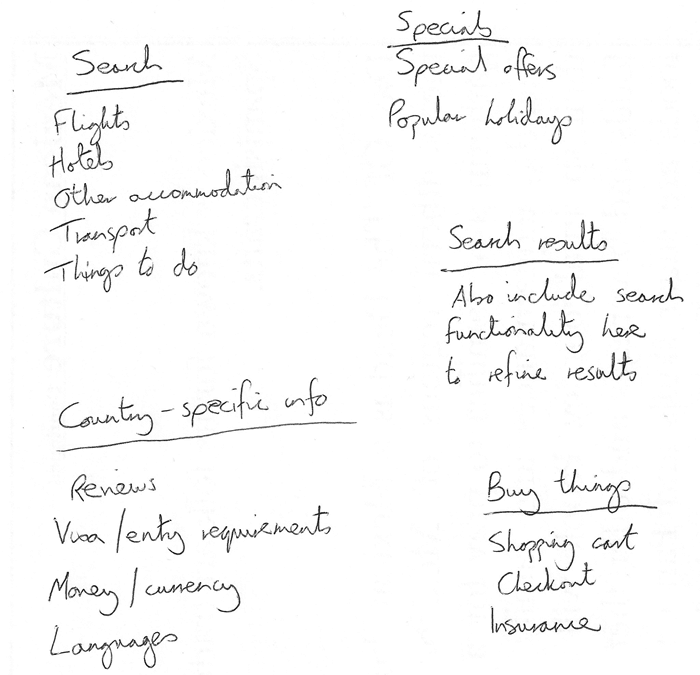

5. 现在，尝试着再画一个网站的草图 — 每个气泡代表网站的一个页面，在气泡与气泡之间用连线的方式，来说明它们之间的联系。主页面可能位于中心位置，并且链接到其他的大多数页面；对于一个小型网站，大多数页面都可以从主页的导航栏中链接跳转，虽然也存在例外。你可能也希望记录下内容将如何显示的笔记。

### 主动学习：创建你自己的站点地图[Section](https://developer.mozilla.org/zh-CN/docs/learn/HTML/Introduction_to_HTML/%E6%96%87%E4%BB%B6%E5%92%8C%E7%BD%91%E7%AB%99%E7%BB%93%E6%9E%84#%E4%B8%BB%E5%8A%A8%E5%AD%A6%E4%B9%A0%EF%BC%9A%E5%88%9B%E5%BB%BA%E4%BD%A0%E8%87%AA%E5%B7%B1%E7%9A%84%E7%AB%99%E7%82%B9%E5%9C%B0%E5%9B%BE)

尝试对你自己创造的网站进行上述步骤的练习。你想要做一个关于什么的网站？

**注意**: 将你的工作成果保存在任意的地方，之后你可能还会需要它。

### 总结[Section](https://developer.mozilla.org/zh-CN/docs/learn/HTML/Introduction_to_HTML/%E6%96%87%E4%BB%B6%E5%92%8C%E7%BD%91%E7%AB%99%E7%BB%93%E6%9E%84#%E6%80%BB%E7%BB%93)

通过本文，你应该对于如何构建一个网页/网站有了更好的理解。在本单元的最后一篇文章中，我们将学习如何调试 HTML。

### 相关链接[Section](https://developer.mozilla.org/zh-CN/docs/learn/HTML/Introduction_to_HTML/%E6%96%87%E4%BB%B6%E5%92%8C%E7%BD%91%E7%AB%99%E7%BB%93%E6%9E%84#%E7%9B%B8%E5%85%B3%E9%93%BE%E6%8E%A5)

- [Using HTML sections and outlines](https://developer.mozilla.org/en-US/docs/Web/Guide/HTML/Using_HTML_sections_and_outlines): 进一步的指南: HTML5 的元素语义和大纲算法.

##   HTML 调试

写HTML是非常容易的，但如果某部分出了问题并且你找不到错误代码在哪里的时候，本文将向您介绍一些可以帮助您查找和修复HTML中的错误的工具。

| 先决条件: | 熟悉HTML ，例如已经阅读了 [Getting started with HTML](https://developer.mozilla.org/zh-CN/docs/Learn/HTML/Introduction_to_HTML/Getting_started)，[HTML text fundamentals](https://developer.mozilla.org/zh-CN/docs/Learn/HTML/Introduction_to_HTML/HTML_text_fundamentals)，和 [Creating hyperlinks](https://developer.mozilla.org/zh-CN/docs/Learn/HTML/Introduction_to_HTML/Creating_hyperlinks)。 |
| --------- | ------------------------------------------------------------ |
| 目标:     | 学习基础使用调试工具查找HTML中的错误。                       |

### 调试并不可怕[Section](https://developer.mozilla.org/zh-CN/docs/learn/HTML/Introduction_to_HTML/Debugging_HTML#%E8%B0%83%E8%AF%95%E5%B9%B6%E4%B8%8D%E5%8F%AF%E6%80%95)

在编写某种代码时，通常一切都是正常的，直到你犯了某个错误那可怕的时刻便发生了，你的代码无效了 — 无论这是不是你想要的。例如下面，当我们想用[compile](https://developer.mozilla.org/en-US/docs/Glossary/compile)Rust语言去写一个简单的程序的时候，错误报告便会出现。


这里错误信息比较容易理解 — "双引号字符串未闭合"。如果你查看列表，你大概会看到`(Hello, world!");` 这里缺少了一个双引号 ，然而当程序变庞大的时候错误信息也会变得更复杂和更难解释，甚至上面这样简单的例子对于不了解Rust语言的人来说就会有点吓人。

调试没有那么可怕 —  编写和调试任何编程语言的关键是熟悉这门语言和工具。

### **HTML和调试[Section](https://developer.mozilla.org/zh-CN/docs/learn/HTML/Introduction_to_HTML/Debugging_HTML#HTML%E5%92%8C%E8%B0%83%E8%AF%95)**

HTML并不像Rust语言那么难以理解 — 在浏览器解析和显示它之前HTML不会被编译成其他形式  (这是解析而不是编译) HTML的[element](https://developer.mozilla.org/en-US/docs/Glossary/element) 语法可以说比“像Rust的”[JavaScript](https://developer.mozilla.org/en-US/docs/Glossary/JavaScript) 或 [Python](https://developer.mozilla.org/en-US/docs/Glossary/Python)这样“真正的编程语言”更容易理解. 然而浏览器运行HTML比编程语言的运行更宽松，这可以说是好事也是坏事。

### 宽容模式代码[Section](https://developer.mozilla.org/zh-CN/docs/learn/HTML/Introduction_to_HTML/Debugging_HTML#%E5%AE%BD%E5%AE%B9%E6%A8%A1%E5%BC%8F%E4%BB%A3%E7%A0%81)

宽容的意思是什么呢？通常当你写错代码的时候，你会遇到以下两种主要类型的错误：

- **语法错误**: 由于拼写错误导致程序无法运行，就像上面Rust的例子. 修正这些错误是没问题的，只要你熟悉正确的使用工具和知道错误信息的意思。
- **逻辑错误**: 实际上语法是正确的，但代码不是你想要的，这意味着程序运行不正确. 逻辑错误通常比语法错误更难修复，因为没有一个错误信息指示你到错误的来源。

HTML本身不容易因语法错误出错，因为浏览器是以宽松模式来运行，这意味着即使出现语法错误浏览器依然会运行。浏览器通常都有自己的规则来解析语法错误的标记语言，所以程序仍然会运行，尽管可能不是你预期的样子。这样当然仍然会带来问题。

**注意**: HTML可以自由的运行，是因为在 Web 创建之初，它的宗旨就是：允许人们获取他们发布的内容比确保所有语法完全正确更重要。如果当初 Web 在一开始就更加严格的话，也许 Web 就不会像今天这样流行了。

### 主动学习: 学习宽容式代码风格[Section](https://developer.mozilla.org/zh-CN/docs/learn/HTML/Introduction_to_HTML/Debugging_HTML#%E4%B8%BB%E5%8A%A8%E5%AD%A6%E4%B9%A0_%E5%AD%A6%E4%B9%A0%E5%AE%BD%E5%AE%B9%E5%BC%8F%E4%BB%A3%E7%A0%81%E9%A3%8E%E6%A0%BC)

现在到你自己学习 HTML 代码宽松特性的时候了。

1. 首先，找到我们的 [debug-example demo](https://github.com/mdn/learning-area/blob/master/html/introduction-to-html/debugging-html/debug-example.html) 副本并保存到本地。这里故意写了一些错误在代码中，以便我们探究（HTML 标记被写成了**糟糕的格式**，与 **良好的格式**相反）。

2. 接着，在浏览器中打开—你会看到下面的样子：

   

3. 这看起来一点儿也不好；让我们来看看源代码，看看我们是否能找出为什么（只显示了 body 的内容）：

   ```html
   <h1>HTML debugging examples</h1>
   
   <p>What causes errors in HTML?
   
   <ul>
     <li>Unclosed elements: If an element is <strong>not closed properly,
         then its effect can spread to areas you didn't intend
   
     <li>Badly nested elements: Nesting elements properly is also very important
         for code behaving correctly. <strong>strong <em>strong emphasised?</strong>
         what is this?</em>
   
     <li>Unclosed attributes: Another common source of HTML problems. Let's
         look at an example: <a href="https://www.mozilla.org/>link to Mozilla
         homepage</a>
   </ul>
   ```

4. 让我们检查一下这里看到的问题：

   - [paragraph](https://developer.mozilla.org/zh-CN/docs/Web/HTML/Element/p) 和 [list item](https://developer.mozilla.org/zh-CN/docs/Web/HTML/Element/li) 元素没有结束标签。看看上面的图片，看起来对标记并没有导致太严重的影响，因为很容易推断出一个元素应该在哪里结束，在哪里开始。
   - 第一个 [`strong`](https://developer.mozilla.org/zh-CN/docs/Web/HTML/Element/strong) 元素没有结束标签。这问题有一点大，因为不太容易确定元素在哪里结束。事实上，整个剩下的文本都被加粗强调了。
   - 这部分代码嵌套很糟糕：`<strong>strong <em>strong emphasised?</strong> what is this?</em>`。由于之前的问题，要解释这是如何解析的并不容易。
   - `href` 属性缺少了一个双引号。这导致了最大的问题—链接完全没有解析出来。

5. 现在我们看看浏览器渲染出来的标记语言，而不是源代码中的标记语言。我们打开浏览器的开发者工具。如果你对这个不太熟悉的话，先浏览一下[Discover browser developer tools](https://developer.mozilla.org/zh-CN/docs/Learn/Discover_browser_developer_tools)。

6. 在开发者模式中的审查器件，你可以看到被渲染出来的标记语言会像这样。

   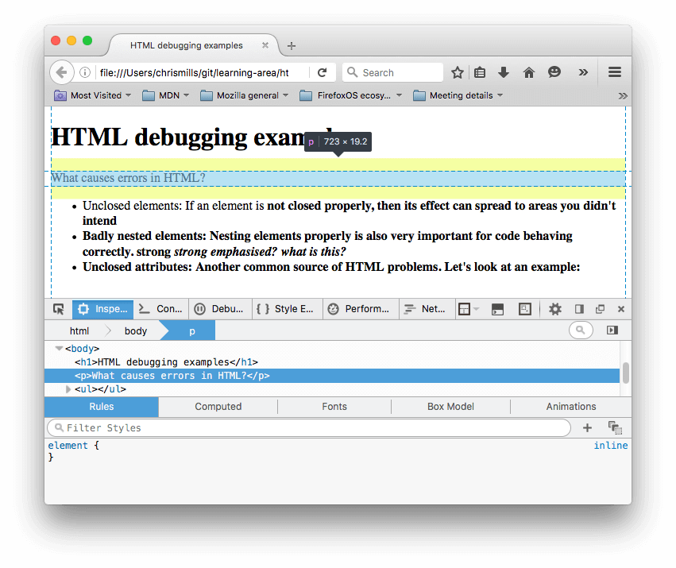

7. 使用开发者模式下的审查器，可以非常清楚地看到浏览器尝试修补我们的代码错误（下面是火狐浏览器中的情况，其他浏览器也会进行修补）

   - 段落和类表元素被加上了闭合标签。

   - 第一个<strong>标签闭合的位置并不明确，因此浏览器用自己的<strong>标签将每一块分离的文本包括了进来，就在文档的底部。

   - 浏览器像下面这样修补嵌套错误：

     ```html
     <strong>strong
       <em>strong emphasised?</em>
     </strong>
     <em> what is this?</em>
     ```

   - 有错误属性的链接整个被删掉了。最后一个列表元素就像这样：

     ```html
     <li>
       <strong>Unclosed attributes: Another common source of HTML problems.
       Let's look at an example: </strong>
     </li>
     ```

### **HTML验证[Section](https://developer.mozilla.org/zh-CN/docs/learn/HTML/Introduction_to_HTML/Debugging_HTML#HTML%E9%AA%8C%E8%AF%81)**

看了上面的例子之后，你应该会希望自己的HTML格式正确。那么应该如何做呢？上面的例子都是一些非常小的错误，因此稍微浏览一下自己的代码就可以发现，但是如果是一个非常庞大、复杂的HTML文档呢？

最好的方法就是让你的HTML页面通过 [Markup Validation Service](https://validator.w3.org/) — 由W3C创立并维护的，这个网站紧跟定义 HTML，CSS，和其他网络技术的具体内容. 这个网页将 HTML 文档作为输入,并运行 ，然后给你一个报告告诉你你的 HTML 有哪些错误.


为了确定需要验证的HTML，你可以输入一个指向该HTML页面的网址，或者上传一份HTML文件，或者直接输入一些HTML代码。

### 主动学习：验证一份HTML文档[Section](https://developer.mozilla.org/zh-CN/docs/learn/HTML/Introduction_to_HTML/Debugging_HTML#%E4%B8%BB%E5%8A%A8%E5%AD%A6%E4%B9%A0%EF%BC%9A%E9%AA%8C%E8%AF%81%E4%B8%80%E4%BB%BDHTML%E6%96%87%E6%A1%A3)

让我们用[sample document](https://github.com/mdn/learning-area/blob/master/html/introduction-to-html/debugging-html/debug-example.html)尝试一下：

1. 在浏览器中打开 [Markup Validation Service](https://validator.w3.org/) 。
2. 点击或者激活 [Validate by Direct Input](https://validator.w3.org/#validate_by_input) 栏。
3. 将整个示范文档的代码（不仅仅是body部分）复制粘贴到在Markup Validation Service中显示的巨大的文本框。
4. *点击Check按钮。*

然后就会出现一张列表，显示了文档中的错误或者其他信息。


### 解析错误信息

展示在你眼前的错误信息列表可能会很有用，也可能并没有帮助。经过一点点练习你就会知道如何解析这些错误从而修复错误。让我们来浏览一下这些错误信息的含义。你会看到每一行都有一个数字和信息栏，来帮助你轻松定位错误。

- End tag `li` implied, but there were open elements（隐含着结束标签 `li` ，但却出现了元素的开始标签；共两个）: 这条信息表明一个元素的开始标签应该对应着一个结束标签，结束标签是隐含的，但实际上并不存在。行/列（line/column）信息指出那一行代码的下一行是结束标签应该出现的地方，这已经足够看出问题所在了。

- Unclosed element `strong`（未闭合标签 `strong` ）：这是非常容易理解的，一个[``](https://developer.mozilla.org/zh-CN/docs/Web/HTML/Element/strong)元素没有闭合，行/列信息指出了它所在之处。

- End tag `strong` violates nesting rules（结束标签 `strong` 违反了嵌套规则）：指出了错误嵌套的元素，行/列信息表明了错误所在。

- End of file reached when inside an attribute value. Ignoring tag（在属性值内达到文件末尾。忽略标签）: 这个比较难懂，它说的是在某个地方有一个属性的值没有正确构成，估计是在文件末尾附近，因为文件的结尾（EOF）出现在了一个属性值里。事实上浏览器没有渲染超链接就已经告诉我们错误出在哪个元素了。

- End of file seen and there were open elements（文件结尾有未闭合的元素）：这个有点意义不明，但基本上表明了有元素没有正确闭合。行号指向文件最后几行，且错误信息给出了一个这种错误的案例：

  ```html
  example: <a href="https://www.mozilla.org/>link to Mozilla homepage</a> ↩ </ul>↩ </body>↩</html>
  ```

  **注意**: 一个缺少结束引号标记的属性会导致一个未闭合的元素，因为其余的文档被解析为了属性的内容。

- Unclosed element `ul`（未闭合元素 `ul`）：这个不是很有帮助，因为[`ul`](https://developer.mozilla.org/zh-CN/docs/Web/HTML/Element/ul)已经正确闭合了。出现这个错误是因为那个[`a`](https://developer.mozilla.org/zh-CN/docs/Web/HTML/Element/a)元素因少了右引号而没有闭合。

如果你不能一次弄懂所有的错误，别着急，你可以试试先修复那些你已经弄懂的错误，然后再申请验证，看看剩下的错误是哪些。有时候最先修复的错误可能让你摆脱了后面一系列的错误——因为一个小问题可能引发好几个错误，就像连锁反应。

当你所有的错误都修复之后，会得到下面的输出。

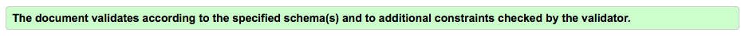

### **总结[Section](https://developer.mozilla.org/zh-CN/docs/learn/HTML/Introduction_to_HTML/Debugging_HTML#%E6%80%BB%E7%BB%93)**

这就是我们关于HTML调试的介绍，这应该也会帮助你调试CSS和JavaScript，或者你未来遇到的任何一种语言。这也是HTML模块学习的最后一篇文章，现在你可以用我们给你布置的任务来测试一下自己：下面的第一个链接。

## 标记一封信

我们或早或晚都会学会如何写信，这也是一个不错的测试我们文本格式化技巧的例子！ 在此评估中，我们会给你一封写好的信用来标记，以测验你基础和高级的HTML文本格式化技巧，包括超链接。此外我们将测试你对一些HTML `<head>`内容的熟悉程度。

| 先决条件： | 在尝试此评估之前，你应该已经看过[Getting started with HTML](https://developer.mozilla.org/zh-CN/docs/learn/HTML/Introduction_to_HTML/Getting_started) 、[What’s in the head? Metadata in HTML](https://developer.mozilla.org/zh-CN/docs/learn/HTML/Introduction_to_HTML/The_head_metadata_in_HTML)、[HTML text fundamentals](https://developer.mozilla.org/zh-CN/docs/learn/HTML/Introduction_to_HTML/HTML_text_fundamentals) 、[Creating hyperlinks](https://developer.mozilla.org/zh-CN/docs/Learn/HTML/Introduction_to_HTML/Creating_hyperlinks)和[Advanced text formatting](https://developer.mozilla.org/zh-CN/docs/Learn/HTML/Introduction_to_HTML/Advanced_text_formatting)。 |
| ---------- | ------------------------------------------------------------ |
| 目的：     | 测试基本和高级HTML文本格式和超链接技能，了解HTML <head>中的内容。 |

### 起点[Section](https://developer.mozilla.org/zh-CN/docs/Learn/HTML/Introduction_to_HTML/Marking_up_a_letter#%E8%B5%B7%E7%82%B9)

开始评估之前，你应该先复制一份[要标记的原始文本](https://github.com/mdn/learning-area/blob/master/html/introduction-to-html/marking-up-a-letter-start/letter-text.txt)，和HTML[需要导入的CSS代码](https://github.com/mdn/learning-area/blob/master/html/introduction-to-html/marking-up-a-letter-start/css.txt)，然后 用你的文本编辑器创建一个新的`.html`文件来进行评估（或者用[JSBin](http://jsbin.com/)或[Thimble](https://thimble.mozilla.org/)等网站来进行评估）。

### 项目概要[Section](https://developer.mozilla.org/zh-CN/docs/Learn/HTML/Introduction_to_HTML/Marking_up_a_letter#%E9%A1%B9%E7%9B%AE%E6%A6%82%E8%A6%81)

在这个项目里，你的任务是标记一封放在大学内网上的信，这封信是研究人员对一名未来的博士生的回复，关于他们在大学工作的申请。

块/结构语义：

- 你应该使用适当的结构来构造整体文档，包括doctype、[`html`](https://developer.mozilla.org/zh-CN/docs/Web/HTML/Element/html) 、 [`hrad`](https://developer.mozilla.org/zh-CN/docs/Web/HTML/Element/head)和[`body`](https://developer.mozilla.org/zh-CN/docs/Web/HTML/Element/body)元素。
- 除下面提到的几点之外，这封信应该被标记成有着段落和标题的结构。 这封信有一个顶级标题（“Re：”那行）和三个二级标题。
- 使用适当类型的列表标记该学期的开学时间、学习科目和外国舞蹈。
- 那两个地址可以就放在段落中，且 [`address`](https://developer.mozilla.org/zh-CN/docs/Web/HTML/Element/address)元素不适合他们——想一下为什么。此外，地址的每一行都应该另开新行，但不是新的段落。

内联语义：

- 显著标明发信人和收信人的姓名（以及“电话”和“电子邮件”）。
- 用适当的元素把文档中的四个日期标记成机器可读的日期。
- 把信中第一个地址和第一个日期的类属性设置成“sender-column”，这样你添加的CSS就可以使它们右对齐，就像经典的信件布局里的一样。
- 标记出信件正文中的五个首字母缩略词或缩写的扩展形式。
- 适当标注六个下标/上标。
- 用适当的字符实体引用来标记大于号、乘号和度符号。
- 试着标记至少两个适当的、具有很强重要性/重点（strong importance/emphasis）单词。
- 有两个地方应加上超链接，为它们添加适当的标题。链接指向http://example.com就行。
- 应该用适当的元素标记大学的座右铭引用和引文。

文档的头部：

- 用适当的meta标签把文档的字符集声明为utf-8。
- 用适当的meta标签说明信件的作者。
- 用适当的标签引入我们提供的CSS代码。

### 提示和技巧[Section](https://developer.mozilla.org/zh-CN/docs/Learn/HTML/Introduction_to_HTML/Marking_up_a_letter#%E6%8F%90%E7%A4%BA%E5%92%8C%E6%8A%80%E5%B7%A7)

- 使用[W3C HTML验证器](https://validator.w3.org/)来验证HTML，如果验证通过，你会得到奖励积分。
- 完成这个评估不需要任何CSS知识，你只需要把已提供的CSS放到HTML元素里就好。

### 范例[Section](https://developer.mozilla.org/zh-CN/docs/Learn/HTML/Introduction_to_HTML/Marking_up_a_letter#%E8%8C%83%E4%BE%8B)

下面的截图展示了这封信被标记完成之后可能会是什么样子。


### 评估[Section](https://developer.mozilla.org/zh-CN/docs/Learn/HTML/Introduction_to_HTML/Marking_up_a_letter#%E8%AF%84%E4%BC%B0)

如果这个评估是一系列课程的一部分，你应该可以让你的老师或导师为你批改。 如果你是自学，可以很容易地在[Learning Area Discourse thread](https://discourse.mozilla-community.org/t/learning-web-development-marking-guides-and-questions/16294)或[Mozilla IRC](https://wiki.mozilla.org/IRC)的[#mdn](irc://irc.mozilla.org/mdn) IRC频道回复得到批改指南。请先自己试着做——作弊学不到任何东西！


## 构建内容页面

使用CSS构建一个准备好内容的页面是一个非常重要的技能，因此在这个评估中，您将会考虑到您构建页面可能最终查找的能力，并选择适当的结构语义来构建一个布局在上面。

| 先决条件: | 在尝试本评估前你应该已经学完了其余课程，特别是 [Document and website structure](https://developer.mozilla.org/zh-CN/docs/Learn/HTML/Introduction_to_HTML/Document_and_website_structure). |
| --------- | ------------------------------------------------------------ |
| 目标:     | 检验网页结构知识，以及如何使用 HTML 标记呈现一个预期的布局设计。 |

### 起点[Section](https://developer.mozilla.org/zh-CN/docs/Learn/HTML/Introduction_to_HTML/Structuring_a_page_of_content#%E8%B5%B7%E7%82%B9)

开始本测验前，你应该先下载这个[包含了所有材料的zip压缩文件](https://github.com/mdn/learning-area/blob/master/html/introduction-to-html/structuring-a-page-of-content-start/assets.zip?raw=true)。该 zip 文件包含：

- 需要你补充结构标记的 HTML 文件。
- 给标记添加样式的 CSS 文件。
- 页面中使用的图片。

在你的本地电脑上创建示例，或者也可以使用像 [JSBin](http://jsbin.com/) 或 [Thimble](https://thimble.mozilla.org/) 这样的网站来完成你的测验。

### 项目简介[Section](https://developer.mozilla.org/zh-CN/docs/Learn/HTML/Introduction_to_HTML/Structuring_a_page_of_content#%E9%A1%B9%E7%9B%AE%E7%AE%80%E4%BB%8B)

本项目中，你的任务是为一个鸟类观察网站的主页内容添加结构化的元素，使其可以应用页面设计。它需要：

- 一个全宽度的页眉（header），包含网站主标题、网站 logo 和导航栏菜单。设计样式生效后标题和 logo 会在两边，导航栏在它们下面。
- 一个两列的主内容区域 — 一个包含欢迎信息的主块和一个包含图片缩略图的侧边栏。
- 一个包含版权信息和鸣谢的页脚（footer）。

你应该为以下内容添加合适的标签：

- 页眉
- 导航菜单
- 主要内容
- 欢迎语
- 图片侧边栏
- 页脚

你应该：

- 在已有的 link 标签下面添加另一个 [``](https://developer.mozilla.org/zh-CN/docs/Web/HTML/Element/link) 元素，来将提供的 CSS 文件添加到页面中。

### 要点和提示[Section](https://developer.mozilla.org/zh-CN/docs/Learn/HTML/Introduction_to_HTML/Structuring_a_page_of_content#%E8%A6%81%E7%82%B9%E5%92%8C%E6%8F%90%E7%A4%BA)

- 使用[W3C HTML validator](https://validator.w3.org/) 来验证你的 HTML；如果它尽可能多的验证，你会得到加分。("googleapis" 一行用于从 Google Fonts 服务引入自定义字体到页面；这个不会被验证，所以不用担心。)
- 你不需要知道任何 CSS 来做本测验；你只需要将提供的 CSS 通过 HTML 元素添加即可。
- 提供的 CSS 已经设计好了，所以当正确的结构元素被添加到标记中，就会如给定的页面一样是绿色的。
- 如果你卡住了并且不能设想添加元素到哪里，画一个简单的页面布局模块图通常很有帮助，然后添加一个你认为可以包裹每个块的元素。

### 示例[Section](https://developer.mozilla.org/zh-CN/docs/Learn/HTML/Introduction_to_HTML/Structuring_a_page_of_content#%E7%A4%BA%E4%BE%8B)

添加标记后的主页的样子的一个可能示例，如以下截图所示：


### 评估[Section](https://developer.mozilla.org/zh-CN/docs/Learn/HTML/Introduction_to_HTML/Structuring_a_page_of_content#%E8%AF%84%E4%BC%B0)

如果你将本测验作为有组织的课程的一部分，你应该将你的工作给你的老师/导师来打分。如果你是自学，你可以很容易地通过在 [discussion thread about this exercise](https://discourse.mozilla.org/t/structuring-a-page-of-content-assignment/24678) 获得标记帮助，或者在 [Mozilla IRC](https://wiki.mozilla.org/IRC) 的 [#mdn](irc://irc.mozilla.org/mdn) IRC 频道。首先尝试自己做练习 — 作弊不会有任何收获！  

# 多媒体与嵌入

**章节主要内容**

- **[HTML中的图片](https://developer.mozilla.org/zh-CN/docs/Learn/HTML/Multimedia_and_embedding/Images_in_HTML)**
- **[音视频内容](https://developer.mozilla.org/zh-CN/docs/Learn/HTML/Multimedia_and_embedding/Video_and_audio_content)**
- **[从<object> 到 <iframe>— 其他嵌入技术](https://developer.mozilla.org/zh-CN/docs/Learn/HTML/Multimedia_and_embedding/Other_embedding_technologies)**
- **[给网页添加矢量图](https://developer.mozilla.org/zh-CN/docs/Learn/HTML/Multimedia_and_embedding/Adding_vector_graphics_to_the_Web)**
- **[响应式图片](https://developer.mozilla.org/zh-CN/docs/Learn/HTML/Multimedia_and_embedding/Responsive_images)**
- **[Mozilla醒目页面](https://developer.mozilla.org/zh-CN/docs/Learn/HTML/Multimedia_and_embedding/Mozilla_splash_page)**

## 多媒体与嵌入概述

在这份教程中，到目前为止我们已经看到了许多的文字了。真的很多文字。但是网页除了文本之外什么都没有，真的非常无聊，所以，让我们开始看看怎样让网页动起来。用更多有趣的内容！本模块要探索怎样用HTML来让你的网页包含多媒体，包括可以包含图像的不同方式，以及怎样嵌入视频，甚至是整个其他的网页。

### 预备知识[Section](https://developer.mozilla.org/zh-CN/docs/Learn/HTML/Multimedia_and_embedding#%E9%A2%84%E5%A4%87%E7%9F%A5%E8%AF%86)

在你开始本模块之前，你应该已经拥有了关于HTML基础的合理知识，就是之前在[HTML介绍](https://developer.mozilla.org/zh-CN/docs/learn/HTML/Introduction_to_HTML)中所述。如果你还没有看过那个模块（或者类似的），先去看看，然后再回来吧！

**提示**: 如果你在电脑/平板电脑/其他设备上不能创建你自己的代码文件，你可以尝试在在线代码编辑网站例如[JSBin](https://jsbin.com/)或者[Thimble](https://thimble.mozilla.org/)来运行（大部分的）代码示例。

### 指南[Section](https://developer.mozilla.org/zh-CN/docs/Learn/HTML/Multimedia_and_embedding#%E6%8C%87%E5%8D%97)

本模块包含以下的文章，它们将会让你了解所有在网页上关于嵌入多媒体的基础方面。

- [HTML中的图片](https://developer.mozilla.org/zh-CN/docs/Learn/HTML/Multimedia_and_embedding/Images_in_HTML)

  还有其他类型的多媒体要考虑，但是从低调的 [`img`](https://developer.mozilla.org/zh-CN/docs/Web/HTML/Element/img) 元素开始是符合逻辑的，它常常被用来在网页中嵌入一个简单的图片。在这篇文章中，我们要看看怎样更深入的使用它，包括基础，用标题注解 [`figure`](https://developer.mozilla.org/zh-CN/docs/Web/HTML/Element/figure)，以及怎样把它关联到CSS背景图片。

- [视频和音频内容](https://developer.mozilla.org/zh_CN/docs/Learn/HTML/Multimedia_and_embedding/Video_and_audio_content)

  接下来，我们将看看怎样在我们的页面上用HTML5的 [``](https://developer.mozilla.org/zh-CN/docs/Web/HTML/Element/video) 和[``](https://developer.mozilla.org/zh-CN/docs/Web/HTML/Element/audio)元素来嵌入视频和音频；包括基础，提供向不同的浏览器提供不同文件格式的访问方式，增加标题和副标题，以及增加对过时的浏览器的兼容。

- [从 object 到 iframe — 其他嵌入技术](https://developer.mozilla.org/zh_CN/docs/Learn/HTML/Multimedia_and_embedding/Other_embedding_technologies)

  在这一节，我们将来了解一些另辟蹊径的内容，看一组元素，它们可以让你在页面中嵌入许多不同类型的内容： [`iframe`](https://developer.mozilla.org/zh-CN/docs/Web/HTML/Element/iframe), [`ember`](https://developer.mozilla.org/zh-CN/docs/Web/HTML/Element/embed) 和 [`object`](https://developer.mozilla.org/zh-CN/docs/Web/HTML/Element/object) 元素。 `<iframe> 用来嵌入其他网页，而另外两者可以帮助你嵌入` PDF, SVG, 甚至是 Flash — 一种逐渐退出历史舞台的技术，不过也许你还是能时不时的看到它。

- [在页面中添加矢量图像](https://developer.mozilla.org/zh_CN/docs/Learn/HTML/Multimedia_and_embedding/Adding_vector_graphics_to_the_Web)

  矢量图像在一些特定场景中非常有用。不同于常见的格式，比如PNG/JPG, 它们不会在放大的时候变得扭曲或者显示出像素格——它们可以在缩放时保持光滑。本文将为你介绍什么是矢量图像，以及如何在网页中添加流行的 [SVG](https://developer.mozilla.org/en-US/docs/Glossary/SVG) 格式图像。

- [响应式图片](https://developer.mozilla.org/zh-CN/docs/Learn/HTML/Multimedia_and_embedding/Responsive_images)

  现在有许多不同的设备类型能够浏览网络 - 从手机到台式电脑 - 在现代网络世界中掌握的一个基本概念就是响应式设计。这是指创建可以自动更改其功能以适应不同屏幕尺寸，分辨率等的网页。稍后将在CSS模块中详细介绍这一点，但是现在我们将看看HTML可用于创建响应式图像的工具，包括[``](https://developer.mozilla.org/zh-CN/docs/Web/HTML/Element/picture)元素。

### 评估[Section](https://developer.mozilla.org/zh-CN/docs/Learn/HTML/Multimedia_and_embedding#%E8%AF%84%E4%BC%B0)

以下评估将测试您对上述指南中涵盖的HTML基础知识的理解：

- [Mozilla启动页面](https://developer.mozilla.org/en-US/docs/Learn/HTML/Multimedia_and_embedding/Mozilla_splash_page)

  在这个评估中，我们将测试您对本模块文章中讨论的一些技巧的了解，让您将一些图像和视频添加到一个关于Mozilla的时髦的页面！

## HTML中的图片

在一开始时，Web仅有文本，那真的是很无趣。幸运的是，没过多久网页上就能嵌入图片和其他有趣的内容了。虽然还有许多其他类型的多媒体，但是从地位比较低的[``](https://developer.mozilla.org/zh-CN/docs/Web/HTML/Element/img)元素开始是符合逻辑的，它常常被用来在网页中嵌入一张简单的图片。在这篇文章中，我们将看到怎样深入的使用它，包括基本的用[``](https://developer.mozilla.org/zh-CN/docs/Web/HTML/Element/figure)来添加说明文字，以及怎样把它和CSS背景图片链接起来。

| 学习本节的前提条件: | 掌握基本的电脑知识，[安装基本软件](https://developer.mozilla.org/zh-CN/docs/Learn/Getting_started_with_the_web/Installing_basic_software)，基本的[文件处理](https://developer.mozilla.org/zh-CN/docs/Learn/Getting_started_with_the_web/Dealing_with_files)知识，熟悉[HTML基础](https://developer.mozilla.org/zh-CN/docs/Learn/HTML/Introduction_to_HTML/Getting_started) |
| ------------------- | ------------------------------------------------------------ |
| 本节目的:           | 学习如何在 HTML 页面插入简单的图片，为图片添加简单的说明，以及 CSS 背景图片与 HTML 图片的关系。 |

### 怎样将一幅图片放到网页上?[Section](https://developer.mozilla.org/zh-CN/docs/Learn/HTML/Multimedia_and_embedding/Images_in_HTML#%E6%80%8E%E6%A0%B7%E5%B0%86%E4%B8%80%E5%B9%85%E5%9B%BE%E7%89%87%E6%94%BE%E5%88%B0%E7%BD%91%E9%A1%B5%E4%B8%8A)

我们可以用[``](https://developer.mozilla.org/zh-CN/docs/Web/HTML/Element/img) 元素来把图片放到网页上。它是一个空元素（它不需要包含文本内容或闭合标签），最少只需要一个 `src` （一般读作其全称 *source）*来使其生效。`src` 属性包含了指向我们想要引入的图片的路径，可以是相对路径或绝对URL，就像 [``](https://developer.mozilla.org/zh-CN/docs/Web/HTML/Element/a) 元素的 `href` 属性一样。

**注意：**在继续之前，你应该阅读[快速入门URL和路径](https://developer.mozilla.org/zh-CN/docs/Learn/HTML/Introduction_to_HTML/Creating_hyperlinks#URLs%E4%B8%8E%E8%B7%AF%E5%BE%84(path)%E5%BF%AB%E9%80%9F%E5%85%A5%E9%97%A8)来复习一下相对和绝对URL。

举个例子来看，如果你有一幅文件名为 `dinosaur.jpg` 的图片，且它与你的 HTML  页面存放在相同路径下，那么你可以这样嵌入它：

```html

```

如果这张图片存储在和 HTML 页面同路径的 `images` 文件夹下（这也是Google推荐的做法，利于[SEO](https://developer.mozilla.org/en-US/docs/Glossary/SEO)/索引），那么你可以采用如下形式：

```html

```

以此类推。

**注意：**搜索引擎也读取图像的文件名并把它们计入SEO。因此你应该给你的图片取一个描述性的文件名：`dinosaur.jpg` 比 `img835.png `要好。

你也可以像下面这样使用绝对路径：

```html

```

但是这种方式是不被推荐的，这样做只会使浏览器做更多的工作，例如重新通过 DNS 再去寻找 IP 地址。通常我们都会把图片和 HTML 放在同一个服务器上。

**警告：**大多数图片是有版权的。**不要**在你的网页上使用一张图片，除非：

1. 你是图片版权所有者
2. 你有图片版权所有者明确的、书面上的使用授权
3. 你有充分的证据证明这张图片是公共领域内的

侵犯版权是违法并且不道德的。此外，在得到授权之前**永远不要**把你的`src`属性指向其他人网站上的图片。这被称为"盗链（hotlinking）"。同样，盗取其他人的带宽也是违法的。而且这会降低你的页面的加载速度，而且图片可能会在不受你控制的情况下被移走或用别的令人尴尬的东西替换掉。

我们上面的代码会展示如下的结果页面：


**注意：**像[``](https://developer.mozilla.org/zh-CN/docs/Web/HTML/Element/img)和[``](https://developer.mozilla.org/zh-CN/docs/Web/HTML/Element/video)这样的元素有时被称之为**替换元素**，因为这样的元素的内容和尺寸由外部资源（像是一个图片或视频文件）所定义，而不是元素自身。

**注意：**你可以在[GitHub上的这个网页](https://mdn.github.io/learning-area/html/multimedia-and-embedding/images-in-html/index.html)看到这个例子的运行结果（也可以看到[源码](https://github.com/mdn/learning-area/blob/master/html/multimedia-and-embedding/images-in-html/index.html)）。

### 备选文本[Section](https://developer.mozilla.org/zh-CN/docs/Learn/HTML/Multimedia_and_embedding/Images_in_HTML#%E5%A4%87%E9%80%89%E6%96%87%E6%9C%AC)

下一个我们讨论的属性是 `alt` ，它的值应该是对图片的文字描述，用于在图片无法显示或不能被看到的情况。例如，上面的例子可以做如下改进：

```html

```

测试`alt` 属性最简单的方式就是故意拼错图片文件名，这样浏览器就无法找到该图片从而显示备选的文本。如果我们将上例的图片文件名改为 `dinosooooor.jpg`，浏览器就不能显示图片，而显示：


那么，为什么我们需要备选文本呢？它可以派上用场的原因有很多：

- 用户有视力障碍，通过[屏幕阅读器](https://zh.wikipedia.org/wiki/%E8%9E%A2%E5%B9%95%E9%96%B1%E8%AE%80%E5%99%A8)来浏览网页 。事实上，给图片一个备选的描述文本对大多数用户都是很有用的。
- 就像上面所说的，你也许会把图片的路径或文件名拼错。
- 浏览器不支持该图片类型。某些用户仍在使用纯文本的浏览器，例如 [Lynx](https://en.wikipedia.org/wiki/Lynx_%28web_browser%29)，这些浏览器会把图片替换为描述文本。
- 你会想提供一些文字描述来给搜索引擎使用，例如搜索引擎可能会将图片的文字描述和查询条件进行匹配。
- 用户关闭的图片显示以减少数据的传输，这在手机上是十分普遍的，并且在一些国家带宽是有限且昂贵。

你到底应该在 `alt` 里写点什么呢？这首先取决于为什么这张图片会在这儿，换句话说，如果这张图片没显示出来，会少了什么：

- **装饰：**如果图片只是用于装饰，而不是内容的一部分，可以写一个空的`alt=""` 。例如，屏幕阅读器不会浪费时间对用户读出不是核心需要的内容。实际上装饰性图片就不应该放在HTML文件里， [CSS background images](https://developer.mozilla.org/zh-CN/docs/Learn/HTML/Multimedia_and_embedding/Images_in_HTML#CSS_background_images)才应该用于插入装饰图片，但如果这种情况无法避免， `alt=""`会是最佳处理方案。
- **内容：**如果你的图片提供了重要的信息，就要在`alt`文本中简要的提供相同的信息，甚至更近一步，把这些信息写在主要的文本内容里，这样所有人都能看见。不要写冗余的备选文本（如果在主要文本中将所有的段落都重复两遍，对于有视力障碍的用户来说多烦啊！），如果在主要文本中已经对图片进行了充分的描述，写`alt=""`就好。
- **链接：**如果你把图片嵌套在[``](https://developer.mozilla.org/zh-CN/docs/Web/HTML/Element/a)标签里，来把图片变成链接，那你还必须[提供无障碍的链接文本](https://developer.mozilla.org/zh-CN/docs/Learn/HTML/Introduction_to_HTML/Creating_hyperlinks#%E7%94%A8%E6%B8%85%E6%99%B0%E7%9A%84%E9%93%BE%E6%8E%A5%E6%8E%AA%E8%BE%9E%E3%80%82)。在这种情况下，你可以写在同一个<a>元素里，或者写在图片的`alt`属性里，随你喜欢。
- **文本：**你不应该将文本放到图像里。例如，如果你的主标题需要有阴影，你可以[用CSS](https://developer.mozilla.org/zh-CN/docs/Web/CSS/text-shadow)来达到这个目的，而不是把文本放到图片里。如果真的必须这么做，那就把文本也放到`alt`里。

本质上，关键在于在图片无法被看见时也提供一个可用的体验，这确保了所有人都不会错失一部分内容。尝试在浏览器中使图片不可见然后看看网页变成什么样了，你会很快意识到在图片无法显示时备选文本能帮上多大忙。

**注意：**想知道更多，可以看我们的[备选文本](https://developer.mozilla.org/en-US/docs/Learn/Accessibility/HTML#Text_alternatives)指南

### 宽度和高度[Section](https://developer.mozilla.org/zh-CN/docs/Learn/HTML/Multimedia_and_embedding/Images_in_HTML#%E5%AE%BD%E5%BA%A6%E5%92%8C%E9%AB%98%E5%BA%A6)

你可以用宽度和高度属性来指定你的图片的高度和宽度（你可以用多种方式找到你的图片的宽度和高度，例如在Mac上，你可以用 Cmd + I 来得到显示的图片文件的信息）回到我们的例子，你可以这样做：

```html

```

在正常的情况下，这不会对显示产生很大的影响， 但是如果图片没有显示（例如用户刚刚开始浏览网页，但是图片还没有加载完成），你会注意到浏览器会为要显示的图片留下一定的空间：


这是一件好事情——这使得页面加载的更快速更流畅。

然而，你不应该使用HTML属性来改变图片的大小。如果你把尺寸设定的太大，最终图片看起来会模糊；如果太小，会在下载远远大于你需要的图片时浪费带宽。如果你没有保持正确的[宽高比](https://zh.wikipedia.org/wiki/%E9%95%B7%E5%AF%AC%E6%AF%94_(%E5%BD%B1%E5%83%8F))，图片可能看起来会扭曲。在把图片放到你的网站页面之前，你应该使用图形编辑器使图片的尺寸正确。

**注意：**如果你需要改变图片的尺寸，你应该使用[CSS](https://developer.mozilla.org/zh-CN/docs/Learn/CSS)而不是HTML。

### Image titles 图片标题[Section](https://developer.mozilla.org/zh-CN/docs/Learn/HTML/Multimedia_and_embedding/Images_in_HTML#Image_titles_%E5%9B%BE%E7%89%87%E6%A0%87%E9%A2%98)

类似于[超链接](https://developer.mozilla.org/zh-CN/docs/Learn/HTML/Introduction_to_HTML/Creating_hyperlinks#%E4%BD%BF%E7%94%A8%3Ctitle%3E%E6%B7%BB%E5%8A%A0%E6%94%AF%E6%8C%81%E4%BF%A1%E6%81%AF)，你可以给图片增加`title`属性来提供需要更进一步的支持信息。在我们的例子中，可以这样做：

```html

```

这会给我们一个提示，看起来就像链接标题：


图片标题并不必须要包含有意义的信息，通常来说，将这样的支持信息放到主要文本中而不是附着于图片会更好。不过，在有些环境中这样做更有用，比如当没有空间显示提示时，也就是在图片栏中。

然而，这并不是推荐的——title有很多易访问性问题，主要是基于这样一个事实，即屏幕阅读器的支持是不可预测的，大多数浏览器都不会显示它，除非您在鼠标悬停时（例如：title无法访问键盘用户），如果你对更多的信息感兴趣，阅读[The Trials and Tribulations of the Title Attribute](https://www.24a11y.com/2017/the-trials-and-tribulations-of-the-title-attribute/) by Scott O'Hara.

### 动手练习：嵌入一张图片[Section](https://developer.mozilla.org/zh-CN/docs/Learn/HTML/Multimedia_and_embedding/Images_in_HTML#%E5%8A%A8%E6%89%8B%E7%BB%83%E4%B9%A0%EF%BC%9A%E5%B5%8C%E5%85%A5%E4%B8%80%E5%BC%A0%E5%9B%BE%E7%89%87)

好，轮到你了！在这个动手练习中， 我们希望你可以做一个简单的嵌入图片练习。 你有一个基本的 [`img`](https://developer.mozilla.org/zh-CN/docs/Web/HTML/Element/img) 标签; 我们希望你可以把下面这个 URL 所指向的图片嵌入到 HTML 中:

https://raw.githubusercontent.com/mdn/learning-area/master/html/multimedia-and-embedding/images-in-html/dinosaur_small.jpg

之前我们说过永远不要从其他服务器热链接图片，但这次只是出于学习目的，所以我们会允许你这么做一次。

我们还希望你可以:

- 添加 `alt`文字，添加完成后，可以故意把 URL 写错，来检查 [``](https://developer.mozilla.org/zh-CN/docs/Web/HTML/Element/alt) 的效果。
- 设置图片正确的 `width` 和 `height` 属性（提示：宽 200px，高 171px），然后再将宽和高的值进行改变，看看会有什么影响.
- 在图片上设置 `title` 属性。

如果你遇到了错误，你可以按 reset 按钮来重置。如果你遇到了困难无法完成, 按下 Show solution 按钮来看一下答案。

<iframe src="https://mdn.mozillademos.org/zh-CN/docs/Learn/HTML/Multimedia_and_embedding/Images_in_HTML$samples/Playable_code?revision=1409236" class="live-sample-frame sample-code-frame" height="500" width="700" id="frame_Playable_code" frameborder="0" style="font-style: normal; max-width: calc((100% - 40px) - 6px); margin: 0px; padding: 20px; border-width: 1px 1px 1px 5px; border-style: solid; border-color: rgb(61, 126, 154); border-image: initial; width: calc((100% - 40px) - 6px); color: rgb(51, 51, 51); font-family: Verdana, arial, x-locale-body, sans-serif; font-size: 16px; font-variant-ligatures: normal; font-variant-caps: normal; font-weight: 400; letter-spacing: -0.05328px; orphans: 2; text-align: start; text-indent: 0px; text-transform: none; white-space: normal; widows: 2; word-spacing: 0px; -webkit-text-stroke-width: 0px; background-color: rgb(255, 255, 255); text-decoration-style: initial; text-decoration-color: initial;"></iframe>

在 CodePen 中打开在 JSFiddle 中打开


### 通过为图片搭配说明文字的方式来解说图片[Section](https://developer.mozilla.org/zh-CN/docs/Learn/HTML/Multimedia_and_embedding/Images_in_HTML#%E9%80%9A%E8%BF%87%E4%B8%BA%E5%9B%BE%E7%89%87%E6%90%AD%E9%85%8D%E8%AF%B4%E6%98%8E%E6%96%87%E5%AD%97%E7%9A%84%E6%96%B9%E5%BC%8F%E6%9D%A5%E8%A7%A3%E8%AF%B4%E5%9B%BE%E7%89%87)

说到说明文字, 这里有很多种方法让你添加一段说明文字来搭配图片。比如，没有人会阻止你这么做：

```html
<div class="figure">
  

  <p>A T-Rex on display in the Manchester University Museum.</p>
</div>
```

这是可以的 ， [`p`](https://developer.mozilla.org/zh-CN/docs/Web/HTML/Element/p) 中包含了你需要的内容，以及方便使用 CSS 的一种很好的风格。但是这里有一个问题 ，从语义的角度上来讲，[`img`](https://developer.mozilla.org/zh-CN/docs/Web/HTML/Element/img) 和 [`p`](https://developer.mozilla.org/zh-CN/docs/Web/HTML/Element/p) 并没有什么联系，这会给使用屏幕阅读的人造成问题，比如当你有 50 张图片和其搭配的 50 段说明文字，那么一段说明文字是和哪张图片有关联的呢？

有一个更好的做法是使用 HTML5 的 [`figure`](https://developer.mozilla.org/zh-CN/docs/Web/HTML/Element/figure) 和 [`figcaption`](https://developer.mozilla.org/zh-CN/docs/Web/HTML/Element/figcaption) 元素，它正是为此而被创造出来的：为图片提供一个语义容器，在标题和图片之间建立清晰的关联。我们之前的例子可以重写为:

```html
<figure>
  

  <figcaption>A T-Rex on display in the Manchester University Museum.</figcaption>
</figure>
```

这个 [`figcaption`](https://developer.mozilla.org/zh-CN/docs/Web/HTML/Element/figcaption) 元素 告诉浏览器和其他辅助的技术工具这段说明文字描述了 [`figure`](https://developer.mozilla.org/zh-CN/docs/Web/HTML/Element/figure)元素的内容.

**注意：**从无障碍的角度来说，说明文字和 `alt` 文本扮演着不同的角色。看得见图片的人们同样可以受益于说明文字，而 `alt` 文字只有在图片无法显示时才这样。 所以，说明文字和 `alt`  的内容应该一样，因为当图片无法显示时，它们会出现。尝试让你的图片不显示，看看效果如何。

注意 [`figure`](https://developer.mozilla.org/zh-CN/docs/Web/HTML/Element/figure) 里不一定要是一张图片，只要是一个这样的独立内容单元：

- 用紧凑、易于掌握的方式表达你的意图。
- 可以放在页面线性流的中几个地方（Could go in several places in the page's linear flow）
- 为主要内容提供重要的补充说明。

&lt;figure> 可以是几张图片、一段代码、音视频、方程、表格或别的。

### 动手练习: 创建一个 figure[Section](https://developer.mozilla.org/zh-CN/docs/Learn/HTML/Multimedia_and_embedding/Images_in_HTML#%E5%8A%A8%E6%89%8B%E7%BB%83%E4%B9%A0_%E5%88%9B%E5%BB%BA%E4%B8%80%E4%B8%AA_figure)

在这个动手练习的部分中, 我们希望你把本章节中的上一个动手练习完成的代码拿过来，把它转换为一个 figure:

- 把之前的代码放入 [`figure`](https://developer.mozilla.org/zh-CN/docs/Web/HTML/Element/figure) 元素中.
- 将 `title` 属性的文本复制出来, 删除 `title` 元素, 然后把文字放入 [`figcaption`](https://developer.mozilla.org/zh-CN/docs/Web/HTML/Element/figcaption) 元素中，当然这个元素在 [`img`](https://developer.mozilla.org/zh-CN/docs/Web/HTML/Element/img) 的下面.

如果你遇到了错误，你可以按 reset 按钮来重置. 如果你遇到了困难无法完成, 按下 Show solution 按钮来看一下答案.

<iframe src="https://mdn.mozillademos.org/zh-CN/docs/Learn/HTML/Multimedia_and_embedding/Images_in_HTML$samples/Playable_code_2?revision=1409236" class="live-sample-frame sample-code-frame" height="500" width="700" id="frame_Playable_code_2" frameborder="0" style="font-style: normal; max-width: calc((100% - 40px) - 6px); margin: 0px; padding: 20px; border-width: 1px 1px 1px 5px; border-style: solid; border-color: rgb(61, 126, 154); border-image: initial; width: calc((100% - 40px) - 6px); color: rgb(51, 51, 51); font-family: Verdana, arial, x-locale-body, sans-serif; font-size: 16px; font-variant-ligatures: normal; font-variant-caps: normal; font-weight: 400; letter-spacing: -0.05328px; orphans: 2; text-align: start; text-indent: 0px; text-transform: none; white-space: normal; widows: 2; word-spacing: 0px; -webkit-text-stroke-width: 0px; background-color: rgb(255, 255, 255); text-decoration-style: initial; text-decoration-color: initial;"></iframe>

在 CodePen 中打开在 JSFiddle 中打开


### CSS 背景图片[Section](https://developer.mozilla.org/zh-CN/docs/Learn/HTML/Multimedia_and_embedding/Images_in_HTML#CSS_%E8%83%8C%E6%99%AF%E5%9B%BE%E7%89%87)

你也可以使用 CSS 把图片嵌入网站中（JavaScript也行，不过那是另外一个故事了），这个 CSS 属性 [`background-image`](https://developer.mozilla.org/zh-CN/docs/Web/CSS/background-image) 和另其他 `background-*` 属性是用来放置背景图片的。比如，为页面中的所有段落设置一个背景图片，你可以这样做：

```css
p {
  background-image: url("images/dinosaur.jpg");
}
```

按理说，这种做法相对于 HTML 中插入图片的做法，可以更好地控制图片和设置图片的位置，那么为什么我们还要使用 HTML 图片呢？如上所述，CSS 背景图片只是为了装饰 — 如果你只是想要在你的页面上添加一些漂亮的东西，来提升视觉效果，那 CSS 的做法是可以的。但是这样插入的图片完全没有语义上的意义，它们不能有任何备选文本，也不能被屏幕阅读器识别。这就是 HTML 图片有用的地方了。

总而言之，如果图像对您的内容里有意义，则应使用HTML图像。 如果图像纯粹是装饰，则应使用CSS背景图片。

**提示：**你可以在 [CSS](https://developer.mozilla.org/zh-CN/docs/Learn/CSS) 模块里学到更多关于[CSS背景图片](https://developer.mozilla.org/zh-CN/docs/Learn/CSS/Styling_boxes/%E8%83%8C%E6%99%AF)的东西。

### 总结[Section](https://developer.mozilla.org/zh-CN/docs/Learn/HTML/Multimedia_and_embedding/Images_in_HTML#%E6%80%BB%E7%BB%93)

目前到此为止，我们详细介绍了图片和说明文字，在下篇文章中，我们将进一步看看如何使用 HTML 在网页上嵌入音频和视频。

## 视频和音频内容


​    现在我们可以轻松的为一张 web 网页添加简单的图像，下一步是开始为 HTML 文档添加音频和视频的播放器。在这篇文章当中，我们会学习到 [`video`](https://developer.mozilla.org/zh-CN/docs/Web/HTML/Element/video) 和 [`audio`](https://developer.mozilla.org/zh-CN/docs/Web/HTML/Element/audio) 两个标签；然后我们还将会看看如何为你的视频添加字幕。

| 前提: | 基础计算机能力，[基础的软件安装](https://developer.mozilla.org/zh-CN/docs/Learn/Getting_started_with_the_web/Installing_basic_software)，基础的[文件处理](https://developer.mozilla.org/zh-CN/docs/Learn/Getting_started_with_the_web/Dealing_with_files)知识，基础的 HTML 知识 (包括 [Getting started with HTML](https://developer.mozilla.org/zh-CN/docs/learn/HTML/Introduction_to_HTML/Getting_started) ) 以及 [Images in HTML](https://developer.mozilla.org/zh-CN/docs/Learn/HTML/Multimedia_and_embedding/Images_in_HTML). |
| ----- | ------------------------------------------------------------ |
| 目标: | 学习如何在一张 web 页面中嵌入音频和视频，以及如何为视频添加字幕。 |

### web 中的音频和视频[Section](https://developer.mozilla.org/zh-CN/docs/Learn/HTML/Multimedia_and_embedding/Video_and_audio_content#web_%E4%B8%AD%E7%9A%84%E9%9F%B3%E9%A2%91%E5%92%8C%E8%A7%86%E9%A2%91)

web 开发者们一直以来想在 Web 中使用音频和视频，自21世纪初以来，我们的带宽开始能够支持任意类型的视频（视频文件比文本和图片要大的多）。在早些时候，传统的 web 技术（如 HTML ）不能够在 Web 中嵌入音频和视频，所以一些像 [Flash](https://en.wikipedia.org/wiki/Adobe_Flash) (后来有 [Silverlight](https://en.wikipedia.org/wiki/Microsoft_Silverlight) ) 的专利技术在处理这些内容上变得很受欢迎。这些技术能够正常的工作，但是却有着一系列的问题，包括无法很好的支持 HTML/CSS 特性、安全问题，以及可行性问题。

传统的解决方案能够解决许多这样的问题，前提是它能够正确的工作。幸运的是，几年之后 [HTML5](https://developer.mozilla.org/en-US/docs/Glossary/HTML5) 标准提出，其中有许多的新特性，包括 [`video`](https://developer.mozilla.org/zh-CN/docs/Web/HTML/Element/video) 和 [`audio`](https://developer.mozilla.org/zh-CN/docs/Web/HTML/Element/audio) 标签，以及一些 [JavaScript](https://developer.mozilla.org/en-US/docs/Glossary/JavaScript) 和 [APIs](https://developer.mozilla.org/en-US/docs/Glossary/API) 用于对其进行控制。在这里，我们不讨论有关 JavaScript 的问题，仅仅讲解有关 HTML 的基础。

我们不会教你如何制作音频和视频，因为那需要一种完全不同的技术。我们已经为你提供了一些视频和音频的文件（ [sample audio and video files and example code](https://github.com/mdn/learning-area/tree/master/html/multimedia-and-embedding/video-and-audio-content) ）用于你进行试验，以防止你没有可进行试验的样本。

**Note**: 在你开始之前，你应当了解一些 [OVPs](https://developer.mozilla.org/zh-CN/docs/Glossary/OVP) (在线视频提供商) 例如 [YouTube](https://www.youtube.com/) 、[Dailymotion](http://www.dailymotion.com/) 、 [Vimeo](https://vimeo.com/), 以及在线音频提供商例如 [Soundcloud](https://soundcloud.com/)。这些公司提供方便、简单的方式来支持视频，所以你不必担心庞大的带宽消耗。OVPS 甚至提供现成的代码用于为你的 web 网页嵌入视频/音频。如果你使用那种服务，你便可以避免在这篇文章中我们将讨论的一些难题。在下一篇文章中，我们将会讨论这种服务。 

### &lt;video> 标签[Section](https://developer.mozilla.org/zh-CN/docs/Learn/HTML/Multimedia_and_embedding/Video_and_audio_content#%3Cvideo%3E_%E6%A0%87%E7%AD%BE)

&lt;video> 允许你简单的嵌入一段视频。一个简单的例子如下：

```html
<video src="rabbit320.webm" controls>
  <p>Your browser doesn't support HTML5 video. Here is a <a href="rabbit320.webm">link to the video</a> instead.</p> 
</video>
```

当中的一些属性如下:

- `src`

  同 [`img`](https://developer.mozilla.org/zh-CN/docs/Web/HTML/Element/img) 标签使用方式相同，src 属性指向你想要嵌入网页当中的视频资源，他们的使用方式完全相同。

- `controls`

  用户必须能够控制视频和音频的回放功能。你可以使用浏览器提供的控制接口，同时你也可以在 JavaScript （[JavaScript API](https://developer.mozilla.org/en-US/docs/Web/API/HTMLMediaElement)）当中使用这些控制接口。至少，这些媒体应该包括开始和停止，以及调整音量的功能。

- `<video>` 标签内的段落

  这个叫做**后备内容** — 当浏览器不支持 &lt;video> 标签的时候，它将会显示出来，它使我们能够对旧的浏览器做一些兼容处理。你可以添加任何后备内容，在这个例子中我们提供了一个指向这个视频文件的链接，从而使用户可以至少访问到这个文件，而不会局限于浏览器的支持。

已嵌入视频文件的网页样式如下：


你可以点击[这里](http://mdn.github.io/learning-area/html/multimedia-and-embedding/video-and-audio-content/simple-video.html)查看网页，或者点击[这里](https://github.com/mdn/learning-area/blob/master/html/multimedia-and-embedding/video-and-audio-content/simple-video.html)查看源代码。

### 多格式支持[Section](https://developer.mozilla.org/zh-CN/docs/Learn/HTML/Multimedia_and_embedding/Video_and_audio_content#%E5%A4%9A%E6%A0%BC%E5%BC%8F%E6%94%AF%E6%8C%81)

以上的例子中有一个问题，你可能已经注意到了，如果你尝试使用像 Safari 或者 Internet Explorer 这些浏览器来访问上面的链接。视频并不会播放，这是因为不同的浏览器对视频格式的支持不同。

我们先来快速的了解一下术语。像 MP3、MP4、WebM这些术语叫做**容器格式**。他们是用不同的方式来播放音频或者视频的 — 也就是说这些容器是用不同的音频轨道、视频轨道、元数据来呈现媒体文件的。

视频和音频都有不同的格式，如下:

- WebM 容器通常包括了 Ogg Vorbis 音频和 VP8/VP9 视频。主要在 FireFox 和 Chrome 当中支持。
- MP4 容器通常包括 AAC 以及 MP3 音频和 H.264 视频。主要在 Internet Explorer 和 Safari 当中支持。
- 老式的 Ogg 容器往往支持 Ogg Vorbis  音频和 Ogg Theora 视频。主要在 Firefox 和 Chrome 当中支持，不过这个容器已经被更强大的 WebM 容器所取代。

音频播放器将会直接播放音频文件,，例如 MP3 和 Ogg 文件。这些不需要容器。

**Note**: 这并没有那么简单，你可以从这里看到 [audio-video codec compatibility table](https://developer.mozilla.org/en-US/docs/Web/HTML/Supported_media_formats#Browser_compatibility).。此外，许多移动平台的浏览器能够播放一些不支持的格式，但是它们用的却是底层系统的媒体播放器。但这也仅是现在支持。

以上的格式主要用于将音频和视频压缩成可管理的文件（原始的音频和视频文件非常大）。浏览器包含了不同的 **Codecs**,，如 Vorbis 和 H.264,，它们用来将已压缩的音频和视频转化成二进制数字。正如刚才所说，浏览器并不全支持相同的 codecs，所以你得使用几个不同格式的文件来兼容不同的浏览器。如果你使用的格式都得不到浏览器的支持，那么媒体文件将不会播放。

**Note:** 你也许会疑惑为什么会有这样的情况存在。**MP3** (音频格式) 和 **MP4/H.264** (视频格式) 是被广泛支持的两种格式，并且质量良好。然而，他们却有专利的阻碍 — MP3 的专利会持续到2017年（就在我翻译这篇文章的当天，MP3专利解除了），而 H.264 会持续到2027年早期。意思也就是说浏览器若想要支持这些格式，就得支付高额的费用。此外，许多人反对软件技术垄断，支持开源的格式。这就是为什么我们需要准备不同的格式来兼容不同的浏览器。

我们该怎么做呢？请看如下例子（你可以点击这里[查看](http://mdn.github.io/learning-area/html/multimedia-and-embedding/video-and-audio-content/multiple-video-formats.html)网页，或者点击这里[查看](https://github.com/mdn/learning-area/blob/gh-pages/html/multimedia-and-embedding/video-and-audio-content/multiple-video-formats.html)源代码）：

```html
<video controls>
  <source src="rabbit320.mp4" type="video/mp4">
  <source src="rabbit320.webm" type="video/webm">
  <p>Your browser doesn't support HTML5 video. Here is a <a href="rabbit320.mp4">link to the video</a> instead.</p>
</video>
```

现在我们将 src 属性从 &lt;video> 标签中移除，转而将它放在几个单独的标签 [`source`](https://developer.mozilla.org/zh-CN/docs/Web/HTML/Element/source) 当中。在这个例子当中，浏览器将会检查 &lt;source> 标签，并且播放第一个与其自身 codec 相匹配的媒体。你的视频应当包括 WebM 和 MP4 两种格式，这两种在目前已经足够支持大多数平台和浏览器。

每个 `<source>` 标签页含有一个 type 属性，这个属性是可选的，但是建议你添加上这个属性 — 它包含了视频文件的 [MIME types](https://developer.mozilla.org/en-US/docs/Glossary/MIME_type) ，同时浏览器也会通过检查这个属性来迅速的跳过那些不支持的格式。如果你没有添加 type 属性，浏览器会尝试加载每一个文件，直到找到一个能正确播放的格式，这样会消耗掉大量的时间和资源。

**Note**: 你可以在这里（[article on supported media formats](https://developer.mozilla.org/en-US/docs/Web/HTML/Supported_media_formats)）查看有关 [MIME types](https://developer.mozilla.org/en-US/docs/Glossary/MIME_type) 的支持。

### 其他 &lt;video> 特性[Section](https://developer.mozilla.org/zh-CN/docs/Learn/HTML/Multimedia_and_embedding/Video_and_audio_content#%E5%85%B6%E4%BB%96_%3Cvideo%3E_%E7%89%B9%E6%80%A7)

这里有许多你可以用在 HTML5 &lt;video> 上的特性，请看我们的第三个例子：

```html
<video controls width="400" height="400"
       autoplay loop muted
       poster="poster.png">
  <source src="rabbit320.mp4" type="video/mp4">
  <source src="rabbit320.webm" type="video/webm">
  <p>Your browser doesn't support HTML5 video. Here is a <a href="rabbit320.mp4">link to the video</a> instead.</p>
</video>
```

这串代码将会给我们呈现出如下页面：

新的特性：

- `width` 和 `height`

  你可以用属性控制视频的尺寸，也可以用 [CSS](https://developer.mozilla.org/en-US/docs/Glossary/CSS) 来控制视频尺寸。 无论使用哪种方式，视频都会保持它原始的长宽比 — 也叫做**纵横比**。如果你设置的尺寸没有保持视频原始长宽比，那么视频边框将会拉伸，而未被视频内容填充的部分，将会显示默认的背景颜色。

- `autoplay`

  这个属性会使音频和视频内容立即播放，即使页面的其他部分还没有加载完全。建议不要应用这个属性在你的网站上，因为用户们会比较反感自动播放的媒体文件。

- `loop`

  这个属性可以让音频或者视频文件循环播放。同样不建议使用，除非有必要。

- `muted`

  这个属性会导致媒体播放时，默认关闭声音。

- `poster`

  这个属性指向了一个图像的URL，这个图像会在视频播放前显示。通常用于粗略的预览或者广告。

- `preload`

  这个属性被用来缓冲较大的文件，有3个值可选：`"none"` ：不缓冲`"auto"` ：页面加载后缓存媒体文件`"metadata"` ：仅缓冲文件的元数据

你可以点击[这里](https://mdn.github.io/learning-area/html/multimedia-and-embedding/video-and-audio-content/extra-video-features.html)查看以上的例子，也可以点击[这里](https://github.com/mdn/learning-area/blob/gh-pages/html/multimedia-and-embedding/video-and-audio-content/extra-video-features.html)查看源代码。注意我们并没有使用 autoplay 属性在这个版本的例子中 — 如果当页面一加载就开始播放视频的话，就不会看到 poster 属性的效果了。

### &lt;audio> 标签[Section](https://developer.mozilla.org/zh-CN/docs/Learn/HTML/Multimedia_and_embedding/Video_and_audio_content#%3Caudio%3E_%E6%A0%87%E7%AD%BE)

<audio> 标签与 <video> 标签的使用方式几乎完全相同，有一些细微的差别比如下面的边框不同，一个典型的例子如下：

```html
<audio controls>
  <source src="viper.mp3" type="audio/mp3">
  <source src="viper.ogg" type="audio/ogg">
  <p>Your browser doesn't support HTML5 audio. Here is a <a href="viper.mp3">link to the audio</a> instead.</p>
</audio>
```

这串代码将会产生如下的效果：

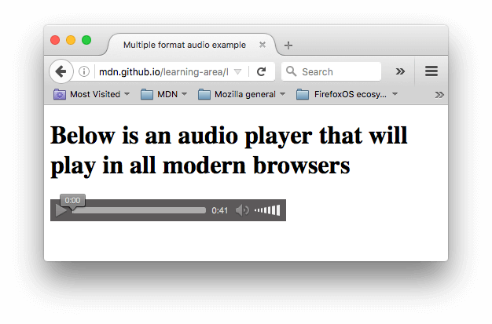

**Note**: 你可以点击这里[查看](http://mdn.github.io/learning-area/html/multimedia-and-embedding/video-and-audio-content/multiple-audio-formats.html)以上例子，或者点击[这里](https://github.com/mdn/learning-area/blob/gh-pages/html/multimedia-and-embedding/video-and-audio-content/multiple-audio-formats.html)查看源代码。

音频播放器所占用的空间比视频播放器要小，由于它没有视觉部件 — 你只需要显示出能控制音频播放的控件。一些与 HTML5 <video> 的差异如下：

- [`audio`](https://developer.mozilla.org/zh-CN/docs/Web/HTML/Element/audio) 标签不支持 width/height 属性 — 由于其并没有视觉部件，也就没有可以设置 width/height 的内容。
- 同时也不支持 poster 属性 — 同样，没有视觉部件。

除此之外，&lt;audio> 标签支持所有 &lt;video> 标签拥有的特性 — 你可以回顾上面的章节来了解更多的有关信息。

### **显示音轨文本[Section](https://developer.mozilla.org/zh-CN/docs/Learn/HTML/Multimedia_and_embedding/Video_and_audio_content#%E6%98%BE%E7%A4%BA%E9%9F%B3%E8%BD%A8%E6%96%87%E6%9C%AC)**

现在，我们将讨论一个略微先进的概念，这个概念将会十分的有用。许多人不想（或者不能）听到 Web 上的音频/视频内容，至少在某些情况下是这样的，比如：

- 许多人患有听觉障碍（通常来说是很难听清声音的人，或者聋人），所以他们不能听见音频中的声音。
- 另外的情况可能是由于人们并不能听音频，可能是因为他们在一个非常嘈杂的环境当中（比如在一个拥挤的酒吧内恰好赶上了球赛 ），也可能是由于他们并不想打扰到其他人（比如在一个十分安静的地方，例如图书馆）。
- 有一些人他们不说音频当中的语言，所以他们听不懂，因此他们想要一个副本或者是翻译来帮助他们理解媒体内容。

给那些听不懂音频语言的人们提供一个音频内容的副本岂不是一件很棒的事情吗？所以，感谢 HTML5 &lt;video> 使之成为可能，有了 [WebVTT](https://developer.mozilla.org/en-US/docs/Web/API/Web_Video_Text_Tracks_Format) 格式，你可以使用 [`track`](https://developer.mozilla.org/zh-CN/docs/Web/HTML/Element/track) 标签。

**Note**: “副本”的意思是指，用文本记录下音频的内容。

WebVTT 是一个格式，用来编写文本文件，这个文本文件包含了众多的字符串，这些字符串会带有一些元数据，它们可以用来描述这个字符串将会在视频中显示的时间，甚至可以用来描述这些字符串的样式以及定位信息。这些字符串叫做 **cues** ，你可以根据不同的需求来显示不同的样式，最常见的如下：

- subtitle

  通过添加翻译字幕，来帮助那些听不懂外国语言的人们理解音频当中的内容。

- captions

  同步翻译对白，或是描述一些有重要信息的声音，来帮助那些不能听音频的人们理解音频中的内容。

- timed descriptions

  将文字转换为音频，用于服务那些有视觉障碍的人。

一个典型的 WebVTT 文件如下：

```html
WEBVTT

1
00:00:22.230 --> 00:00:24.606
This is the first subtitle.

2
00:00:30.739 --> 00:00:34.074
This is the second.

  ...
```

让其与 HTML 媒体一起显示，你需要做如下工作：

1. 以 .vtt 后缀名保存文件。
2. 用 [`track`](https://developer.mozilla.org/zh-CN/docs/Web/HTML/Element/track) 标签链接 .vtt 文件， `<track>` 标签需放在 `<audio>` 或 `<video> 标签当中`，同时需要放在所有 &lt;source> 标签之后。使用 `kind` 属性来指明是哪一种类型，如 subtitles 、 captions 、 descriptions。然后，使用 `srclang` 来告诉浏览器你是用什么语言来编写的 subtitles。

如下:

```html
<video controls>
    <source src="example.mp4" type="video/mp4">
    <source src="example.webm" type="video/webm">
    <track kind="subtitles" src="subtitles_en.vtt" srclang="en">
</video>
```

上面这串代码会显示一段带有字幕的视频，如下：


如果你想了解更多细节，你可以阅读 [Adding captions and subtitles to HTML5 video](https://developer.mozilla.org/en-US/Apps/Build/Audio_and_video_delivery/Adding_captions_and_subtitles_to_HTML5_video)。在 Github 上你可以找到与本文相关的样例，他们由 Ian Devlin 编写，点击[这里](http://iandevlin.github.io/mdn/video-player-with-captions/)可以查看该样例，或者点击[这里](https://github.com/iandevlin/iandevlin.github.io/tree/master/mdn/video-player-with-captions)查看源代码。这个样例使用了 JavaScript 代码，它使得用户可以选择不同的字幕。注意，若想要显示字幕，你需要点击 "CC" 按钮，并且选择一种语言 — English, Deutsch, 或 Español。

**Note**: 文本轨道会使你的网站更容易被搜索引擎抓取到 （[SEO](https://developer.mozilla.org/en-US/docs/Glossary/SEO)）， 由于搜索引擎的文本抓取能力非常强大，使用文本轨道甚至可以让搜索引擎通过视频的内容直接链接。

### 实践学习：在你的网站上嵌入你自己的视频或音频。[Section](https://developer.mozilla.org/zh-CN/docs/Learn/HTML/Multimedia_and_embedding/Video_and_audio_content#%E5%AE%9E%E8%B7%B5%E5%AD%A6%E4%B9%A0%EF%BC%9A%E5%9C%A8%E4%BD%A0%E7%9A%84%E7%BD%91%E7%AB%99%E4%B8%8A%E5%B5%8C%E5%85%A5%E4%BD%A0%E8%87%AA%E5%B7%B1%E7%9A%84%E8%A7%86%E9%A2%91%E6%88%96%E9%9F%B3%E9%A2%91%E3%80%82)

在这个实践学习当中，我们希望你能够走出去，并且记录一些你自己的视频或者音频 — 如今，大多数手机都能够非常方便的记录视频或者音频，并且你可以将他们上传到你的电脑上面，你可以使用这些功能来记录你的视频或音频。在这时候，你可能需要做一些格式转换，如果是视频的话，你需要将它们转化为 WebM 或者 MP4 ，如果是音频的话，你需要将它们转化为 MP3 或者 Ogg 。 不过你并不需要担心，有许多的程序都能够帮你解决这些问题，例如 [Miro Video Converter](http://www.mirovideoconverter.com/) 和 [Audacity](https://sourceforge.net/projects/audacity/).。我们非常希望你能够亲自动手实现它。

如果你无法取得任意的音频或者视频，你可以使用我们已经为你提供的样本（[sample audio and video files](https://github.com/mdn/learning-area/tree/master/html/multimedia-and-embedding/video-and-audio-content)）。同时你也可以使用我们的代码来作为参考。

我们希望你能够：

1. 将你的音频或者视频文件保存在你电脑上的一个新目录中。
2. 创建一个新的 HTML 文件在相同的路径下，命名为 index.html。
3. 在页面上添加 &lt;audio> 和 &lt;video> 标签；并使用浏览器默认的控件来显示它们。
4. 在当中添加 &lt;source> 标签，并添加 type 属性，以便于浏览器能够找到其能够支持的格式并加载它。
5. 在 &lt;video> 标签中添加 poster 属性，这会显示在视频播放之前。

另外，你可以尝试研究一下文本音轨，试着为你的视频添加一些字幕。

### 总结[Section](https://developer.mozilla.org/zh-CN/docs/Learn/HTML/Multimedia_and_embedding/Video_and_audio_content#%E6%80%BB%E7%BB%93)

我们祝愿你可以沉浸在 Web 网站的音频和视频当中，下一篇文章，我们将会学习到另外一种在 web 页面中嵌入内容的方法，比如使用 [`iframe`](https://developer.mozilla.org/zh-CN/docs/Web/HTML/Element/iframe) 或者 [`object`](https://developer.mozilla.org/zh-CN/docs/Web/HTML/Element/object)。

### 相关资料[Section](https://developer.mozilla.org/zh-CN/docs/Learn/HTML/Multimedia_and_embedding/Video_and_audio_content#%E7%9B%B8%E5%85%B3%E8%B5%84%E6%96%99)

- [`audio`](https://developer.mozilla.org/zh-CN/docs/Web/HTML/Element/audio)
- [`video`](https://developer.mozilla.org/zh-CN/docs/Web/HTML/Element/video)
- [`source`](https://developer.mozilla.org/zh-CN/docs/Web/HTML/Element/source)
- [`track`](https://developer.mozilla.org/zh-CN/docs/Web/HTML/Element/track)
- [Adding captions and subtitles to HTML5 video](https://developer.mozilla.org/en-US/Apps/Build/Audio_and_video_delivery/Adding_captions_and_subtitles_to_HTML5_video)
- [Audio and Video delivery](https://developer.mozilla.org/en-US/docs/Web/Apps/Fundamentals/Audio_and_video_delivery):：这里面包含了许多使用 HTML 和 JavaScript 在页面中添加音频或视频的资料。
- [Audio and Video manipulation](https://developer.mozilla.org/en-US/docs/Web/Apps/Fundamentals/Audio_and_video_manipulation): 这里面包含了许多使用 JavaScript 来控制音频或视频的资料。
- Automated options to [translate multimedia](http://www.inwhatlanguage.com/blog/translate-video-audio/).

## 从对象到iframe - 其他嵌入技术

到目前为止，您应该掌握了将图像、视频和音频嵌入到网页上的诀窍了。此刻，让我们继续深入学习，来看一些能让您在网页中嵌入各种内容类型的元素： [`iframe`](https://developer.mozilla.org/zh-CN/docs/Web/HTML/Element/iframe), [`embed`](https://developer.mozilla.org/zh-CN/docs/Web/HTML/Element/embed) 和[`object`](https://developer.mozilla.org/zh-CN/docs/Web/HTML/Element/object) 元素。`<iframe>`用于嵌入其他网页，另外两个元素则允许您嵌入PDF，SVG，甚至Flash — 一种正在被淘汰的技术，但您仍然会时不时的看到它。

| 先决条件: | 基本的计算机素养，[安装的基本软件](https://developer.mozilla.org/en-US/Learn/Getting_started_with_the_web/Installing_basic_software)，[使用文件](https://developer.mozilla.org/en-US/Learn/Getting_started_with_the_web/Dealing_with_files)的基本知识，熟悉HTML基础知识（参考HTML [入门](https://developer.mozilla.org/en-US/docs/Learn/HTML/Introduction_to_HTML/Getting_started)）以及本模块中以前的文章。 |
| --------- | ------------------------------------------------------------ |
| 目的:     | 要了解如何使用`<object>、`[`embed`](https://developer.mozilla.org/en-US/docs/Web/HTML/Element/embed)以及[`iframe`](https://developer.mozilla.org/en-US/docs/Web/HTML/Element/iframe)在网页中嵌入部件，例如Flash电影或其他网页。 |

### 嵌入的简史[Section](https://developer.mozilla.org/zh-CN/docs/Learn/HTML/Multimedia_and_embedding/%E5%85%B6%E4%BB%96%E5%B5%8C%E5%85%A5%E6%8A%80%E6%9C%AF#%E5%B5%8C%E5%85%A5%E7%9A%84%E7%AE%80%E5%8F%B2)

很久以前，很流行在网络上使用**框架**创建网站 — 网站的一小部分存储于单独的HTML页面中。这些被嵌入在一个称为**框架集**的主文档中，它允许您指定每个框架能够填充在屏幕上的区域，而不像调整表格的列和行的大小。这些做法在90年代中期至90年代后期被认为是比较酷的，有证据表明，将网页分解成较小的块，这样有利于下载速度 —值得注意的是当时网络连接速度十分缓慢。然而，这些技术有很多问题，随着网络速度越来越快，这些技术带来的问题远超过它们带来的积极因素，所以你再也看不到它们被使用了。

一小段时间之后（20世纪90年代末，21世纪初），插件技术变得非常受欢迎，例如[Java Applet](https://developer.mozilla.org/en-US/docs/Glossary/Java)和[Flash](https://developer.mozilla.org/en-US/docs/Glossary/Adobe_Flash) — 这些技术允许网络开发者将丰富的内容嵌入到网页中，例如视频和动画等，这些内容不能通过HTML单独实现。嵌入这些技术是通过诸如[`object`](https://developer.mozilla.org/en-US/docs/Web/HTML/Element/object)和较少使用[`embed`](https://developer.mozilla.org/en-US/docs/Web/HTML/Element/embed)的元素来实现的，当时它们非常有用。由于许多问题，包括可访问性、安全性、文件大小等，它们已经过时了; 如今，大多数移动设备不再支持这些插件，桌面端也逐渐不再支持。

最后，[`iframe`](https://developer.mozilla.org/en-US/docs/Web/HTML/Element/iframe)元素出现了（连同其他嵌入内容的方式，如[`canvas`](https://developer.mozilla.org/en-US/docs/Web/HTML/Element/canvas)，[`video`](https://developer.mozilla.org/en-US/docs/Web/HTML/Element/video)等），它提供了一种将整个web页嵌入到另一个网页的方法，看起来就像那个web页是另一个网页的一个[`img`](https://developer.mozilla.org/zh-CN/docs/Web/HTML/Element/img)或其他元素一样。[`iframe`](https://developer.mozilla.org/zh-CN/docs/Web/HTML/Element/iframe)现在经常被使用。

了解完历史之后，让我们继续往下看以了解如何使用它们。

### 自主学习：嵌入类型的使用[Section](https://developer.mozilla.org/zh-CN/docs/Learn/HTML/Multimedia_and_embedding/%E5%85%B6%E4%BB%96%E5%B5%8C%E5%85%A5%E6%8A%80%E6%9C%AF#%E8%87%AA%E4%B8%BB%E5%AD%A6%E4%B9%A0%EF%BC%9A%E5%B5%8C%E5%85%A5%E7%B1%BB%E5%9E%8B%E7%9A%84%E4%BD%BF%E7%94%A8)

在这篇文章中，我们将直接进入自主学习部分，让你立即体会到嵌入技术的实用性。大家都非常熟悉[Youtube](https://www.youtube.com/)，但很多人不了解它所提供的一些分享功能。让我们来看看Youtube如何让我们通过[`iframe`](https://developer.mozilla.org/en-US/docs/Web/HTML/Element/iframe)在页面中嵌入喜欢的视频。

1. 首先，去Youtube找一个喜欢的视频。
2. 在视频下方，您会看到一个*共享*按钮 - 点击查看共享选项。
3. 选择“ *嵌入”*选项卡，您将得到一些`<iframe>`代码 - 复制一下。
4. 粘贴到下面的*输入*框里，看看*输出*结果是什么。

此外，您还可以试试在示例中嵌入[Google地图](https://www.google.com/maps/)：

1. 去Google地图找一个喜欢的地图。
2. 点击UI左上角的“汉堡菜单”（三条水平线）。
3. 选择*共享或嵌入地图*选项。
4. 选择嵌入地图选项，这将给你一些`<iframe>`代码 - 复制一下。
5. 粘贴到下面的*输入*框，看看*输出*结果是什么。

如果你犯了某些错误，你可以点击*Reset按钮以重置编辑器。*如果你确实被卡住了， 按下Show *solution按钮以借鉴答案。*

<iframe src="https://mdn.mozillademos.org/zh-CN/docs/Learn/HTML/Multimedia_and_embedding/%E5%85%B6%E4%BB%96%E5%B5%8C%E5%85%A5%E6%8A%80%E6%9C%AF$samples/Playable_code?revision=1396428" height="600" width="700" id="frame_Playable_code" class="live-sample-frame sample-code-frame" frameborder="0" style="font-style: normal; max-width: calc((100% - 40px) - 6px); margin: 0px; padding: 20px; border-width: 1px 1px 1px 5px; border-style: solid; border-color: rgb(61, 126, 154); border-image: initial; width: calc((100% - 40px) - 6px); color: rgb(51, 51, 51); font-family: Verdana, arial, x-locale-body, sans-serif; font-size: 16px; font-variant-ligatures: normal; font-variant-caps: normal; font-weight: 400; letter-spacing: -0.05328px; orphans: 2; text-align: start; text-indent: 0px; text-transform: none; white-space: normal; widows: 2; word-spacing: 0px; -webkit-text-stroke-width: 0px; background-color: rgb(255, 255, 255); text-decoration-style: initial; text-decoration-color: initial;"></iframe>

在 CodePen 中打开在 JSFiddle 中打开


### **Iframe详解[Section](https://developer.mozilla.org/zh-CN/docs/Learn/HTML/Multimedia_and_embedding/%E5%85%B6%E4%BB%96%E5%B5%8C%E5%85%A5%E6%8A%80%E6%9C%AF#Iframe%E8%AF%A6%E8%A7%A3)**

是不是很简单又有趣呢？[`iframe`](https://developer.mozilla.org/en-US/docs/Web/HTML/Element/iframe)元素旨在允许您将其他Web文档嵌入到当前文档中。这很适合将第三方内容纳入您的网站，您可能无法直接控制，也不希望实现自己的版本 - 例如来自在线视频提供商的视频，[Disqus](https://disqus.com/)等评论系统，在线地图提供商，广告横幅等。您通过本课程使用的实时可编辑示例就是使用`<iframe>` 实现的。

我们会在后面提到，关于`<iframe>`有一些严重的[安全隐患](https://developer.mozilla.org/zh-CN/docs/Learn/HTML/Multimedia_and_embedding/%E5%85%B6%E4%BB%96%E5%B5%8C%E5%85%A5%E6%8A%80%E6%9C%AF#%E5%AE%89%E5%85%A8%E9%9A%90%E6%82%A3)需要考虑，但这并不意味着你不应该在你的网站上使用它们 — 它只需要一些知识和仔细地思考。让我们更详细地探索这些代码。假设您想在其中一个网页上加入MDN词汇表，您可以尝试以下方式：

```html
<iframe src="https://developer.mozilla.org/en-US/docs/Glossary"
        width="100%" height="500" frameborder="0"
        allowfullscreen sandbox>
  <p> <a href="https://developer.mozilla.org/en-US/docs/Glossary">
    Fallback link for browsers that don't support iframes
  </a> </p>
</iframe>
```

此示例包括使用以下所需的`<iframe>`基本要素：

- `allowfullscreen`

  如果设置，`<iframe>`则可以通过[全屏API](https://developer.mozilla.org/en-US/docs/Web/Apps/Fundamentals/User_notifications/Full_screen_api)设置为全屏模式（稍微超出本文的范围）。

- `frameborder`

  如果设置为1，则会告诉浏览器在此框架和其他框架之间绘制边框，这是默认行为。0删除边框。不推荐这样设置，因为在[CSS中](https://developer.mozilla.org/en-US/docs/Glossary/CSS)可以更好地实现相同的效果。[`border`](https://developer.mozilla.org/en-US/docs/Web/CSS/border)`: none;`

- `src`

  该属性与[`<video>`](https://developer.mozilla.org/en-US/docs/Web/HTML/Element/video)/``一样包含指向要嵌入文档的URL路径。

- `width` 和 `height`

  这些属性指定您想要的iframe的宽度和高度。

- 备选内容

  与[``](https://developer.mozilla.org/en-US/docs/Web/HTML/Element/video)等其他类似元素相同，您可以在`<iframe></iframe>`标签之间包含备选内容，如果浏览器不支持`<iframe>`，将会显示备选内容，这种情况下，我们已经添加了一个到该页面的链接。现在您几乎不可能遇到任何不支持`<iframe>`的浏览器。

- `sandbox`

  该属性需要在已经支持其他`<iframe>`功能（例如IE 10及更高版本）但稍微更现代的浏览器上才能工作，该属性可以提高安全性设置; 我们将在下一节中更加详细地谈到。

**注意**：为了提高速度，在主内容完成加载后，使用JavaScript设置iframe的`src`属性是个好主意。这使您的页面可以更快地被使用，并减少您的官方页面加载时间（重要的[SEO](https://developer.mozilla.org/en-US/docs/Glossary/SEO)指标）。

### 安全隐患[Section](https://developer.mozilla.org/zh-CN/docs/Learn/HTML/Multimedia_and_embedding/%E5%85%B6%E4%BB%96%E5%B5%8C%E5%85%A5%E6%8A%80%E6%9C%AF#%E5%AE%89%E5%85%A8%E9%9A%90%E6%82%A3)

以上我们提到了安全问题 - 现在我们来详细介绍一下这一点。我们并不期望您第一次就能完全理解所有内容; 我们只想让您意识到这一问题，在您更有经验并开始考虑在您的实验和工作中使用`<iframe>`时为你提供参考。此外，没有必要害怕和不使用`<iframe>`—你只需要谨慎一点。继续看下去吧...

浏览器制造商和Web开发人员了解到网络上的坏人（通常被称为**黑客**，或更准确地说是**破解者**），如果他们试图恶意修改您的网页或欺骗人们进行不想做的事情时常通过iframe作为共同目标来攻击（官方术语：**攻击向量**），例如显示用户名和密码等敏感信息。因此，规范工程师和浏览器开发人员已经开发了各种安全机制，使`<iframe>`更加安全，这有些最佳方案值得我们考虑 - 我们将在下面介绍其中的一些。

[单击劫持](https://en.wikipedia.org/wiki/Clickjacking)是一种常见的iframe攻击，黑客将隐藏的iframe嵌入到您的文档中（或将您的文档嵌入到他们自己的恶意网站），并使用它来捕获用户的交互。这是误导用户或窃取敏感数据的常见方式。

一个快速的例子 — 尝试在浏览器中加载上面的例子 - 你也可以[在Github上找到它](http://mdn.github.io/learning-area/html/multimedia-and-embedding/other-embedding-technologies/iframe-detail.html)（[参见源代码](https://github.com/mdn/learning-area/blob/gh-pages/html/multimedia-and-embedding/other-embedding-technologies/iframe-detail.html)）。你将不会看到任何内容，但如果你点击[浏览器开发者工具](https://developer.mozilla.org/en-US/docs/Learn/Common_questions/What_are_browser_developer_tools)中的*控制台*，你会看到一条消息，告诉你为什么没有显示内容。在Firefox中，您会*被告知：“X-Frame-Options拒绝加载https://developer.mozilla.org/en-US/docs/Glossary”*。这是因为构建MDN的开发人员已经在网站页面的服务器上设置了一个不允许被嵌入到`<iframe>`的设置（请参阅[配置CSP指令](https://developer.mozilla.org/zh-CN/docs/Learn/HTML/Multimedia_and_embedding/Other_embedding_technologies#%E9%85%8D%E7%BD%AECSP%E6%8C%87%E4%BB%A4)）这是有必要的 — 整个MDN页面被嵌入在其他页面中没有多大意义，除非您想要将其嵌入到您的网站上并将其声称为自己的内容，或尝试通过单击劫持来窃取数据，这都是非常糟糕的事情。此外，如果每个人都这样做，所有额外的带宽将花费Mozilla很多资金。

#### 只有在必要时嵌入

有时嵌入第三方内容（例如YouTube视频和地图）是有意义的，但如果您只在完全需要时嵌入第三方内容，您可以省去很多麻烦。网络安全的一个很好的经验法则是*“你怎么谨慎都不为过，如果你决定要做这件事，多检查一遍；如果是别人做的，在被证明是安全的之前，都假设这是危险的。”*

除了安全问题，你还应该意识到知识产权问题。无论在线内容还是离线内容，绝大部分内容都是有版权的，甚至是一些你没想到有版权的内容（例如，[Wikimedia Commons](https://commons.wikimedia.org/wiki/Main_Page)上的大多数图片）。不要在网页上展示一些不属于你的内容，除非你是所有者或所有者给了你明确的、书面的许可。对于侵犯版权的惩罚是严厉的。再说一次，你再小心也不为过。

如果内容获得许可，你必须遵守许可条款。例如，MDN上的内容是[在CC-BY-SA下许可的](https://developer.mozilla.org/zh-CN/docs/MDN/About#%E7%89%88%E6%9D%83%E5%92%8C%E8%AE%B8%E5%8F%AF)，这意味着，如果你要引用我们的内容，就必须[用适当的方式注明来源](https://wiki.creativecommons.org/wiki/Best_practices_for_attribution)，即使你对内容做了实质性的修改。

#### 使用 HTTPS

[HTTPS](https://developer.mozilla.org/en-US/docs/Glossary/HTTPS)是[HTTP](https://developer.mozilla.org/en-US/docs/Glossary/HTTP)的加密版本。您应该尽可能使用HTTPS为您的网站提供服务：

1. HTTPS减少了远程内容在传输过程中被篡改的机会，
2. HTTPS防止嵌入式内容访问您的父文档中的内容，反之亦然。

使用HTTPS需要一个安全证书，这可能是昂贵的（尽管[Let's Encrypt](https://letsencrypt.org/)让这件事变得更容易），如果你没有，可以使用HTTP来为你的父文档提供服务。但是，由于HTTPS的第二个好处，*无论成本如何，您绝对不能使用HTTP嵌入第三方内容*（在最好的情况下，您的用户的Web浏览器会给他们一个可怕的警告）。所有有声望的公司，例如Google Maps或Youtube，当您嵌入内容时，`<iframe>`将通过HTTPS提供 - 查看`<iframe>` `src`属性内的URL。

**注意**：[Github页面](https://developer.mozilla.org/en-US/docs/Learn/Common_questions/Using_Github_pages)允许默认情况下通过HTTPS提供内容，因此对托管内容很有用。如果您正在使用不同的托管，并且不确定，请向您的托管服务商询问。

#### 始终使用`sandbox`属性

你想给攻击者尽可能少的机会在你的网站上做坏事，那么你应该只给嵌入式内容*工作所需的权限。*当然，这也适用于你自己的内容。一个代码可以适当使用或用于测试的容器，但不能对其他代码库（意外或恶意）造成任何损害称为[沙盒](https://en.wikipedia.org/wiki/Sandbox_(computer_security))。

未沙盒化(Unsandboxed)内容可以做得太多（执行JavaScript，提交表单，弹出窗口等）默认情况下，您应该使用没有参数的`sandbox`属性来强制执行所有可用的限制，如我们前面的示例所示。

如果绝对需要，您可以逐个添加权限（`sandbox=""`属性值内） - 请参阅`sandbox`所有可用选项的参考条目。其中重要的一点是，你*永远不*应该同时添加`allow-scripts`和`allow-same-origin`到你的`sandbox`属性中-在这种情况下，嵌入的内容可以绕过，从执行脚本停止网站同源安全策略，并使用JavaScript来关闭完全沙盒。

**注意**：如果攻击者可以直接（外部`iframe`）愚弄人们访问恶意内容，Sandboxing不提供任何保护。如果某些内容有可能是恶意的（例如，用户生成的内容），请将其从不同的[域服务](https://developer.mozilla.org/en-US/docs/Glossary/domain)到您的主要网站。

#### 配置CSP指令

[CSP](https://developer.mozilla.org/en-US/docs/Glossary/CSP)代表**内容安全策略**，它提供[一组HTTP标头](https://developer.mozilla.org/en-US/docs/Web/Security/CSP/CSP_policy_directives)（由web服务器发送时与元数据一起发送的元数据），旨在提高HTML文档的安全性。在`<iframe>`s安全性方面，您可以*将服务器配置为发送适当的X-Frame-Options  标题。*这样做可以防止其他网站在其网页中嵌入您的内容（这将导致[点击](https://en.wikipedia.org/wiki/clickjacking)和一系列其他攻击），正如我们之前看到的那样，MDN开发人员已经做了这些工作。

**注意**：您可以阅读Frederik Braun的帖子[在X-Frame-Options安全性头上](https://blog.mozilla.org/security/2013/12/12/on-the-x-frame-options-security-header/)来获取有关此主题的更多背景信息。显然，在这篇文章中已经解释得很清楚了。

### &lt;**embed>和&lt;object>元素[Section](https://developer.mozilla.org/zh-CN/docs/Learn/HTML/Multimedia_and_embedding/%E5%85%B6%E4%BB%96%E5%B5%8C%E5%85%A5%E6%8A%80%E6%9C%AF#%3Cembed%3E%E5%92%8C%3Cobject%3E%E5%85%83%E7%B4%A0)**

[`<embed>`](https://developer.mozilla.org/en-US/docs/Web/HTML/Element/embed)和`<object>`元素的功能不同于`<iframe>`—— 这些元素是用来嵌入多种类型的外部内容的通用嵌入工具，其中包括像Java小程序和Flash，PDF（可在浏览器中显示为一个PDF插件）这样的插件技术，甚至像视频，SVG和图像的内容！

**注意**：**插件**是一种对浏览器原生无法读取的内容提供访问权限的软件。

然而，您不太可能使用这些元素 - Applet几年来一直没有被使用；由于许多原因，Flash不再受欢迎（见下面的[插件案例](https://developer.mozilla.org/zh-CN/docs/Learn/HTML/Multimedia_and_embedding/Other_embedding_technologies#The_case_against_plugins)）；PDF更倾向于被链接而不是被嵌入；其他内容，如图像和视频都有更优秀、更容易元素来处理。插件和这些嵌入方法真的是一种传统技术，我们提及它们主要是为了以防您在某些情况下遇到问题，比如内部网或企业项目等。

如果您发现自己需要嵌入插件内容，那么您至少需要一些这样的信息：

|                                                              | [`embed`](https://developer.mozilla.org/zh-CN/docs/Web/HTML/Element/embed) | [`object`](https://developer.mozilla.org/zh-CN/docs/Web/HTML/Element/object) |
| ------------------------------------------------------------ | ------------------------------------------------------------ | ------------------------------------------------------------ |
| 嵌入内容的[网址](https://developer.mozilla.org/en-US/docs/Glossary/URL) | `src`                                                        | `data`                                                       |
| 嵌入内容的*准确*[媒体类型](https://developer.mozilla.org/en-US/docs/Glossary/MIME_type) | `type`                                                       | `type`                                                       |
| 由插件控制的框的高度和宽度（以CSS像素为单位）                | `height` `width`                                             | `height` `width`                                             |
| 名称和值，将插件作为参数提供                                 | 具有这些名称和值的ad hoc属性                                 | 单标签[``](https://developer.mozilla.org/en-US/docs/Web/HTML/Element/param)元素，包含在内`<object>` |
| 独立的HTML内容作为不可用资源的回退                           | 不支持（`<noembed>`已过时）                                  | 包含在元素`<object>`之后`<param>`                            |

**注意**：`<object>`需要`data`属性，`type`属性或两者。如果您同时使用这两个，您也可以使用该`typemustmatch`属性（仅在Firefox中实现，在本文中）。`typemustmatch`保持嵌入文件不运行，除非`type`属性提供正确的媒体类型。`typemustmatch`因此，当您嵌入来自不同[来源的](https://developer.mozilla.org/en-US/docs/Glossary/origin)内容（可以防止攻击者通过插件运行任意脚本）时，可以赋予重要的安全优势。

下面是一个使用该[`embed`](https://developer.mozilla.org/en-US/docs/Web/HTML/Element/embed)元素嵌入Flash影片的示例（请参阅此处的[Github](http://mdn.github.io/learning-area/html/multimedia-and-embedding/other-embedding-technologies/embed-flash.html)，并[检查源代码](https://github.com/mdn/learning-area/blob/gh-pages/html/multimedia-and-embedding/other-embedding-technologies/embed-flash.html)）：

```html
<embed src="whoosh.swf" quality="medium"
       bgcolor="#ffffff" width="550" height="400"
       name="whoosh" align="middle" allowScriptAccess="sameDomain"
       allowFullScreen="false" type="application/x-shockwave-flash"
       pluginspage="http://www.macromedia.com/go/getflashplayer">
```

很可怕，不是吗 。Adobe Flash工具生成的HTML往往更糟糕，使用嵌入`<object>`元素的`<embed>`元素来覆盖所有的基础（查看一个例子）。甚至有一段时间，Flash被成功地用作HTML5视频的备用内容，但是这种情况越来越被认为是不必要的。

现在来看一个`<object>`将PDF嵌入一个页面的例子（参见[实例](http://mdn.github.io/learning-area/html/multimedia-and-embedding/other-embedding-technologies/object-pdf.html)和[源代码](https://github.com/mdn/learning-area/blob/gh-pages/html/multimedia-and-embedding/other-embedding-technologies/object-pdf.html)）：

```html
<object data="mypdf.pdf" type="application/pdf"
        width="800" height="1200" typemustmatch>
  <p>You don't have a PDF plugin, but you can <a href="myfile.pdf">download the PDF file.</a></p>
</object>
```

PDF是纸与数据之间重要的阶梯，但它们[在可访问性上有些问题](http://webaim.org/techniques/acrobat/acrobat)[，](http://webaim.org/techniques/acrobat/acrobat)并且可能难以在小屏幕上阅读。它们在一些圈子中仍然受欢迎，我们最好是用链接指向它们，而不是将其嵌入到网页中，以便它们可以在单独的页面上被下载或被阅读。

### 针对插件的情况[Section](https://developer.mozilla.org/zh-CN/docs/Learn/HTML/Multimedia_and_embedding/%E5%85%B6%E4%BB%96%E5%B5%8C%E5%85%A5%E6%8A%80%E6%9C%AF#%E9%92%88%E5%AF%B9%E6%8F%92%E4%BB%B6%E7%9A%84%E6%83%85%E5%86%B5)

以前，插件在网络上是不可或缺的。还记得你必须安装Adobe Flash Player才能在线观看电影的日子吗？并且你还会不断地收到关于更新Flash Player和Java运行环境的烦人警报。Web技术已经变得更加强大，那些日子已经结束了。对于大多数应用程序，现在是停止依赖插件传播内容，开始利用Web技术的时候了。

- **扩大你对大家的影响力。**每个人都有一个浏览器，但插件越来越少，特别是在移动用户中。由于Web在很大程度上不需要依赖插件而运行，所以人们宁愿只是去竞争对手的网站而不是安装插件。
- **从Flash和其他插件附带的额外的可访问性问题中摆脱。**
- **避免额外的安全隐患。**即使经过无数次补丁[，](http://www.cvedetails.com/product/6761/Adobe-Flash-Player.html?vendor_id=53) Adobe Flash也是[非常不安全的](http://www.cvedetails.com/product/6761/Adobe-Flash-Player.html?vendor_id=53)。2015年，Facebook的首席安全官Alex Stamos甚至[要求Adobe停止Flash。](http://www.theverge.com/2015/7/13/8948459/adobe-flash-insecure-says-facebook-cso)

那你该怎么办？如果您需要交互性，HTML和[JavaScript](https://developer.mozilla.org/en-US/docs/Glossary/JavaScript)可以轻松地为您完成工作，而不需要Java小程序或过时的ActiveX / BHO技术。您可以使用[HTML5视频](https://developer.mozilla.org/en-US/docs/Learn/HTML/Howto/Add_audio_or_video_content_to_a_webpage)来满足媒体需求，矢量图形[SVG](https://developer.mozilla.org/en-US/docs/Learn/HTML/Howto/Add_vector_image_to_a_webpage)，以及复杂图像和动画[画布](https://developer.mozilla.org/en-US/docs/Web/API/Canvas_API/Tutorial)。[彼得·埃尔斯特（Peter Elst）几年前已经提到](https://plus.google.com/+PeterElst/posts/P5t4pFhptvp)，对于工作Adobe Flash极少是正确的工具，除了专门的游戏和商业应用。对于ActiveX，即使微软的[Edge](https://developer.mozilla.org/en-US/docs/Glossary/Microsoft_Edge)浏览器也不再支持。

### **概要[Section](https://developer.mozilla.org/zh-CN/docs/Learn/HTML/Multimedia_and_embedding/%E5%85%B6%E4%BB%96%E5%B5%8C%E5%85%A5%E6%8A%80%E6%9C%AF#%E6%A6%82%E8%A6%81)**

在Web文档中嵌入其他内容这一主题可以很快变得非常复杂，因此在本文中，我们尝试以一种简单而熟悉的方式来介绍它，这种介绍方式将立即显示出相关性，同时仍暗示了一些涉及更高级功能的技术。刚开始，除了嵌入第三方内容（如地图和视频），您不太可能在网页上使用到嵌入技术。当你变得更有经验时，你可能会开始为他们找到更多的用途。

除了我们在这里讨论的那些外，还有许多涉及嵌入外部内容的技术。我们看到了一些在前面的文章中出现的，如[`<video>`](https://developer.mozilla.org/en-US/docs/Web/HTML/Element/video)，[`<audio>`](https://developer.mozilla.org/en-US/docs/Web/HTML/Element/audio)和[``](https://developer.mozilla.org/en-US/docs/Web/HTML/Element/img)，但还有其它的有待关注，如  [`<canvas>`](https://developer.mozilla.org/en-US/docs/Web/HTML/Element/canvas)用于JavaScript生成的2D和3D图形，`<svg>`用于嵌入矢量图形。我们将在此学习模块的下一篇文章中学习[SVG](https://developer.mozilla.org/en-US/docs/Web/SVG)。

## 在网页中添加矢量图形


  矢量图形在很多情况下非常有用 — 它们拥有较小的文件尺寸，却高度可缩放，所以它们不会在镜头拉近或者放大图像时像素化。在这篇文章中，我们将为您呈现如何在网页中添加矢量图形。

| 前提： | 你需要了解 [HTML的基本知识](https://developer.mozilla.org/en-US/docs/Learn/HTML/Introduction_to_HTML) 并且知道如何 [在你的文档中插入图片](https://developer.mozilla.org/en-US/docs/Learn/HTML/Multimedia_and_embedding/Images_in_HTML). |
| ------ | ------------------------------------------------------------ |
| 目标： | 了解如何嵌入 SVG (矢量) 图形到网页中。                       |

**提示：** 本文的目的并不是教你 SVG；仅仅是告诉你它是什么，以及如何在网页中添加它。

### **什么是矢量图形？[Section](https://developer.mozilla.org/zh-CN/docs/Learn/HTML/Multimedia_and_embedding/Adding_vector_graphics_to_the_Web#%E4%BB%80%E4%B9%88%E6%98%AF%E7%9F%A2%E9%87%8F%E5%9B%BE%E5%BD%A2%EF%BC%9F)**

在网上，你会和两种类型的图片打交道 — 位图和矢量图:

- 位图使用像素网格来定义 — 一个位图文件精确得包含了每个像素的位置和它的色彩信息。流行的位图格式包括 Bitmap (`.bmp`), PNG (`.png`), JPEG (`.jpg`), and GIF (`.gif`.)
- 矢量图使用算法来定义 — 一个矢量图文件包含了图形和路径的定义，电脑可以根据这些定义计算出当它们在屏幕上渲染时应该呈现的样子。 [SVG](https://developer.mozilla.org/en-US/docs/Glossary/SVG) 格式可以让我们创造用于 Web 的精彩的矢量图形。

为了让你清楚的认识到两者的区别，我们来一个例子。你可以在我们的 Github 仓库中在线查看这个例子：[vector-versus-raster.html](http://mdn.github.io/learning-area/html/multimedia-and-embedding/adding-vector-graphics-to-the-web/vector-versus-raster.html) — 它并排展示了两个看起来一致的图像，一个红色的五角星以及黑色的阴影。不同的是，左边的是 PNG，而右边的是 SVG 图像。

当你放大网页的时候，区别就会变得明显起来 — 随着你的放大，PNG 图片变得像素化了，因为它存储是每个像素的颜色和位置信息 — 当它被放大时，每个像素就被放大以填满屏幕上更多的像素，所以图像就会开始变得马赛克感觉。矢量图像看起来仍然效果很好且清晰，因为无论它的尺寸如何，都使用算法来计算出图像的形状，仅仅是根据放大的倍数来调整算法中的值。


**注意**: 上面的图片实际上都是 PNG 图片 —— 每个例子中左边的图片代表光栅图片，右边的星星代表矢量图。还有，访问 [vector-versus-raster.html](http://mdn.github.io/learning-area/html/multimedia-and-embedding/adding-vector-graphics-to-the-web/vector-versus-raster.html) 示例来查看真正的例子！

此外，矢量图形相较于同样的位图，通常拥有更小的体积，因为它们仅需储存少量的算法，而不是逐个储存每个像素的信息。

### SVG是什么？[Section](https://developer.mozilla.org/zh-CN/docs/Learn/HTML/Multimedia_and_embedding/Adding_vector_graphics_to_the_Web#SVG%E6%98%AF%E4%BB%80%E4%B9%88%EF%BC%9F)

[SVG](https://developer.mozilla.org/zh-CN/docs/Web/SVG) 是用于描述矢量图像的[XML](https://developer.mozilla.org/en-US/docs/Glossary/XML)语言。 它基本上是像HTML一样的标记，除了你有许多不同的元素来定义你想要出现在图像中的形状，以及你想要应用于这些形状的效果。 SVG用于标记图形，而不是内容。 非常简单，你有一些元素来创建简单图形，如[`<circle>`](https://developer.mozilla.org/zh-CN/docs/Web/SVG/Element/circle) 和[`<rect>`](https://developer.mozilla.org/zh-CN/docs/Web/SVG/Element/rect)。更高级的SVG功能包括 [`<feColorMatrix>`](https://developer.mozilla.org/zh-CN/docs/Web/SVG/Element/feColorMatrix)（使用变换矩阵转换颜色）[`<animate>`](https://developer.mozilla.org/zh-CN/docs/Web/SVG/Element/animate) （矢量图形的动画部分）和 [`<mask>`](https://developer.mozilla.org/zh-CN/docs/Web/SVG/Element/mask)（在图像顶部应用蒙版）

作为一个简单的例子，以下代码创建一个圆和一个矩形：

```html
<svg version="1.1"
     baseProfile="full"
     width="300" height="200"
     xmlns="http://www.w3.org/2000/svg">
  <rect width="100%" height="100%" fill="black" />
  <circle cx="150" cy="100" r="90" fill="blue" />
</svg>
```

这将创建以下输出：

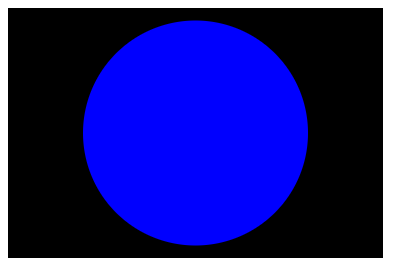

从上面的例子可以看出，SVG很容易手工编码。 是的，您可以在文本编辑器中手动编写简单的SVG，但是对于复杂的图像，这很快就开始变得非常困难。 为了创建SVG图像，大多数人使用矢量图形编辑器，如 [Inkscape](https://inkscape.org/en/) 或 [Illustrator](https://en.wikipedia.org/wiki/Adobe_Illustrator)。 这些软件包允许您使用各种图形工具创建各种插图，并创建照片的近似值（例如Inkscape的跟踪位图功能）。

SVG除了迄今为止所描述的以外还有其他优点：

- 矢量图像中的文本仍然可访问（这也有利于 [SEO](https://developer.mozilla.org/en-US/docs/Glossary/SEO))）。
- SVG 可以很好地适应样式/脚本，因为图像的每个组件都是可以通过CSS或通过JavaScript编写的样式的元素。

那么为什么会有人想使用光栅图形而不是SVG？ 其实 SVG 确实有一些缺点：

- SVG非常容易变得复杂，这意味着文件大小会增加; 复杂的SVG也会在浏览器中占用很长的处理时间。
- SVG可能比栅格图像更难创建，具体取决于您尝试创建哪种图像。
- 旧版浏览器不支持SVG，因此如果您需要在网站上支持旧版本的 IE，则可能不适合（SVG从IE9开始得到支持）。

由于上述原因，光栅图形更适合照片那样复杂精密的图像。

**注意：**在Inkscape中，将文件保存为纯SVG以节省空间。 另请参阅[如何为Web准备SVG](http://tavmjong.free.fr/INKSCAPE/MANUAL/html/Web-Inkscape.html)。

### **将SVG添加到页面[Section](https://developer.mozilla.org/zh-CN/docs/Learn/HTML/Multimedia_and_embedding/Adding_vector_graphics_to_the_Web#%E5%B0%86SVG%E6%B7%BB%E5%8A%A0%E5%88%B0%E9%A1%B5%E9%9D%A2)**

在本节中，我们将介绍将SVG矢量图形添加到网页的不同方式。

**快捷方式：[``](https://developer.mozilla.org/zh-CN/docs/Web/HTML/Element/img)[Section](https://developer.mozilla.org/zh-CN/docs/Learn/HTML/Multimedia_and_embedding/Adding_vector_graphics_to_the_Web#%E5%BF%AB%E6%8D%B7%E6%96%B9%E5%BC%8F%EF%BC%9A%3Cimg%3E)**

要通过 [``](https://developer.mozilla.org/zh-CN/docs/Web/HTML/Element/img)元素嵌入SVG，你只需要按照预期的方式在 src 属性中引用它。你将需要一个`height`或`width`属性（或者如果您的SVG没有固有的宽高比）。如果还没有这样做，请阅读[HTML中的图片](https://developer.mozilla.org/zh-CN/docs/Learn/HTML/Multimedia_and_embedding/Images_in_HTML) 。

```html

```

**优点**

- 快速，熟悉的图像语法与`alt`属性中提供的内置文本等效。
- 可以通过在[`<a>`](https://developer.mozilla.org/zh-CN/docs/Web/HTML/Element/a)元素嵌套``，使图像轻松地成为超链接。

**缺点**

- 无法使用JavaScript操作图像。
- 如果要使用CSS控制SVG内容，则必须在SVG代码中包含内联CSS样式。 （从SVG文件调用的外部样式表不起作用）
- 不能用CSS伪类来重设图像样式（如`:focus`）。

### 疑难解答和跨浏览器支持[Section](https://developer.mozilla.org/zh-CN/docs/Learn/HTML/Multimedia_and_embedding/Adding_vector_graphics_to_the_Web#%E7%96%91%E9%9A%BE%E8%A7%A3%E7%AD%94%E5%92%8C%E8%B7%A8%E6%B5%8F%E8%A7%88%E5%99%A8%E6%94%AF%E6%8C%81)

对于不支持SVG（IE 8及更低版本，Android 2.3及更低版本）的浏览器，您可以从`src`属性引用PNG或JPG，并使用`srcset`属性 只有最近的浏览器才能识别）来引用SVG。 在这种情况下，仅支持浏览器将加载SVG - 较旧的浏览器将加载PNG：

```html

```

您还可以使用SVG作为CSS背景图像，如下所示。 在下面的代码中，旧版浏览器会坚持他们理解的PNG，而较新的浏览器将加载SVG：

```
background: url("fallback.png") no-repeat center;
background-image: url("image.svg");
background-size: contain;
```

像上面描述的``方法一样，使用 CSS 背景图像插入SVG 意味着它不能被 JavaScript 操作，并且也受到相同的 CSS 限制。

如果 SVG 根本没有显示，可能是因为你的服务器设置不正确。 如果是这个问题，[这篇文章](https://developer.mozilla.org/zh-CN/docs/Web/SVG/Tutorial/Getting_Started#A_Word_on_Webservers)将告诉你正确方向。

### 如何在HTML中引入SVG代码[Section](https://developer.mozilla.org/zh-CN/docs/Learn/HTML/Multimedia_and_embedding/Adding_vector_graphics_to_the_Web#%E5%A6%82%E4%BD%95%E5%9C%A8HTML%E4%B8%AD%E5%BC%95%E5%85%A5SVG%E4%BB%A3%E7%A0%81)


你还可以在文本编辑器中打开SVG文件，复制SVG代码，并将其粘贴到HTML文档中 - 这有时称为将**SVG内联**或**内联SVG**。确保您的SVG代码在`<svg></svg>`标签中（不要在外面添加任何内容）。这是一个非常简单的示例，您可以粘贴到文档中：

```html
<svg width="300" height="200">
    <rect width="100%" height="100%" fill="green" />
</svg>
```

**优点**

- 将 SVG 内联减少 HTTP 请求，可以减少加载时间。
- 您可以为 SVG 元素分配`class`和`id`，并使用 CSS 修改样式，无论是在SVG中，还是 HTML 文档中的 CSS 样式规则。 实际上，您可以使用任何 [SVG外观属性](https://developer.mozilla.org/zh-CN/docs/Web/SVG/Attribute#Presentation_attributes) 作为CSS属性。
- 内联SVG是唯一可以让您在SVG图像上使用CSS交互（如`:focus`）和CSS动画的方法（即使在常规样式表中）。
- 您可以通过将 SVG 标记包在[`<a>`](https://developer.mozilla.org/zh-CN/docs/Web/HTML/Element/a)元素中，使其成为超链接。

**缺点**

- 这种方法只适用于在一个地方使用的SVG。多次使用会导致资源密集型维护（resource-intensive maintenance）。
- 额外的 SVG 代码会增加HTML文件的大小。
- 浏览器不能像缓存普通图片一样缓存内联SVG。
- 您可能会在[`<foreignObject>`](https://developer.mozilla.org/zh-CN/docs/Web/SVG/Element/foreignObject) 元素中包含回退，但支持 SVG 的浏览器仍然会下载任何后备图像。你需要考虑仅仅为支持过时的浏览器，而增加额外开销是否真的值得。


### 如何使用 [`<iframe>`](https://developer.mozilla.org/zh-CN/docs/Web/HTML/Element/iframe) 嵌入SVG[Section](https://developer.mozilla.org/zh-CN/docs/Learn/HTML/Multimedia_and_embedding/Adding_vector_graphics_to_the_Web#%E5%A6%82%E4%BD%95%E4%BD%BF%E7%94%A8_%3Ciframe%3E_%E5%B5%8C%E5%85%A5SVG)

您可以在浏览器中打开 SVG 图像，就像网页一样。 因此，使用`<iframe>`嵌入 SVG 文档就像我们在 [从对象到iframe - 其他嵌入技术](https://developer.mozilla.org/zh-CN/docs/Learn/HTML/Multimedia_and_embedding/%E5%85%B6%E4%BB%96%E5%B5%8C%E5%85%A5%E6%8A%80%E6%9C%AF) 中进行研究一样。

这是一个快速回顾：

```html
<iframe src="triangle.svg" width="500" height="500" sandbox>
    
</iframe>
```

这绝对不是最好的方法：

**缺点**

- 如你所知， `iframe`有一个回退机制，如果浏览器不支持`iframe`，则只会显示回退。
- 此外，除非 SVG 和您当前的网页具有相同的 [origin](https://developer.mozilla.org/en-US/docs/Glossary/origin)，否则你不能在主页面上使用 JavaScript 来操纵 SVG。

### 动手学习：使用SVG[Section](https://developer.mozilla.org/zh-CN/docs/Learn/HTML/Multimedia_and_embedding/Adding_vector_graphics_to_the_Web#%E5%8A%A8%E6%89%8B%E5%AD%A6%E4%B9%A0%EF%BC%9A%E4%BD%BF%E7%94%A8SVG)

在这个动手学习部分中，我们希望你能够体验一下 SVG 的乐趣。 在下面的“input”部分，您将看到我们已经提供了一些样例来开始使用。 您还可以访问 [SVG元素参考](https://developer.mozilla.org/zh-CN/docs/Web/SVG/Element)，了解更多关于SVG可以使用的其他玩具的细节，也可以尝试一下。 这部分都是为了锻炼你的研究技巧，并且有一些乐趣。

如果你卡住了，无法使你的代码工作，你可以随时使用 Reset 按钮进行重置。


### 总结[Section](https://developer.mozilla.org/zh-CN/docs/Learn/HTML/Multimedia_and_embedding/Adding_vector_graphics_to_the_Web#%E6%80%BB%E7%BB%93)

本文提供了一个矢量图形和 SVG 的快速浏览，让你了解他们的作用，以及如何在网页中引入 SVG。 它从来没有打算成为学习 SVG 的完整教程，只是一个指南，让你在网上遇到 SVG 时知道它是什么。 所以不要觉得你不是一个 SVG 专家而担心。如果你想了解更多关于它的工作原理，我们在下面列出了一些可能会帮助您的信息。

在本模块的最后一篇文章中，我们将详细探索响应式图像，查看 HTML 可以让您的图像在不同设备上更好地适配。

### 相关链接[Section](https://developer.mozilla.org/zh-CN/docs/Learn/HTML/Multimedia_and_embedding/Adding_vector_graphics_to_the_Web#%E7%9B%B8%E5%85%B3%E9%93%BE%E6%8E%A5)

- [SVG tutorial](https://developer.mozilla.org/en-US/docs/Web/SVG/Tutorial/Getting_Started) on MDN
- [Quick tips for responsive SVGs](http://thenewcode.com/744/Making-SVG-Responsive)
- [Sara Soueidan's tutorial on responsive SVG images](http://tympanus.net/codrops/2014/08/19/making-svgs-responsive-with-css/)
- [Accessibility benefits of SVG](http://www.w3.org/TR/SVG-access/)
- [How to scale SVGs ](https://css-tricks.com/scale-svg/) （它不像光栅图形那么简单！）

##   响应式图片

在这篇文章中我们将学习关于响应式图片——一种可以在不同的屏幕尺寸和分辨率的设备上都能良好工作以及其他特性的图片，并且看看HTML提供了什么工具来帮助实现它们。响应式图片仅仅只是响应式web设计的一部分（奠定了响应式web设计的良好基础），我们会在未来的[CSS topic](https://developer.mozilla.org/en-US/docs/Learn/CSS)模块中学到更多关于这一主题的知识。

| 学习本章节的前提: | 你应该已经了解了 [HTML的基础](https://developer.mozilla.org/zh-CN/docs/Learn/HTML/Introduction_to_HTML) 以及如何 [在网站上添加静态图片](https://developer.mozilla.org/zh-CN/docs/Learn/HTML/Multimedia_and_embedding/Images_in_HTML). |
| ----------------- | ------------------------------------------------------------ |
| 目的:             | 学习如何使用 `srcset` 以及 [`<picture>`](https://developer.mozilla.org/zh-CN/docs/Web/HTML/Element/picture) 元素，来实现网页中的响应式图片处理方法。 |

### 为什么要用自适应的图片？[Section](https://developer.mozilla.org/zh-CN/docs/Learn/HTML/Multimedia_and_embedding/Responsive_images#%E4%B8%BA%E4%BB%80%E4%B9%88%E8%A6%81%E7%94%A8%E8%87%AA%E9%80%82%E5%BA%94%E7%9A%84%E5%9B%BE%E7%89%87%EF%BC%9F)

让我们来看一个典型的场景。一个典型的网站可能会有一张页首图片，这让访问者看起来感到愉快。图片下面可能会添加一些内容图像。页首图像的跨度可能是整个页首的宽度。而内容图像会适应内容纵列的某处。此处有个简单的例子：


这个网页在宽屏设备上表现良好，例如笔记本电脑或台式机（你可以[查看在线演示](http://mdn.github.io/learning-area/html/multimedia-and-embedding/responsive-images/not-responsive.html)并且在GitHub上查看[源代码](https://github.com/mdn/learning-area/blob/master/html/multimedia-and-embedding/responsive-images/not-responsive.html)）。我们不会在这一节课中讨论CSS，除了下面提到的那些：

- 正文内容被设置的最大宽度为1200像素——在高于该宽度的视口中，正文保持在1200像素，并将其本身置于可用空间的中间。在该宽度以下的视口中，正文将保持在视口宽度的100%。
- 页眉图像被设置为使其中心始终位于页眉的中心，无论页眉的宽度是多少。所以如果网站被显示在窄屏上，图片中心的重要细节（里面的人）仍然可以看到，而两边超出的部分都消失了。它的高度是200px。
- 内容图片已经被设置为如果body元素比图像更小，图像就开始缩小，这样图像总是在正文里，而不是溢出正文。

然而，当你尝试在一个狭小的屏幕设备上查看本页面时，问题就会产生。网页的页眉看起来还可以，但是页眉这张图片占据了屏幕的一大部分的高度，在这个尺寸下，你在第一张图片的内容里很难看到人。


一个改进的方法是，当网站在狭窄的屏幕上观看时，显示一幅图片的包含了重要细节的裁剪版本，第二个被裁剪的图片会在像平板电脑这样的中等宽度的屏幕设备上显示，这就是众所周知的**艺术方向问题（art direction problem）**。

另外，如果是在小屏手机屏幕上显示网页，那么没有必要在网页上嵌入这样大的图片。这被称之为**分辨率切换问题（resolution switching problem）**—一张位图被设置为固定像素的宽和高。当我们看[矢量图形](https://developer.mozilla.org/en-US/docs/Learn/HTML/Multimedia_and_embedding/Adding_vector_graphics_to_the_Web)时，一张较小的位图看来会有颗粒感，如果位图显示的尺寸大于原始尺寸（然而矢量图不会这样）。

相反，没有必要在比图片实际尺寸小的屏幕上显示一张大图，这样做会浪费带宽——当可以在设备上使用小图像时，手机用户尤其不愿意因为下载用于桌面的大图像而浪费带宽。理想的情况是当访问网站时依靠不同的设备来提供不同的分辨率图片和不同尺寸的图片。

让事情变得复杂的是，有些设备有很高的分辨率，为了显示的更出色，可能需要超出你预料的更大的图像。这从本质上是一样的问题，但在环境上有一些不同。

你可能会认为矢量图形能解决这些问题，在某种程度上是这样的——它们无论是文件大小还是比例都合适，无论在哪里你都应该尽可能的使用它们。然而，它们并不适合所有的图片类型，虽然在简单图形、图案、界面元素等方面较好，但如果是有大量的细节的照片，创建矢量图像会变得非常复杂。像JPEG格式这样的位图会更适合上面例子中的图像。

当web第一次出现时，这样的问题并不存在，在上世纪90年代中期，仅仅可以通过笔记本电脑和台式机来浏览web页面，所以浏览器开发者和规范制定者甚至没有想到要实现这种解决方式（响应式开发）。最近应用的响应式图像技术，通过让浏览器提供多个图像文件来解决上述问题，比如使用相同显示效果的图片但包含多个不同的分辨率（分辨率切换），或者使用不同的图片以适应不同的空间分配（艺术方向）。

**注意**: 在这篇文章中讨论的新特性 — `srcset`/`sizes`/[`<picture>`](https://developer.mozilla.org/zh-CN/docs/Web/HTML/Element/picture) — 都已经被新版本的现代浏览器和移动浏览器所支持（包括Edge，而不是IE）。

### **怎样创建自适应的图片?[Section](https://developer.mozilla.org/zh-CN/docs/Learn/HTML/Multimedia_and_embedding/Responsive_images#%E6%80%8E%E6%A0%B7%E5%88%9B%E5%BB%BA%E8%87%AA%E9%80%82%E5%BA%94%E7%9A%84%E5%9B%BE%E7%89%87)**

在这一部分中，我们将看看上面说明的两个问题，并且展示怎样用HTML的响应式图片来解决这些问题。需要注意的是，如以上示例所示，在本节中我们将专注于HTML的 [``](https://developer.mozilla.org/zh-CN/docs/Web/HTML/Element/img)，但网站页眉的图片仅是装饰性的，实际上应该要用CSS的背景图片来实现。[CSS是比HTML更好的响应式设计的工具](http://blog.cloudfour.com/responsive-images-101-part-8-css-images/)，我们会在未来的CSS模块中讨论。

### **分辨率切换：不同的尺寸[Section](https://developer.mozilla.org/zh-CN/docs/Learn/HTML/Multimedia_and_embedding/Responsive_images#%E5%88%86%E8%BE%A8%E7%8E%87%E5%88%87%E6%8D%A2%EF%BC%9A%E4%B8%8D%E5%90%8C%E7%9A%84%E5%B0%BA%E5%AF%B8)**

那么，我们想要用分辨率切换解决什么问题呢？我们想要显示相同的图片内容，仅仅依据设备来显示更大或更小的图片——这是我们在示例中使用第二个内容图像的情况。标准的[``](https://developer.mozilla.org/zh-CN/docs/Web/HTML/Element/img)元素传统上仅仅让你给浏览器指定唯一的资源文件。

```html

```

我们可以使用两个新的属性——`srcset` 和 `sizes`——来提供更多额外的资源图像和提示，帮助浏览器选择正确的一个资源。你可以看到 [reponsive.html](http://mdn.github.io/learning-area/html/multimedia-and-embedding/responsive-images/responsive.html) 的例子，也可以在GitHub上看到[source code](https://github.com/mdn/learning-area/blob/master/html/multimedia-and-embedding/responsive-images/responsive.html)：

```html

```

`srcset`和`sizes`属性看起来很复杂，但是如果你按照上图所示进行格式化，那么他们并不是很难理解，每一行有不同的属性值。每个值都包含逗号分隔的列表。列表的每一部分由三个子部分组成。让我们来看看现在的每一个内容：

**srcset**定义了我们允许浏览器选择的图像集，以及每个图像的大小。在每个逗号之前，我们写：

1. 一个**文件名** (`elva-fairy-480w.jpg`.)
2. 一个空格
3. **图像的固有宽度**（以像素为单位）（480w）——注意到这里使用`w`单位，而不是你预计的`px`。这是图像的真实大小，可以通过检查你电脑上的图片文件找到（例如，在Mac上，你可以在Finder上选择这个图像，然后按 Cmd + I 来显示信息）。

**sizes**`定义了一组媒体条件（例如屏幕宽度）并且指明当某些媒体条件为真时，什么样的图片尺寸是最佳选择—我们在之前已经讨论了一些提示。在这种情况下，在每个逗号之前，我们写：

1. 一个**媒体条件**（`(max-width:480px)`）——你会在 [CSS topic](https://developer.mozilla.org/en-US/docs/Learn/CSS)中学到更多的。但是现在我们仅仅讨论的是媒体条件描述了屏幕可能处于的状态。在这里，我们说“当视窗的宽度是480像素或更少”。
2. 一个空格
3. 当媒体条件为真时，图像将填充的**槽的宽度**（`440px`）

**注意**: 对于槽的宽度，你也许会提供一个固定值 (`px`, `em`) 或者是一个相对于视口的长度(`vw`)，但不是百分比。你也许以及注意到最后一个槽的宽度是没有媒体条件的，它是默认的，当没有任何一个媒体条件为真时，它就会生效。 当浏览器成功匹配第一个媒体条件的时候，剩下所有的东西都会被忽略，所以要注意媒体条件的顺序。

所以，有了这些属性，浏览器会：

1. 查看设备宽度
2. 检查`sizes`列表中哪个媒体条件是第一个为真
3. 查看给予该媒体查询的槽大小
4. 加载`srcset`列表中引用的最接近所选的槽大小的图像

就是这样！所以在这里，如果支持浏览器以视窗宽度为480px来加载页面，那么`(max-width: 480px)`的媒体条件为真，因此`440px`的槽会被选择，所以`elva-fairy-480w.jpg`将加载，因为它的的固定宽度（`480w`）最接近于`440px`。800px的照片大小为128KB而480px版本仅有63KB大小—节省了65KB。现在想象一下，如果这是一个有很多图片的页面。使用这种技术会节省移动端用户的大量带宽。

老旧的浏览器不支持这些特性，它会忽略这些特征。并继续正常加载 `src`属性引用的图像文件。

**注意**: 在 HTML 文件中的 [`<head>`](https://developer.mozilla.org/zh-CN/docs/Web/HTML/Element/head) 标签里， 你将会找到这一行代码 `<meta name="viewport" content="width=device-width">`: 这行代码会强制地让手机浏览器采用它们真实视图的宽度来加载网页（有些手机浏览器会提供不真实的视图宽度, 然后加载比浏览器真实视图的宽度大的宽度的网页，然后再缩小加载的页面，这样的做法对响应式图片或其他设计，没有任何帮助。我们会在未来的模块教给你更多关于这方面的知识）。

### 一些有用的开发工具[Section](https://developer.mozilla.org/zh-CN/docs/Learn/HTML/Multimedia_and_embedding/Responsive_images#%E4%B8%80%E4%BA%9B%E6%9C%89%E7%94%A8%E7%9A%84%E5%BC%80%E5%8F%91%E5%B7%A5%E5%85%B7)

这里有一些在浏览器中的非常实用的[开发者工具](https://developer.mozilla.org/en-US/docs/Learn/Common_questions/What_are_browser_developer_tools)用来帮助制定重要的槽宽度，以及其他你可能会用到的场景。当我在设置槽宽度的时候，我先加载了示例中的无响应的版本（`not-responsive.html`），然后进入 [响应设计视图](https://developer.mozilla.org/en-US/docs/Tools/Responsive_Design_Mode) （*Tools > Web Developer > Responsive Design View），*这个工具允许你在不同设备的屏幕宽度场景下查看网页的布局。

我设置我的视图宽度为 320px，然后再改为 480px；每一次宽度的改变我就进入 [DOM 检查 ](https://developer.mozilla.org/en-US/docs/Tools/Page_Inspector)，点击我们感兴趣的 [``](https://developer.mozilla.org/zh-CN/docs/Web/HTML/Element/img) 元素，然后在显示屏右侧的 Box Model 视图选项卡中查看它的大小。 你应该会看到，这种无响应式的做法会让你的图片在不同屏幕宽度下有着固定的宽度。


接着, 你可以检查 `srcset` 是否正常工作，你需要将视图的宽度设置为你想要的，(比如，把宽度设置的比较小，让页面看起来比较狭窄），打开网络检查（*Tools > Web Developer > Network），*然后重新加载页面。网络检查工具会给你一个列表，里面的文件都是已经被下载来构造网页的。然后你可以在这里看到哪个图像文件被下载了。

**注意**: 在 Chrome 中测试时，通过如下方式禁用缓存：打开 DevTools ，并选中下 Settings > Preferences > Network 的选择框。否则，Chrome 会优先选择缓存图片而不是恰好适配的那个。


### 分辨率切换: 相同的尺寸, 不同的分辨率[Section](https://developer.mozilla.org/zh-CN/docs/Learn/HTML/Multimedia_and_embedding/Responsive_images#%E5%88%86%E8%BE%A8%E7%8E%87%E5%88%87%E6%8D%A2_%E7%9B%B8%E5%90%8C%E7%9A%84%E5%B0%BA%E5%AF%B8_%E4%B8%8D%E5%90%8C%E7%9A%84%E5%88%86%E8%BE%A8%E7%8E%87)

如果你支持多种分辨率显示，但希望每个人在屏幕上看到的图片的实际尺寸是相同的，你可以让浏览器通过`srcset`和x语法结合——一种更简单的语法——而不用`sizes`，来选择适当分辨率的图片。你可以看一个例子 [srcset-resolutions.html](http://mdn.github.io/learning-area/html/multimedia-and-embedding/responsive-images/srcset-resolutions.html)（或 [the source code](https://github.com/mdn/learning-area/blob/master/html/multimedia-and-embedding/responsive-images/srcset-resolutions.html)）：

```html

```

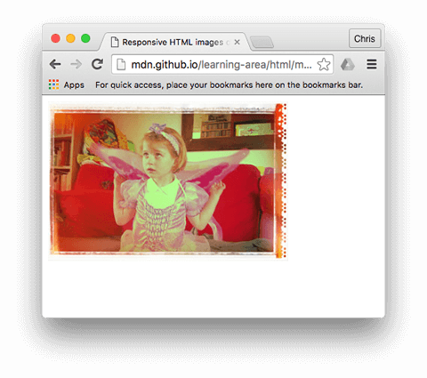

在这个例子中，下面的CSS会应用在图片上，所以它的宽度在屏幕上是320像素（也称作CSS像素）：

```css
img {
  width: 320px;
}
```

在这种情况下，`sizes`并不需要——浏览器只是计算出正在显示的显示器的分辨率，然后提供`srcset`引用的最适合的图像。因此，如果访问页面的设备具有标准/低分辨率显示，一个设备像素表示一个CSS像素，`elva-fairy-320w.jpg`会被加载（1x 是默认值，所以你不需要写出来）。如果设备有高分辨率，两个或更多的设备像素表示一个CSS像素，`elva-fairy-640w.jpg` 会被加载。640px的图像大小为93KB，320px的图像的大小仅仅有39KB。

### 艺术方向[Section](https://developer.mozilla.org/zh-CN/docs/Learn/HTML/Multimedia_and_embedding/Responsive_images#%E8%89%BA%E6%9C%AF%E6%96%B9%E5%90%91)

回顾一下，**艺术方向问题**涉及要更改显示的图像以适应不同的图像显示尺寸。例如，如果在桌面浏览器上的一个网站上显示一张大的、横向的照片，照片中央有个人，然后当在移动端浏览器上浏览这个网站时，照片会缩小，这时照片上的人会变得非常小，看起来会很糟糕。这种情况可能在移动端显示一个更小的肖像图会更好，这样人物的大小看起来更合适。[``](https://developer.mozilla.org/zh-CN/docs/Web/HTML/Element/picture)元素允许我们这样实现。

回到我们最初的例子 [not-responsive.html](http://mdn.github.io/learning-area/html/multimedia-and-embedding/responsive-images/not-responsive.html) ，我们有一张图片需要艺术方向：

```html

```

让我们改用 [`<picture>`](https://developer.mozilla.org/zh-CN/docs/Web/HTML/Element/picture)！就像[`<video>`和`<audio>`](https://developer.mozilla.org/en-US/docs/Learn/HTML/Multimedia_and_embedding/Video_and_audio_content)，[`<picture>`](https://developer.mozilla.org/zh-CN/docs/Web/HTML/Element/picture)素包含了一些[`<source>`](https://developer.mozilla.org/zh-CN/docs/Web/HTML/Element/source)元素，它使浏览器在不同资源间做出选择，紧跟着的是最重要的[``](https://developer.mozilla.org/zh-CN/docs/Web/HTML/Element/img)元素。[responsive.html](http://mdn.github.io/learning-area/html/multimedia-and-embedding/responsive-images/responsive.html)的代码如下：

```html
<picture>
  <source media="(max-width: 799px)" srcset="elva-480w-close-portrait.jpg">
  <source media="(min-width: 800px)" srcset="elva-800w.jpg">
  
</picture>
```

-  `<source>`元素包含一个`media`属性，这一属性包含一个媒体条件——就像第一个`srcset`例子，这些条件来决定哪张图片会显示——第一个条件返回真，那么就会显示这张图片。在这种情况下，如果视窗的宽度为799px或更少，第一个`<source>`元素的图片就会显示。如果视窗的宽度是800px或更大，就显示第二张图片。
- `srcset`属性包含要显示图片的路径。请注意，正如我们在``上面看到的那样，`<source>`可以使用引用多个图像的`srcset`属性，还有`sizes`属性。所以你可以通过一个 `<picture>`元素提供多个图片，不过也可以给每个图片提供多分辨率的图片。实际上，你可能不想经常做这样的事情。
- 在任何情况下，你都必须在 `</picture>`之前正确提供一个``元素以及它的`src`和`alt`属性，否则不会有图片显示。当媒体条件都不返回真的时候（你可以在这个例子中删除第二个`<source>` 元素），它会提供图片；如果浏览器不支持 `<picture>`元素时，它可以作为后备方案。

这样的代码允许我们在宽屏和窄屏上都能显示合适的图片，像下面展示的一样：

.png)


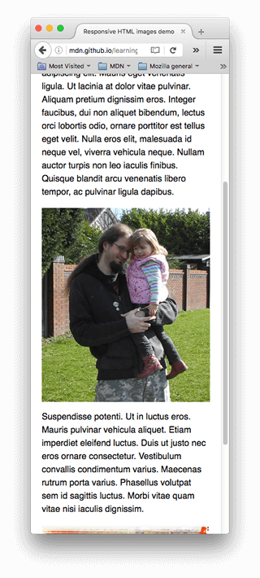

**注意**: 你应该仅仅当在艺术方向场景下使用media属性；当你使用media时，不要在sizes属性中也提供媒体条件。

**为什么我们不能使用 CSS 或 JavaScript 来做到这一效果?[Section](https://developer.mozilla.org/zh-CN/docs/Learn/HTML/Multimedia_and_embedding/Responsive_images#%E4%B8%BA%E4%BB%80%E4%B9%88%E6%88%91%E4%BB%AC%E4%B8%8D%E8%83%BD%E4%BD%BF%E7%94%A8_CSS_%E6%88%96_JavaScript_%E6%9D%A5%E5%81%9A%E5%88%B0%E8%BF%99%E4%B8%80%E6%95%88%E6%9E%9C)**

当浏览器开始加载一个页面, 它会先下载 (预加载) 任意的图片，这是发生在主解析器开始加载和解析页面的 CSS 和 JavaScript 之前的。这是一个非常有用的技巧，平均来说，页面加载的时间少了 20%。但是, 这对响应式图片一点帮助都没有, 所以需要实现类似 `srcset`的方法。因为你不能先加载好 [``](https://developer.mozilla.org/zh-CN/docs/Web/HTML/Element/img) 元素后, 再用 JavaScript 检测视图的宽度，如果觉得大小不合适，就动态地加载小的图片替换已经加载好的图片，这样的话, 原始的图像已经被加载了, 然后你也加载了小的图像, 这样的做法对于响应式图像的理念来说，是很糟糕的。


### 大胆的使用现代图像格式[Section](https://developer.mozilla.org/zh-CN/docs/Learn/HTML/Multimedia_and_embedding/Responsive_images#%E5%A4%A7%E8%83%86%E7%9A%84%E4%BD%BF%E7%94%A8%E7%8E%B0%E4%BB%A3%E5%9B%BE%E5%83%8F%E6%A0%BC%E5%BC%8F)

有很多令人激动的新图像格式（例如WebP和JPEG-2000）可以在有高质量的同时有较低的文件大小。然而，浏览器对其的支持参差不齐。

`<picture>`让我们能继续满足老式浏览器的需要。你可以在`type`属性中提供MIME类型，这样浏览器就能立即拒绝其不支持的文件类型：

```html
<picture>
  <source type="image/svg+xml" srcset="pyramid.svg">
  <source type="image/webp" srcset="pyramid.webp"> 
  
</picture>
```

- 不要使用`media`属性，除非你也需要艺术方向。
- 在`<source>` 元素中，你只可以引用在`type`中声明的文件类型。
- 像之前一样，如果必要，你可以在`srcset`和`sizes`中使用逗号分割的列表。

### 主动学习：实现属于你的响应式图像[Section](https://developer.mozilla.org/zh-CN/docs/Learn/HTML/Multimedia_and_embedding/Responsive_images#%E4%B8%BB%E5%8A%A8%E5%AD%A6%E4%B9%A0%EF%BC%9A%E5%AE%9E%E7%8E%B0%E5%B1%9E%E4%BA%8E%E4%BD%A0%E7%9A%84%E5%93%8D%E5%BA%94%E5%BC%8F%E5%9B%BE%E5%83%8F)

在这次主动学习中，我们希望你变得勇敢和自力更生……我们希望你把自己拍摄的艺术截图，通过 `<picture>`来实现在窄屏幕和宽屏幕下的显示，以及使用 `srcset`切换不同的分辨率。

1. 写一些简单 HTML 来包含你的代码（如果你喜欢，也可以使用 `not-responsive.html` 作为起点）。
2. 找一张漂亮的宽屏风景图像，其中需要包含一些细节。使用图像编辑器创建一个网页大小的版本。然后裁剪一下，显示一个更小的部分，其中包含放大的细节, 然后创建第二张图片 (差不多 480px 宽度比较好。)
3. 使用 `<picture>` 元素来实现艺术图片切换器！
4. 创建不同大小的多张图片, 每个图片的图像都是一样的。
5. 使用 `srcset`/`size` 来创建一个分辨率切换器示例, 可以在不同的分辨率的情况下，提供相同尺寸的图像, 或者在不同的视图大小的情况下，提供不同尺寸大小的图像。

**注意**: 使用浏览器开发工具来帮助你工作时可以得到你需要的视图大小，就像上文提到的。

### 小结[Section](https://developer.mozilla.org/zh-CN/docs/Learn/HTML/Multimedia_and_embedding/Responsive_images#%E5%B0%8F%E7%BB%93)

这章节中充满了响应式图像 — 我们希望你学习新技术的过程是享受的。概括来说，有两个不同的问题，文章中我们一直在讨论：

- **艺术方向**：当你想为不同布局提供不同剪裁的图片——比如在桌面布局上显示完整的、横向图片，而在手机布局上显示一张剪裁过的、突出重点的纵向图片，可以用 [`<picture>`](https://developer.mozilla.org/zh-CN/docs/Web/HTML/Element/picture)元素来实现。
- **分辨率切换**：当你想要为窄屏提供更小的图片时，因为小屏幕不需要像桌面端显示那么大的图片；以及你想为高/低分辨率屏幕提供不同分辨率的图片时，都可以通过 [vector graphics](https://developer.mozilla.org/en-US/docs/Learn/HTML/Multimedia_and_embedding/Adding_vector_graphics_to_the_Web) (SVG images)、 `srcset` 以及 `sizes` 属性来实现。

此时整个[Multimedia and embedding](https://developer.mozilla.org/en-US/docs/Learn/HTML/Multimedia_and_embedding) 模块接近尾声！在继续下一个模块之前，你现在唯一要做的就是尝试我们的多媒体评估，看看你做得怎样。玩的开心。

### 参阅[Section](https://developer.mozilla.org/zh-CN/docs/Learn/HTML/Multimedia_and_embedding/Responsive_images#%E5%8F%82%E9%98%85)

- [Jason Grigsby对响应式图片的出色介绍](http://blog.cloudfour.com/responsive-images-101-definitions)
- [R响应式图片：如果你只是在改变分辨率，就用srcset](https://css-tricks.com/responsive-images-youre-just-changing-resolutions-use-srcset/) — 包含了更多关于浏览器如何选择显示图片的解释
- [``](https://developer.mozilla.org/zh-CN/docs/Web/HTML/Element/img)
- [`<picture>`](https://developer.mozilla.org/zh-CN/docs/Web/HTML/Element/picture)
- [`<source>`](https://developer.mozilla.org/zh-CN/docs/Web/HTML/Element/source)


##   Mozilla醒目页面

在这个测验中，我们将测试你对于本模块文章所讨论的技术的掌握程度，让你将一些有关于 Mozilla 的图片和视频添加到一个漂亮的页面上！

| 学习本章节的要求: | 在开始这个测验之前，你应该了解了 [Multimedia and embedding](https://developer.mozilla.org/zh-CN/docs/Learn/HTML/Multimedia_and_embedding) 模块的其他文章. |
| ----------------- | ------------------------------------------------------------ |
| 目的:             | 测试这些知识的掌握程度：在页面中嵌入图片和视频，框架，和 HTML 响应式图片技术。 |

### 起点[Section](https://developer.mozilla.org/zh-CN/docs/Learn/HTML/Multimedia_and_embedding/Mozilla_splash_page#%E8%B5%B7%E7%82%B9)

为了开始这次测验，你需要从[mdn-splash-page-start](https://github.com/mdn/learning-area/blob/master/html/multimedia-and-embedding/mdn-splash-page-start/)这个GitHub目录下下载HTML和图片。在你本地设备上新建一个 `index.html` 文件，并将  [index.html](https://github.com/mdn/learning-area/blob/master/html/multimedia-and-embedding/mdn-splash-page-start/index.html) 的内容复制到进去。 然后把 [pattern.png](https://github.com/mdn/learning-area/blob/master/html/multimedia-and-embedding/mdn-splash-page-start/pattern.png) 保存在同一目录下（右键图片有下载选项）。

访问 [originals](https://github.com/mdn/learning-area/tree/master/html/multimedia-and-embedding/mdn-splash-page-start/originals) 文件夹中不同的图片文件，然后用同样的方法将它们下载到本地。现在，你需要将这些图片文件保存到不同的目录下，因为在这些图片准备好被使用之前，你需要使用图像编辑器来处理这些图片.

**注意**: 这个示例的 HTML 文件包含一些页面的 CSS 样式。你不需要去碰 CSS 的内容，而只是 [``](https://developer.mozilla.org/zh-CN/docs/Web/HTML/Element/body) 元素中的 HTML 部分，只要你插入了正确的标记，样式就会正确显示。

### **项目概要[Section](https://developer.mozilla.org/zh-CN/docs/Learn/HTML/Multimedia_and_embedding/Mozilla_splash_page#%E9%A1%B9%E7%9B%AE%E6%A6%82%E8%A6%81)**

在这个测验中，我们为你呈现了一个接近完成了的 Mozilla醒目页面，旨在说明一些关于Mozilla的有趣的事情，以及提供一些更一步的资源链接。但目前还没有添加任何视频或图片，这份工作就交给你了！你需要添加一些图片、视频等多媒体元素，好让页面变得更漂亮和更有意义。下一小节详细描述了你需要做的工作：

### 准备图片[Section](https://developer.mozilla.org/zh-CN/docs/Learn/HTML/Multimedia_and_embedding/Mozilla_splash_page#%E5%87%86%E5%A4%87%E5%9B%BE%E7%89%87)

使用你最爱的图片编辑器，创建下面几张图片的 400px 宽的版本和 120px 宽的版本：

- `firefox_logo-only_RGB.png`
- `firefox-addons.jpg`
- `mozilla-dinosaur-head.png`

给它们取个有意义的名字，例如`firefoxlogo400.png` 和`firefoxlogo120.png`。

这些图片将和 `mdn.svg` 一起作为`further-info`区内资源链接的图标和网站页眉的火狐图标。将这些图片副本保存在与 `index.html`文件的同一个目录下。 

接着，创建一个 1200px 宽的 `red-panda.jpg`风景图片版本，和一个 600px 宽的肖像版本，用来显示更近镜头下的熊猫. 同样地，为它们取一个你可以轻松分辨出来的名字. 将它们的副本保存在与 `index.html`文件相同的目录下。

**注意**：你应该在看起来还行的前提下尽量优化 JPG 和 PNG 图片的大小，[tinypng.com](https://tinypng.com/)为此提供了很好的服务。

### 为 header 添加一个图标[Section](https://developer.mozilla.org/zh-CN/docs/Learn/HTML/Multimedia_and_embedding/Mozilla_splash_page#%E4%B8%BA_header_%E6%B7%BB%E5%8A%A0%E4%B8%80%E4%B8%AA%E5%9B%BE%E6%A0%87)

在 [`<header>`](https://developer.mozilla.org/zh-CN/docs/Web/HTML/Element/header) 元素中添加一个 [``](https://developer.mozilla.org/zh-CN/docs/Web/HTML/Element/img) 元素，嵌入一个小尺寸版本的火狐图标。

### 为主 article 添加一个视频[Section](https://developer.mozilla.org/zh-CN/docs/Learn/HTML/Multimedia_and_embedding/Mozilla_splash_page#%E4%B8%BA%E4%B8%BB_article_%E6%B7%BB%E5%8A%A0%E4%B8%80%E4%B8%AA%E8%A7%86%E9%A2%91)

就在 [`<article>`](https://developer.mozilla.org/zh-CN/docs/Web/HTML/Element/article) 元素中（开放标签下面），嵌入一个YouTube视频（<https://www.youtube.com/watch?v=ojcNcvb1olg>），使用合适YouTube工具来生成所需的代码。视频的宽度应该是 400px。

### 为 further info 的链接添加响应式图片[Section](https://developer.mozilla.org/zh-CN/docs/Learn/HTML/Multimedia_and_embedding/Mozilla_splash_page#%E4%B8%BA_further_info_%E7%9A%84%E9%93%BE%E6%8E%A5%E6%B7%BB%E5%8A%A0%E5%93%8D%E5%BA%94%E5%BC%8F%E5%9B%BE%E7%89%87)

在`further-info`类的 [`<div>`](https://developer.mozilla.org/zh-CN/docs/Web/HTML/Element/div)里你会看到四个 [`<a>`](https://developer.mozilla.org/zh-CN/docs/Web/HTML/Element/a) 元素，每个都指向一个有趣的、关于 Mozilla 的页面。为了完成这一部分，你需要在每个[`<a>`](https://developer.mozilla.org/zh-CN/docs/Web/HTML/Element/a) 元素里插入一个 [``](https://developer.mozilla.org/zh-CN/docs/Web/HTML/Element/img) 元素，需要包含合适的 `src`，`alt`，`srcset` 和 `sizes` 属性。

我们希望每张图片（除了某个本身就是响应式的）在浏览器的视口的宽度小于等于480px时使用的120px宽的图片，其他情况下选择400px 的版本.

确保正确的链接匹配了正确的图片！

**注意**: 为了正确的测试 `srcset`/`sizes` 示例，你需要把你的网站上传到服务器（使用 [Github pages](https://developer.mozilla.org/en-US/docs/Learn/Common_questions/Using_Github_pages) 是一个简单免费的方法），访问服务器上的网页，你就可以使用浏览器开发者工具来测试它们是否正常工作，如 [响应式图片：有用的开发工具](https://developer.mozilla.org/zh-CN/Learn/HTML/Multimedia_and_embedding/Responsive_images#Useful_developer_tools)中所说

### 一个艺术方向性的红色熊猫[Section](https://developer.mozilla.org/zh-CN/docs/Learn/HTML/Multimedia_and_embedding/Mozilla_splash_page#%E4%B8%80%E4%B8%AA%E8%89%BA%E6%9C%AF%E6%96%B9%E5%90%91%E6%80%A7%E7%9A%84%E7%BA%A2%E8%89%B2%E7%86%8A%E7%8C%AB)

在`red-panda`类的[`<div>`](https://developer.mozilla.org/zh-CN/docs/Web/HTML/Element/div) 中，我们希望插入一个[`<picture>`](https://developer.mozilla.org/zh-CN/docs/Web/HTML/Element/picture)元素`，在视口宽度小于等于600px时使用那张比较小的纵向的熊猫图片，在其他情况下则使用大的横向的图片。

### 示例[Section](https://developer.mozilla.org/zh-CN/docs/Learn/HTML/Multimedia_and_embedding/Mozilla_splash_page#%E7%A4%BA%E4%BE%8B)

下面的截图展示了在正确标记后，醒目页面在宽屏和窄屏下的样子。


### 评估[Section](https://developer.mozilla.org/zh-CN/docs/Learn/HTML/Multimedia_and_embedding/Mozilla_splash_page#%E8%AF%84%E4%BC%B0)

如果这个评估是一系列课程的一部分，你应该可以让你的老师或导师为你批改。 如果你是自学，可以很容易地在 [discussion thread about this exercise](https://discourse.mozilla.org/t/mozilla-splash-page-assignment/24679)或[Mozilla IRC](https://wiki.mozilla.org/IRC)的[#mdn](irc://irc.mozilla.org/mdn) IRC频道回复得到批改指南。请先自己试着做——作弊学不到任何东西！

 

### 在这个模块中[Section](https://developer.mozilla.org/zh-CN/docs/Learn/HTML/Multimedia_and_embedding/Responsive_images#%E5%9C%A8%E8%BF%99%E4%B8%AA%E6%A8%A1%E5%9D%97%E4%B8%AD)

- [HTML中的图片](https://developer.mozilla.org/zh-CN/docs/Learn/HTML/Multimedia_and_embedding/Images_in_HTML)
- [音视频内容](https://developer.mozilla.org/zh-CN/docs/Learn/HTML/Multimedia_and_embedding/Video_and_audio_content)
- [从<object> 到 <iframe>— 其他嵌入技术](https://developer.mozilla.org/zh-CN/docs/Learn/HTML/Multimedia_and_embedding/Other_embedding_technologies)
- [给网页添加矢量图](https://developer.mozilla.org/zh-CN/docs/Learn/HTML/Multimedia_and_embedding/Adding_vector_graphics_to_the_Web)
- [响应式图片](https://developer.mozilla.org/zh-CN/docs/Learn/HTML/Multimedia_and_embedding/Responsive_images)
- [Mozilla醒目页面](https://developer.mozilla.org/zh-CN/docs/Learn/HTML/Multimedia_and_embedding/Mozilla_splash_page)


# HTML 表格

##   HTML 表格概述

在HTML中一个很普通的任务是构建表格数据，有大量的元素和属性是来满足这种需求的。只需要一点儿的CSS来设定风格，HTML让在web上显示表格数据变的很容易，例如你的学校的教学计划，你当地的游泳馆的时刻表， 或者是关于你最爱的恐龙或足球队的统计数据。这个模块会教给你所有你需要知道的关于用HTML构建表格数据的知识。

### 先决条件[Section](https://developer.mozilla.org/zh-CN/docs/Learn/HTML/Tables#%E5%85%88%E5%86%B3%E6%9D%A1%E4%BB%B6)

在你开始这一模块之前，你需要已经了解了HTML的基础知识——看[Introduction to HTML](https://developer.mozilla.org/zh-CN/docs/Learn/HTML/Introduction_to_HTML).

**Note**: 如果你是在计算机/平板电脑等其他你无法创建文件的设备上的话，你可以尝试在在线代码编辑平台上运行代码例如 [JSBin](http://jsbin.com/) 或 [Thimble](https://thimble.mozilla.org/).

### 向导[Section](https://developer.mozilla.org/zh-CN/docs/Learn/HTML/Tables#%E5%90%91%E5%AF%BC)

本模块包含以下的文章

- [HTML 表格基础](https://developer.mozilla.org/zh-CN/docs/Learn/HTML/Tables/Basics)

  本文将帮助你学习如何使用 HTML 格式，包括如行、列、表头、跨列的行或跨行的列等基本特性，以及如何将多行进行分组进行样式化。

- [HTML 表格高级功能与可访问性](https://developer.mozilla.org/zh-CN/docs/Learn/HTML/Tables/Advanced)

  在本模块第二篇文章中，我们将了解一些 HTML 表格的高级功能 —— 比如表名称/表摘要，因为可访问性的原因，将表格内容划分为表头、主体以及脚部等章节。

### 练习[Section](https://developer.mozilla.org/zh-CN/docs/Learn/HTML/Tables#%E7%BB%83%E4%B9%A0)

- [构造行星的数据结构](https://developer.mozilla.org/zh-CN/docs/Learn/HTML/Tables/Structuring_planet_data)

  在表格的练习中，我们向你提供了一些在我们太阳系的行星的数据，不妨你把它构造成一个HTML的表格吧。

## HTML 表格基础

本文将从HTML表格开始，介绍一些基本的内容，如行和单元格、标题、使单元格跨越多个列和行，以及如何将列中的所有单元组合在一起进行样式化。

| 前置知识: | HTML基本概念 (参见 [Introduction to HTML](https://developer.mozilla.org/en-US/docs/Learn/HTML/Introduction_to_HTML))。 |
| --------- | ------------------------------------------------------------ |
| 目标:     | 了解熟悉HTML表格基本知识。                                   |

### 什么是表格？[Section](https://developer.mozilla.org/zh-CN/docs/Learn/HTML/Tables/Basics#%E4%BB%80%E4%B9%88%E6%98%AF%E8%A1%A8%E6%A0%BC%EF%BC%9F)

表格是由行和列组成的结构化数据集(表格数据)，它能够使你简捷迅速地查找某个表示不同类型数据之间的某种关系的值 。比如说，某个人和他的年龄，一天或是一周，当地游泳池的时间表 。


表格在人类社会中很常见，而且已经存在很长时间了，下面这张1800年的美国人口普查文件中就可以证明：

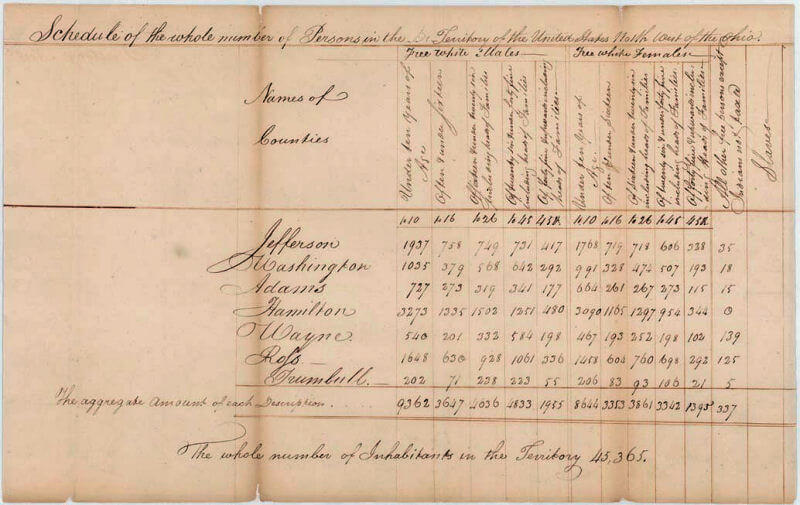

因此，HTML的创建者们提供了一种方法来构建和呈现web上的表格数据，这也就不足为奇了。

### 表格如何工作？[Section](https://developer.mozilla.org/zh-CN/docs/Learn/HTML/Tables/Basics#%E8%A1%A8%E6%A0%BC%E5%A6%82%E4%BD%95%E5%B7%A5%E4%BD%9C%EF%BC%9F)

表格的一个特点就是严格. 通过在行和列的标题之间进行视觉关联的方法，就可以让信息能够很简单地被解读出来。观察下面的示例表格，然后找一个单数人称代词，这个单数人称代词是用于第三人称的, 用于女性的, 用作句子中的对象. 你可以把相应的行和列的标题关联起来，找到答案。

人称代词

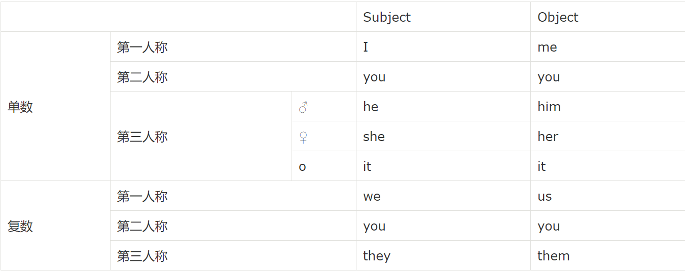

正确完成后, 即使是盲人也可以解析 HTML 表格中的数据，一个成功的 HTML 表格应该做到无论用户是视力正常还是视力受损，都能提高用户的体验。

### 表格风格[Section](https://developer.mozilla.org/zh-CN/docs/Learn/HTML/Tables/Basics#%E8%A1%A8%E6%A0%BC%E9%A3%8E%E6%A0%BC)

你可以在 GitHub 上找到上面表格的 [HTML源码](https://github.com/mdn/learning-area/blob/master/html/tables/basic/personal-pronouns.html) ; 先去看看, 当然也可以看看这个 [look at the live example](http://mdn.github.io/learning-area/html/tables/basic/personal-pronouns.html)! 你也许会注意到一件事情，那就是这个表格看上去可读性不是很好，那是因为现在这个页面上面的那个表格通过 MDN 站点添加了一些样式, 而 GitHub 上面的并没有添加。

不要幻想; 为了能够让表格在网页上有效, 你需要提供一些 CSS 的样式信息，以及尽可能好的 HTML 固定结构. 在这个模块中，我们将专注于 HTML 部分; 在你完成这里的内容之后，你可以浏览 [Styling tables](https://developer.mozilla.org/en-US/docs/Learn/CSS/Styling_boxes/Styling_tables) 来了解 CSS 的部分。

虽然在这个模块中我们不会专注于 CSS, 但是我们提供了一个较小的 CSS 样式表让你使用，和默认的没有采用任何 CSS 样式的表相比，表格会更加可读。 你可以在 [stylesheet here](https://github.com/mdn/learning-area/blob/master/html/tables/basic/minimal-table.css) 获取样式表，以及在 [HTML template](https://github.com/mdn/learning-area/blob/master/html/tables/basic/blank-template.html) 获取 HTML 文件来应用样式表，这些会让你在 “测试 HTML 表格” 中有一个好的起点。

**注意**: 也可以看下 [personal_pronouns table with this styling applied](http://mdn.github.io/learning-area/html/tables/basic/personal-pronouns-styled.html) 这个版本, 这个是应用了 CSS 以后表格看上去的样子。

### 什么时候你不应该使用 HTML 表格?[Section](https://developer.mozilla.org/zh-CN/docs/Learn/HTML/Tables/Basics#%E4%BB%80%E4%B9%88%E6%97%B6%E5%80%99%E4%BD%A0%E4%B8%8D%E5%BA%94%E8%AF%A5%E4%BD%BF%E7%94%A8_HTML_%E8%A1%A8%E6%A0%BC)

HTML 表格 应该用于表格数据 ，这正是 HTML 表格设计出来的用途. 不幸的是, 许多人习惯用 HTML 表格来实现网页布局， e.g. 一行包含 header, 一行包含几列内容, 一行包含 footer, etc. 你可以在我们的 [Accessibility Learning Module](https://developer.mozilla.org/en-US/docs/Learn/Accessibility) 中的  [Page Layouts](https://developer.mozilla.org/en-US/docs/Learn/Accessibility/HTML#Page_layouts) 获得更多细节内容和一个示例。这种做法以前是很常见的，因为以前 CSS 在不同浏览器上的兼容性比较糟糕 ; 表格布局现在不太普遍，但您可能仍然会在网络的某些角落看到它们。

简单来说, 使用表格布局而不使用 [CSS layout techniques](https://developer.mozilla.org/en-US/docs/Learn/CSS/CSS_layout) 是很糟糕的. 主要的理由有以下几个:

1. **表格布局减少了视觉受损的用户的可访问性**: [屏幕阅读器](https://developer.mozilla.org/en-US/docs/Learn/Tools_and_testing/Cross_browser_testing/Accessibility#Screenreaders), 被盲人所使用, 解析存在于 HTML 页面上的标签，然后为用户读出其中的内容。因为对于布局来说，表格不是一个正确的工具， 使用的标记比使用 CSS 布局技术更复杂, 所以屏幕阅读器的输出会让他们的用户感到困惑。
2. **表格会产生很多标签**: 正如刚才提到的, 表格布局通常会比正确的布局技术涉及更复杂的标签结构，这会导致代码变得更难于编写、维护、调试.
3. **表格不能自动响应**: 当你使用正确的布局容器 (比如 [`<header>`](https://developer.mozilla.org/zh-CN/docs/Web/HTML/Element/header), [`<section>`](https://developer.mozilla.org/zh-CN/docs/Web/HTML/Element/section), [`<>article`](https://developer.mozilla.org/zh-CN/docs/Web/HTML/Element/article), 或是 [`<div>`](https://developer.mozilla.org/zh-CN/docs/Web/HTML/Element/div)), 它们的默认宽度是父元素的 100%. 而表格的的默认大小是根据其内容而定的。因此，需要采取额外的措施来获取表格布局样式，以便有效地在各种设备上工作。

### 动手练习: 创建你的第一个表格[Section](https://developer.mozilla.org/zh-CN/docs/Learn/HTML/Tables/Basics#%E5%8A%A8%E6%89%8B%E7%BB%83%E4%B9%A0_%E5%88%9B%E5%BB%BA%E4%BD%A0%E7%9A%84%E7%AC%AC%E4%B8%80%E4%B8%AA%E8%A1%A8%E6%A0%BC)

对于表格的理论知识，我们已经说了很多了，所以, 让我们来看一个使用的例子，并建立一个简单的表格.

1. 首先, 将 [blank-template.html](https://github.com/mdn/learning-area/blob/master/html/tables/basic/blank-template.html) 和 [minimal-table.css](https://github.com/mdn/learning-area/blob/master/html/tables/basic/minimal-table.css) 拷贝到你的本地环境上。

2. 每一个表格的内容都包含在这两个标签中 : **<table></table>**. 在你的 HTML 的 [`<body>`](https://developer.mozilla.org/zh-CN/docs/Web/HTML/Element/body) 中添加这些内容。

3. 在表格中，最小的内容容器是单元格, 是通过 <td>元素创建的 ('td' 代表 'table data'). 把下面的内容添加到你的表格标签中:

   ```html
   <td>Hi, I'm your first cell.</td>
   ```

4. 如果我们想要一行四个单元格，我们需要把这组标签拷贝三次，更新你表中的内容，让它看起来是这样的:

   ```html
   <td>Hi, I'm your first cell.</td>
   <td>I'm your second cell.</td>
   <td>I'm your third cell.</td>
   <td>I'm your fourth cell.</td>
   ```

你会看到, 单元格不会放置在彼此的下方, 而是自动与同一行上的其他单元格对齐. 每个 `<td>`元素 创建一个单独单元格，它们共同组成了第一行。我们添加的每个单元格都使行的长度变长。

如果想让这一行停止增加，并让单元格从第二行开始，我们需要使用 **<tr>** 元素 ('tr' 代表 'table row'). 让我们现在来证实一下。

1. 把你已经创建好的 4 个单元格放入 <tr>标签, 就像:

   ```html
   <tr>
     <td>Hi, I'm your first cell.</td>
     <td>I'm your second cell.</td>
     <td>I'm your third cell.</td>
     <td>I'm your fourth cell.</td>
   </tr>
   ```

2. 现在你已经实现了一行，可以继续增加至两行、三行。每一行都需要一个额外的 `<tr>` 元素来包装，每个单元格的内容都应该写在 `<td>`中。

这样会产生一个如下所示的表:

| Hi, I'm your first cell. | I'm your second cell. | I'm your third cell. | I'm your fourth cell. |
| ------------------------ | --------------------- | -------------------- | --------------------- |
| Second row, first cell.  | Cell 2.               | Cell 3.              | Cell 4.               |

**注意**: 你也可以在 GitHub 中查看 [simple-table.html](https://github.com/mdn/learning-area/blob/master/html/tables/basic/simple-table.html) ([see it live also](http://mdn.github.io/learning-area/html/tables/basic/simple-table.html)).

### 使用 &lt;th> 元素添加标题[Section](https://developer.mozilla.org/zh-CN/docs/Learn/HTML/Tables/Basics#%E4%BD%BF%E7%94%A8_%3Cth%3E_%E5%85%83%E7%B4%A0%E6%B7%BB%E5%8A%A0%E6%A0%87%E9%A2%98)

现在，让我们把注意力转向表格标题，表格中的标题是特殊的单元格，通常在行或列的开始处，定义行或列包含的数据类型 (举个例子, 看到本篇文章中第一个示例中的 "单数" 或者 "Object"  ). 为了说明它们为什么这么有用, 来看下面这个例子，首先是源代码:

```html
<table>
  <tr>
    <td>&nbsp;</td>
    <td>Knocky</td>
    <td>Flor</td>
    <td>Ella</td>
    <td>Juan</td>
  </tr>
  <tr>
    <td>Breed</td>
    <td>Jack Russell</td>
    <td>Poodle</td>
    <td>Streetdog</td>
    <td>Cocker Spaniel</td>
  </tr>
  <tr>
    <td>Age</td>
    <td>16</td>
    <td>9</td>
    <td>10</td>
    <td>5</td>
  </tr>
  <tr>
    <td>Owner</td>
    <td>Mother-in-law</td>
    <td>Me</td>
    <td>Me</td>
    <td>Sister-in-law</td>
  </tr>
  <tr>
    <td>Eating Habits</td>
    <td>Eats everyone's leftovers</td>
    <td>Nibbles at food</td>
    <td>Hearty eater</td>
    <td>Will eat till he explodes</td>
  </tr>
</table>
```

这是表格实际呈现的效果:

|               | Knocky                    | Flor            | Ella         | Juan                      |
| ------------- | ------------------------- | --------------- | ------------ | ------------------------- |
| Breed         | Jack Russell              | Poodle          | Streetdog    | Cocker Spaniel            |
| Age           | 16                        | 9               | 10           | 5                         |
| Owner         | Mother-in-law             | Me              | Me           | Sister-in-law             |
| Eating Habits | Eats everyone's leftovers | Nibbles at food | Hearty eater | Will eat till he explodes |

这里的问题是：虽然你可以弄清楚发生了什么，但是尽可能的交叉参考数据并不容易。如果列和行的标题以某种方式出现，那将会更好。

### 动手练习: 表格标题[Section](https://developer.mozilla.org/zh-CN/docs/Learn/HTML/Tables/Basics#%E5%8A%A8%E6%89%8B%E7%BB%83%E4%B9%A0_%E8%A1%A8%E6%A0%BC%E6%A0%87%E9%A2%98)

让我们来改进这个表格.

1. 首先, 把 [dogs-table.html](https://github.com/mdn/learning-area/blob/master/html/tables/basic/dogs-table.html) 和 [minimal-table.css](https://github.com/mdn/learning-area/blob/master/html/tables/basic/minimal-table.css) 文件保存到你的本地环境，HTML 文件包含上文你看到的几种狗的数据。
2. 为了将表格的标题在视觉上和语义上都能被识别为标题，你可以使用 **<th>** 元素 ('th' 代表 'table header'). 用法和 `<td>`是一样的，除了它表示为标题，不是普通的单元格以外。进入你的 HTML 文件, 将表格中应该是标题的 `<td>` 元素标记的内容，都改为用 `<th>` 元素标记。
3. 保存你的 HTML 文件，然后在浏览器中加载，然后你应该会看到，现在的标题更像标题了。

**注意**: 你可以在 GitHub 中找到完成的版本 [dogs-table-fixed.html](https://github.com/mdn/learning-area/blob/master/html/tables/basic/dogs-table-fixed.html)  ([see it live also](http://mdn.github.io/learning-area/html/tables/basic/dogs-table-fixed.html)).

### 为什么标题是有用的?[Section](https://developer.mozilla.org/zh-CN/docs/Learn/HTML/Tables/Basics#%E4%B8%BA%E4%BB%80%E4%B9%88%E6%A0%87%E9%A2%98%E6%98%AF%E6%9C%89%E7%94%A8%E7%9A%84)

我们已经给出了部分答案，当标题明显突出的时候，你可以更加简单地找到你想找的数据，设计上也会看起来更好。

**注意**: 即使你不给表格添加你自己的样式，表格标题也会带有一些默认样式：加粗和居中，让标题可以突出显示。

表格标题也有额外的好处，随着 `scope` 属性 (我们将在下一篇文章中了解到)，这个属性允许你让表格变得更加无障碍，每个标题与相同行或列中的所有数据相关联。屏幕阅读设备能一次读出一列或一行的数据，这是非常有帮助的。

### 允许单元格跨越多行和列[Section](https://developer.mozilla.org/zh-CN/docs/Learn/HTML/Tables/Basics#%E5%85%81%E8%AE%B8%E5%8D%95%E5%85%83%E6%A0%BC%E8%B7%A8%E8%B6%8A%E5%A4%9A%E8%A1%8C%E5%92%8C%E5%88%97)

有时我们希望单元格跨越多行或多列。以下是一个简单的例子，显示了一些常见动物的名字。在某些情况下，我们要显示动物名称旁边的男性和女性的名字。有时候我们又不需要，那不需要的情况下，我们希望写着动物的名字的单元格的宽度可以是两个单元格的宽度 (因为写着名字的行会有两列，而没有写名字的行只有一列，行的宽度是不一样的)。

一开始的标记写法是这样的:

```html
<table>
  <tr>
    <th>Animals</th>
  </tr>
  <tr>
    <th>Hippopotamus</th>
  </tr>
  <tr>
    <th>Horse</th>
    <td>Mare</td>
  </tr>
  <tr>
    <td>Stallion</td>
  </tr>
  <tr>
    <th>Crocodile</th>
  </tr>
  <tr>
    <th>Chicken</th>
    <td>Cock</td>
  </tr>
  <tr>
    <td>Rooster</td>
  </tr>
</table>
```

但是输出的结果不是我们想要的:

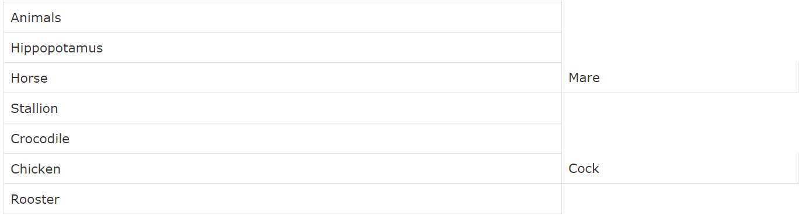

我们需要一个方法，让 "Animals", "Hippopotamus", 和 "Crocodile" 的单元格的宽度变为两个单元格， "Horse" 和 "Chicken" 的高度变为两行 (因为要拥有一个男性名字和女性名字，可以先看效果图)。幸好, 表格中的标题和单元格有 `colspan` 和 `rowspan` 属性，这两个属性可以帮助我们实现这些效果。这两个属性接受一个没有单位的数字值，数字决定了它们的宽度或高度是几个单元格。比如, `colspan="2"` 使一个单元格的宽度是两个单元格。

让我们使用 `colspan` 和 `rowspan` 来改进现有的表格。

1. 首先，把 [animals-table.html](https://github.com/mdn/learning-area/blob/master/html/tables/basic/animals-table.html) 和 [minimal-table.css](https://github.com/mdn/learning-area/blob/master/html/tables/basic/minimal-table.css) 文件复制到你的本地环境，HTML 文件中包含了你刚才看到的动物示例的数据。
2. 接着，使用 `colspan` 让 "Animals", "Hippopotamus", 和 "Crocodile" 占 2 个单元格的宽度。
3. 最后，使用 `rowspan` 让 "Horse" 和 "Chicken" 占 2 个单元格的高度。
4. 保存后，用浏览器打开你写的 HTML 文件，看看改进的地方。

**注意**: 你也可以在 GitHub 上找到完成的版本 [animals-table-fixed.html](https://github.com/mdn/learning-area/blob/master/html/tables/basic/animals-table-fixed.html)  ([see it live also](http://mdn.github.io/learning-area/html/tables/basic/animals-table-fixed.html)).

### 为表格中的列提供共同的样式[Section](https://developer.mozilla.org/zh-CN/docs/Learn/HTML/Tables/Basics#%E4%B8%BA%E8%A1%A8%E6%A0%BC%E4%B8%AD%E7%9A%84%E5%88%97%E6%8F%90%E4%BE%9B%E5%85%B1%E5%90%8C%E7%9A%84%E6%A0%B7%E5%BC%8F)

在我们继续介绍之前，我们将介绍本文中的最后一个功能。HTML有一种方法可以定义整列数据的样式信息：就是 **&lt;col>** 和 **&lt;colgroup>** 元素。 它们存在是因为如果你想让一列中的每个数据的样式都一样，那么你就要为每个数据都添加一个样式，这样的做法是令人厌烦和低效的。你通常需要在列中的每个 `<td>` 或 `<th>` 上定义样式，或者使用一个复杂的选择器，比如 [`:nth-child()`](https://developer.mozilla.org/zh-CN/docs/Web/CSS/:nth-child())。

下面是一个简单的示例:

```html
<table>
  <tr>
    <th>Data 1</th>
    <th style="background-color: yellow">Data 2</th>
  </tr>
  <tr>
    <td>Calcutta</td>
    <td style="background-color: yellow">Orange</td>
  </tr>
  <tr>
    <td>Robots</td>
    <td style="background-color: yellow">Jazz</td>
  </tr>
</table>
```

下面就是上述代码的结果:

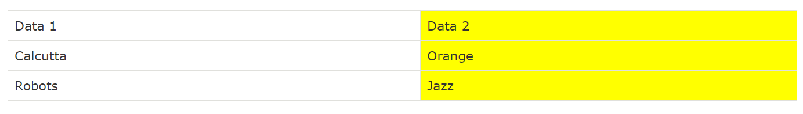

这样不太理想，因为我们不得不在列中的每个单元格中重复那些样式信息 (在真实的项目中，我们或许会设置一个 `class` 包含那三个单元格 ，然后在一个单独的样式表中定义样式). 为了舍弃这种做法，我们可以只定义一次，在 `<col>` 元素中。`<col>` 元素被规定包含在 `<colgroup>`容器中，而 `<colgroup>`就在 `<table>` 标签的下方。我们可以通过如下的做法来创建与上面相同的效果:

```html
<table>
  <colgroup>
    <col>
    <col style="background-color: yellow">
  </colgroup>
  <tr>
    <th>Data 1</th>
    <th>Data 2</th>
  </tr>
  <tr>
    <td>Calcutta</td>
    <td>Orange</td>
  </tr>
  <tr>
    <td>Robots</td>
    <td>Jazz</td>
  </tr>
</table>
```

我们使用了两个 `<col>`来定义“列的样式”，每一个`<col>`都会制定每列的样式，对于第一列，我们没有采取任何样式，但是我们仍然需要添加一个空的 `<col>` 元素，如果不这样做，那么我们的样式就会应用到第一列上，这和我们预想的不一样。

如果你想把这种样式信息应用到每一列，我们可以只使用一个 `<col>` 元素，不过需要包含 span 属性，像这样：

```html
<colgroup>
  <col style="background-color: yellow" span="2">
</colgroup>
```

就像 `colspan` 和 `rowspan`, `span` 需要一个无单位的数字值，用来制定你想要让这个样式应用到表格中多少列

### 动手练习: colgroup and col[Section](https://developer.mozilla.org/zh-CN/docs/Learn/HTML/Tables/Basics#%E5%8A%A8%E6%89%8B%E7%BB%83%E4%B9%A0_colgroup_and_col)

又到了需要你自己独立完成的时间了。

下面你可以看到一位语言老师的时间表。星期五，她有一个新的课程，全天教荷兰语，但是在星期二和星期四的几个时间点，她也教德语。她想把那些包含她教学的日子的列高亮显示。

<iframe src="https://mdn.github.io/learning-area/html/tables/basic/timetable-fixed.html" height="320" class="live-sample-frame" frameborder="0" width="100%" style="font-style: normal; max-width: 100%; margin: 0px; padding: 0px; border: 0px; color: rgb(51, 51, 51); font-family: Verdana, arial, x-locale-body, sans-serif; font-size: 16px; font-variant-ligatures: normal; font-variant-caps: normal; font-weight: 400; letter-spacing: -0.05328px; orphans: 2; text-align: start; text-indent: 0px; text-transform: none; white-space: normal; widows: 2; word-spacing: 0px; -webkit-text-stroke-width: 0px; background-color: rgb(255, 255, 255); text-decoration-style: initial; text-decoration-color: initial;"></iframe>


通过下面这些步骤来重构这个表格。

1. 首先，把 [timetable.html](https://github.com/mdn/learning-area/blob/master/html/tables/basic/timetable.html) 文件复制到你的本地环境。这个 HTML 文件包含你在上文中看到的表格，不过是减去样式信息的。
2. 在 table 的顶部添加一个 `<colgroup>` 元素，就放在 `<table>` 标签下面，`<colgroup>`可以添加 `<col>` 元素 (继续看下面剩余的步骤)。
3. 第一列和第二列不需要应用样式。
4. 为第三列添加一个背景颜色。`style` 属性是 `background-color:#97DB9A;`
5. 为第四列设置一个独立的宽度，`style` 属性是 `width: 42px;`
6. 为第五列添加一个背景颜色。`style` 属性是 `background-color: #97DB9A;`
7. 为第六列添加不同的背景颜色和边框，表示这是一个特殊的日子，表示她正在教一个新的课。  `style` 属性是 `background-color:#DCC48E; border:4px solid #C1437A;`
8. 最后两天是休息日，所以只需将它们设置为无背景颜色，但需要设置宽度；`style` 属性是 `width: 42px;`

看看你是否能完成这个示例，如果你遇到了困难，或想要核对你完成的作品，你可以在 GitHub 上找到完成的版本 [timetable-fixed.html](https://github.com/mdn/learning-area/blob/master/html/tables/basic/timetable-fixed.html) ([see it live also](http://mdn.github.io/learning-area/html/tables/basic/timetable-fixed.html))。

### 小结[Section](https://developer.mozilla.org/zh-CN/docs/Learn/HTML/Tables/Basics#%E5%B0%8F%E7%BB%93)

本章节仅仅包含了 HTML 表格的基础。在下一篇文章中，我们将介绍一些稍微更高级的表格功能，并开始考虑方便视力障碍的人士的访问

##   HTML表格高级特性和可访问性

这个模块的第二篇文章中，我们来看一下 HTML 表格更高级的功能，比如像 表格的标题/摘要，以及将你表格中的各行分组成头部、正文、页脚部分，提高视力受损用户的可访问性。

| 学习本章节的前提条件: | HTML 的基础知识 (see [Introduction to HTML](https://developer.mozilla.org/en-US/docs/Learn/HTML/Introduction_to_HTML)). |
| --------------------- | ------------------------------------------------------------ |
| 目的:                 | 学习 HTML 表格进一步的功能，以及表格的无障碍访问性。         |

### 使用 &lt;caption> 为你的表格增加一个标题[Section](https://developer.mozilla.org/zh-CN/docs/Learn/HTML/Tables/Advanced#%E4%BD%BF%E7%94%A8_%3Ccaption%3E_%E4%B8%BA%E4%BD%A0%E7%9A%84%E8%A1%A8%E6%A0%BC%E5%A2%9E%E5%8A%A0%E4%B8%80%E4%B8%AA%E6%A0%87%E9%A2%98)

你可以为你的表格增加一个标题，通过 [`<caption>`](https://developer.mozilla.org/zh-CN/docs/Web/HTML/Element/caption) 元素，再把 [`<caption>`](https://developer.mozilla.org/zh-CN/docs/Web/HTML/Element/caption) 元素放入 [`<table>`](https://developer.mozilla.org/zh-CN/docs/Web/HTML/Element/table) 元素中. 你应该把它放在`<table>` 标签的下面。

```html
<table>
  <caption>Dinosaurs in the Jurassic period</caption>

  ...
</table>
```

从上面简单的例子可以推断，标题意味着包含对于表格内容的描述，这对那些希望可以快速浏览网页中的表格对他们是否有帮助的读者们来说，是非常好的功能。特别是盲人用户，不需要让屏幕阅读设备读出很多单元格的内容，来让用户了解这张表格讲的是什么，而是可以依靠标题的内容，来决定是否需要了解更详细的内容。

标题就放在 `<table>` 标签的下面。

**注意**: 这个 `summary` 属性也可以在`<table>` 元素中使用，用来提供一段描述，同样可以被屏幕阅读设备阅读。我们推荐使用 `<caption>` 元素来代替使用，因为 `summary` 被 HTML5 规范， [deprecated](https://developer.mozilla.org/zh-CN/docs/Glossary/deprecated) (废除了)，也不能被视力正常的用户阅读。 (它不会出现在页面上)

### 动手练习: 添加一个标题[Section](https://developer.mozilla.org/zh-CN/docs/Learn/HTML/Tables/Advanced#%E5%8A%A8%E6%89%8B%E7%BB%83%E4%B9%A0_%E6%B7%BB%E5%8A%A0%E4%B8%80%E4%B8%AA%E6%A0%87%E9%A2%98)

我们来试试看吧，回顾一下我们在之前的文章中第一次遇到的例子。.

1. 打开你的语言老师的学校时间表，就是 [HTML Table Basics](https://developer.mozilla.org/en-US/docs/Learn/HTML/Tables/Basics#Active_learning_colgroup_and_col) 结尾中的例子，或者把 [timetable-fixed.html](https://github.com/mdn/learning-area/blob/master/html/tables/basic/timetable-fixed.html) 文件复制下面.
2. 为表格添加一个合适的标题。
3. 保存你的代码，然后用浏览器打开，看看你的表格是什么样的。

**注意**:你也可以在 GitHub 上找到我们的版本 [timetable-caption.html](https://github.com/mdn/learning-area/blob/master/html/tables/advanced/timetable-caption.html) ([see it live also](http://mdn.github.io/learning-area/html/tables/advanced/timetable-caption.html)).

### 添加 &lt;thead>, &lt;tfoot>, 和 &lt;tbody> 结构[Section](https://developer.mozilla.org/zh-CN/docs/Learn/HTML/Tables/Advanced#%E6%B7%BB%E5%8A%A0_%3Cthead%3E_%3Ctfoot%3E_%E5%92%8C_%3Ctbody%3E_%E7%BB%93%E6%9E%84)

由于你的表格在结构上有点复杂，如果把它们定义得更加结构化，那会帮助我们更能了解结构。一个明确的方法是使用 , ,和 , 这些元素允许你把表格中的部分标记为表头、页脚、正文部分。

这些元素不会使表格更易于屏幕阅读器用户访问，也不会造成任何视觉上的改变。然而，它们在应用样式和布局上会起到作用，可以更好地让 CSS 应用到表格上。给你一些有趣的例子，在长表格的情况下，你可以在每个打印页面上使表格页眉和页脚重复，你也可以让表格的正文部分显示在一个单独的页面上，并通过上下滚动来获得内容。

试着使用它们:

-  `<thead>` 需要嵌套在 table 元素中，放置在头部的位置，因为它通常代表第一行，第一行中往往都是每列的标题，但是不是每种情况都是这样的。如果你使用了&lt;col> / &lt;colgroup>元素，那么 `<thead>`元素就需要放在它们的下面。
-  `<tfoot>` 需要嵌套在 table 元素中，放置在底部 (页脚)的位置，一般是最后一行，往往是对前面所有行的总结，比如，你可以按照预想的方式将`<tfoot>`放在表格的底部，或者就放在 `<thead>` 的下面。(浏览器仍将它呈现在表格的底部)
-  `<tbody>` 需要嵌套在 table 元素中，放置在 `<thead>`的下面或者是 `<tfoot>` 的下面，这取决于你如何设计你的结构。(`<tfoot>`放在`<thead>`下面也可以生效.)

**注意**: `<tbody>` 总是包含在每个表中，如果你没有在代码中指定它，那就是隐式的。可以来验证一下，打开一个你之前没有包含 `<tbody>` 的例子，然后在你的 [browser developer tools](https://developer.mozilla.org/en-US/docs/Learn/Common_questions/What_are_browser_developer_tools) 中观察你的代码，你会看到浏览器为你添加了这个标签。你也许会想问，为什么你应该在所有表中都需要这个元素，因为它可以让你更好地控制表格结构和样式。

### 动手练习: 添加表格结构[Section](https://developer.mozilla.org/zh-CN/docs/Learn/HTML/Tables/Advanced#%E5%8A%A8%E6%89%8B%E7%BB%83%E4%B9%A0_%E6%B7%BB%E5%8A%A0%E8%A1%A8%E6%A0%BC%E7%BB%93%E6%9E%84)

让我们动手使用这些新元素。

1. 首先，把 [spending-record.html](https://github.com/mdn/learning-area/blob/master/html/tables/advanced/spending-record.html) 和 [minimal-table.css](https://github.com/mdn/learning-area/blob/master/html/tables/advanced/minimal-table.css) 拷贝到你的本地环境。

2. 尝试在浏览器中打开它，你会发现看起来不错，但是它可以被改善得更好。 "SUM" 行包含了已经使用的金额的总和，不过它出现在了错误的位置，以及代码中还遗失了一些细节。

3. 将明显的标题行改为使用 `<thead>` 元素，"SUM" 行使用 `<tfoot>` 元素，剩余的内容使用 `<tbody>` 元素。

4. 先保存，再刷新。你会看到，添加了 `<tfoot>` 元素后，导致 "SUM" 这行跑到了表格的底部。

5. 接着, 添加一个 `colspan` 属性，使 "SUM" 单元格占 4 个单元格的位置，所以实际数字是显示在 “Cost” 列的底部。

6. 让我们为表格添加一些简单的额外属性，能够让你理解这些属性是如何帮助更好地让表格应用 CSS 的。在你的 HTML 文件的 head 标签部分，你会看到一个空的 

    

   元素. 在 style 元素中添加下列 CSS 代码：

   ```css
   tbody {
     font-size: 90%;
     font-style: italic;
   }
   
   tfoot {
     font-weight: bold;
   }
   ```

7. 先保存，再刷新，然后观察一下结果。如果没有 `<tbody>` 和 `<tfoot>` 元素，你也许会写更加复杂的选择器来应用同样的样式。

**注意**: 我们并不期望目前你可以理解所有 CSS 的内容。当你经过我们的 CSS 模块的时候，你应该会了解更多 ([Introduction to CSS](https://developer.mozilla.org/zh_CN/docs/Learn/CSS/Introduction_to_CSS) 是一个好的起点；我们也有专门的文章 [styling tables](https://developer.mozilla.org/zh_CN/docs/Learn/CSS/Styling_boxes/Styling_tables)).

你完成的表格应该如下所示：

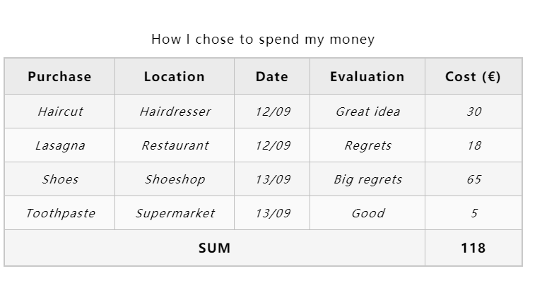

**注意**: 你也可以在 GitHub 上找到 [spending-record-finished.html](https://github.com/mdn/learning-area/blob/master/html/tables/advanced/spending-record-finished.html) ([see it live also](http://mdn.github.io/learning-area/html/tables/advanced/spending-record-finished.html)).

### 嵌套表格[Section](https://developer.mozilla.org/zh-CN/docs/Learn/HTML/Tables/Advanced#%E5%B5%8C%E5%A5%97%E8%A1%A8%E6%A0%BC)

在一个表格中嵌套另外一个表格是可能的，只要你包含完整的结构，包括 `<table>` 元素。这样通常是不建议的，因为这种做法会使标记看上去很难理解，对使用屏幕阅读的用户来说，可访问性也降低了。以及在很多情况下，也许你只需要插入额外的 单元格/行/列 到已有的表格中。然而有时候是必要的，比如你想要从其他资源中更简单地导入内容。

下面的代码演示了一个简单的嵌套表格:

```html
<table id="table1">
  <tr>
    <th>title1</th>
    <th>title2</th>
    <th>title3</th>
  </tr>
  <tr>
    <td id="nested">
      <table id="table2">
        <tr>
          <td>cell1</td>
          <td>cell2</td>
          <td>cell3</td>
        </tr>
      </table>
    </td>
    <td>cell2</td>
    <td>cell3</td>
  </tr>
  <tr>
    <td>cell4</td>
    <td>cell5</td>
    <td>cell6</td>
  </tr>
</table>
```

输出看起来是这样的：

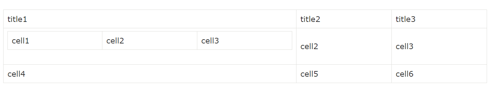

### 对于视力受损的用户的表格[Section](https://developer.mozilla.org/zh-CN/docs/Learn/HTML/Tables/Advanced#%E5%AF%B9%E4%BA%8E%E8%A7%86%E5%8A%9B%E5%8F%97%E6%8D%9F%E7%9A%84%E7%94%A8%E6%88%B7%E7%9A%84%E8%A1%A8%E6%A0%BC)

让我们简要回顾一下如何使用数据表。一个表格可以是一个便利的工具，或者让我们快速访问数据，并允许我们查找不同的值。比如，你只需要稍微看一眼下列的表格，你就能得知 2016 年 8 月份在 Gent 出售了多少个 Rings (戒指)。为了理解信息，我们让数据与列标题或行标题之间建立视觉联系。

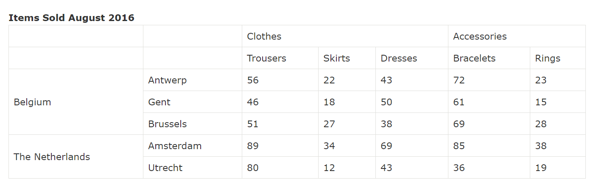

但假设你无法通过视觉关联这些数据呢? 那么你应该如何阅读上述的表格? 视力受损的用户经常使用一个屏幕阅读设备来为他们读出网页上的信息。对于盲人来说，阅读简单的文字没有什么问题，但是要理解一张表格的内容，这就有一些难度了。虽然，使用正确的标记，我们可以用程序化来代替视觉关联。

**注意**: 根据[世界卫生组织 2017 年的数据](http://www.who.int/zh/news-room/fact-sheets/detail/blindness-and-visual-impairment)，大约有 2.53 亿人患有视觉障碍。

本篇文章提供了更一步的技术来使表格的可访问性尽可能地提高。

### 使用列和行的标题[Section](https://developer.mozilla.org/zh-CN/docs/Learn/HTML/Tables/Advanced#%E4%BD%BF%E7%94%A8%E5%88%97%E5%92%8C%E8%A1%8C%E7%9A%84%E6%A0%87%E9%A2%98)

屏幕阅读设备会识别所有的标题，然后在它们和它们所关联的单元格之间产生编程关联。列和行标题的组合将标识和解释每个单元格中的数据，以便屏幕阅读器用户可以类似于视力正常的用户的操作来理解表格。

我们之前的文章就提到过这一点，可见  elements](https://developer.mozilla.org/en-US/docs/Learn/HTML/Tables/Basics#Adding_headers_with_%3Cth%3E_elements).

### scope 属性[Section](https://developer.mozilla.org/zh-CN/docs/Learn/HTML/Tables/Advanced#scope_%E5%B1%9E%E6%80%A7)

本篇文章的一个新话题是 `scope` 属性，可以添加在`<th>` 元素中，用来帮助屏幕阅读设备更好地理解那些标题单元格，这个标题单元格到底是列标题呢，还是行标题。比如： 回顾我们早期的支出记录示例，您可以明确地将列标题这样定义：

```html
<thead>
  <tr>
    <th scope="col">Purchase</th>
    <th scope="col">Location</th>
    <th scope="col">Date</th>
    <th scope="col">Evaluation</th>
    <th scope="col">Cost (€)</th>
  </tr>
</thead>
```

以及每一行都可以这样定义一个行标题 (如果我们已经使用了 th 和 td 元素):

```html
<tr>
  <th scope="row">Haircut</th>
  <td>Hairdresser</td>
  <td>12/09</td>
  <td>Great idea</td>
  <td>30</td>
</tr>
```

屏幕阅读设备会识别这种结构化的标记，并一次读出整列或整行，比如：

`scope` 还有两个可选的值 ： `colgroup` 和 `rowgroup`。这些用于位于多个列或行的顶部的标题。 如果你回顾一些文章开始部分的 "Items sold..." 表格。你会看到 "Clothes" 单元格在"Trousers", "Skirts", 和 "Dresses" 单元格的上面，且包括了它们三个。像 "Clothes" 这种单元格应该被标记为 (`<th>`)，但是 "Clothes" 是一个位于顶部的标题，且定义了其他三个子标题。 因此 "Clothes" 应该有一个 `scope="colgroup"`属性，而另外三个子标题应该用 `scope="col"`属性。

### id 和标题属性[Section](https://developer.mozilla.org/zh-CN/docs/Learn/HTML/Tables/Advanced#id_%E5%92%8C%E6%A0%87%E9%A2%98%E5%B1%9E%E6%80%A7)

如果要替代 `scope` 属性，可以使用 `id` 和 `headers` 属性来创造标题与单元格之间的联系。使用方法如下:

1. 为每个`<th>` 元素添加一个 `id` (id 不能重复)。
2. 为每个 `<td>` 元素添加一个 `headers` 属性。每个 `headers` 属性需要包含 th 元素的 `id` 。 如果这个单元格是属于一个 th 元素下的，那么就需要包含 th 元素的 id 的值，如果属于多个 th 元素，那么可以用空格分隔这些 id。

这给你的HTML表格一个明确的定义，关于表格中每个单元格的位置。通过 headers 属性来定义属于哪些行或列。像一个电子表格，为了正常工作，该表确实需要列和行标题。

回到我们的花费成本示例，前两个片段可以重写为：

```html
<thead>
  <tr>
    <th id="purchase">Purchase</th>
    <th id="location">Location</th>
    <th id="date">Date</th>
    <th id="evaluation">Evaluation</th>
    <th id="cost">Cost (€)</th>
  </tr>
</thead>
<tbody>
<tr>
  <th id="haircut">Haircut</th>
  <td headers="location haircut">Hairdresser</td>
  <td headers="date haircut">12/09</td>
  <td headers="evaluation haircut">Great idea</td>
  <td headers="cost haircut">30</td>
</tr>

  ...

</tbody>
```

**注意**: 这个放进为标题单元格和数据单元格之间创造了非常精确的联系。但是这个方法使用了大量的标记，所以容错率比较低。使用 `scope` 的方法对于大多数表格来说，也够用了。

### 动手练习: 使用 scope 和 headers[Section](https://developer.mozilla.org/zh-CN/docs/Learn/HTML/Tables/Advanced#%E5%8A%A8%E6%89%8B%E7%BB%83%E4%B9%A0_%E4%BD%BF%E7%94%A8_scope_%E5%92%8C_headers)

1. 对于这个最后的练习，首先把 [items-sold.html](https://github.com/mdn/learning-area/blob/master/html/tables/advanced/items-sold.html) 和 [minimal-table.css](https://github.com/mdn/learning-area/blob/master/html/tables/advanced/minimal-table.css),拷贝到你的本地环境。
2. 现在尝试添加适当的 `scope` 属性来让表格变得更加恰当。
3. 最后，尝试把未添加 `scope` 属性的源文件再复制一份。这次使用 `id` 和 `headers` 属性让表格变得更加恰当。

**注意**: 你可以根据我们完成的例子检查你的工作，请看 [items-sold-scope.html](https://github.com/mdn/learning-area/blob/master/html/tables/advanced/items-sold-scope.html) ([also see this live](http://mdn.github.io/learning-area/html/tables/advanced/items-sold-scope.html)) 和 [items-sold-headers.html](https://github.com/mdn/learning-area/blob/master/html/tables/advanced/items-sold-headers.html) ([see this live too](http://mdn.github.io/learning-area/html/tables/advanced/items-sold-headers.html)).

### 总结[Section](https://developer.mozilla.org/zh-CN/docs/Learn/HTML/Tables/Advanced#%E6%80%BB%E7%BB%93)

关于 HTML 表格你还可以学习其他一些东西，但是我们目前已经把大部分你需要知道的内容都告诉你了。在此刻，如果你想学习关于 HTML 表格的样式，可以阅读 [Styling Tables](https://developer.mozilla.org/en-US/docs/Learn/CSS/Styling_boxes/Styling_tables).

###### 

## 作业：构建行星数据

在我们的表格评定中，我们为你提供有关太阳系中行星的一些数据，并让你将其结构化成HTML表。

| 学习本章的前提条件: | 在尝试这个评定之前，你应该已经把这个模块的所有文章都学习完成了。 |
| ------------------- | ------------------------------------------------------------ |
| 目的:               | 检测对 HTML 表格及相关功能的理解。                           |

### 起点[Section](https://developer.mozilla.org/zh-CN/docs/Learn/HTML/Tables/Structuring_planet_data#%E8%B5%B7%E7%82%B9)

要开始这个评估，将 [blank-template.html](https://github.com/mdn/learning-area/blob/master/html/tables/assessment-start/blank-template.html), [minimal-table.css](https://github.com/mdn/learning-area/blob/master/html/tables/assessment-start/minimal-table.css), 和 [planets-data.txt](https://github.com/mdn/learning-area/blob/master/html/tables/assessment-start/planets-data.txt) 文件拷贝到你的本地环境。

**注意**: 另外， 你可以使用 [JSBin](https://jsbin.com/) 或 [Thimble](https://thimble.mozilla.org/) 来做你的测验。你可以把 HTML, CSS 和 JavaScript 粘贴到其中一个网上编辑器里。如果你使用的网上编辑器不支持 JavaScript/CSS 文件链接到 HTML 中使用，那么也可以使用 `<script>`/`<style>` 元素将它们直接写在你的 HTML 页面里。

### 项目概要[Section](https://developer.mozilla.org/zh-CN/docs/Learn/HTML/Tables/Structuring_planet_data#%E9%A1%B9%E7%9B%AE%E6%A6%82%E8%A6%81)

你在学校工作; 目前，你的学生正在学习太阳系的行星，然后你想为他们提供一份简单的易于追踪的数据集合，来查找有关行星的数字和情况。一张 HTML 数据表将是理想的，你需要先获得可用的数据，然后把它变成一张表格，跟着下面的步骤。

完成后的表格看上去应该是这样的:


你也可以看 [see the example live here](https://mdn.github.io/learning-area/html/tables/assessment-finished/planets-data.html) (不准去看源代码，不要作弊!)


### 要完成的步骤[Section](https://developer.mozilla.org/zh-CN/docs/Learn/HTML/Tables/Structuring_planet_data#%E8%A6%81%E5%AE%8C%E6%88%90%E7%9A%84%E6%AD%A5%E9%AA%A4)

下面的步骤描述了：为了完成这个示例的表格，你所要做的事情 。所有你需要的数据都包含在`planets-data.txt` 文件中。如果你在获得这些数据时遇到了问题，也看看上面的实例，或者尝试绘制一个图。

1. 打开在你本地环境中的 `blank-template.html`副本，提供一个外部容器来初始化表格，一个表格 header，一个表格 body。在这个例子中，你不需要表格 footer 。
2. 为你的表格添加我们提供的标题。
3. 在表格的 header 中添加一行，用来包括所有列的标题。
4. 在表格的 body 部分创建所有内容行，记住要让所有是行标题的单元格语义化。
5. 确保所有内容都插入了正确的单元格，在原始数据中，每行行星数据都显示在其相关行星的旁边。
6. 添加一些属性，让行标题和列标题更加明确地与和它们有关的单元格进行关联，使用 rowgroups 让子标题和父标题也进行关联。
7. 为包含所有行星标题的行标题的那一列数据，添加一个黑色边框

### 要点和提示[Section](https://developer.mozilla.org/zh-CN/docs/Learn/HTML/Tables/Structuring_planet_data#%E8%A6%81%E7%82%B9%E5%92%8C%E6%8F%90%E7%A4%BA)

- 标题行的第一个单元格需要是空白的，然后宽度为 2 个单元格。
- 行的主标题 (e.g. *Jovian planets*) 以及放置在行星名称行左侧的标题 (e.g. *Saturn*) 整理出来有点麻烦， — 你需要确保每个单元格都有正确的高度和宽度。(即横跨正确的行数和列数)
- 将标题与其行/列相关联的一种方法比其他方法容易得多。

### 评定[Section](https://developer.mozilla.org/zh-CN/docs/Learn/HTML/Tables/Structuring_planet_data#%E8%AF%84%E5%AE%9A)

如果您将此评估作为有组织的课程的一部分，您应该能够将您的工作交给您的老师/导师进行评改。 如果您是自学习的，那么您可以通过询问  [Learning Area Discourse thread](https://discourse.mozilla-community.org/t/learning-web-development-marking-guides-and-questions/16294), 或在 [#mdn](irc://irc.mozilla.org/mdn)的IRC频道 [Mozilla IRC](https://wiki.mozilla.org/IRC) 中轻松获得标记指南. 首先尝试练习 - 作弊对你没有益处！

#   HTML表单

##   HTML表单指南


  这个模块提供了一系列帮助您掌握HTML表单的文章。HTML表单是与用户交互的强大工具;然而，由于历史和技术上的原因，如何充分发挥它们的潜力并不总是显而易见的。在本指南中，我们将介绍HTML表单的所有方面，从结构到样式，从数据处理到自定义小部件。

### 预备知识[Section](https://developer.mozilla.org/zh-CN/docs/Learn/HTML/Forms#%E9%A2%84%E5%A4%87%E7%9F%A5%E8%AF%86)

在开始这个模块之前，您至少应该完成我们[对HTML的介绍](https://developer.mozilla.org/zh-CN/docs/Learn/HTML/Introduction_to_HTML)。此时此刻，您应该会发现[基本指南](https://developer.mozilla.org/zh-CN/docs/Learn/HTML/Forms#%E5%9F%BA%E6%9C%AC%E6%8C%87%E5%8D%97)很容易理解，并且能够使用我们的[原生表单小部件](https://developer.mozilla.org/zh-CN/docs/Learn/HTML/Forms/The_native_form_widgets)指南。

但是模块的其余部分更高级一些，很容易将表单小部件放在页面上，但是如果不使用高级表单特性、CSS和JavaScript，就不能对它们做太多的工作。因此，在您查看其他部分之前，我们建议您先离开，先学习一些[CSS](https://developer.mozilla.org/zh-CN/docs/Learn/CSS)和[JavaScript](https://developer.mozilla.org/zh-CN/docs/Learn/JavaScript)。

**注意：**如果您正在使用一个不能让您创建自己的文件的计算机/平板电脑/其它设备，那么您可以尝试(大多数)在线编码程序中的代码示例，例如[JSBin](http://jsbin.com/)或[Thimble](https://thimble.mozilla.org/)。

### 基本指南[Section](https://developer.mozilla.org/zh-CN/docs/Learn/HTML/Forms#%E5%9F%BA%E6%9C%AC%E6%8C%87%E5%8D%97)

- [你的第一个HTML表单](https://developer.mozilla.org/zh-CN/docs/Learn/HTML/Forms/Your_first_HTML_form)

  本系列的第一篇文章提供了您第一次创建HTML表单的经验，包括设计一个简单表单，使用正确的HTML元素实现它，通过CSS添加一些非常简单的样式，以及如何将数据发送到服务器。

- [如何构造HTML表单](https://developer.mozilla.org/zh-CN/docs/Learn/HTML/Forms/How_to_structure_an_HTML_form)

  有了基础知识，我们现在更详细地了解了用于为表单的不同部分提供结构和意义的元素。

### 什么表单小部件可用?[Section](https://developer.mozilla.org/zh-CN/docs/Learn/HTML/Forms#%E4%BB%80%E4%B9%88%E8%A1%A8%E5%8D%95%E5%B0%8F%E9%83%A8%E4%BB%B6%E5%8F%AF%E7%94%A8)

- [原生表单小部件](https://developer.mozilla.org/zh-CN/docs/Learn/HTML/Forms/The_native_form_widgets)

  现在，我们详细研究了不同表单部件的功能，查看了哪些选项可用于收集不同类型的数据。

### 验证和提交表单数据[Section](https://developer.mozilla.org/zh-CN/docs/Learn/HTML/Forms#%E9%AA%8C%E8%AF%81%E5%92%8C%E6%8F%90%E4%BA%A4%E8%A1%A8%E5%8D%95%E6%95%B0%E6%8D%AE)

- [发送表单数据](https://developer.mozilla.org/zh-CN/docs/Learn/HTML/Forms/Sending_and_retrieving_form_data)

  本文讨论当用户提交一个表单时，当用户提交一个表单时，会发生什么情况，当用户提交表单时，我们该如何处理?我们还研究了与发送表单数据相关的一些安全问题。

- [表单数据验证](https://developer.mozilla.org/zh-CN/docs/Learn/HTML/Forms/Form_validation)

  发送数据还不够，我们还需要确保数据用户填写表单的格式是正确的，我们需要成功地处理它，而且它不会破坏我们的应用程序。我们还希望帮助用户正确填写表单，在使用应用程序时不要感到沮丧。表单验证帮助我们实现这些目标，本文将告诉您需要了解的内容。

### 高级指南[Section](https://developer.mozilla.org/zh-CN/docs/Learn/HTML/Forms#%E9%AB%98%E7%BA%A7%E6%8C%87%E5%8D%97)

- [如何构建自定表单小组件](https://developer.mozilla.org/zh-CN/docs/Learn/HTML/Forms/How_to_build_custom_form_widgets)

  在某些情况下，原生表单部件无法提供您需要的东西，例如，由于样式或功能。在这种情况下，您可能需要使用原生HTML构建自己的表单小部件。本文将说明您是如何做到这一点的，以及在实际案例研究中需要注意的事项。

- [通过JavaScript发送表单](https://developer.mozilla.org/zh-CN/docs/Learn/HTML/Forms/Sending_forms_through_JavaScript)

  本文将讨论如何使用表单来组装HTTP请求，并通过定制的JavaScript发送它，而不是标准的表单提交。它还研究了为什么要这么做，以及这样做的意义。（请参阅使用FormData对象。）

- [遗留浏览器中的HTML表单](https://developer.mozilla.org/zh-CN/docs/Learn/HTML/Forms/HTML_forms_in_legacy_browsers)

  文章覆盖特性检测等。这应该被重定向到跨浏览器测试模块，因为相同的东西在那里被更好地覆盖。

### 表单样式指南[Section](https://developer.mozilla.org/zh-CN/docs/Learn/HTML/Forms#%E8%A1%A8%E5%8D%95%E6%A0%B7%E5%BC%8F%E6%8C%87%E5%8D%97)

- [HTML表单样式](https://developer.mozilla.org/zh-CN/docs/Learn/HTML/Forms/Styling_HTML_forms)

  本文介绍了使用CSS的样式表单，包括您可能需要了解的基本样式任务的所有基础知识。

- [高级HTML表单样式](https://developer.mozilla.org/zh-CN/docs/Learn/HTML/Forms/Advanced_styling_for_HTML_forms)

  在这里，我们将看到一些更高级的表单样式技术，这些技术需要在处理一些更难以风格的元素时使用。

- [表单部件的属性兼容性表](https://developer.mozilla.org/zh-CN/docs/Learn/HTML/Forms/Property_compatibility_table_for_form_widgets)

  这最后一篇文章提供了一个方便的参考，允许您查看哪些CSS属性与哪些表单元素是兼容的。

### 另见[Section](https://developer.mozilla.org/zh-CN/docs/Learn/HTML/Forms#%E5%8F%A6%E8%A7%81)

- [HTML forms element reference](https://developer.mozilla.org/zh-CN/docs/Web/HTML/Element#Forms)
- [HTML &lt;input> types reference](https://developer.mozilla.org/zh-CN/docs/Web/HTML/Element/input)

## 创建我的第一个表单


  本系列的第一篇文章提供了您第一次创建HTML表单的经验，包括设计一个简单表单，使用正确的HTML元素实现它，通过CSS添加一些非常简单的样式，以及如何将数据发送到服务器。

| 预备知识： | 基本计算机素养和[对HTML的基本理解](https://developer.mozilla.org/en-US/docs/Learn/HTML/Introduction_to_HTML)。 |
| ---------- | ------------------------------------------------------------ |
| 目标：     | 为了熟悉HTML表单是什么，它们被用来做什么，如何设计它们，以及简单情况下需要的基本HTML元素。 |

### HTML表单是什么？[Section](https://developer.mozilla.org/zh-CN/docs/Learn/HTML/Forms/Your_first_HTML_form#HTML%E8%A1%A8%E5%8D%95%E6%98%AF%E4%BB%80%E4%B9%88%EF%BC%9F)

HTML表单是用户和web站点或应用程序之间交互的主要内容之一。它们允许用户将数据发送到web站点。大多数情况下，数据被发送到web服务器，但是web页面也可以自己拦截它并使用它。

HTML表单是由一个或多个小部件组成的。这些小部件可以是文本字段(单行或多行)、选择框、按钮、复选框或单选按钮。大多数情况下，这些小部件与描述其目的的标签配对——正确实现的标签能够清楚地指示视力正常的用户和盲人用户输入表单输入的内容。

HTML表单和常规HTML文档的主要区别在于，大多数情况下，表单收集的数据被发送到web服务器。在这种情况下，您需要设置一个web服务器来接收和处理数据。如何设置这样的服务器超出了本文的范围，但是如果您想了解更多，请参阅模块后面的[发送表单数据](https://developer.mozilla.org/zh-CN/docs/Learn/HTML/Forms/Sending_and_retrieving_form_data)。

### 设计表单[Section](https://developer.mozilla.org/zh-CN/docs/Learn/HTML/Forms/Your_first_HTML_form#%E8%AE%BE%E8%AE%A1%E8%A1%A8%E5%8D%95)

在开始编写代码之前，最好先退一步，花点时间考虑一下您的表单。设计一个快速的模型将帮助您定义您想要询问用户的正确的数据集。从用户体验(UX)的角度来看，要记住：表单越大，失去用户的风险就越大。保持简单，保持专注:只要求必要的数据。在构建站点或应用程序时，设计表单是非常重要的一步。这超出了本文的范围，涵盖了表单的用户体验，但是如果您想深入了解这个主题，您应该阅读下面的文章:

- 粉碎杂志有[很好的关于表单用户体验的文章](http://uxdesign.smashingmagazine.com/tag/forms/)，但其中最重要的应该是他们的[Extensive Guide To Web Form Usability](http://uxdesign.smashingmagazine.com/2011/11/08/extensive-guide-web-form-usability/).
- UXMatters 也是一个非常有思想的资源，从基本的[最佳实践](https://developer.mozilla.org/zh-CN/docs/Learn/HTML/Forms/%E4%B9%9F%E6%98%AF%E4%B8%80%E4%B8%AA%E9%9D%9E%E5%B8%B8%E6%9C%89%E6%80%9D%E6%83%B3%E7%9A%84%E8%B5%84%E6%BA%90%EF%BC%8C%E4%BB%8E%E5%9F%BA%E6%9C%AC%E7%9A%84%E6%9C%80%E4%BD%B3%E5%AE%9E%E8%B7%B5%E5%88%B0%E5%A4%8D%E6%9D%82%E7%9A%84%E9%97%AE%E9%A2%98%EF%BC%8C%E4%BE%8B%E5%A6%82%E5%A4%9A%E9%A1%B5%E8%A1%A8%E5%8D%95%EF%BC%8C%E9%83%BD%E6%9C%89%E5%BE%88%E5%A5%BD%E7%9A%84%E5%BB%BA%E8%AE%AE%E3%80%82)到复杂的问题如[多页表单](https://www.uxmatters.com/mt/archives/2010/03/pagination-in-web-forms-evaluating-the-effectiveness-of-web-forms.php)，都有很好的建议。

在本文中，我们将构建一个简单的联系人表单。让我们做一个粗略的草图。


我们的表单将包含三个文本字段和一个按钮。我们向用户询问他们的姓名、电子邮件和他们想要发送的信息。点击这个按钮将把他们的数据发送到一个web服务器。

### 主动学习:实现我们的表单HTML[Section](https://developer.mozilla.org/zh-CN/docs/Learn/HTML/Forms/Your_first_HTML_form#%E4%B8%BB%E5%8A%A8%E5%AD%A6%E4%B9%A0%E5%AE%9E%E7%8E%B0%E6%88%91%E4%BB%AC%E7%9A%84%E8%A1%A8%E5%8D%95HTML)

好了，现在我们准备进入HTML代码并对表单进行编码。为了构建我们的联系人表单，我们将使用以下HTML元素:[`<form>`](https://developer.mozilla.org/zh-CN/docs/Web/HTML/Element/form), [`<label>`](https://developer.mozilla.org/zh-CN/docs/Web/HTML/Element/label), [`<input>`](https://developer.mozilla.org/zh-CN/docs/Web/HTML/Element/input), [`<textarea>`](https://developer.mozilla.org/zh-CN/docs/Web/HTML/Element/textarea), and [`<button>`](https://developer.mozilla.org/zh-CN/docs/Web/HTML/Element/button).

在进一步讨论之前，先创建一个[简单HTML模板](https://github.com/mdn/learning-area/blob/master/html/introduction-to-html/getting-started/index.html)的本地副本—您将在这里输入您的表单HTML。

### [`<form>`](https://developer.mozilla.org/zh-CN/docs/Web/HTML/Element/form) 元素[Section](https://developer.mozilla.org/zh-CN/docs/Learn/HTML/Forms/Your_first_HTML_form#%3Cform%3E_%E5%85%83%E7%B4%A0)

所有HTML表单都以一个[`<form>`](https://developer.mozilla.org/zh-CN/docs/Web/HTML/Element/form)元素开始：

```html
<form action="/my-handling-form-page" method="post">

</form>
```

这个元素正式定义了一个表单。就像[`<div>`](https://developer.mozilla.org/zh-CN/docs/Web/HTML/Element/div)元素或[`<p>`](https://developer.mozilla.org/zh-CN/docs/Web/HTML/Element/p)元素，它是一个容器元素，但它也支持一些特定的属性来配置表单的行为方式。它的所有属性都是可选的，但至少要设置`action`属性和`method`属性，这被认为是最佳实践。

- `action` 属性定义了在提交表单时所收集的数据的位置(URL)。.
-  `method` 属性定义了发送数据的HTTP方法(它可以是“get”或“post”).

**注意:**如果您想深入了解这些属性是如何工作的，那么将在[发送表单数据](https://developer.mozilla.org/zh-CN/docs/Learn/HTML/Forms/Sending_and_retrieving_form_data)文章中详细说明。

现在，将上面的[`<form>`](https://developer.mozilla.org/zh-CN/docs/Web/HTML/Element/form) 元素添加到您的HTML主体中

### [`<label>`](https://developer.mozilla.org/zh-CN/docs/Web/HTML/Element/label), [`<input>`](https://developer.mozilla.org/zh-CN/docs/Web/HTML/Element/input) 和 [`<textarea>`](https://developer.mozilla.org/zh-CN/docs/Web/HTML/Element/textarea) 元素[Section](https://developer.mozilla.org/zh-CN/docs/Learn/HTML/Forms/Your_first_HTML_form#%3Clabel%3E_%3Cinput%3E_%E5%92%8C_%3Ctextarea%3E_%E5%85%83%E7%B4%A0)

我们的联系人表单非常简单，包含三个文本字段，每个字段都有一个标签。该名称的输入字段将是一个基本的单行文本字段，电子邮件的输入字段将是一个只接受电子邮件地址的单行文本字段，而消息的输入字段将是一个基本的多行文本字段。

就HTML代码而言，我们需要如下的东西来实现这些表单小部件：

```html
<form action="/my-handling-form-page" method="post">
    <div>
        <label for="name">Name:</label>
        <input type="text" id="name" />
    </div>
    <div>
        <label for="mail">E-mail:</label>
        <input type="email" id="mail" />
    </div>
    <div>
        <label for="msg">Message:</label>
        <textarea id="msg"></textarea>
    </div>
</form>
```

更新您的表单代码，使其看起来像上面的代码。

结果如下：

<iframe src="https://mdn.mozillademos.org/zh-CN/docs/Learn/HTML/Forms/Your_first_HTML_form$samples/The_HTMLelement(label)_HTMLelement(input)_and_HTMLelement(textarea)_elements?revision=1413343" height="100" width="100%" id="frame_The_HTMLelement(label)_HTMLelement(input)_and_HTMLelement(textarea)_elements" class="live-sample-frame sample-code-frame" frameborder="0" style="font-style: normal; max-width: calc((100% - 40px) - 6px); margin: 0px; padding: 20px; border-width: 1px 1px 1px 5px; border-style: solid; border-color: rgb(61, 126, 154); border-image: initial; width: calc((100% - 40px) - 6px); color: rgb(51, 51, 51); font-family: Verdana, arial, x-locale-body, sans-serif; font-size: 16px; font-variant-ligatures: normal; font-variant-caps: normal; font-weight: 400; letter-spacing: -0.05328px; orphans: 2; text-align: start; text-indent: 0px; text-transform: none; white-space: normal; widows: 2; word-spacing: 0px; -webkit-text-stroke-width: 0px; background-color: rgb(255, 255, 255); text-decoration-style: initial; text-decoration-color: initial;"></iframe>

&lt;div> 元素可以方便地构造我们的代码，使样式更简单(参见本文后面的文章)。注意在所有<label>元素上使用for属性；它是将标签链接到表单小部件的一种正式方式。这个属性引用相应的小部件的id。这样做有一些好处。最明显的一个好处是允许用户单击标签以激活相应的小部件。如果您想更好地理解这个属性的其他好处，您可以找到如何构造HTML表单的详细信息。

在 [`<input>`](https://developer.mozilla.org/zh-CN/docs/Web/HTML/Element/input)元素中，最重要的属性是`type` 属性。这个属性非常重要，因为它定义了[`<input>`](https://developer.mozilla.org/zh-CN/docs/Web/HTML/Element/input)属性的行为方式。它可以从根本上改变元素，所以要注意它。稍后您将在[原生表单挂件](https://developer.mozilla.org/zh-CN/docs/Learn/HTML/Forms/The_native_form_widgets)文章中找到更多关于此的内容。

- 在我们的简单示例中，我们使用值 `text` 作为第一个输入——这个属性的默认值。它表示一个基本的单行文本字段，接受任何类型的文本输入。
- 对于第二个输入，我们使用值`email`，它定义了一个只接受格式良好的电子邮件地址的单行文本字段。
- 最后一个值将一个基本的文本字段转换为一种“智能”字段，该字段将对用户输入的数据进行一些检查。在稍后的表单数据验证文章中，您将了解到[表单验证](https://developer.mozilla.org/zh-CN/docs/Learn/HTML/Forms/Data_form_validation)的更多信息。

最后但同样重要的是，要注意`<input />` 和 `<textarea></textarea>`的语法。这是HTML的一个奇怪之处。 `<input>` 标签是一个空元素，这意味着它不需要关闭标签。相反， [`<textarea>`](https://developer.mozilla.org/zh-CN/docs/Web/HTML/Element/textarea)不是一个空元素，因此必须使用适当的结束标记来关闭它。这对HTML表单的特定特性有影响:定义默认值的方式。要定义[``](https://developer.mozilla.org/zh-CN/docs/Web/HTML/Element/input)的默认值，你必须使用`value` 属性，如下所示：

```html
<input type="text" value="by default this element is filled with this text" />
```

相反，如果您想定义[``](https://developer.mozilla.org/zh-CN/docs/Web/HTML/Element/textarea)的默认值，您只需在[``](https://developer.mozilla.org/zh-CN/docs/Web/HTML/Element/textarea)元素的开始和结束标记之间放置默认值，就像这样:

```html
<textarea>by default this element is filled with this text</textarea>
```

### [`<button>`](https://developer.mozilla.org/zh-CN/docs/Web/HTML/Element/button) 元素[Section](https://developer.mozilla.org/zh-CN/docs/Learn/HTML/Forms/Your_first_HTML_form#%3Cbutton%3E_%E5%85%83%E7%B4%A0)

我们的表格已经快准备好了，我们只需要再添加一个按钮，让用户在填写完表单后发送他们的数据。这是通过使用 [`<button>`](https://developer.mozilla.org/zh-CN/docs/Web/HTML/Element/button) 元素完成的。在 `</form>`标签上添加以下内容：

```html
<div class="button">
<button type="submit">Send your message</button>
</div>
```

您将看到[``](https://developer.mozilla.org/zh-CN/docs/Web/HTML/Element/button)元素也接受一个 `type`属性，它接受三个值中的一个:`submit`, `reset`或者 `button`。

- 单击 `submit` 按钮 发送表单的数据到[`<form>`](https://developer.mozilla.org/zh-CN/docs/Web/HTML/Element/form)元素的`action` 属性所定义的网页。
- 单击 `reset` 按钮 将所有表单小部件重新设置为它们的默认值。从用户体验的角度来看，这被认为是一种糟糕的做法。
- 单击`button` 按钮……不会发生任何事！这听起来很傻，但是用JavaScript构建定制按钮非常有用。 

 

**注意：**您还可以使用相应类型的 [`<input>`](https://developer.mozilla.org/zh-CN/docs/Web/HTML/Element/input)元素来生成一个按钮，如 `<input type="submit">`。[`<button>`](https://developer.mozilla.org/zh-CN/docs/Web/HTML/Element/button)元素的主要优点是， [`<input>`](https://developer.mozilla.org/zh-CN/docs/Web/HTML/Element/input)元素只允许纯文本作为其标签，而[`<button>`](https://developer.mozilla.org/zh-CN/docs/Web/HTML/Element/button)元素允许完整的HTML内容，允许更复杂、更有创意的按钮文本。

### 基本表单样式[Section](https://developer.mozilla.org/zh-CN/docs/Learn/HTML/Forms/Your_first_HTML_form#%E5%9F%BA%E6%9C%AC%E8%A1%A8%E5%8D%95%E6%A0%B7%E5%BC%8F)

现在您已经完成了表单的HTML代码，尝试保存它并在浏览器中查看它。
现在，你会看到它看起来很丑。


**注意：** 如果你怀疑你的HTML代码不对，试着把它和我们完成的例子进行比较 —— [first-form.html](https://github.com/mdn/learning-area/blob/master/html/forms/your-first-HTML-form/first-form.html) (你也可以观看[预览版](https://mdn.github.io/learning-area/html/forms/your-first-HTML-form/first-form.html))。

如何排布好表单是公认的难点。这超出了本文的讨论范围，所以现在我们只需要让您添加一些CSS来让它看起来很好。

首先，在您的HTML头部中添加一个 [`<style>`](https://developer.mozilla.org/zh-CN/docs/Web/HTML/Element/style)元素。应该是这样的：

```html
<style>

</style>
```

在样式标签中，添加如下的CSS，如下所示:

```css
form {
  /* 居中表单 */
  margin: 0 auto;
  width: 400px;
  /* 显示表单的轮廓 */
  padding: 1em;
  border: 1px solid #CCC;
  border-radius: 1em;
}

form div + div {
  margin-top: 1em;
}

label {
  /* 确保所有label大小相同并正确对齐 */
  display: inline-block;
  width: 90px;
  text-align: right;
}

input, textarea {
  /* 确保所有文本输入框字体相同
     textarea默认是等宽字体 */
  font: 1em sans-serif;

  /* 使所有文本输入框大小相同 */
  width: 300px;
  box-sizing: border-box;

  /* 调整文本输入框的边框样式 */
  border: 1px solid #999;
}

input:focus, textarea:focus {
  /* 给激活的元素一点高亮效果 */
  border-color: #000;
}

textarea {
  /* 使多行文本输入框和它们的label正确对齐 */
  vertical-align: top;

  /* 给文本留下足够的空间 */
  height: 5em;
}

.button {
  /* 把按钮放到和文本输入框一样的位置 */
  padding-left: 90px; /* 和label的大小一样 */
}

button {
  /* 这个外边距的大小与label和文本输入框之间的间距差不多 */
  margin-left: .5em;
}
```

现在，它看起来没那么丑了。


**注意**: 你可以在GitHub上的这里找到它 [first-form-styled.html](https://github.com/mdn/learning-area/blob/master/html/forms/your-first-HTML-form/first-form-styled.html) ([也可以在这儿看运行结果](https://mdn.github.io/learning-area/html/forms/your-first-HTML-form/first-form-styled.html)).

### 向您的web服务器发送表单数据[Section](https://developer.mozilla.org/zh-CN/docs/Learn/HTML/Forms/Your_first_HTML_form#%E5%90%91%E6%82%A8%E7%9A%84web%E6%9C%8D%E5%8A%A1%E5%99%A8%E5%8F%91%E9%80%81%E8%A1%A8%E5%8D%95%E6%95%B0%E6%8D%AE)

最后一部分，也许是最棘手的部分，是在服务器端处理表单数据。如前所述，大多数时候HTML表单是向用户请求数据并将其发送到web服务器的一种方便的方式。

[`<form>`](https://developer.mozilla.org/zh-CN/docs/Web/HTML/Element/form) 元素将定义如何通过`action` 属性和 `method`属性来发送数据的位置和方式。

但这还不够。我们还需要为我们的数据提供一个名称。这些名字对双方都很重要：在浏览器端，它告诉浏览器哪个名称提供每个数据，在服务器端，它允许服务器按名称处理每个数据块。

要将数据命名为表单，您需要在每个表单小部件上使用 `name` 属性来收集特定的数据块。让我们再来看看我们的表单代码:

```html
<form action="/my-handling-form-page" method="post"> 
  <div>
    <label for="name">Name:</label>
    <input type="text" id="name" name="user_name" />
  </div>
  <div>
    <label for="mail">E-mail:</label>
    <input type="email" id="mail" name="user_email" />
  </div>
  <div>
    <label for="msg">Message:</label>
    <textarea id="msg" name="user_message"></textarea>
  </div>

  ...
```

在我们的例子中，表单会发送三个已命名的数据块 "`user_name`", "`user_email`", 和 "`user_message`"。这些数据将用使用[HTTP `POST`](https://developer.mozilla.org/en-US/docs/Web/HTTP/Methods/POST) 方法,把信息发送到URL为 "`/my-handling-form-page`"目录下。

在服务器端，位于URL"`/my-handling-form-page`" 上的脚本将接收的数据作为HTTP请求中包含的3个键/值项的列表。这个脚本处理这些数据的方式取决于您。每个服务器端语言(PHP、Python、Ruby、Java、c等等)都有自己的机制。深入到这个主题已经超出了本指南的范围，但是如果您想了解更多，我们已经在[发送表单数据](https://developer.mozilla.org/zh-CN/docs/Learn/HTML/Forms/Sending_and_retrieving_form_data)文章中提供了一些示例。 

### 总结[Section](https://developer.mozilla.org/zh-CN/docs/Learn/HTML/Forms/Your_first_HTML_form#%E6%80%BB%E7%BB%93)

祝贺您，您已经构建了您的第一个HTML表单。它看起来就像这样:

<iframe src="https://mdn.mozillademos.org/zh-CN/docs/Learn/HTML/Forms/Your_first_HTML_form/Example$samples/A_simple_form?revision=1413343" height="240" width="100%" id="frame_A_simple_form" class="live-sample-frame sample-code-frame" frameborder="0" style="font-style: normal; max-width: calc((100% - 40px) - 6px); margin: 0px; padding: 20px; border-width: 1px 1px 1px 5px; border-style: solid; border-color: rgb(61, 126, 154); border-image: initial; width: calc((100% - 40px) - 6px); color: rgb(51, 51, 51); font-family: Verdana, arial, x-locale-body, sans-serif; font-size: 16px; font-variant-ligatures: normal; font-variant-caps: normal; font-weight: 400; letter-spacing: -0.05328px; orphans: 2; text-align: start; text-indent: 0px; text-transform: none; white-space: normal; widows: 2; word-spacing: 0px; -webkit-text-stroke-width: 0px; background-color: rgb(255, 255, 255); text-decoration-style: initial; text-decoration-color: initial;"></iframe>

在 CodePen 中打开在 JSFiddle 中打开


然而，这仅仅是开始，现在是时候深入研究了。HTML表单比我们在这里看到的要强大得多，本指南的其他文章将帮助您掌握其余部分。

## 如何构造HTML表单

有了基础知识，我们现在更详细地了解了用于为表单的不同部分提供结构和意义的元素。

| 前提条件: | 基本的计算机能力, 和基本的 [对HTML的理解](https://developer.mozilla.org/en-US/docs/Learn/HTML/Introduction_to_HTML)。 |
| --------- | ------------------------------------------------------------ |
| 目标:     | 要理解如何构造HTML表单并赋予它们语义，以便它们是可用的和可访问的。 |

HTML表单的灵活性使它们成为HTML中最复杂的结构之一;您可以使用专用的表单元素和属性构建任何类型的基本表单。在构建HTML表单时使用正确的结构将有助于确保表单可用性和可访问性。

##  <form> 元素[Section](https://developer.mozilla.org/zh-CN/docs/Learn/HTML/Forms/How_to_structure_an_HTML_form#%3Cform%3E_%E5%85%83%E7%B4%A0)

 [``](https://developer.mozilla.org/zh-CN/docs/Web/HTML/Element/form) 元素按照一定的格式定义了表单和确定表单行为的属性。当您想要创建一个HTML表单时，都必须从这个元素开始，然后把所有内容都放在里面。许多辅助技术或浏览器插件可以发现[``](https://developer.mozilla.org/zh-CN/docs/Web/HTML/Element/form)元素并实现特殊的钩子，使它们更易于使用。 

我们早在之前的文章中就遇见过它了。

**注意:** 严格禁止在一个表单内嵌套另一个表单。嵌套会使表单的行为不可预知，而取决于正在使用的浏览器。

请注意，在[``](https://developer.mozilla.org/zh-CN/docs/Web/HTML/Element/form)元素之外使用表单小部件是可能的，但是如果您这样做了，那么表单小部件与任何表单都没有任何关系。这样的小部件可以在表单之外使用，但是您应该对于这些小部件有特别的计划，因为它们自己什么也不做。您将不得不使用JavaScript定制他们的行为。

**注意**: HTML5在HTML表单元素中引入`form`属性。它让您显式地将元素与表单绑定在一起，即使元素不在[``](https://developer.mozilla.org/zh-CN/docs/Web/HTML/Element/form)中。不幸的是，就目前而言，跨浏览器对这个特性的实现还不足以使用。

##  <fieldset> 和 <legend> 元素[Section](https://developer.mozilla.org/zh-CN/docs/Learn/HTML/Forms/How_to_structure_an_HTML_form#%3Cfieldset%3E_%E5%92%8C_%3Clegend%3E_%E5%85%83%E7%B4%A0)

[``](https://developer.mozilla.org/zh-CN/docs/Web/HTML/Element/fieldset)元素是一种方便的用于创建具有相同目的的小部件组的方式，出于样式和语义目的。 你可以在`<fieldset>`开口标签后加上一个 [``](https://developer.mozilla.org/zh-CN/docs/Web/HTML/Element/legend)元素来给[``](https://developer.mozilla.org/zh-CN/docs/Web/HTML/Element/fieldset) 标上标签。 [``](https://developer.mozilla.org/zh-CN/docs/Web/HTML/Element/legend)的文本内容正式地描述[``](https://developer.mozilla.org/zh-CN/docs/Web/HTML/Element/fieldset)的用途。它是包含在`<fieldset>`里的。

许多辅助技术将使用[``](https://developer.mozilla.org/zh-CN/docs/Web/HTML/Element/legend) 元素，就好像它是相应的 [``](https://developer.mozilla.org/zh-CN/docs/Web/HTML/Element/fieldset) 元素。例如，在说出每个小部件的标签之前，像[Jaws](http://www.freedomscientific.com/products/fs/jaws-product-page.asp)或[NVDA](http://www.nvda-project.org/)这样的屏幕阅读器会说出图例的内容。

这里有一个小例子:

```html
<form>
  <fieldset>
    <legend>Fruit juice size</legend>
    <p>
      <input type="radio" name="size" id="size_1" value="small">
      <label for="size_1">Small</label>
    </p>
    <p>
      <input type="radio" name="size" id="size_2" value="medium">
      <label for="size_2">Medium</label>
    </p>
    <p>
      <input type="radio" name="size" id="size_3" value="large">
      <label for="size_3">Large</label>
    </p>
  </fieldset>
</form>
```

**注意**: 你可以在 [fieldset-legend.html](https://github.com/mdn/learning-area/blob/master/html/forms/html-form-structure/fieldset-legend.html) (你也可以看[预览版](https://mdn.github.io/learning-area/html/forms/html-form-structure/fieldset-legend.html)) 看到该例。

当阅读上述表格时，屏幕阅读器将会读第一个小部件“Fruit juice size small”，“Fruit juice size medium”为第二个，“Fruit juice size large”为第三个。

本例中的用例是最重要的。每当您有一组单选按钮时，您应该将它们嵌套在[``](https://developer.mozilla.org/zh-CN/docs/Web/HTML/Element/fieldset)元素中。还有其他用例，一般来说，[``](https://developer.mozilla.org/zh-CN/docs/Web/HTML/Element/fieldset)元素也可以用来对表单进行分段。理想情况下，长表单应该在多个页面之间进行拆分，但是如果表单很长，但必须在单个页面上，那么在不同的fieldsets中放置不同的相关部分可以提高可用性。

因为它对辅助技术的影响， [``](https://developer.mozilla.org/zh-CN/docs/Web/HTML/Element/fieldset) 元素是构建可访问表单的关键元素之一。然而，你有责任不去滥用它。如果可能，每次构建表单时，尝试侦听[屏幕阅读器](https://www.nvaccess.org/download/)如何解释它。如果听起来很奇怪，试着改进表单结构。

##  <label> 元素[Section](https://developer.mozilla.org/zh-CN/docs/Learn/HTML/Forms/How_to_structure_an_HTML_form#%3Clabel%3E_%E5%85%83%E7%B4%A0)

正如我们在前一篇文章中看到的， [``](https://developer.mozilla.org/zh-CN/docs/Web/HTML/Element/label) 元素是为HTML表单小部件定义标签的正式方法。如果你想构建可访问的表单，这是最重要的元素——当正确实现时，屏幕阅读器将会与任何相关的说明一起使用表单元素的标签。以我们在上一篇文章中看到的例子为例:

```html
<label for="name">Name:</label> <input type="text" id="name" name="user_name">
```

通过他们各自的`for` 属性和 `id` 属性，`<label>` 标签与 `<input>` 正确相关联。如此，一个屏幕阅读器会读出诸如“Name, edit text”之类的东西。

如果标签没有正确设置，屏幕阅读器只会读出Edit text blank”之类的东西，这不太有帮助。

注意，一个小部件可以嵌套在它的[``](https://developer.mozilla.org/zh-CN/docs/Web/HTML/Element/label)元素中，就像这样：

```html
<label for="name">
  Name: <input type="text" id="name" name="user_name">
</label>
```

尽管可以这样做，但人们认为设置`for`属性才是最好的做法，因为一些辅助技术不理解标签和小部件之间的隐式关系。

### 标签也可点击

正确设置标签的另一个好处是可以在所有浏览器中单击标签来激活相应的小部件。这对于像文本输入这样的例子很有用，在这里你可以点击标签和输入来聚焦它，它同样对于单选按钮和复选框特别有用——这种控件的可点击区域可能非常小，设置标签来使它们可点击区域变大是非常有用的。

举个例子：

```html
<form>
  <p>
    <label for="taste_1">I like cherry</label>
    <input type="checkbox" id="taste_1" name="taste_cherry" value="1">
  </p>
  <p>
    <label for="taste_2">I like banana</label>
    <input type="checkbox" id="taste_2" name="taste_banana" value="2">
  </p>
</form>
```

**注意**: 你可以在 [checkbox-label.html](https://github.com/mdn/learning-area/blob/master/html/forms/html-form-structure/checkbox-label.html) (你也可以看[预览版](https://mdn.github.io/learning-area/html/forms/html-form-structure/checkbox-label.html)) 看到该例。

### 多个标签[Section](https://developer.mozilla.org/zh-CN/docs/Learn/HTML/Forms/How_to_structure_an_HTML_form#%E5%A4%9A%E4%B8%AA%E6%A0%87%E7%AD%BE)

严格地说，您可以在一个小部件上放置多个标签，但是这不是一个好主意，因为一些辅助技术可能难以处理它们。在多个标签的情况下，您应该将一个小部件和它的标签嵌套在一个[``](https://developer.mozilla.org/zh-CN/docs/Web/HTML/Element/label)元素中。

让我们考虑下面这个例子：

```html
<p>Required fields are followed by <abbr title="required">*</abbr>.</p>

<!-- So this: -->
<div>
  <label for="username">Name:</label>
  <input type="text" name="username">
  <label for="username"><abbr title="required">*</abbr></label>
</div>

<!-- would be better done like this: -->
<div>
  <label for="username">
    <span>Name:</span>
    <input id="username" type="text" name="username">
    <abbr title="required">*</abbr>
  </label>
</div>

<!-- But this is probably best: -->
<div>
  <label for="username">Name: <abbr title="required">*</abbr></label>
  <input id="username" type="text" name="username">
</div>
```

顶部的段落定义了所需元素的规则。它必须在开始时确保像屏幕阅读器这样的辅助技术在用户找到必需的元素之前显示或念出它们。这样，他们就知道星号是什么意思了。根据屏幕阅读器的设置，屏幕阅读器会把星号读为“star”或“required”——不管怎样，都会在第一段中讲清楚。

- 在第一个例子中，标签根本没有和`input`一起被念出来——读出来的只是“edit the blank”，和单独被念出的标签。多个`<label>`元素会使屏幕阅读器迷惑。
- 在第二个例子中，事情变得清晰一点了——标签和输入一起，读出的是“name star name edit text”，但标签仍然是单独读出的。这还是有点令人困惑，但这次还是稍微好一点了，因为`input`和`label`联系起来了。
- 第三个例子是最好的——标签是一起读出的，标签和输入读出的是“name star edit text”。

**注意**：你可能会得到一些不同的结果，这取决于你的屏幕阅读器。这是在VoiceOver上测试的（NVDA的行为也类似）。我们也乐于听听你的试验结果。

**注意**: 你可以在 GitHub 上看到 [required-labels.html](https://github.com/mdn/learning-area/blob/master/html/forms/html-form-structure/required-labels.html) (你也可以看[预览版](https://mdn.github.io/learning-area/html/forms/html-form-structure/required-labels.html))。不要运行2个或3个未注释版本的示例—— 如果您有多个标签和多个输入相同的ID，那么屏幕阅读器肯定会感到困惑！

## 用于表单的通用HTML结构[Section](https://developer.mozilla.org/zh-CN/docs/Learn/HTML/Forms/How_to_structure_an_HTML_form#%E7%94%A8%E4%BA%8E%E8%A1%A8%E5%8D%95%E7%9A%84%E9%80%9A%E7%94%A8HTML%E7%BB%93%E6%9E%84)

除了特定于HTML表单的结构之外，还应该记住表单同样是HTML。这意味着您可以使用HTML的所有强大功能来构造一个HTML表单。

正如您在示例中可以看到的，用[``](https://developer.mozilla.org/zh-CN/docs/Web/HTML/Element/div)元素包装标签和它的小部件是很常见的做法。[``](https://developer.mozilla.org/zh-CN/docs/Web/HTML/Element/p)元素也经常被使用，HTML列表也是如此（后者在构造多个复选框或单选按钮时最为常见）。

除了[``](https://developer.mozilla.org/zh-CN/docs/Web/HTML/Element/fieldset)元素之外，使用HTML标题（例如，[``](https://developer.mozilla.org/zh-CN/docs/Web/HTML/Element/h1)、[``](https://developer.mozilla.org/zh-CN/docs/Web/HTML/Element/h2)）和分段（如[``](https://developer.mozilla.org/zh-CN/docs/Web/HTML/Element/section)）来构造一个复杂的表单也是一种常见的做法。

最重要的是，你要找到一种你觉得很舒服的风格，而且它也能带来可访问的、可用的形式。

它包含了[``](https://developer.mozilla.org/zh-CN/docs/Web/HTML/Element/section)元素中包含的每个单独的功能部分，以及一个[``](https://developer.mozilla.org/zh-CN/docs/Web/HTML/Element/fieldset)来包含单选按钮。

### 自主学习:构建一个表单结构[Section](https://developer.mozilla.org/zh-CN/docs/Learn/HTML/Forms/How_to_structure_an_HTML_form#%E8%87%AA%E4%B8%BB%E5%AD%A6%E4%B9%A0%E6%9E%84%E5%BB%BA%E4%B8%80%E4%B8%AA%E8%A1%A8%E5%8D%95%E7%BB%93%E6%9E%84)

让我们把这些想法付诸实践，建立一个稍微复杂一点的表单结构——一个支付表单。这个表单将包含许多您可能还不了解的小部件类型—现在不要担心这个；在下一篇文章（[原生表单小部件](https://developer.mozilla.org/en-US/docs/Learn/HTML/Forms/The_native_form_widgets)）中，您将了解它们是如何工作的。现在，当您遵循下面的指令时，请仔细阅读这些描述，并开始理解我们使用的包装器元素是如何构造表单的，以及为什么这么做。

1. 在开始之前，在计算机上的一个新目录中，创建一个[空白模板文件](https://github.com/mdn/learning-area/blob/master/html/introduction-to-html/getting-started/index.html)的本地副本和[我们的支付表单的CSS样式](https://github.com/mdn/learning-area/blob/master/html/forms/html-form-structure/payment-form.css)。

2. 首先，通过添加下面这行代码到你的HTML

   `<head>`

   使你的HTML应用CSS。

   ```html
   <link href="payment-form.css" rel="stylesheet">
   ```

3. 接下来，通过添加外部

   `<form>`

   元素来开始一张表单：

   ```html
   <form>
   
   </form>
   ```

4. 在 

   ```
   <form>
   ```

    

   标签内，首先添加一个标题和段落，告诉用户必需的字段是如何标记的:

   ```html
   <h1>Payment form</h1>
   <p>Required fields are followed by <strong><abbr title="required">*</abbr></strong>.</p>
   ```

5. 接下来，我们将在表单中添加一个更大的代码段，在我们之前的代码下面。在这里，您将看到，我们正在将联系人信息字段包装在一个单独的

   `<section>`

   元素中。此外，我们有一组两个单选按钮，每个单选按钮都放在自己的列表中(

   `<li>`

   ))元素。最后，我们有两个标准文本

   `<input>`

   和它们相关的

   `<label>`

   元素，每个元素包含在

   中，加上输入密码的密码输入。现在将这些代码添加到您的表单中:

   ```html
   <section>
       <h2>Contact information</h2>
       <fieldset>
         <legend>Title</legend>
         <ul>
             <li>
               <label for="title_1">
                 <input type="radio" id="title_1" name="title" value="M." >
                 Mister
               </label>
             </li>
             <li>
               <label for="title_2">
                 <input type="radio" id="title_2" name="title" value="Ms.">
                 Miss
               </label>
             </li>
         </ul>
       </fieldset>
       <p>
         <label for="name">
           <span>Name: </span>
           <strong><abbr title="required">*</abbr></strong>
         </label>
         <input type="text" id="name" name="username">
       </p>
       <p>
         <label for="mail">
           <span>E-mail: </span>
           <strong><abbr title="required">*</abbr></strong>
         </label>
         <input type="email" id="mail" name="usermail">
       </p>
       <p>
         <label for="pwd">
           <span>Password: </span>
           <strong><abbr title="required">*</abbr></strong>
         </label>
         <input type="password" id="pwd" name="password">
       </p>
   </section>
   ```

6. 现在，我们将转到表单的第二个

   ```
   <section>
   ```

   ——支付信息。在这里，我们有三个不同的小部件以及它们的标签，每个都包含在一个

   ```
   <p>
   ```

   中。第一个是选择信用卡类型的下拉菜单(

   `<select>`

   )。第二个是输入一个信用卡号的类型编号的

    

   ```
   <input>
   ```

    

   元素。最后一个是输入

   ```
   date
   ```

   类型的

   ```
   <input>
   ```

    

   元素，用来输入卡片的过期日期（这将在支持浏览器中出现一个日期选择器小部件，并在非支持的浏览器中回退到普通的文本输入）。同样，在之前的代码后面输入以下内容：

   ```html
   <section>
       <h2>Payment information</h2>
       <p>
         <label for="card">
           <span>Card type:</span>
         </label>
         <select id="card" name="usercard">
           <option value="visa">Visa</option>
           <option value="mc">Mastercard</option>
           <option value="amex">American Express</option>
         </select>
       </p>
       <p>
         <label for="number">
           <span>Card number:</span>
           <strong><abbr title="required">*</abbr></strong>
         </label>
           <input type="text" id="number" name="cardnumber">
       </p>
       <p>
         <label for="date">
           <span>Expiration date:</span>
           <strong><abbr title="required">*</abbr></strong>
           <em>formatted as mm/yy</em>
         </label>
         <input type="text" id="date" name="expiration">
       </p>
   </section>
   ```

7. 我们要添加的最后一个部分要简单得多，它只包含了一个

   ```
   submit
   ```

   类型的 

   `<button>`

    ，用于提交表单数据。现在把这个添加到你的表单的底部:

   ```html
   <p> <button type="submit">Validate the payment</button> </p>
   ```

您可以在下面看到已完成的表单 (你可以在Github上看到[源码](https://github.com/mdn/learning-area/blob/master/html/forms/html-form-structure/payment-form.html)和[预览版](https://mdn.github.io/learning-area/html/forms/html-form-structure/payment-form.html)）：


在 CodePen 中打开在 JSFiddle 中打开


## 总结[Section](https://developer.mozilla.org/zh-CN/docs/Learn/HTML/Forms/How_to_structure_an_HTML_form#%E6%80%BB%E7%BB%93)

现在，您已经具备了正确地构造HTML表单所需的所有知识;下一篇文章将深入介绍各种不同类型的表单小部件，您将希望从用户那里收集信息。

## 另见[Section](https://developer.mozilla.org/zh-CN/docs/Learn/HTML/Forms/How_to_structure_an_HTML_form#%E5%8F%A6%E8%A7%81)

- [A List Apart: *Sensible Forms: A Form Usability Checklist*](http://www.alistapart.com/articles/sensibleforms/)
