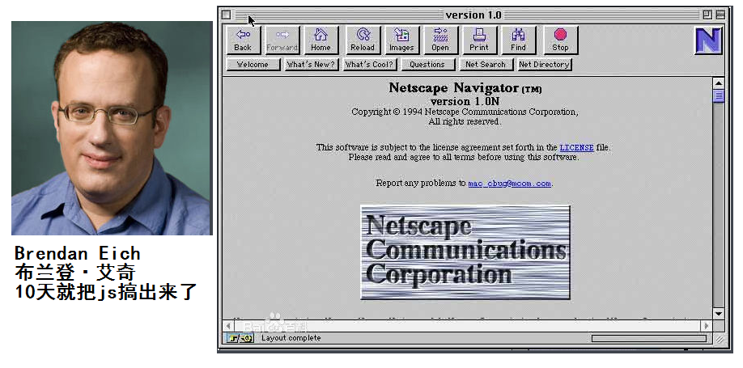
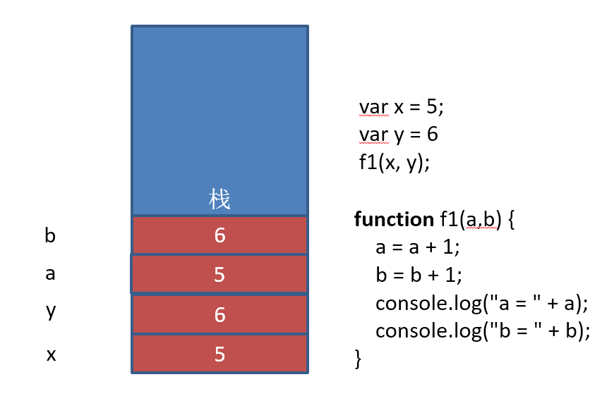

[TOC]

# JavaScript基础

HTML和CSS   京东

## 课前娱乐 
**众人皆笑我疯癫,我笑尔等看不穿**


##课前说明
目标：掌握编程的基本思想
掌握JavaScript的基础语法,使用常见API(备注)完成相应案例及练习和作业
培养独立解决问题能力
遇到问题先独立调试(牛X从规范和调试开始)
能够独立写出所有案例代码
注意：
1. 以大多数同学的接受能力为基准，稳准狠的前行
2. 注重基础，以最简单的案例说明问题，并以企业项目案例进行实践
3. 课上思考，课下提问。不需要深究的地方不要钻牛角尖。
4. 必须完成作业,基础坚挺的同学低调,基础薄弱同学多问
   一句话送给大家:**当你要放弃的时候想想当初为什么坚持到现在！**
   笔记和代码是”大家的”,
   自己写的才是自己的.
   复制代码者,没有”男朋友”
   不写代码者,没有”女朋友”

##阶段说明
JavaScript基础
Web API
JavaScript高级

##第一天重点内容
**变量的声明及使用**
**数据类型**
**类型转换**
**运算符**

##课外提示
1.敲代码用指法,指法配图，坚持一周者即可熟练
2.码农不需要练就一阳指或者二指禅
3.可以使用金山打字通，此处并非打广告,个人建议，天天敲代码，不停的反复的敲练习和作业，速度和基本功的快速提升
奉劝各位:
**保护好自己的手**
**控制自己的右手**

windows中的常用快捷键


##浏览器说明
浏览器是指可以显示网页服务器或者文件系统的HTML文件内容，并让用户与这些文件交互的一种软件。
通俗的讲:可以显示页面的一个软件,
国内网民计算机上常见的网页浏览器有，QQ浏览器、Internet Explorer、Firefox、Safari，Opera、Google Chrome、百度浏览器、搜狗浏览器、猎豹浏览器、360浏览器、UC浏览器、傲游浏览器、世界之窗浏览器等，浏览器是最经常使用到的客户端程序。
常用的五大浏览器：chrome，firefox，Safari，ie，opera
我们用chrome(谷歌浏览器)


## 网页、网站和应用程序

网页：单独的一个页面
网站：一些列相关的页面组成到一起
应用程序：可以和用户产生交互，并实现某种功能。

## 演示JavaScript的强大

http://impress.github.io/impress.js/
http://naotu.baidu.com/ 
https://codecombat.com/
https://ide.codemao.cn/

需要翻墙
https://developers.google.com/blockly/
blockly迷宫
https://blockly-games.appspot.com

blockly迷宫不需要翻墙
https://blockly.uieee.com/

## JavaScript介绍

### JavaScript是什么

HTML CSS 

JavaScript 编程语言   流程控制

Netscape在最初将其脚本语言命名为LiveScript，后来Netscape在与Sun合作之后将其改名为JavaScript。JavaScript最初受Java启发而开始设计的，目的之一就是“看上去像Java”，因此语法上有类似之处，一些名称和命名规范也借自Java。JavaScript与Java名称上的近似，是当时Netscape为了营销考虑与Sun微系统达成协议的结果。Java和JavaScript的关系就像张雨和张雨生的关系，只是名字很像。

​	Java  服务器端的编程语言

​	JavaScript  运行在客户端(浏览器)的编程语言

> JavaScript是一种运行在***客户端*** 的***脚本语言*** 
> JavaScript的解释器被称为JavaScript引擎，为浏览器的一部分，广泛用于客户端的脚本语言，最早是在HTML（标准通用标记语言下的一个应用）网页上使用，用来给HTML网页增加动态功能。



### JavaScript最初的目的

演示：http://baixiu.uieee.com/admin/login.php
最初的目的是为了处理表单的验证操作。

### JavaScript现在的意义(应用场景)

JavaScript 发展到现在几乎无所不能。

1. 网页特效
2. 服务端开发(Node.js)
3. 命令行工具(Node.js)
4. 桌面程序(Electron)
5. App(Cordova)
6. 控制硬件-物联网(Ruff)
7. 游戏开发(cocos2d-js)

### JavaScript和HTML、CSS的区别

1. HTML：提供网页的结构，提供网页中的内容
2. CSS: 用来美化网页
3. JavaScript: 可以用来控制网页内容，给网页增加动态的效果

## JavaScript的组成


### ECMAScript - JavaScript的核心 

ECMA 欧洲计算机制造联合会

网景：JavaScript

微软：JScript

定义了JavaScript的语法规范  

JavaScript的核心，描述了语言的基本语法和数据类型，ECMAScript是一套标准，定义了一种语言的标准与具体实现无关

### BOM - 浏览器对象模型

一套操作浏览器功能的API

通过BOM可以操作浏览器窗口，比如：弹出框、控制浏览器跳转、获取分辨率等

### DOM - 文档对象模型

一套操作页面元素的API

DOM可以把HTML看做是文档树，通过DOM提供的API可以对树上的节点进行操作

## JavaScript初体验

CSS：行内样式、嵌入样式、外部样式

### JavaScript的书写位置 

```
 js的代码可以分三个地方写:
 1.在html的文件中,script的标签中写js代码
 2.js代码可以在html的标签中写---
 3.在js文件中可以写js代码,但是需要在html的页面中引入 script的标签中的src="js的路径"

 在webstorm工具中打开页面:
 1. 右上角有浏览器图标,直接点击即可
 2. 快捷键: Alt+F2 回车或者上下键选择
```

- 写在行内

```html
<input type="button" value="按钮" onclick="alert('Hello World')" />
```

- 写在script标签中

```html
<head>
  <script>
    alert('Hello World!');
  </script>
</head>
```

- 写在外部js文件中，在页面引入

```html
<script src="main.js"></script>
```

- 注意点

  ***引用外部js文件的script标签中不可以写JavaScript代码***

## 计算机组成

### 软件

- 应用软件：浏览器(Chrome/IE/Firefox)、QQ、Sublime、Word
- 系统软件：Windows、Linux、mac OSX

### 硬件

- 三大件：CPU、内存、硬盘    -- 主板
- 输入设备：鼠标、键盘、手写板、摄像头等
- 输出设备：显示器、打印机、投影仪等


## 变量

### 什么是变量

- 什么是变量

  变量是计算机内存中存储数据的标识符，根据变量名称可以获取到内存中存储的数据

- 为什么要使用变量

  使用变量可以方便的获取或者修改内存中的数据

### 如何使用变量

- var声明变量

```javascript
var age;
```

- 变量的赋值

```javascript
var age;
age = 18;
```

- 同时声明多个变量

```javascript
var age, name, sex;
age = 10;
name = 'zs';
```

- 同时声明多个变量并赋值


```javascript
var age = 10, name = 'zs';
```

### 变量在内存中的存储

```javascript
var age = 18;
```


### 变量的命名规则和规范

- 规则 - 必须遵守的，不遵守会报错

  - 由字母、数字、下划线、$符号组成，不能以数字开头

  - 不能是关键字和保留字，例如：for、while。

  - 区分大小写

- 规范 - 建议遵守的，不遵守不会报错

  - 变量名必须有意义
  - 遵守驼峰命名法。首字母小写，后面单词的首字母需要大写。例如：userName、userPassword

- 下面哪些变量名不合法

  ```
  a	    
  1
  age18
  18age
  name
  $name
  _sex
  &sex
  theworld  theWorld
  ```

### 案例练习

1. 交换两个变量的值

    变量的交换的第一个思路:使用第三方的变量进行交换

   ```
          var num1=10;
          var num2=20;
         //把num1这个变量的值取出来放在temp变量中
          var temp=num1;
         //把num2这个变量的值取出来放在num1变量中
          num1=num2;
         //把temp变量的值取出来放在num2变量中
          num2=temp;
   ```
  第二种方式交换:一般适用于数字的交换

   ```
          var num1 = 10;
          var num2 = 20;
          //把num1的变量中的值和num2变量中的值,取出来相加,重新赋值给num1这个变量
          num1 = num1 + num2;//30
          //num1变量的值和num2变量的值取出来,相减的结果重新赋值给num2
          num2 = num1 - num2;//10
          //num1变量的值和num2变量的值取出来,相减的结果重新赋值给num1
          num1 = num1 - num2;//20
   ```

  

2. 不使用临时变量，交换两个数值变量的值

   ```
      // 扩展的变量的交换:只需要看代码,不需要理解---位运算
      var num1 = 10;
       var num2 = 20;
       num1 = num1 ^ num2;
       num2 = num1 ^ num2;
       num1 = num1 ^ num2;
   ```

   ​

## 数据类型

### 简单数据类型

Number、String、Boolean、Undefined、Null

#### Number类型

- 数值字面量：数值的固定值的表示法

  110 1024  60.5

- 进制

```
十进制
	var num = 9;
	进行算数计算时，八进制和十六进制表示的数值最终都将被转换成十进制数值。
十六进制
	var num = 0xA;
	数字序列范围：0~9以及A~F
八进制
    var num1 = 07;   // 对应十进制的7
    var num2 = 019;  // 对应十进制的19
    var num3 = 08;   // 对应十进制的8
    数字序列范围：0~7
    如果字面值中的数值超出了范围，那么前导零将被忽略，后面的数值将被当作十进制数值解析
```

- 浮点数

  - 浮点数的精度问题

```
浮点数
	var n = 5e-324;   // 科学计数法  5乘以10的-324次方  
浮点数值的最高精度是 17 位小数，但在进行算术计算时其精确度远远不如整数
   var result = 0.1 + 0.2;    // 结果不是 0.3，而是：0.30000000000000004
   console.log(0.07 * 100);
   不要判断两个浮点数是否相等
```

- 数值范围

```
最小值：Number.MIN_VALUE，这个值为： 5e-324
最大值：Number.MAX_VALUE，这个值为： 1.7976931348623157e+308
无穷大：Infinity
无穷小：-Infinity
```

- 数值判断

  - NaN：not a number
    - NaN 与任何值都不相等，包括他本身
  - isNaN: is not a number

#### String类型

'abc'   "abc"

- 字符串字面量

  '程序猿'，'程序媛', "黑马程序猿"

  

  思考：如何打印以下字符串。
  我是一个"正直"的人 
  我很喜欢"黑马'程序猿'"

- 转义符

  

- 字符串长度

  length属性用来获取字符串的长度

  ```javascript
  var str = '黑马程序猿 Hello World';
  console.log(str.length);
  ```

- 字符串拼接

  字符串拼接使用 + 连接

  ```javascript
  console.log(11 + 11);
  console.log('hello' + ' world');
  console.log('100' + '100');
  console.log('11' + 11);
  console.log('male:' + true);
  ```

  1. 两边只要有一个是字符串，那么+就是字符串拼接功能
  2. 两边如果都是数字，那么就是算术功能。

#### Boolean类型

- Boolean字面量：  true和false，区分大小写
- 计算机内部存储：true为1，false为0

#### Undefined和Null

1. undefined表示一个声明了没有赋值的变量，变量只声明的时候值默认是undefined
2. null表示一个空，变量的值如果想为null，必须手动设置

### 复杂数据类型

​	Object

### 获取变量的类型

typeof

```javascript
var age = 18;
console.log(typeof age);  // 'number'
```

### 字面量

在源代码中一个固定值的表示法。

数值字面量：8, 9, 10

字符串字面量：'黑马程序员', "大前端"

布尔字面量：true，false

## 注释

### 单行注释

用来描述下面一个或多行代码的作用

```javascript
// 这是一个变量
var name = 'hm';
```

### 多行注释

用来注释多条代码

```javascript
/*
var age = 18;
var name = 'zs';
console.log(name, age);
*/
```

## 数据类型转换

如何使用谷歌浏览器，快速的查看数据类型？

字符串的颜色是黑色的，数值类型是蓝色的，布尔类型也是蓝色的，undefined和null是灰色的

### 转换成字符串类型

- toString()

  ```
  var num = 5;
  console.log(num.toString());
  ```

- String()强制转换

  ```
  String()函数存在的意义：有些值没有toString()，这个时候可以使用String()。比如：undefined和null
  ```

- 拼接字符串方式

  num  +  ""，当 + 两边一个操作符是字符串类型，一个操作符是其它类型的时候，会先把其它类型转换成字符串再进行字符串拼接，返回字符串

### 转换成数值类型

- Number()

  ```
  Number()可以把任意值转换成数值，如果要转换的字符串中有一个不是数值的字符，返回NaN
  想要转数字:Number();要比parseInt(),parseFloat()严格
  ```

- parseInt()

  ```javascript
  var num1 = parseInt("12.3abc");  // 返回12，如果第一个字符是数字会解析知道遇到非数字结束
  var num2 = parseInt("abc123");   // 返回NaN，如果第一个字符不是数字或者符号就返回NaN
  ```

- parseFloat()

  ```
  parseFloat()把字符串转换成浮点数
  parseFloat()和parseInt非常相似，不同之处在与
  	parseFloat会解析第一个. 遇到第二个.或者非数字结束
  	如果解析的内容里只有整数，解析成整数
  ```

- +，-0等运算

  ```javascript
  var str = '500';
  console.log(+str);		// 取正 
  console.log(-str);		// 取负
  console.log(str - 0);    
  ```

### 转换成布尔类型

- Boolean()

0  ''(空字符串) null undefined NaN 会转换成false  其它都会转换成true

## 操作符

运算符  operator 

5 + 6   

表达式  组成 操作数和操作符，会有一个结果

### 算术运算符

```
+ - * / %  
```

### 一元运算符

一元运算符：只有一个操作数的运算符

5 + 6  两个操作数的运算符 二元运算符

++  自身加1

-- 自身减1

- 前置++

  ```javascript
  var num1 = 5;
  ++ num1; 

  var num2 = 6;
  console.log(num1 + ++ num2);
  ```

- 后置++

  ```javascript
  var num1 = 5;
  num1 ++;    
  var num2 = 6 
  console.log(num1 + num2 ++);
  ```

- 猜猜看

  ```javascript
  var a = 1; var b = ++a + ++a; console.log(b);    
  var a = 1; var b = a++ + ++a; console.log(b);    
  var a = 1; var b = a++ + a++; console.log(b);    
  var a = 1; var b = ++a + a++; console.log(b);  
  ```
  **总结**
  **前置++：先加1，后参与运算**
  **后置++：先参与运算，后加1**
  **上面两个理解后，下面两个自通**
  **前置--  ：先减1，后参与运算**
  **后置--  ：先参与运算，后减1**
  ​

### 逻辑运算符(布尔运算符)
	&& 与 两个操作数同时为true，结果为true，否则都是false
	|| 或 两个操作数有一个为true，结果为true，否则为false
	!  非  取反

### 关系运算符(比较运算符)
	<  >  >=  <= == != === !==
```javascript
==与===的区别：==只进行值得比较，===类型和值同时相等，则相等

var result = '55' == 55;  	// true
var result = '55' === 55; 	// false 值相等，类型不相等
var result = 55 === 55; 	// true
```

### 赋值运算符

=   +=   -=   *=   /=   %=
```javascript
例如：
var num = 0;
num += 5;	//相当于  num = num + 5;
```


### 运算符的优先级
	优先级从高到底
		1. ()  优先级最高
		2. 一元运算符  ++   --   !
		3. 算数运算符  先*  /  %   后 +   -
		4. 关系运算符  >   >=   <   <=
		5. 相等运算符   ==   !=    ===    !==
		6. 逻辑运算符 先&&   后||
		7. 赋值运算符

```	javascript
// 练习1：
4 >= 6 || '人' != '阿凡达' && !(12 * 2 == 144) && true
// 练习2：
var num = 10;
5 == num / 2 && (2 + 2 * num).toString() === '22'
```
## 表达式和语句 

### 表达式

>一个表达式可以产生一个值，有可能是运算、函数调用、有可能是字面量。表达式可以放在任何需要值的地方。

### 语句

>语句可以理解为一个行为，循环语句和判断语句就是典型的语句。一个程序有很多个语句组成，一般情况下;分割一个一个的语句
## 流程控制

>程序的三种基本结构

### 顺序结构

 从上到下执行的代码就是顺序结构

**程序默认就是由上到下顺序执行的**

### 分支结构	

根据不同的情况，执行对应代码

### 循环结构

循环结构：重复做一件事情

## 分支结构

### if语句

语法结构

```javascript
if (/* 条件表达式 */) {
  // 执行语句
}
if (/* 条件表达式 */){
  // 成立执行语句
} else {
  // 否则执行语句
}
if (/* 条件1 */){
  // 成立执行语句
} else if (/* 条件2 */){
  // 成立执行语句
} else if (/* 条件3 */){
  // 成立执行语句
} else {
  // 最后默认执行语句
}
```
##### 案例：练习
    求两个数的最大数

```
  var x = 10;
        var y = 15;
        if (x > y) {
            alert("最大数为x" + x)
        } else {
            alert("最大数为y" + y)
        }
```

​    判断一个数是偶数还是奇数

```
 var x = 10;
        if (x % 2 == 0) {
            alert("x是偶数" + x)
        } else {
            alert("x是奇数" + x)
        }
```

​    学生分数评级转换，把百分制转换成ABCDE   <60  E  60-70 D  70-80 C  80-90 B  90 - 100 A

```
        var x = 99;
        if (x < 60) {
            alert("成绩评分为E"+x)
        } else if (60 <= x && x < 70) {
            alert("成绩评分为D"+x)
        }
        else if (70 <= x && x < 80) {
            alert("成绩评分为C"+x)
        }
        else if (80 <= x && x < 90) {
            alert("成绩评分为B"+x)
        }
        else if (90 <= x && x < 100) {
            alert("成绩评分为A"+x)
        }
```

作业：
    判断一个年份是闰年还是平年
      闰年：能被4整除，但不能被100整除的年份 或者 能被400整除的年份

```
     var year = 2020;
        if (year % 4 == 0 && year % 100 != 0 || year % 400 == 0) {
            alert("当前年份是闰年" + year)
        } else {
            alert("当前年份不是闰年" + year)
        }
```

​    判断一个人的年龄是否满18岁(是否成年)

```
  var age = 18;
        if (x>=18){
            alert("当前年龄成年"+age)
        } else {
            alert("当前年龄未成年"+age)
        }
```


### 三元运算符
	表达式1 ? 表达式2 : 表达式3
	是对if……else语句的一种简化写法

案例：
	是否年满18岁
	从两个数中找最大值

```
   //显示成年还是未成年
    var age = 10;
    var result2 = age >= 18 ? "成年了" : "未成年";
    console.log(result2);
```

总结:大多数情况,使用if-else的语句都可以用三元表达式的方式来表示

### switch语句

语法格式:
```javascript
switch (expression) {
  case 常量1:
    语句;
    break;
  case 常量2:
    语句;
    break;
  case 常量3:
    语句;
    break;
  …
  case 常量n:
    语句;
    break;
  default:
    语句;
    break;
}
```
	break可以省略，如果省略，代码会继续执行下一个case
	switch 语句在比较值时使用的是全等操作符, 因此不会发生类型转换（例如，字符串'10' 不等于数值 10）

案例：
	显示星期几


​	素质教育（把分数变成ABCDE）千万不要写100个case哟

```
var rate = "B";
        switch (rate){
            case "A":
                alert("90到100之间");
                break;
            case "B":
                alert("80到90之间");
                break;
            case "C":
                alert("70到80之间");
                break;
            case "D":
                alert("60到70之间");
                break;
            case "E":
                alert("0到59之间");
                break;
            default:
                alert("你的等级无法判定")

        }
```


### 布尔类型的隐式转换

流程控制语句会把后面的值隐式转换成布尔类型

	转换为true   非空字符串  非0数字  true 任何对象
	转换成false  空字符串  0  false  null  undefined

```javascript
// 结果是什么？
var a = !!'123';
```


### 案例

```javascript
var message;
// 会自动把message转换成false
if (message) {     
  // todo...
}
```


## 循环结构

> 在javascript中，循环语句有三种，while、do..while、for循环。

### while语句

基本语法：

```javascript
// 当循环条件为true时，执行循环体，
// 当循环条件为false时，结束循环。
while (循环条件) {
  //循环体
}
```

代码示例：

```javascript
// 计算1-100之间所有数的和
// 初始化变量
var i = 1;
var sum = 0;
// 判断条件
while (i <= 100) {
  // 循环体
  sum += i;
  // 自增
  i++;
}
console.log(sum);
```

案例：
    打印100以内 7的倍数

```
 var i = 0;
        while (i <= 100) {
            if (i % 7 == 0 && i != 0) {
                console.log("100以内 7的倍数" + i)
            }
            i++;
        }
```

​    打印100以内所有偶数

```
   var i = 0;
        while (i <= 100) {
            if (i % 2 == 0 && i != 0) {
                console.log("100以内偶数" + i)
            }
            i++;
        }
```

​    打印100以内所有偶数的和

```
 var i = 0;
        var sum = 0;
        while (i <= 100) {
            if (i % 2 == 0 && i != 0) {
                sum = sum + i;
            }
            i++;
        }
        console.log("100以内偶数的和" + sum)
```

作业：
    打印100以内的奇数

```
		var i = 0;
        while (i <= 100) {
            if (i % 2 != 0 && i != 0) {
                console.log("100以内奇数" + i)
            }
            i++;
        }
```

​    打印100以内的奇数的和

```
 		var i = 0;
        var sum = 0;
        while (i <= 100) {
            if (i % 2 != 0 && i != 0) {
                sum = sum + i;
            }
            i++;
        }
        console.log("100以内奇数的和" + sum)
```


### do...while语句

> do..while循环和while循环非常像，二者经常可以相互替代，但是do..while的特点是不管条件成不成立，都会执行一次。

基础语法：

```javascript
do {
  // 循环体;
} while (循环条件);
```

代码示例：

```javascript
// 初始化变量
var i = 1;
var sum = 0;
do {
  sum += i;//循环体
  i++;//自增
} while (i <= 100);//循环条件
```

案例：使用do-while循环：

求100以内所有3的倍数的和

```
		var i = 0;
        var sum = 0;
        do {
            if (i % 3 == 0 && i != 0) {
                sum = sum + i;
            }

        } while (i <= 100)
```


```

输出询问“我爱你，嫁给我吧？”，选择“你喜欢我吗？(y/n):"，如果输入为y则打印”我们形影不离“，若输入为n,则继续询问 
```

### for语句

>  while和do...while一般用来解决无法确认次数的循环。for循环一般在循环次数确定的时候比较方便

for循环语法：

```javascript
// for循环的表达式之间用的是;号分隔的，千万不要写成,
for (初始化表达式1; 判断表达式2; 自增表达式3) {
  // 循环体4
}
```

执行顺序：1243  ----  243   -----243(直到循环条件变成false)

1. 初始化表达式
2. 判断表达式
3. 自增表达式
4. 循环体

案例：

```
打印1-100之间所有数
 for (i=1;i<=100;i++) {
        console.log(i)
    }
求1-100之间所有数的和
        var sum = 0;
        for (i = 0; i <= 100; i++) {
            sum = sum + i;
        }
        alert("1-100之间所有数的和"+sum)
求1-100之间所有数的平均值
        var sum = 0;
        for (i = 1; i <= 100; i++) {
            sum = sum + i;
        }
        alert("1-100之间所有数的平均值"+sum/100)
求1-100之间所有偶数的和
        var sum = 0;
        for (i = 1; i <= 100; i++) {
            if (i % 2 == 0) {
                sum = sum + i;
            }
        }
        alert("1-100之间所有偶数的和" + sum)
同时求1-100之间所有偶数和奇数的和
        var ouShuSum = 0;
        var jiShuSun = 0
        for (i = 1; i <= 100; i++) {
            if (i % 2 == 0) {
                ouShuSum = ouShuSum + i;
            } else {
                jiShuSun = jiShuSun + i;
            }

        }
        alert("1-100之间所有偶数的和" + ouShuSum+"---1-100之间所有奇数的和"+jiShuSun)
打印正方形
// 使用拼字符串的方法的原因
// console.log 输出重复内容的问题
// console.log 默认输出内容介绍后有换行
var start = '';
for (var i = 0; i < 10; i++) {
  for (var j = 0; j < 10; j++) {
    start += '* ';
  }
  start += '\n';
}
console.log(start);
打印直角三角形
var start = '';
for (var i = 0; i < 10; i++) {
  for (var j = i; j < 10; j++) {
    start += '* ';
  }
  start += '\n';
}
console.log(start);

打印9*9乘法表
var str = '';
for (var i = 1; i <= 9; i++) {
  for (var j = i; j <=9; j++) {
    str += i + ' * ' + j + ' = ' + i * j + '\t';
  }
  str += '\n';
}
console.log(str);
```

作业：

```
求1-100之间所有数的乘积
求1-100之间所有奇数的和
计算1-100之间能3整除的数的和
计算1-100之间不能被7整除的数的和
// 讲解思路。如果不会写程序，可以先把数学公式准备好
本金10000元存入银行，年利率是千分之三，每过1年，将本金和利息相加作为新的本金。计算5年后，获得的本金是多少？
有个人想知道，一年之内一对兔子能繁殖多少对？于是就筑了一道围墙把一对兔子关在里面。已知一对兔子每个月可以生一对小兔子，而一对兔子从出生后第3个月起每月生一对小兔子。假如一年内没有发生死亡现象，那么，一对兔子一年内（12个月）能繁殖成多少对？（兔子的规律为数列，1，1，2，3，5，8，13，21）
```


### continue和break

> break:立即跳出整个循环，即循环结束，开始执行循环后面的内容（直接跳到大括号）
>
> continue:立即跳出当前循环，继续下一次循环（跳到i++的地方）

案例：

```javascript
求整数1～100的累加值，但要求碰到个位为3的数则停止累加
求整数1～100的累加值，但要求跳过所有个位为3的数
```

作业：

求1-100之间不能被7整除的整数的和（用continue）
求200-300之间所有的奇数的和（用continue）
求200-300之间第一个能被7整数的数（break）


### 调试

- 过去调试JavaScript的方式
  - alert()
  - console.log()
- 断点调试

>断点调试是指自己在程序的某一行设置一个断点，调试时，程序运行到这一行就会停住，然后你可以一步一步往下调试，调试过程中可以看各个变量当前的值，出错的话，调试到出错的代码行即显示错误，停下。

- 调试步骤

```javascript
浏览器中按F12-->sources-->找到需要调试的文件-->在程序的某一行设置断点
```

- 调试中的相关操作

```javascript
Watch: 监视，通过watch可以监视变量的值的变化，非常的常用。
F10: 程序单步执行，让程序一行一行的执行，这个时候，观察watch中变量的值的变化。
F8：跳到下一个断点处，如果后面没有断点了，则程序执行结束。
```

tips: ***监视变量，不要监视表达式，因为监视了表达式，那么这个表达式也会执行。***

1. 代码调试的能力非常重要，只有学会了代码调试，才能学会自己解决bug的能力。初学者不要觉得调试代码麻烦就不去调试，知识点花点功夫肯定学的会，但是代码调试这个东西，自己不去练，永远都学不会。
2. 今天学的代码调试非常的简单，只要求同学们记住代码调试的这几个按钮的作用即可，后面还会学到很多的代码调试技巧。

## 数组


### 为什么要学习数组

> 之前学习的数据类型，只能存储一个值(比如：Number/String。我们想存储班级中所有学生的姓名，此时该如何存储？

###  数组的概念

> 所谓数组，就是将多个元素（通常是同一类型）按一定顺序排列放到一个集合中，那么这个集合我们就称之为数组。
### 数组的定义
> 数组是一个有序的列表，可以在数组中存放任意的数据，并且数组的长度可以动态的调整。

通过数组字面量创建数组

```javascript
// 创建一个空数组
var arr1 = []; 
// 创建一个包含3个数值的数组，多个数组项以逗号隔开
var arr2 = [1, 3, 4]; 
// 创建一个包含2个字符串的数组
var arr3 = ['a', 'c']; 

// 可以通过数组的length属性获取数组的长度
console.log(arr3.length);
// 可以设置length属性改变数组中元素的个数
arr3.length = 0;
```

### 获取数组元素

数组的取值

```javascript
// 格式：数组名[下标]	下标又称索引
// 功能：获取数组对应下标的那个值，如果下标不存在，则返回undefined。
var arr = ['red',, 'green', 'blue'];
arr[0];	// red
arr[2]; // blue
arr[3]; // 这个数组的最大下标为2,因此返回undefined
```


### 遍历数组
> 遍历：遍及所有，对数组的每一个元素都访问一次就叫遍历。

数组遍历的基本语法：

```javascript
for(var i = 0; i < arr.length; i++) {
	// 数组遍历的固定结构
}
```
### 数组中新增元素
数组的赋值

```javascript
// 格式：数组名[下标/索引] = 值;
// 如果下标有对应的值，会把原来的值覆盖，如果下标不存在，会给数组新增一个元素。
var arr = ["red", "green", "blue"];
// 把red替换成了yellow
arr[0] = "yellow";
// 给数组新增加了一个pink的值
arr[3] = "pink";
```
### 案例


案例1:求数组中所有元素的和

```

 var arr1 = [10, 20, 30, 40, 50];
    var sum = 0;
    for (var i = 0; i < arr1.length; i++) {
      sum += arr1[i];
    }
    console.log(sum);

```

案例2:求数组中所有元素的平均值
```


     var arr2 = [1, 2, 3, 4, 5];
    var sum2 = 0;
    for (var i = 0; i < arr2.length; i++) {
      sum2 += arr2[i];
    }
    console.log(sum2 / arr2.length);
```

案例3:求一组数中的最大值和最小值，以及所在位置

```
		var arr3 = [1, 3, 2, 5, 10, 100, 50];
        //假设max变量中存储的是最大值
        var max = arr3[0];
        var x = 0;
        for (var i = 0; i < arr3.length; i++) {
            //判断这个变量的值和数组中每个元素的值是不是最大值
            if (max < arr3[i]) {
                max = arr3[i];
                x=i;
            }
        }
        console.log("最大值:" + max+"在数组中的下标位置"+x);
```

//案例4:求数组中所有元素的最小值

```
var arr4 = [100, 10, 20, 30, 40, 50];
var min = arr4[0];//假设min里存储的就是最小值
for (var i = 0; i < arr4.length; i++) {
    if (min > arr4[i]) {
        min = arr4[i];
    }
}
console.log("最小值:" + min);
```

案例5:倒序遍历数组

```
        var arr5 = [10, 20, 30, 40, 50, 100];
        //正序
           for (var i = 0; i < arr5.length; i++) {
             console.log(arr5[i]);
           }
        //倒序
        for (var i = arr5.length - 1; i >= 0; i--) {
            console.log(arr5[i]);
        }
```

案例6:把数组中每个元素用|拼接到一起产生一个字符串并输出

```
 var names = ["卡卡西", "佐助", "鸣人", "大蛇丸", "雏田", "小苏", "凤姐", "黑崎一护"];
        var str = "";//空的字符串
        for (var i = 0; i <= names.length; i++) {
            str += names[i] + "|";
        }
        console.log(str);
```

  案例7:去掉数组中重复的0，把其他的数据放在一个新的数组中

```
			var arr = [10, 0, 20, 0, 30, 0, 50];
           var newArr=[];//新数组,用来存放第一个数组中所有非0的数字
           for(var i=0;i<arr.length;i++){
             if(arr[i]!=0){
               newArr[newArr.length]=arr[i];
             }
           }
           //把新数组的长度作为下标使用,数组的长度是可以改变的
           console.log(newArr);
```

   案例8:反转数组---把数组中的数据的位置调换

```
           var array = [10, 20, 30, 40, 50];
           //循环的目的是控制交换的次数
           for (var i = 0; i < array.length / 2; i++) {
             //先把第一个元素的值放在第三方变量中
             var temp = array[i];
             array[i] = array[array.length - 1 - i];
             array[array.length - 1 - i] = temp;
           }
           console.log(array);

方法2
           for(var i=array.length-1;i>=0;i--){
             console.log(array[i]);
           }
        console.log(array);//50 40 30 20 10
```

//冒泡排序:把所有的数据按照一定的顺序进行排列(从小到大,从大到下)

```
    var arr = [10, 0, 100, 20, 60, 30];
    //循环控制比较的轮数
    for (var i = 0; i < arr.length - 1; i++) {
      //控制每一轮的比较的次数
      for (var j = 0; j < arr.length - 1 - i; j++) {
        if (arr[j] < arr[j + 1]) {
          var temp = arr[j];
          arr[j] = arr[j + 1];
          // arr[j + 1] = temp;
        }
      }
    }
    console.log(arr);
```


```


将字符串数组用|或其他符号分割
要求将数组中的0项去掉，将不为0的值存入一个新的数组，生成新的数组
翻转数组
冒泡排序，从小到大
```

## 函数
### 为什么要有函数

> 如果要在多个地方求1-100之间所有数的和，应该怎么做？

### 什么是函数

>把一段相对独立的具有特定功能的代码块封装起来，形成一个独立实体，就是函数，起个名字（函数名），在后续开发中可以反复调用
>
>函数的作用就是封装一段代码，将来可以重复使用

### 函数的定义

- 函数声明

```javascript
function 函数名(){
  // 函数体
}
```

- 函数表达式

```javascript
var fn = function() {
  // 函数体
}
```

- 特点：

  函数声明的时候，函数体并不会执行，只要当函数被调用的时候才会执行。
  函数一般都用来干一件事情，需用使用动词+名词，表示做一件事情 `tellStory` `sayHello`等

### 函数的调用
- 调用函数的语法：

```javascript
函数名();
```

- 特点：

  函数体只有在调用的时候才会执行，调用需要()进行调用。
  可以调用多次(重复使用)

代码示例：

```javascript
// 声明函数
function sayHi() {
  console.log("吃了没？");
}
// 调用函数
sayHi();

// 求1-100之间所有数的和
function getSum() {
  var sum = 0;
  for (var  i = 0; i < 100; i++) {
    sum += i;
  }
  console.log(sum);
}
// 调用
getSum();
```
### 函数的参数

- 为什么要有参数

```javascript
function getSum() {
  var sum = 0;
  for (var i = 1; i <= 100; i++) {
    sum += i;
  }
  console.log();
}

// 虽然上面代码可以重复调用，但是只能计算1-100之间的值
// 如果想要计算n-m之间所有数的和，应该怎么办呢？
```

- 语法：

```javascript
// 函数内部是一个封闭的环境，可以通过参数的方式，把外部的值传递给函数内部
// 带参数的函数声明
function 函数名(形参1, 形参2, 形参...){
  // 函数体
}

// 带参数的函数调用
函数名(实参1, 实参2, 实参3);
```

- 形参和实参

  > 1. 形式参数：在声明一个函数的时候，为了函数的功能更加灵活，有些值是固定不了的，对于这些固定不了的值。我们可以给函数设置参数。这个参数没有具体的值，仅仅起到一个占位置的作用，我们通常称之为形式参数，也叫形参。
  > 2. 实际参数：如果函数在声明时，设置了形参，那么在函数调用的时候就需要传入对应的参数，我们把传入的参数叫做实际参数，也叫实参。

```javascript
var x = 5, y = 6;
fn(x,y); 
function fn(a, b) {
  console.log(a + b);
}
//x,y实参，有具体的值。函数执行的时候会把x,y复制一份给函数内部的a和b，函数内部的值是复制的新值，无法修改外部的x,y
```

### 案例

- 求1-n之间所有数的和

  ```
        function everySum(x) {
              var sum = 0;
              for (var i = 1; i <= x; i++) {
                  sum += i;
              }
              console.log(sum);
          }
  ```

- 求n-m之间所有数额和

  ```
      function geteverySum2(n, m) {
        var sum = 0;
        for (var i = n; i <= m; i++) {
          sum += i;
        }
        return sum;
      }
  ```

- 圆的面积

  ```
      function getS(r) {
        return Math.PI * r * r;
      }
  ```

  

- 求2个数中的最大值

  ```
          function consoleMax(x, y) {
              console.log(x > y ? x : y);
          }
  ```

  

- 求3个数中的最大值

  ```
          function consoleMax(x, y, z) {
              timp;
              timp = x > y ? x : y;
              timp = timp > z ? timp : z;
              console.log(timp)
          }
  方法2
      function getThreeMax(x, y, z) {
        return x > y ? (x > z ? x : z) : (y > z ? y : z);
      }
  ```

  

- 判断一个数是否是素数(质数),只能被1和自身整除，质数是从2开始

  ```
      //用这个数字和这个数字前面的所有的数字整除一次(没有1的,没有自身的)
      function isPrimeNumber(num) {
          for (var i = 2; i < num; i++) {
              if (num % i == 0) {
                  //说明有一个数字整除了,就没有必要向后继续整除了,此时就已经验证出不是质数
                  return false;
              }
          }
          return true;
      }
  ```

  

### 函数的返回值

>当函数执行完的时候，并不是所有时候都要把结果打印。我们期望函数给我一些反馈（比如计算的结果返回进行后续的运算），这个时候可以让函数返回一些东西。也就是返回值。函数通过return返回一个返回值

返回值语法：

```javascript
//声明一个带返回值的函数
function 函数名(形参1, 形参2, 形参...){
  //函数体
  return 返回值;
}

//可以通过变量来接收这个返回值
var 变量 = 函数名(实参1, 实参2, 实参3);
```

函数的调用结果就是返回值，因此我们可以直接对函数调用结果进行操作。

返回值详解：
    如果函数没有显示的使用 return语句 ，那么函数有默认的返回值：undefined
    如果函数使用 return语句，那么跟再return后面的值，就成了函数的返回值
    如果函数使用 return语句，但是return后面没有任何值，那么函数的返回值也是：undefined
    函数使用return语句后，这个函数会在执行完 return 语句之后停止并立即退出，也就是说return后面的所有其他代码都不会再执行。
    
    推荐的做法是要么让函数始终都返回一个值，要么永远都不要返回值。

### 案例

- 求一个数阶乘

  ```
      function getJieCheng(num) {
        var result = 1;
        for (var i = 1; i <= num; i++) {
          result *= i;
        }
        return result;
      }
  ```

- 求1!+2!+3!+....+n!

  

- 求一组数中的最大值

- 求一组数中的最小值

### arguments的使用

> JavaScript中，arguments对象是比较特别的一个对象，实际上是当前函数的一个内置属性。也就是说所有函数都内置了一个arguments对象，arguments对象中存储了传递的所有的实参。arguments是一个伪数组，因此及可以进行遍历

- 案例
```javascript
求任意个数的最大值
求任意个数的和
```

### 案例

求斐波那契数列Fibonacci中的第n个数是多少？

规律前两个数的和等于后一个人数
1 1 2 3 5 8 13 21 34 55 89 144

```
function getFib(num) {
  var num1=1;
  var num2=1;
  var sum=0;
  for(var i=3;i<=num;i++){
    sum=num1+num2;
    num1=num2;
    num2=sum;
  }
  return sum;
}
```

翻转数组，返回一个新数组
对数组排序，从小到大
输入一个年份，判断是否是闰年[闰年：能被4整数并且不能被100整数，或者能被400整数

```
    function isLeapYear(year) {
        return year % 4 == 0 && year % 100 != 0 || year % 400 == 0;
    }
```

输入某年某月某日，判断这一天是这一年的第几天？

```
        function getDays(year, month, day) {
            //定义变量存储对应的天数
            var days = day;
            //如果用户输入的是一月份,没必要向后算天数,直接返回天数
            if (month == 1) {
                return days;
            }
            //代码执行到这里-----说明用户输入的不是1月份
            //用户输入的是7月份23日----1，2，3  +23
            //定义一个数组,存储每个月份的天数
            var months = [31, 28, 31, 30, 31, 30, 31, 31, 30, 31, 30, 31];
            //当前天数加月份的和等于总天数
            for (var i = 0; i < month - 1; i++) {
                days += months[i];
            }
            //需要判断这个年份是不是闰年,闰年需要加1天
            if (isLeapYear(year) && month > 2) {
                days++;
            }
            return days;
        }
        //判断这个年份是不是闰年
        function isLeapYear(year) {
            return year % 4 == 0 && year % 100 != 0 || year % 400 == 0;
        }
```


## 函数其它

### 匿名函数

> 匿名函数：没有名字的函数

匿名函数如何使用：

	将匿名函数赋值给一个变量，这样就可以通过变量进行调用
	匿名函数自调用

关于自执行函数（匿名函数自调用）的作用：防止全局变量污染。
### 自调用函数
>匿名函数不能通过直接调用来执行，因此可以通过匿名函数的自调用的方式来执行
```javascript
(function () {
  alert(123);
})();
```
### 函数是一种数据类型

```javascript
function fn() {}
console.log(typeof fn);//函数的类型为function
```

- 函数作为参数

因为函数也是一种类型，可以把函数作为两一个函数的参数，在两一个函数中调用

- 函数做为返回值

因为函数是一种类型，所以可以把函数可以作为返回值从函数内部返回，这种用法在后面很常见。

```javascript
function fn(b) {
  var a = 10;
  return function () {
    alert(a+b);
  }
}
fn(15)();
```

### 代码规范
    1.命名规范	
    2.变量规范   
    	var name = 'zs';	
    3.注释规范
    	// 这里是注释
    4.空格规范
    5.换行规范
    	var arr = [1, 2, 3, 4];
    	if (a > b) {
          
    	}
    	for(var i = 0; i < 10; i++) {
          
    	}
    	function fn() {
          
    	}

## 作用域
作用域：变量可以起作用的范围

### 全局变量和局部变量

- 全局变量

  ​在任何地方都可以访问到的变量就是全局变量，对应全局作用域

- 局部变量

  ​只在固定的代码片段内可访问到的变量，最常见的例如函数内部。对应局部作用域(函数作用域)

```
不使用var声明的变量是全局变量，不推荐使用。
变量退出作用域之后会销毁，全局变量关闭网页或浏览器才会销毁
```

### 块级作用域

任何一对花括号（｛和｝）中的语句集都属于一个块，在这之中定义的所有变量在代码块外都是不可见的，我们称之为块级作用域。
**在es5之前没有块级作用域的的概念,只有函数作用域**，现阶段可以认为JavaScript没有块级作用域

### 词法作用域
变量的作用域是在定义时决定而不是执行时决定，也就是说词法作用域取决于源码，通过静态分析就能确定，因此词法作用域也叫做静态作用域。

**在 js 中词法作用域规则:**

- 函数允许访问函数外的数据.
- 整个代码结构中只有函数可以限定作用域.
- 作用域规则首先使用提升规则分析
- 如果当前作用规则中有名字了, 就不考虑外面的名字

```javascript
var num = 123;
function foo() {
  console.log( num );
}
foo();

if ( false ) {
    var num = 123;
}
console.log( num ); // undefiend
```

### 作用域链
	只有函数可以制造作用域结构， 那么只要是代码，就至少有一个作用域, 即全局作用域。凡是代码中有函数，那么这个函数就构成另一个作用域。如果函数中还有函数，那么在这个作用域中就又可以诞生一个作用域。
	
	将这样的所有的作用域列出来，可以有一个结构: 函数内指向函数外的链式结构。就称作作用域链。
```javascript
// 案例1：
function f1() {
    function f2() {
    }
}

var num = 456;
function f3() {
    function f4() {    
    }
}
```


```javascript
// 案例2
function f1() {
    var num = 123;
    function f2() {
        console.log( num );
    }
    f2();
}
var num = 456;
f1();
```


## 预解析

> JavaScript代码的执行是由浏览器中的JavaScript解析器来执行的。JavaScript解析器执行JavaScript代码的时候，分为两个过程：预解析过程和代码执行过程

预解析过程：

1. 把变量的声明提升到当前作用域的最前面，只会提升声明，不会提升赋值。
2. 把函数的声明提升到当前作用域的最前面，只会提升声明，不会提升调用。
3. 先提升var，在提升function


JavaScript的执行过程

```javascript
var a = 25;
function abc (){
  alert(a);//undefined
  var a = 10;
}
abc();
// 如果变量和函数同名的话，函数优先
console.log(a);
function a() {
  console.log('aaaaa');
}
var a = 1;
console.log(a);
```


### 全局解析规则
### 函数内部解析规则
### 变量提升

- 变量提升

  定义变量的时候，变量的声明会被提升到作用域的最上面，变量的赋值不会提升。

- 函数提升

  JavaScript解析器首先会把当前作用域的函数声明提前到整个作用域的最前面

```javascript
// 1、-----------------------------------
var num = 10;
fun();
function fun() {
  console.log(num);
  var num = 20;
}
//2、-----------------------------------
var a = 18;
f1();
function f1() {
  var b = 9;
  console.log(a);
  console.log(b);
  var a = '123';
}
// 3、-----------------------------------
f1();
console.log(c);
console.log(b);
console.log(a);
function f1() {
  var a = b = c = 9;
  console.log(a);
  console.log(b);
  console.log(c);
}
```

## 对象

### 为什么要有对象

```javascript
function printPerson(name, age, sex....) {
}
// 函数的参数如果特别多的话，可以使用对象简化
function printPerson(person) {
  console.log(person.name);
  ……
}
```

### 什么是对象

```
现实生活中：万物皆对象，对象是一个具体的事物，一个具体的事物就会有行为和特征。
举例： 一部车，一个手机
车是一类事物，门口停的那辆车才是对象
	特征：红色、四个轮子
	行为：驾驶、刹车
```

### JavaScript中的对象
```
JavaScript中的对象其实就是生活中对象的一个抽象
JavaScript的对象是无序属性的集合。
	其属性可以包含基本值、对象或函数。对象就是一组没有顺序的值。我们可以把JavaScript中的对象想象成键值对，其中值可以是数据和函数。
对象的行为和特征
	特征---属性
	行为---方法
```

+ 事物的特征在对象中用属性来表示。
+ 事物的行为在对象中用方法来表示。

### 对象字面量
> 字面量：11 'abc'  true  [] {}等

```javascript
var o = {
  name: 'zs,
  age: 18,
  sex: true,
  sayHi: function () {
    console.log(this.name);
  }
};
```

思考：

```javascript
如何把学生对象、老师对象、英雄对象改写成字面量的方式
```
### 对象创建方式

- 对象字面量

```javascript
var o = {
  name: 'zs',
  age: 18,
  sex: true,
  sayHi: function () {
    console.log(this.name);
  }
};   
```

- new Object()创建对象

```javascript
var person = new Object();
  person.name = 'lisi';
  person.age = 35;
  person.job = 'actor';
  person.sayHi = function(){
  console.log('Hello,everyBody');
}
```
- 工厂函数创建对象
```javascript
function createPerson(name, age, job) {
  var person = new Object();
  person.name = name;
  person.age = age;
  person.job = job;
  person.sayHi = function(){
    console.log('Hello,everyBody');
  }
  return person;
}
var p1 = createPerson('张三', 22, 'actor');
```
- 自定义构造函数
```javascript
function Person(name,age,job){
  this.name = name;
  this.age = age;
  this.job = job;
  this.sayHi = function(){
  	console.log('Hello,everyBody');
  }
}
var p1 = new Person('张三', 22, 'actor');
```
### 属性和方法
	如果一个变量属于一个对象所有，那么该变量就可以称之为该对象的一个属性，属性一般是名词，用来描述事物的特征
	如果一个函数属于一个对象所有，那么该函数就可以称之为该对象的一个方法，方法是动词，描述事物的行为和功能
### new关键字
> 构造函数 ，是一种特殊的函数。主要用来在创建对象时初始化对象， 即为对象成员变量赋初始值，总与new运算符一起使用在创建对象的语句中。

1. 构造函数用于创建一类对象，首字母要大写。
2. 构造函数要和new一起使用才有意义。

new在执行时会做四件事情

```
new会在内存中创建一个新的空对象
new 会让this指向这个新的对象
执行构造函数  目的：给这个新对象加属性和方法
new会返回这个新对象
```
### this详解
	JavaScript中的this指向问题，有时候会让人难以捉摸，随着学习的深入，我们可以逐渐了解
	现在我们需要掌握函数内部的this几个特点
		1. 函数在定义的时候this是不确定的，只有在调用的时候才可以确定
		2. 一般函数直接执行，内部this指向全局window
		3. 函数作为一个对象的方法，被该对象所调用，那么this指向的是该对象
		4. 构造函数中的this其实是一个隐式对象，类似一个初始化的模型，所有方法和属性都挂载到了这个隐式对象身上，后续通过new关键字来调用，从而实现实例化
## 对象的使用

### 遍历对象的属性
> 通过for..in语法可以遍历一个对象

```javascript
var obj = {};
for (var i = 0; i < 10; i++) {
  obj[i] = i * 2;
}
for(var key in obj) {
  console.log(key + "==" + obj[key]);
}
```
### 删除对象的属性
```javascript
function fun() { 
  this.name = 'mm';
}
var obj = new fun(); 
console.log(obj.name); // mm 
delete obj.name;
console.log(obj.name); // undefined
```

### 简单类型和复杂类型的区别
>基本类型又叫做值类型，复杂类型又叫做引用类型
>
>值类型：简单数据类型，基本数据类型，在存储时，变量中存储的是值本身，因此叫做值类型。
>
>引用类型：复杂数据类型，在存储是，变量中存储的仅仅是地址（引用），因此叫做引用数据类型。

- 堆和栈

  ```
  堆栈空间分配区别：
  　　1、栈（操作系统）：由操作系统自动分配释放 ，存放函数的参数值，局部变量的值等。其操作方式类似于数据结构中的栈；
  　　2、堆（操作系统）： 存储复杂类型(对象)，一般由程序员分配释放， 若程序员不释放，由垃圾回收机制回收，分配方式倒是类似于链表。
  ```

- 注意：JavaScript中没有堆和栈的概念，此处我们用堆和栈来讲解，目的方便理解和方便以后的学习。


#### 基本类型在内存中的存储


#### 复杂类型在内存中的存储


#### 基本类型作为函数的参数



#### 复杂类型作为函数的参数


```javascript
// 下面代码输出的结果
function Person(name,age,salary) {
  this.name = name;
  this.age = age;
  this.salary = salary;
}
function f1(person) {
  person.name = "ls";
  person = new Person("aa",18,10);
}

var p = new Person("zs",18,1000);
console.log(p.name);
f1(p);
console.log(p.name);
```

思考：

```javascript
//1. 
var num1 = 10;
var num2 = num1;
num1 = 20;
console.log(num1);
console.log(num2);

//2. 
var num = 50;
function f1(num) {
    num = 60;
    console.log(num);
}
f1(num);
console.log(num);

//3. 
var num1 = 55;
var num2 = 66;
function f1(num, num1) {
  num = 100;
  num1 = 100;
  num2 = 100;
  console.log(num);
  console.log(num1);
  console.log(num2);
}

f1(num1, num2);
console.log(num1);
console.log(num2);
console.log(num);
```
## 内置对象

JavaScript中的对象分为3种：内置对象、浏览器对象、自定义对象

JavaScript 提供多个内置对象：Math/Array/Number/String/Boolean...

对象只是带有**属性**和**方法**的特殊数据类型。

学习一个内置对象的使用，只要学会其常用的成员的使用（通过查文档学习）

可以通过MDN/W3C来查询

内置对象的方法很多，我们只需要知道内置对象提供的常用方法，使用的时候查询文档。

### MDN

Mozilla 开发者网络（MDN）提供有关开放网络技术（Open Web）的信息，包括 HTML、CSS 和万维网及 HTML5 应用的 API。

- [MDN](https://developer.mozilla.org/zh-CN/)
- 通过查询MDN学习Math对象的random()方法的使用


### 如何学习一个方法？

1. 方法的功能
2. 参数的意义和**类型**
3. 返回值意义和**类型**
4. demo进行测试

### Math对象

####  Math 对象属性

| 属性                                                         | 描述                                              |
| ------------------------------------------------------------ | ------------------------------------------------- |
| [E](http://www.w3school.com.cn/jsref/jsref_e.asp)            | 返回算术常量 e，即自然对数的底数（约等于2.718）。 |
| [LN2](http://www.w3school.com.cn/jsref/jsref_ln2.asp)        | 返回 2 的自然对数（约等于0.693）。                |
| [LN10](http://www.w3school.com.cn/jsref/jsref_ln10.asp)      | 返回 10 的自然对数（约等于2.302）。               |
| [LOG2E](http://www.w3school.com.cn/jsref/jsref_log2e.asp)    | 返回以 2 为底的 e 的对数（约等于 1.414）。        |
| [LOG10E](http://www.w3school.com.cn/jsref/jsref_log10e.asp)  | 返回以 10 为底的 e 的对数（约等于0.434）。        |
| [PI](http://www.w3school.com.cn/jsref/jsref_pi.asp)          | 返回圆周率（约等于3.14159）。                     |
| [SQRT1_2](http://www.w3school.com.cn/jsref/jsref_sqrt1_2.asp) | 返回返回 2 的平方根的倒数（约等于 0.707）。       |
| [SQRT2](http://www.w3school.com.cn/jsref/jsref_sqrt2.asp)    | 返回 2 的平方根（约等于 1.414）。                 |

#### Math 对象方法

| 方法                                                         | 描述                                                         |
| ------------------------------------------------------------ | ------------------------------------------------------------ |
| [abs(x)](http://www.w3school.com.cn/jsref/jsref_abs.asp)     | 返回数的绝对值。                                             |
| [acos(x)](http://www.w3school.com.cn/jsref/jsref_acos.asp)   | 返回数的反余弦值。                                           |
| [asin(x)](http://www.w3school.com.cn/jsref/jsref_asin.asp)   | 返回数的反正弦值。                                           |
| [atan(x)](http://www.w3school.com.cn/jsref/jsref_atan.asp)   | 以介于 -PI/2 与 PI/2 弧度之间的数值来返回 x 的反正切值。     |
| [atan2(y,x)](http://www.w3school.com.cn/jsref/jsref_atan2.asp) | 返回从 x 轴到点 (x,y) 的角度（介于 -PI/2 与 PI/2 弧度之间）。 |
| [ceil(x)](http://www.w3school.com.cn/jsref/jsref_ceil.asp)   | 对数进行上舍入。                                             |
| [cos(x)](http://www.w3school.com.cn/jsref/jsref_cos.asp)     | 返回数的余弦。                                               |
| [exp(x)](http://www.w3school.com.cn/jsref/jsref_exp.asp)     | 返回 e 的指数。                                              |
| [floor(x)](http://www.w3school.com.cn/jsref/jsref_floor.asp) | 对数进行下舍入。                                             |
| [log(x)](http://www.w3school.com.cn/jsref/jsref_log.asp)     | 返回数的自然对数（底为e）。                                  |
| [max(x,y)](http://www.w3school.com.cn/jsref/jsref_max.asp)   | 返回 x 和 y 中的最高值。                                     |
| [min(x,y)](http://www.w3school.com.cn/jsref/jsref_min.asp)   | 返回 x 和 y 中的最低值。                                     |
| [pow(x,y)](http://www.w3school.com.cn/jsref/jsref_pow.asp)   | 返回 x 的 y 次幂。                                           |
| [random()](http://www.w3school.com.cn/jsref/jsref_random.asp) | 返回 0 ~ 1 之间的随机数。                                    |
| [round(x)](http://www.w3school.com.cn/jsref/jsref_round.asp) | 把数四舍五入为最接近的整数。                                 |
| [sin(x)](http://www.w3school.com.cn/jsref/jsref_sin.asp)     | 返回数的正弦。                                               |
| [sqrt(x)](http://www.w3school.com.cn/jsref/jsref_sqrt.asp)   | 返回数的平方根。                                             |
| [tan(x)](http://www.w3school.com.cn/jsref/jsref_tan.asp)     | 返回角的正切。                                               |
| [toSource()](http://www.w3school.com.cn/jsref/jsref_tosource_math.asp) | 返回该对象的源代码。                                         |
| [valueOf()](http://www.w3school.com.cn/jsref/jsref_valueof_math.asp) | 返回 Math 对象的原始值。                                     |

 

Math对象不是构造函数，它具有数学常数和函数的属性和方法，都是以静态成员的方式提供

跟数学相关的运算来找Math中的成员（求绝对值，取整）

[Math](https://developer.mozilla.org/zh-CN/docs/Web/JavaScript/Reference/Global_Objects/Math)

演示：Math.PI、Math.random()、Math.floor()/Math.ceil()、Math.round()、Math.abs()	、Math.max()

```javascript
Math.PI						// 圆周率
Math.random()				// 生成随机数
Math.floor()/Math.ceil()	 // 向下取整/向上取整
Math.round()				// 取整，四舍五入
Math.abs()					// 绝对值
Math.max()/Math.min()		 // 求最大和最小值

Math.sin()/Math.cos()		 // 正弦/余弦
Math.power()/Math.sqrt()	 // 求指数次幂/求平方根
```

#### 案例

- 求10-20之间的随机数
- 随机生成颜色RGB
- 模拟实现max()/min()

### Date对象

创建 `Date` 实例用来处理日期和时间。Date 对象基于1970年1月1日（世界标准时间）起的毫秒数。

#### Date 对象属性

| 属性                                                         | 描述                                 |
| ------------------------------------------------------------ | ------------------------------------ |
| [constructor](http://www.w3school.com.cn/jsref/jsref_constructor_date.asp) | 返回对创建此对象的 Date 函数的引用。 |
| [prototype](http://www.w3school.com.cn/jsref/jsref_prototype_date.asp) | 使您有能力向对象添加属性和方法。     |

#### Date 对象方法

| 方法                                                         | 描述                                                   |
| ------------------------------------------------------------ | ------------------------------------------------------ |
| [Date()](http://www.w3school.com.cn/jsref/jsref_Date.asp)    | 返回当日的日期和时间。                                 |
| [getDate()](http://www.w3school.com.cn/jsref/jsref_getDate.asp) | 从 Date 对象返回一个月中的某一天 (1 ~ 31)。            |
| [getDay()](http://www.w3school.com.cn/jsref/jsref_getDay.asp) | 从 Date 对象返回一周中的某一天 (0 ~ 6)。               |
| [getMonth()](http://www.w3school.com.cn/jsref/jsref_getMonth.asp) | 从 Date 对象返回月份 (0 ~ 11)。                        |
| [getFullYear()](http://www.w3school.com.cn/jsref/jsref_getFullYear.asp) | 从 Date 对象以四位数字返回年份。                       |
| [getYear()](http://www.w3school.com.cn/jsref/jsref_getYear.asp) | 请使用 getFullYear() 方法代替。                        |
| [getHours()](http://www.w3school.com.cn/jsref/jsref_getHours.asp) | 返回 Date 对象的小时 (0 ~ 23)。                        |
| [getMinutes()](http://www.w3school.com.cn/jsref/jsref_getMinutes.asp) | 返回 Date 对象的分钟 (0 ~ 59)。                        |
| [getSeconds()](http://www.w3school.com.cn/jsref/jsref_getSeconds.asp) | 返回 Date 对象的秒数 (0 ~ 59)。                        |
| [getMilliseconds()](http://www.w3school.com.cn/jsref/jsref_getMilliseconds.asp) | 返回 Date 对象的毫秒(0 ~ 999)。                        |
| [getTime()](http://www.w3school.com.cn/jsref/jsref_getTime.asp) | 返回 1970 年 1 月 1 日至今的毫秒数。                   |
| [getTimezoneOffset()](http://www.w3school.com.cn/jsref/jsref_getTimezoneOffset.asp) | 返回本地时间与格林威治标准时间 (GMT) 的分钟差。        |
| [getUTCDate()](http://www.w3school.com.cn/jsref/jsref_getUTCDate.asp) | 根据世界时从 Date 对象返回月中的一天 (1 ~ 31)。        |
| [getUTCDay()](http://www.w3school.com.cn/jsref/jsref_getUTCDay.asp) | 根据世界时从 Date 对象返回周中的一天 (0 ~ 6)。         |
| [getUTCMonth()](http://www.w3school.com.cn/jsref/jsref_getUTCMonth.asp) | 根据世界时从 Date 对象返回月份 (0 ~ 11)。              |
| [getUTCFullYear()](http://www.w3school.com.cn/jsref/jsref_getUTCFullYear.asp) | 根据世界时从 Date 对象返回四位数的年份。               |
| [getUTCHours()](http://www.w3school.com.cn/jsref/jsref_getUTCHours.asp) | 根据世界时返回 Date 对象的小时 (0 ~ 23)。              |
| [getUTCMinutes()](http://www.w3school.com.cn/jsref/jsref_getUTCMinutes.asp) | 根据世界时返回 Date 对象的分钟 (0 ~ 59)。              |
| [getUTCSeconds()](http://www.w3school.com.cn/jsref/jsref_getUTCSeconds.asp) | 根据世界时返回 Date 对象的秒钟 (0 ~ 59)。              |
| [getUTCMilliseconds()](http://www.w3school.com.cn/jsref/jsref_getUTCMilliseconds.asp) | 根据世界时返回 Date 对象的毫秒(0 ~ 999)。              |
| [parse()](http://www.w3school.com.cn/jsref/jsref_parse.asp)  | 返回1970年1月1日午夜到指定日期（字符串）的毫秒数。     |
| [setDate()](http://www.w3school.com.cn/jsref/jsref_setDate.asp) | 设置 Date 对象中月的某一天 (1 ~ 31)。                  |
| [setMonth()](http://www.w3school.com.cn/jsref/jsref_setMonth.asp) | 设置 Date 对象中月份 (0 ~ 11)。                        |
| [setFullYear()](http://www.w3school.com.cn/jsref/jsref_setFullYear.asp) | 设置 Date 对象中的年份（四位数字）。                   |
| [setYear()](http://www.w3school.com.cn/jsref/jsref_setYear.asp) | 请使用 setFullYear() 方法代替。                        |
| [setHours()](http://www.w3school.com.cn/jsref/jsref_setHours.asp) | 设置 Date 对象中的小时 (0 ~ 23)。                      |
| [setMinutes()](http://www.w3school.com.cn/jsref/jsref_setMinutes.asp) | 设置 Date 对象中的分钟 (0 ~ 59)。                      |
| [setSeconds()](http://www.w3school.com.cn/jsref/jsref_setSeconds.asp) | 设置 Date 对象中的秒钟 (0 ~ 59)。                      |
| [setMilliseconds()](http://www.w3school.com.cn/jsref/jsref_setMilliseconds.asp) | 设置 Date 对象中的毫秒 (0 ~ 999)。                     |
| [setTime()](http://www.w3school.com.cn/jsref/jsref_setTime.asp) | 以毫秒设置 Date 对象。                                 |
| [setUTCDate()](http://www.w3school.com.cn/jsref/jsref_setUTCDate.asp) | 根据世界时设置 Date 对象中月份的一天 (1 ~ 31)。        |
| [setUTCMonth()](http://www.w3school.com.cn/jsref/jsref_setUTCMonth.asp) | 根据世界时设置 Date 对象中的月份 (0 ~ 11)。            |
| [setUTCFullYear()](http://www.w3school.com.cn/jsref/jsref_setUTCFullYear.asp) | 根据世界时设置 Date 对象中的年份（四位数字）。         |
| [setUTCHours()](http://www.w3school.com.cn/jsref/jsref_setutchours.asp) | 根据世界时设置 Date 对象中的小时 (0 ~ 23)。            |
| [setUTCMinutes()](http://www.w3school.com.cn/jsref/jsref_setUTCMinutes.asp) | 根据世界时设置 Date 对象中的分钟 (0 ~ 59)。            |
| [setUTCSeconds()](http://www.w3school.com.cn/jsref/jsref_setUTCSeconds.asp) | 根据世界时设置 Date 对象中的秒钟 (0 ~ 59)。            |
| [setUTCMilliseconds()](http://www.w3school.com.cn/jsref/jsref_setUTCMilliseconds.asp) | 根据世界时设置 Date 对象中的毫秒 (0 ~ 999)。           |
| [toSource()](http://www.w3school.com.cn/jsref/jsref_tosource_boolean.asp) | 返回该对象的源代码。                                   |
| [toString()](http://www.w3school.com.cn/jsref/jsref_toString_date.asp) | 把 Date 对象转换为字符串。                             |
| [toTimeString()](http://www.w3school.com.cn/jsref/jsref_toTimeString.asp) | 把 Date 对象的时间部分转换为字符串。                   |
| [toDateString()](http://www.w3school.com.cn/jsref/jsref_toDateString.asp) | 把 Date 对象的日期部分转换为字符串。                   |
| [toGMTString()](http://www.w3school.com.cn/jsref/jsref_toGMTString.asp) | 请使用 toUTCString() 方法代替。                        |
| [toUTCString()](http://www.w3school.com.cn/jsref/jsref_toUTCString.asp) | 根据世界时，把 Date 对象转换为字符串。                 |
| [toLocaleString()](http://www.w3school.com.cn/jsref/jsref_toLocaleString.asp) | 根据本地时间格式，把 Date 对象转换为字符串。           |
| [toLocaleTimeString()](http://www.w3school.com.cn/jsref/jsref_toLocaleTimeString.asp) | 根据本地时间格式，把 Date 对象的时间部分转换为字符串。 |
| [toLocaleDateString()](http://www.w3school.com.cn/jsref/jsref_toLocaleDateString.asp) | 根据本地时间格式，把 Date 对象的日期部分转换为字符串。 |
| [UTC()](http://www.w3school.com.cn/jsref/jsref_utc.asp)      | 根据世界时返回 1970 年 1 月 1 日 到指定日期的毫秒数。  |
| [valueOf()](http://www.w3school.com.cn/jsref/jsref_valueOf_date.asp) | 返回 Date 对象的原始值。                               |

 

```
//1.声明
var myDate = new Date(); //系统当前时间
var myDate = new Date(yyyy, mm, dd, hh, mm, ss);
var myDate = new Date(yyyy, mm, dd);
var myDate = new Date(“monthName dd, yyyy hh:mm:ss”);
var myDate = new Date(“monthName dd, yyyy”);
var myDate = new Date(epochMilliseconds);

//2.获取时间的某部份
var myDate = new Date();
myDate.getYear(); //获取当前年份(2位)
myDate.getFullYear(); //获取完整的年份(4位,1970-????)
myDate.getMonth(); //获取当前月份(0-11,0代表1月)
myDate.getDate(); //获取当前日(1-31)
myDate.getDay(); //获取当前星期X(0-6,0代表星期天)
myDate.getTime(); //获取当前时间(从1970.1.1开始的毫秒数) 时间戳！！
myDate.getHours(); //获取当前小时数(0-23)
myDate.getMinutes(); //获取当前分钟数(0-59)
myDate.getSeconds(); //获取当前秒数(0-59)
myDate.getMilliseconds(); //获取当前毫秒数(0-999)
myDate.toLocaleDateString(); //获取当前日期
 
myDate.toLocaleTimeString(); //获取当前时间,有兼容问题
 
myDate.toLocaleString( ); //获取日期与时间,有兼容问题
 
//3.计算之前或未来的时间
 
var myDate = new Date();
 
myDate.setDate(myDate.getDate() + 10); //当前时间加10天
 
//类似的方法都基本相同,以set开头,具体参考第2点
 
//4.计算两个日期的偏移量
 
var i = daysBetween(beginDate,endDate); //返回天数
 
var i = beginDate.getTimezoneOffset(endDate); //返回分钟数
 
//5.检查有效日期
 
//checkDate() 只允许”mm-dd-yyyy”或”mm/dd/yyyy”两种格式的日期
 
if( checkDate(“2006-01-01”) ){ }
 
//正则表达式(自己写的检查 yyyy-mm-dd, yy-mm-dd, yyyy/mm/dd, yy/mm/dd 四种)
 
var r = /^(\d{2}|\d{4})[\/-]\d{1,2}[\/-]\d{1,2}$/;
 
if( r.test( myString ) ){ }

```


~~~javascript
// 获取当前时间，UTC世界时间，距1970年1月1日（世界标准时间）起的毫秒数
var now = new Date();
console.log(now.valueOf());	// 获取距1970年1月1日（世界标准时间）起的毫秒数

Date构造函数的参数
1. 毫秒数 1498099000356		new Date(1498099000356)
2. 日期格式字符串  '2015-5-1'	 new Date('2015-5-1')
3. 年、月、日……				  new Date(2015, 4, 1)   // 月份从0开始
~~~

- 获取日期的毫秒形式

```javascript
var now = new Date();
// valueOf用于获取对象的原始值
console.log(date.valueOf())	

// HTML5中提供的方法，有兼容性问题
var now = Date.now();	

// 不支持HTML5的浏览器，可以用下面这种方式
var now = + new Date();			// 调用 Date对象的valueOf() 
```

- 日期格式化方法

```javascript
toString()		// 转换成字符串
valueOf()		// 获取毫秒值
// 下面格式化日期的方法，在不同浏览器可能表现不一致，一般不用
toDateString()
toTimeString()
toLocaleDateString()
toLocaleTimeString()
```

- 获取日期指定部分

```javascript
getTime()  	  // 返回毫秒数和valueOf()结果一样，valueOf()内部调用的getTime()	//返回时间戳
getMilliseconds() 	//当前毫秒数
getSeconds()  // 当前秒
getMinutes()  // 当前分钟
getHours()    // 返回当前小时 0-23
getDay()      // 返回星期几 0周日   6周6
getDate()     // 返回当前月的第几天,返回标准国际时间
getMonth()    // 返回月份，***从0开始***
getFullYear() //返回4位的年份  如 2016
```

#### 案例

- 写一个函数，格式化日期对象，返回yyyy-MM-dd HH:mm:ss的形式

```javascript
function formatDate(d) {
  //如果date不是日期对象，返回
  if (!date instanceof Date) {
    return;
  }
  var year = d.getFullYear(),
      month = d.getMonth() + 1, 
      date = d.getDate(), 
      hour = d.getHours(), 
      minute = d.getMinutes(), 
      second = d.getSeconds();
  month = month < 10 ? '0' + month : month;
  date = date < 10 ? '0' + date : date;
  hour = hour < 10 ? '0' + hour : hour;
  minute = minute < 10 ? '0' + minute:minute;
  second = second < 10 ? '0' + second:second;
  return year + '-' + month + '-' + date + ' ' + hour + ':' + minute + ':' + second;
}
```

- 计算时间差，返回相差的天/时/分/秒

```javascript
function getInterval(start, end) {
  var day, hour, minute, second, interval;
  interval = end - start;
  interval /= 1000;
  day = Math.round(interval / 60 /60 / 24);
  hour = Math.round(interval / 60 /60 % 24);
  minute = Math.round(interval / 60 % 60);
  second = Math.round(interval % 60);
  return {
    day: day,
    hour: hour,
    minute: minute,
    second: second
  }
}
```

### Array对象

- 创建数组对象的两种方式
  - 字面量方式
  - new Array()

```javascript
// 1. 使用构造函数创建数组对象
// 创建了一个空数组
var arr = new Array();
// 创建了一个数组，里面存放了3个字符串
var arr = new Array('zs', 'ls', 'ww');
// 创建了一个数组，里面存放了4个数字
var arr = new Array(1, 2, 3, 4);


// 2. 使用字面量创建数组对象
var arr = [1, 2, 3];

// 获取数组中元素的个数
console.log(arr.length);
```

- 检测一个对象是否是数组

  - instanceof  			array instanceof Array    返回真假
  - Array.isArray()     HTML5中提供的方法，有兼容性问题

  函数的参数，如果要求是一个数组的话，可以用这种方式来进行判断

- toString()/valueOf()

  - toString()		把数组转换成字符串，逗号分隔每一项
  - valueOf()         返回数组对象本身

- 数组常用方法

  演示：push()、shift()、unshift()、reverse()、sort()、splice()、indexOf()

  #### Array 对象属性

  | 属性                                                         | 描述                               |
  | ------------------------------------------------------------ | ---------------------------------- |
  | [constructor](http://www.w3school.com.cn/jsref/jsref_constructor_array.asp) | 返回对创建此对象的数组函数的引用。 |
  | [length](http://www.w3school.com.cn/jsref/jsref_length_array.asp) | 设置或返回数组中元素的数目。       |
  | [prototype](http://www.w3school.com.cn/jsref/jsref_prototype_array.asp) | 使您有能力向对象添加属性和方法。   |

  #### Array 对象方法

  | 方法                                                         | 描述                                                         |
  | ------------------------------------------------------------ | ------------------------------------------------------------ |
  | [concat()](http://www.w3school.com.cn/jsref/jsref_concat_array.asp) | 连接两个或更多的数组，并返回结果。                           |
  | [join()](http://www.w3school.com.cn/jsref/jsref_join.asp)    | 把数组的所有元素放入一个字符串。元素通过指定的分隔符进行分隔。 |
  | [pop()](http://www.w3school.com.cn/jsref/jsref_pop.asp)      | 删除并返回数组的最后一个元素                                 |
  | [push()](http://www.w3school.com.cn/jsref/jsref_push.asp)    | 向数组的末尾添加一个或更多元素，并返回新的长度。             |
  | [reverse()](http://www.w3school.com.cn/jsref/jsref_reverse.asp) | 颠倒数组中元素的顺序。                                       |
  | [shift()](http://www.w3school.com.cn/jsref/jsref_shift.asp)  | 删除并返回数组的第一个元素                                   |
  | [slice()](http://www.w3school.com.cn/jsref/jsref_slice_array.asp) | 从某个已有的数组返回选定的元素                               |
  | [sort()](http://www.w3school.com.cn/jsref/jsref_sort.asp)    | 对数组的元素进行排序                                         |
  | [splice()](http://www.w3school.com.cn/jsref/jsref_splice.asp) | 删除元素，并向数组添加新元素。                               |
  | [toSource()](http://www.w3school.com.cn/jsref/jsref_tosource_array.asp) | 返回该对象的源代码。                                         |
  | [toString()](http://www.w3school.com.cn/jsref/jsref_toString_array.asp) | 把数组转换为字符串，并返回结果。                             |
  | [toLocaleString()](http://www.w3school.com.cn/jsref/jsref_toLocaleString_array.asp) | 把数组转换为本地数组，并返回结果。                           |
  | [unshift()](http://www.w3school.com.cn/jsref/jsref_unshift.asp) | 向数组的开头添加一个或更多元素，并返回新的长度。             |
  | [valueOf()](http://www.w3school.com.cn/jsref/jsref_valueof_array.asp) | 返回数组对象的原始值                                         |

```javascript
// 1 栈操作(先进后出)
push()		//可向数组的末尾添加一个或多个元素，并返回新的长度。
pop() 		//方法用于删除并返回数组的最后一个元素。
// 2 队列操作(先进先出)
push()		//可向数组的末尾添加一个或多个元素，并返回新的长度。
shift()		//方法用于把数组的第一个元素从其中删除，并返回第一个元素的值。
unshift() 	//方法可向数组的开头添加一个或更多元素，并返回新的长度。
// 3 排序方法
reverse()	// 方法用于颠倒数组中元素的顺序。
sort(); 	//即使是数组sort也是根据字符，从小到大排序
// 带参数的sort是如何实现的？
// 4 操作方法
concat()  	//把参数拼接到当前数组
slice() 	//从当前数组中截取一个新的数组，不影响原来的数组，参数start从0开始,end从1开始
splice()	//删除或替换当前数组的某些项目，参数start, deleteCount, options(要替换的项目)
// 5 位置方法
indexOf()、lastIndexOf()   //如果没找到返回-1
// 6 迭代方法 不会修改原数组(可选)
every()、filter()、forEach()、map()、some()
// 7 方法将数组的所有元素连接到一个字符串中。
join()
```

- 清空数组

```javascript
// 方式1 推荐 
arr = [];
// 方式2 
arr.length = 0;
// 方式3
arr.splice(0, arr.length);
```

#### 案例

- 将一个字符串数组输出为|分割的形式，比如“刘备|张飞|关羽”。使用两种方式实现

```javascript
function myJoin(array, seperator) {
  seperator = seperator || ',';
  array = array || [];
  if (array.length == 0){
    return '';
  }
  var str = array[0];
  for (var i = 1; i < array.length; i++) {
    str += seperator + array[i];
  }
  return str;
}
var array = [6, 3, 5, 6, 7, 8, 0];
console.log(myJoin(array, '-'));

console.log(array.join('-'))
```

- 将一个字符串数组的元素的顺序进行反转。["a", "b", "c", "d"] -> [ "d","c","b","a"]。使用两种种方式实现。提示：第i个和第length-i-1个进行交换

```javascript
function myReverse(arr) {
  if (!arr || arr.length == 0) {
    return [];
  }
  for (var i = 0; i < arr.length / 2; i++) {
    var tmp = arr[i];
    arr[i] = arr[this.length - i - 1];
    arr[arr.length - i - 1] = tmp;
  }
  return arr;
}

var array = ['a', 'b', 'c'];
console.log(myReverse(array));

console.log(array.reverse());
```

- 工资的数组[1500, 1200, 2000, 2100, 1800],把工资超过2000的删除

```javascript
// 方式1
var array =  [1500,1200,2000,2100,1800];
var tmpArray = [];
for (var i = 0; i < array.length; i++) {
  if(array[i] < 2000) {
    tmpArray.push(array[i]);
  }
}
console.log(tmpArray);
// 方式2
var array =  [1500, 1200, 2000, 2100, 1800];
array = array.filter(function (item, index) {
  if (item < 2000) {
    return true;
  }
  return false;
});
console.log(array);
```

- ["c", "a", "z", "a", "x", "a"]找到数组中每一个a出现的位置

```javascript
var array =  ['c', 'a', 'z', 'a', 'x', 'a'];
do {
  var index = array.indexOf('a',index + 1);
  if (index != -1){
    console.log(index);
  }
} while (index > 0);
```

- 编写一个方法去掉一个数组的重复元素

```javascript
var array =  ['c', 'a', 'z', 'a', 'x', 'a'];
function clear() {
  var o = {};
  for (var i = 0; i < array.length; i++) {
    var item = array[i];
    if (o[item]) {
      o[item]++;
    }else{
      o[item] = 1;
    }
  }
  var tmpArray = [];
  for(var key in o) {
    if (o[key] == 1) {
      tmpArray.push(key);
    }else{
      if(tmpArray.indexOf(key) == -1){
        tmpArray.push(key);
      }
    }
  }
  returm tmpArray;
}

console.log(clear(array));
```


### 基本包装类型

为了方便操作基本数据类型，JavaScript还提供了三个特殊的引用类型：String/Number/Boolean

```javascript
// 下面代码的问题？
// s1是基本类型，基本类型是没有方法的
var s1 = 'zhangsan';
var s2 = s1.substring(5);

// 当调用s1.substring(5)的时候，先把s1包装成String类型的临时对象，再调用substring方法，最后销毁临时对象, 相当于：
var s1 = new String('zhangsan');
var s2 = s1.substring(5);
s1 = null;
```

```javascript
// 创建基本包装类型的对象
var num = 18;  				//数值，基本类型
var num = Number('18'); 	//类型转换
var num = new Number(18); 	//基本包装类型，对象
// Number和Boolean基本包装类型基本不用，使用的话可能会引起歧义。例如：
var b1 = new Boolean(false);
var b2 = b1 && true;		// 结果是什么
```

### String对象

#### String 对象属性

| 属性                                                         | 描述                       |
| ------------------------------------------------------------ | -------------------------- |
| constructor                                                  | 对创建该对象的函数的引用   |
| [length](http://www.w3school.com.cn/jsref/jsref_length_string.asp) | 字符串的长度               |
| prototype                                                    | 允许您向对象添加属性和方法 |

#### String 对象方法

| 方法                                                         | 描述                                                 |
| ------------------------------------------------------------ | ---------------------------------------------------- |
| [anchor()](http://www.w3school.com.cn/jsref/jsref_anchor.asp) | 创建 HTML 锚。                                       |
| [big()](http://www.w3school.com.cn/jsref/jsref_big.asp)      | 用大号字体显示字符串。                               |
| [blink()](http://www.w3school.com.cn/jsref/jsref_blink.asp)  | 显示闪动字符串。                                     |
| [bold()](http://www.w3school.com.cn/jsref/jsref_bold.asp)    | 使用粗体显示字符串。                                 |
| [charAt()](http://www.w3school.com.cn/jsref/jsref_charAt.asp) | 返回在指定位置的字符。                               |
| [charCodeAt()](http://www.w3school.com.cn/jsref/jsref_charCodeAt.asp) | 返回在指定的位置的字符的 Unicode 编码。              |
| [concat()](http://www.w3school.com.cn/jsref/jsref_concat_string.asp) | 连接字符串。                                         |
| [fixed()](http://www.w3school.com.cn/jsref/jsref_fixed.asp)  | 以打字机文本显示字符串。                             |
| [fontcolor()](http://www.w3school.com.cn/jsref/jsref_fontcolor.asp) | 使用指定的颜色来显示字符串。                         |
| [fontsize()](http://www.w3school.com.cn/jsref/jsref_fontsize.asp) | 使用指定的尺寸来显示字符串。                         |
| [fromCharCode()](http://www.w3school.com.cn/jsref/jsref_fromCharCode.asp) | 从字符编码创建一个字符串。                           |
| [indexOf()](http://www.w3school.com.cn/jsref/jsref_indexOf.asp) | 检索字符串。                                         |
| [italics()](http://www.w3school.com.cn/jsref/jsref_italics.asp) | 使用斜体显示字符串。                                 |
| [lastIndexOf()](http://www.w3school.com.cn/jsref/jsref_lastIndexOf.asp) | 从后向前搜索字符串。                                 |
| [link()](http://www.w3school.com.cn/jsref/jsref_link.asp)    | 将字符串显示为链接。                                 |
| [localeCompare()](http://www.w3school.com.cn/jsref/jsref_localeCompare.asp) | 用本地特定的顺序来比较两个字符串。                   |
| [match()](http://www.w3school.com.cn/jsref/jsref_match.asp)  | 找到一个或多个正则表达式的匹配。                     |
| [replace()](http://www.w3school.com.cn/jsref/jsref_replace.asp) | 替换与正则表达式匹配的子串。                         |
| [search()](http://www.w3school.com.cn/jsref/jsref_search.asp) | 检索与正则表达式相匹配的值。                         |
| [slice()](http://www.w3school.com.cn/jsref/jsref_slice_string.asp) | 提取字符串的片断，并在新的字符串中返回被提取的部分。 |
| [small()](http://www.w3school.com.cn/jsref/jsref_small.asp)  | 使用小字号来显示字符串。                             |
| [split()](http://www.w3school.com.cn/jsref/jsref_split.asp)  | 把字符串分割为字符串数组。                           |
| [strike()](http://www.w3school.com.cn/jsref/jsref_strike.asp) | 使用删除线来显示字符串。                             |
| [sub()](http://www.w3school.com.cn/jsref/jsref_sub.asp)      | 把字符串显示为下标。                                 |
| [substr()](http://www.w3school.com.cn/jsref/jsref_substr.asp) | 从起始索引号提取字符串中指定数目的字符。             |
| [substring()](http://www.w3school.com.cn/jsref/jsref_substring.asp) | 提取字符串中两个指定的索引号之间的字符。             |
| [sup()](http://www.w3school.com.cn/jsref/jsref_sup.asp)      | 把字符串显示为上标。                                 |
| [toLocaleLowerCase()](http://www.w3school.com.cn/jsref/jsref_toLocaleLowerCase.asp) | 把字符串转换为小写。                                 |
| [toLocaleUpperCase()](http://www.w3school.com.cn/jsref/jsref_toLocaleUpperCase.asp) | 把字符串转换为大写。                                 |
| [toLowerCase()](http://www.w3school.com.cn/jsref/jsref_toLowerCase.asp) | 把字符串转换为小写。                                 |
| [toUpperCase()](http://www.w3school.com.cn/jsref/jsref_toUpperCase.asp) | 把字符串转换为大写。                                 |
| toSource()                                                   | 代表对象的源代码。                                   |
| [toString()](http://www.w3school.com.cn/jsref/jsref_toString_string.asp) | 返回字符串。                                         |
| [valueOf()](http://www.w3school.com.cn/jsref/jsref_valueOf_string.asp) | 返回某个字符串对象的原始值。                         |

- 字符串的不可变

```javascript
var str = 'abc';
str = 'hello';
// 当重新给str赋值的时候，常量'abc'不会被修改，依然在内存中
// 重新给字符串赋值，会重新在内存中开辟空间，这个特点就是字符串的不可变
// 由于字符串的不可变，在大量拼接字符串的时候会有效率问题
```

- 创建字符串对象

```javascript
var str = new String('Hello World');

// 获取字符串中字符的个数
console.log(str.length);
```

- 字符串对象的常用方法

  字符串所有的方法，都不会修改字符串本身(字符串是不可变的)，操作完成会返回一个新的字符串

```javascript
// 1 字符方法
charAt()    	//获取指定位置处字符
charCodeAt()  	//获取指定位置处字符的ASCII码
str[0]   		//HTML5，IE8+支持 和charAt()等效
// 2 字符串操作方法
concat()   		//拼接字符串，等效于+，+更常用
slice()    		//从start位置开始，截取到end位置，end取不到
substring() 	//从start位置开始，截取到end位置，end取不到
substr()   		//从start位置开始，截取length个字符
// 3 位置方法
indexOf()   	//返回指定内容在元字符串中的位置
lastIndexOf() 	//从后往前找，只找第一个匹配的
// 4 去除空白   
trim()  		//只能去除字符串前后的空白
// 5 大小写转换方法
to(Locale)UpperCase() 	//转换大写
to(Locale)LowerCase() 	//转换小写
// 6 其它
search()
replace()
split()
fromCharCode()
// String.fromCharCode(101, 102, 103);	 //把ASCII码转换成字符串
```

#### 案例

- 截取字符串"我爱中华人民共和国"，中的"中华"

```javascript
var s = "我爱中华人民共和国";
s = s.substr(2,2);
console.log(s);
```

- "abcoefoxyozzopp"查找字符串中所有o出现的位置

```javascript
var s = 'abcoefoxyozzopp';
var array = [];
do {
  var index = s.indexOf('o', index + 1);
  if (index != -1) {
    array.push(index);
  }
} while (index > -1);
console.log(array);
```

- 把字符串中所有的o替换成!

```javascript
var s = 'abcoefoxyozzopp';
do {
  s = s.replace('o', '');
} while (s.indexOf('o') > -1);
console.log(s);

console.log(s.replace(/o/ig, ''));
```

- 判断一个字符串中出现次数最多的字符，统计这个次数

```javascript
var s = 'abcoefoxyozzopp';
var o = {};

for (var i = 0; i < s.length; i++) {
  var item = s.charAt(i);
  if (o[item]) {
    o[item] ++;
  }else{
    o[item] = 1;
  }
}

var max = 0;
var char ;
for(var key in o) {
  if (max < o[key]) {
    max = o[key];
    char = key;
  }
}

console.log(max);
console.log(char);
```


#### 作业

```
给定一个字符串如：“abaasdffggghhjjkkgfddsssss3444343”问题如下： 
1、 字符串的长度 
2、 取出指定位置的字符，如：0,3,5,9等 
3、 查找指定字符是否在以上字符串中存在，如：i，c ，b等 
4、 替换指定的字符，如：g替换为22,ss替换为b等操作方法 
5、 截取指定开始位置到结束位置的字符串，如：取得1-5的字符串
6、 找出以上字符串中出现次数最多的字符和出现的次数 
7、 遍历字符串，并将遍历出的字符两头添加符号“@”输出至当前的文档页面。 
```

